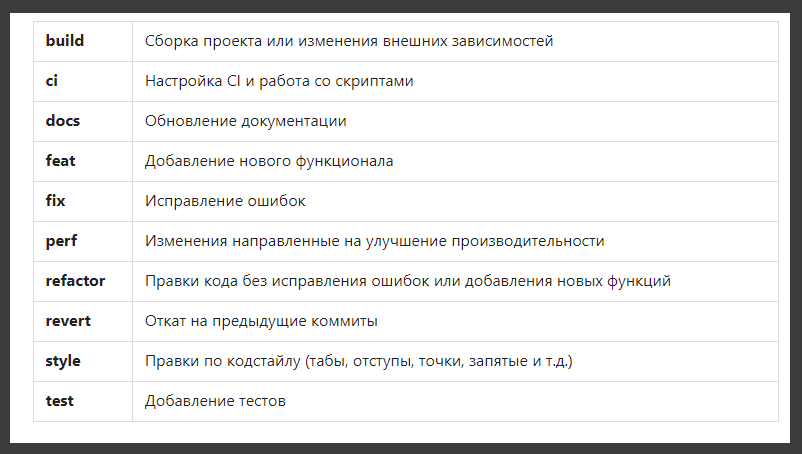

# Git Conventional

habr: <https://habr.com/ru/company/yandex/blog/431432/>

Методология [Conventional Commits](https://www.conventionalcommits.org/en/v1.0.0/) выделяется на фоне других стандартов и заслуживает пристального изучения по ряду причин:

1. Она хорошо документирована и проработана. В её спецификации даны ответы на наиболее распространенные вопросы.
2. Создатели конвенции вдохновились требованиями к написанию коммитов, которые используются в популярном и проверенном временем фреймворке **AngularJS**.
3. Правил конвенции придерживаются несколько крупных и популярных open-source библиотек (таких как **yargs** и **lerna**).
4. К плюсам отнесу подготовку к автоматическому формированию **Release Notes** и **Change Log**.

**Пример коммита по этому стандарту:**

```git
fix(products): поправить длину строки с ценой

Часть заголовков неправильно отображается в мобильной версии из-за ошибок
в проектировании универсальных компонентов.

МЕТА ДАННЫЕ: SECRETMRKT-578, SECRETMRKT-602
```

**Основные тезисы Conventional Commits**

- азработчик должен придерживаться следующей структуры коммитов:

```
<type>(<scope>): <subject>

<body>

<footer>
```

- У коммита должен быть заголовок, может быть тело и нижний колонтитул.
- Заголовок коммита должен начинаться с типа (**type**), указывающего на специфику внесенных в кодовую базу изменений, и завершаться описанием.
- Наряду с обязательными **feat**, **fix** (использование которых строго регламентировано), допускаются и другие типы.
- У коммита может быть область (**scope**). Она характеризует фрагмент кода, которую затронули изменения. Область следует за типом коммита. Стандарт не регламентирует четкий список областей. Примеры областей: **eslint**, **git**, **analytics** и т.д.
- Описание коммита должно быть сразу после типа/области.
- Tело коммита может быть использовано для детализации изменений. Тело должно быть отделено от описания пустой строкой.
- Нижний колонтитул следует использовать для указания внешних ссылок, контекста коммита или другой мета информации. Нижний колонтитул должен быть отделен от тела пустой строкой.

<br>
<br>

**Кроме перечисленых в конвенции правил мы используем следущие популярные рекомендации:**

- В теле коммита пишем что было изменено и почему.
- Используем следующие типы коммитов:



- Пишем описание в повелительном наклонении (**imperative mood**), точно также как сам **Git**.

```
Merge branch 'fix/SECRETMRKT-749-fix-typos-in-titles'
```

- Не закачиваем описание коммита знаками препинания.

<br>
<br>
<br>

**Далее для более продвинутого пользования. Больше для devOps**

**Настроим утилиту commitizen**

Этот инструмент позволяет генерировать коммиты при помощи встроенного визарда. Кроме того, **commitizen** хорошо поддерживается сообществом и, благодаря дополнительным модулям, отлично настраивается.

1. Установим утилиту [commitizen](https://github.com/commitizen/cz-cli) глобально (вам могут потребоваться права администратора).

```shell
npm i -g commitizen
```

2. Следом установим адаптер [cz-customizable](https://github.com/leoforfree/cz-customizable). Он нужен для настройки шаблона с вопросами, которым пользуется утилита **commitizen**.

```shell
npm i -D cz-customizable

```

3. Создадим файл **commitizen.js**, он нужен для настройки **cz-customizable**. Поместим созданный файл в директорию **./config/git**. Рекомендую не захламлять корень проекта конфигурационными файлами и стараться группировать файлы в подготовленной для этого папке. Содержимое:

```js
'use strict';

module.exports = {
  // Добавим описание на русском языке ко всем типам
  types: [
    {
      value: 'build',
      name: 'build:     Сборка проекта или изменения внешних зависимостей',
    },
    { value: 'ci', name: 'ci:        Настройка CI и работа со скриптами' },
    { value: 'docs', name: 'docs:      Обновление документации' },
    { value: 'feat', name: 'feat:      Добавление нового функционала' },
    { value: 'fix', name: 'fix:       Исправление ошибок' },
    {
      value: 'perf',
      name: 'perf:      Изменения направленные на улучшение производительности',
    },
    {
      value: 'refactor',
      name: 'refactor:  Правки кода без исправления ошибок или добавления новых функций',
    },
    { value: 'revert', name: 'revert:    Откат на предыдущие коммиты' },
    {
      value: 'style',
      name: 'style:     Правки по кодстайлу (табы, отступы, точки, запятые и т.д.)',
    },
    { value: 'test', name: 'test:      Добавление тестов' },
  ],

  // Область. Она характеризует фрагмент кода, которую затронули изменения
  scopes: [
    { name: 'components' },
    { name: 'tutorial' },
    { name: 'catalog' },
    { name: 'product' },
  ],

  // Возможность задать спец ОБЛАСТЬ для определенного типа коммита (пример для 'fix')
  /*
  scopeOverrides: {
    fix: [
      {name: 'style'},
      {name: 'e2eTest'},
      {name: 'unitTest'}
    ]
  },
  */

  // Поменяем дефолтные вопросы
  messages: {
    type: 'Какие изменения вы вносите?',
    scope: '\nВыберите ОБЛАСТЬ, которую вы изменили (опционально):',
    // Спросим если allowCustomScopes в true
    customScope: 'Укажите свою ОБЛАСТЬ:',
    subject: 'Напишите КОРОТКОЕ описание в ПОВЕЛИТЕЛЬНОМ наклонении:\n',
    body: 'Напишите ПОДРОБНОЕ описание (опционально). Используйте "|" для новой строки:\n',
    breaking: 'Список BREAKING CHANGES (опционально):\n',
    footer:
      'Место для мета данных (тикетов, ссылок и остального). Например: SECRETMRKT-700, SECRETMRKT-800:\n',
    confirmCommit: 'Вас устраивает получившийся коммит?',
  },

  // Разрешим собственную ОБЛАСТЬ
  allowCustomScopes: true,

  // Запрет на Breaking Changes
  allowBreakingChanges: false,

  // Префикс для нижнего колонтитула
  footerPrefix: 'МЕТА ДАННЫЕ:',

  // limit subject length
  subjectLimit: 72,
};
```

4. Добавим в **package.json** ссылки на **cz-customizable** и созданный ранее конфигурационный файл:

```json
{
  "config": {
    "commitizen": {
      "path": "node_modules/cz-customizable"
    },
    "cz-customizable": {
      "config": "config/git/commitizen.js"
    }
  }
}
```

5. Давайте проверим получившийся результат. Наберите в терминале следующую команду:

```shell
git cz
```

Визард **commitizen** сначала соберет информацию о типе, области коммита, затем последовательно запросит текст, который будет в описании, в теле, в нижнем колонтитуле и после вашего согласия создаст коммит.

<br>
<br>
<br>

**Настроим утилиты husky и commitlint**

1. Установим в проект [husky](https://github.com/typicode/husky) и [commitlint](https://github.com/marionebl/commitlint):

```shell
npm i -D husky @commitlint/cli
```

2. С помощью **husky** добавим проверку коммитов. Для этого в **package.json** сразу после скриптов добавим следующий хук и укажем в нем ссылку на файл **commitlint.js:**

```json
{
  "scripts": {
    "test": "echo \"Error: no test specified\" && exit 1"
  },
  "husky": {
    "hooks": {
      "commit-msg": "commitlint -E HUSKY_GIT_PARAMS -g './config/git/commitlint.js'"
    }
  },
  "devDependencies": {
    "@commitlint/cli": "^7.2.1",
    "husky": "^1.1.3",
}
```

3. Создадим файл **commitlint.js**, необходимый для корректной работы линтера. Поместим созданный файл в директорию **./config/git**. Содержимое файла:

```js
// Файл создан на основе @commitlint/config-conventional

module.exports = {
  rules: {
    // Тело коммита должно начинаться с пустой строки
    'body-leading-blank': [2, 'always'],

    // Нижний колонтитул коммита должен начинаться с пустой строки
    'footer-leading-blank': [2, 'always'],

    // Максимальная длина заголовка 72 символа
    'header-max-length': [2, 'always', 72],

    // Область всегда только в нижнем регистре
    'scope-case': [2, 'always', 'lower-case'],

    // Описание не может быть пустым
    'subject-empty': [2, 'never'],

    // Описание не должно заканчиваться '.'
    'subject-full-stop': [2, 'never', '.'],

    // Тип всегда только в нижнем регистре
    'type-case': [2, 'always', 'lower-case'],

    // Тип не может быть пустым
    'type-empty': [2, 'never'],

    // Перечислим все возможные варианты коммитов
    'type-enum': [
      2,
      'always',
      [
        'build',
        'ci',
        'docs',
        'feat',
        'fix',
        'perf',
        'refactor',
        'revert',
        'style',
        'test',
      ],
    ],
  },
};
```

Всё. Теперь все коммиты будут проверяться перед отправкой в репозиторий :)
