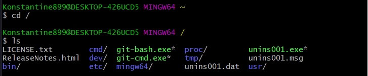

 #Навигация:

<https://ru.hexlet.io/courses/bash/lessons/traverse/theory_unit>

| Команда         | Значение                                                          | 
| -------------   |:-----------------------------------------------------------------:| 
| pwd             | Показывает в какой директории находимся                           | 
| ls              | посмотреть список файлов и папок                                  |   
| ls dirname/     | просмотр содержимого директории                                   |   
| cd dirname/     | переместиться в директорию                                        |
| cd ../          | Выйти из директории                                               |
| cd /            | В корневую директорию                                             |
| cd              | без аргументов перемещает в домашнюю директорию                   |
| cd ~/           | аналог перехода в home директорию, + 2 * Tab просмотр содержимого|
| cd ~/dirname    | Переместиться в указанную директорию относительно home директории|

В **LINUX** - это дирректория **HOME**.

Файловая структура **UNIX** систем представляет из себя дерево в корне которого находится слэш - это корневая(**root**) дирректория.

Такое понятие как **ДИСКИ** здесь нет в отличие о **WINDOWS** систем. Даже любой **ДИСК** который появляется физически в системе, будет всего лиш папкой. 

>Все есть папки и файлы - это идеология UNIX систем.

 

Для того что бы посмотреть список файлов и папок есть команда **ls**. Для того что бы посмотреть какую-то конкретную папку **ls dirname** После того как мы начали набирать ее название просто достаточно нажать **Tab** для того что бы сработал автокомплит и дополнил полностью название.

 

Для того что бы переместиться в эту директорию есть **Change Directory** - это команда **cd dirname**

##cd

Что бы выйти на директорию выше **cd ..**

Перемещение в корневую директорию **cd /** и смотрим список папок и файлов на самом верхнем уровне.

Если запустить **cd** без аргументов, то она перемещает нас в домашнюю директорию

Теперь предположим мы снова возвращаемся в нашу домашнюю директорию **cd /** и хотим попасть в папку **projects**. Для того что бы не  указывать относительный путь, сузществует сокращение т.е. тильда **~**. Она во всяких системах обозначает домашнюю директорию. Если я набираю команду **cd ~/** и жму два раза **Tab**, то нам будут показаны все директории и файлы. И таким образом мы можем переместиться в папку **projects**.

И таким образом я могу переместиться в **projects**.

 

##Относительные и абсолютные пути

У меня есть список директорий.

Для того что бы переместиться в них вы можем использовать относительный путь. Относительный путь никогда не включает корень т.е. не может начинаться со слеша, потому что  слеш всегда обозначает корень, и искать он будет именно из корневой директории.
Мне нужно набрать относительный путь, относительно текущей директории, либо набирать полный путь.

Абсолютные пути это все пути которые начинаются со слеша.

