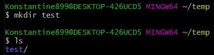
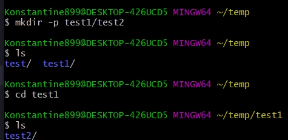
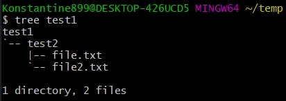
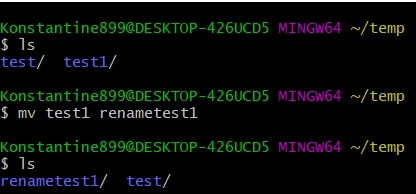
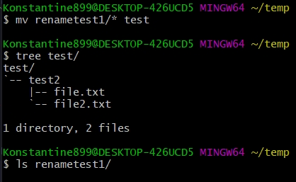
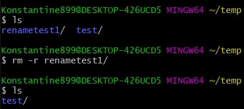

#Управление файловой структурой

| Команда                | Значение                                                                                            | 
| -------------          |:---------------------------------------------------------------------------------------------------:| 
|mkdir dirname           |создание директории                                                                                  |
|mkdir -p dirname/dirname| создание вложенных директорий                                                                       |
|touch                   |создания файла                                                                                       |
|touch dirname/filename  |создание файла в директории                                                                          |
|tree dirname            | просмотр содержимого директории. Не работает в bush для windows. Смотри решение ниже в конспекте    |
|mv dirname dirname      | mv переименование, первый параметр - имя текущей директории, второй параметр имя желаемой директории|
|mv dirname/* dirname    | перемещение всего содержимого из директории                                                         |
|rm filename             | удаление файла                                                                                      |
|rm -r dirname           |удаление директории                                                                                  |
|rm -r *                 |удаление содержимого директории,если мы находимся в директории.Будет удалено все содержимое, кроме самой директории|
|rm -r dirname/*         |удалении содержимого директории, не находясь в данной директории                                     |
|rm -r -f     |Если система спаршивает каждое удаление файла, флаг -f т.е. force даем на все соласие. **Опсно использоать!!!!**|


Познакомимся с командами изменяющие файловую структуру.

##mkdir

**mkdir dirname** - создание директории.



**mkdir -p dirname/dirname** - для создания вложенных директорий использую флаг **-p** который создает директории рекурсивно.




##Создание файлов

Для создания файлов используется команда - **touch filename**.

##Просмотр директории

Для просмотра директории используем команду **tree** которая в удобном виде покажет нам структуру.

> Программа tree из видео по умолчанию отсутствует в большинстве операционных систем. Ее необходимо устанавливать отдельно.

Попробую добавить в **git bach**. Скачиваю **zip** файл с сайта <http://gnuwin32.sourceforge.net/packages/tree.htm>. Под элементом списка **Binaries** есть ссылка на скачивание. Если же сайт не доступен зайди в папку **example**, там лежит необходимый архив. Ссылка на скачивание [ZIP](http://downloads.sourceforge.net/gnuwin32/tree-1.5.2.2-bin.zip).

Из архива, из папки **bin** извлекаю файл **tree.exe** и добавляю его по пути 

>C:\Program Files\Git\usr\bin



##Переименование

В **UNIX** системах как такового переименования не существует. Существует перемещение. Для этого используется **MOVE** т.е.  команда **mv dirname dirname**. Первым параметром **dirname** указываю название текущей директории которую я хочу переименовать, а вторым параметром указываю желаемое название директории.




Давайте теперь предположим что мы хотим содержимое папки  **renametest1** переместить в папку **test**. 

Мы можем делать это пофайлово и пытаясь переносить каждую папку **mv dirname/dirname filename or dirname**. Однако это довольно утомительно.

Мы можем использовать **glob** так называемую подстановку. Выглядит это так **mv dirname/* dirname**. Звездочка при интерпритации разворачивает весь список файлов и папок, что находятся внутри, и фактически вторым аргументом **dirname** мы указываем куда мы перемещаем содержимое папки указанной в первом арументе.



<br/>

##Удаление

Удаление файла это просто **rm filename**.

Если мы пытаемся удалить директорию **rm** нам по умолчанию не позволяет это сделать, для этого нужно использовать флаг **-r**. Это так называемое рекурсивное удаление.



Если мы хотим удалить не саму директорию, а ее содержимое, то есть несколько вариантов. Если мы находимся внутри директории, то мы можем набрать rm -r *. Будет удалено все содержимое, кроме самой директории.

Тоже самое мы можем сделать снаружи, но тогда нам нужно указать все тоже самое, только указать имя папки в которой будет производится удаление rm -r dirname/*

На многих **UNIX** системах при удалении **rm** спрашивает про каждый файл удалять его или нет по этому добавляют еще один флаг который называют **-f**. Флаги можно писать независимо, а можно писать и вместе rm **-rf** или **rm -r -f**. Флаг **-f** называется **force**, он просто говорит что нужно удалить все, и система не будет у вас ничего спрашивать.

>Эта команда rm -r -f достаточно опасная. Многие люди убивали свою систему такой командой
> ```shell
>  rm -r -f /
> ```

**Т.е. с помощью слеша мы переходи на самый верхний уровень нашей системы и говорим удали все, флагом -f мы подтверждаем наше согласие....**