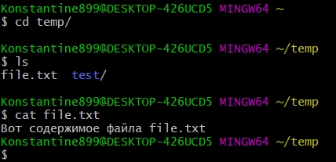
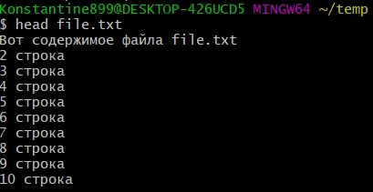
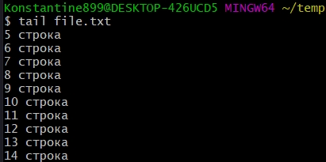
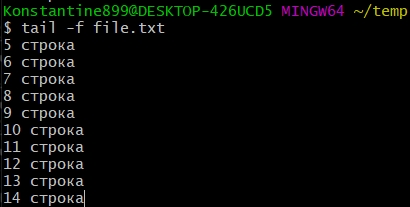
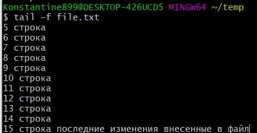
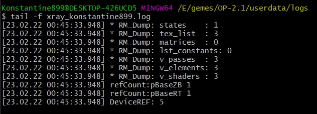
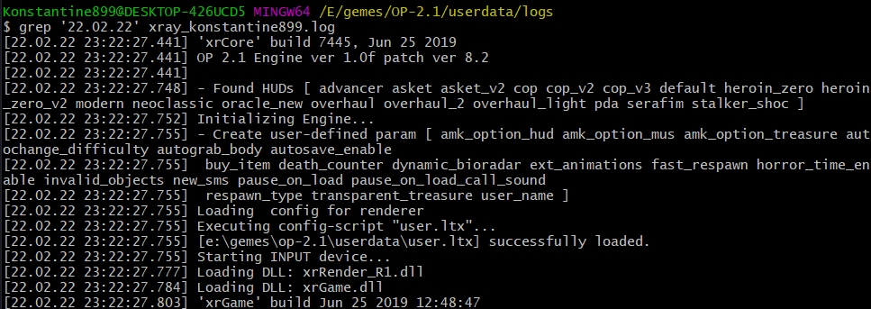
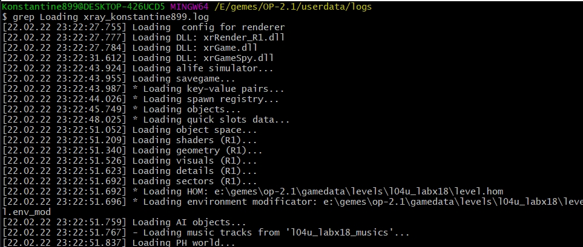

# Просмотр содержимого файлов

|Команда|Значение|
|:-----:|:------:|
|cat filename|вывести содержимое файла|
|head filename|первые 10 строк|
|tail filename|последние 10 строк|
|tail -f filename|следит за изменениями в файле|
|grep 'filter' filename|поиск нужного значения, использовать можно как с кавычками та и без. [Подробнее](https://habr.com/ru/post/229501/)|

**bush** обладает очень мощным средством для работы с текстом. Но мы рассмотрим только базовые варианты использования.

##cat

Самая простая команда это **cat**. С помощью ее мы можем вывести содержимое любого файла.

 

##head

**head** - позволяет вывести только первые 10 строк.

 

##tail

**tail** - выводит последние 10 строк

**tail** обладает еще одной хорошей фитчей которая достигается с помощью флага **-f**. Если в этот файл будет производитя какая-то запись, то мы увидим эту запись.

Как видим пока ни каких изменений.

**tail -f filename** это очень удобный механизм. Его часто используют при просмотре лоов серверов и аналогичных вещей.

Для того что бы выйти из состояния отслеживания нажимаем Ctrl + C.

 

##grep

Еще одна очень полезная и часто используемая команда которая используется при иследовании системы, иследования логов, называется **grep**.

В простейшем случае **grep** позволяет искать подстроку в файле. Эта команда очень наворочная и с помощью ее можно делать множество вещей.

Рассмотрим простой вариант использования. Рассмотрим это на примере файла логов.
Бля файлы логов WINDOWS типо все работают и не дает зайти. Рассмотрю на примере логов сталкера. Вот вывел последние 10 записей файла.

Однако для этого примера тоже проблема, разбивает файлы логов по датам. 

Судя по скриншоту он прошелся по всем файлам и отфильтровал нужное.

Как видите использую без кавычек

[Подробнее](https://habr.com/ru/post/229501/)
