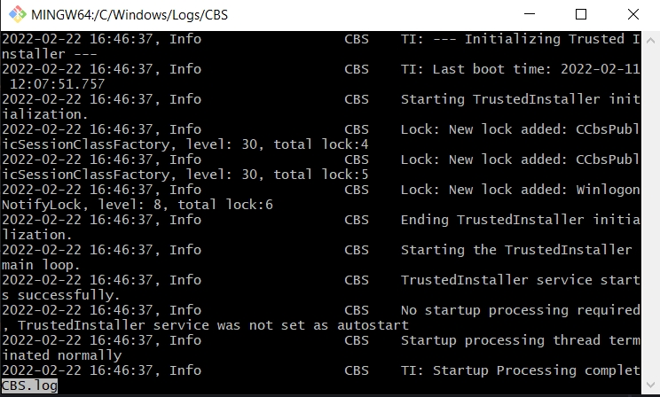
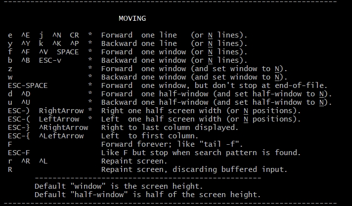
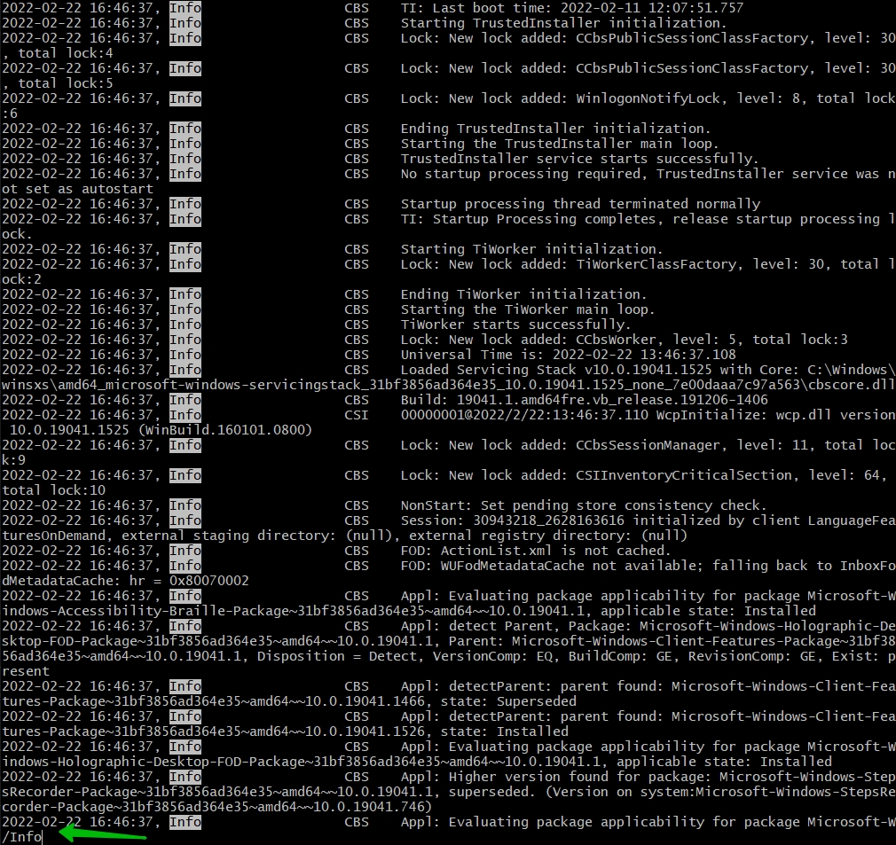

# Пейджеры

|Программа Пейджер|Значение|
|:---------------:|:------:|
|less filename|поэтапно открывает большой файл|

В этой программе содержатся команд **VIM**

|Команда|Значение|
|:-----:|:------:|
|q|выход|
|h|справка|
|Ctrl + F|Скролин файла вниз|
|Ctrl + B|скролинг файла в верх|
|Shift + G|перепеститься в конец файла|
|g|переместиться в начало файла|
|/value|поиск по значению, слову|
|n|позитивны поиск т.е. перемещаюсь по искомому слову|
|Shift + N|негативный поиск т.е. перемещаюсь по искомому слову|
|j или k|перемещаться построчно в верх или вниз |

Часто бывает что размер файла который вы хотите посмотреть слишком большой. У тут на помощь приходит программы называемые Пейджерами.

Пейджер - такая программа которая открывает файл не целеком, а только ту часть которую вы видите на экране. Вы можете по нему перемещаться, соответственно прогружаются соответсвующие части. 

##less

по пути **/C/Windows/Logs/CBS** содержатся системные логи **WINDOWS** они довольно большие.


И вот открывается экран этой программы



Посмотрим на базовые комбинации. В реальности в **less** мы попадаем в режим **VIM**. Практически все комбинации **VIM** здесь работают которые связаны с чтением и поиском текста.

Самое простой с чего стоит начать это выход - это просто **q**.

**h** - справка

```vim
 SUMMARY OF LESS COMMANDS

      Commands marked with * may be preceded by a number, N.
      Notes in parentheses indicate the behavior if N is given.
      A key preceded by a caret indicates the Ctrl key; thus ^K is ctrl-K.

  h  H                 Display this help.
  q  :q  Q  :Q  ZZ     Exit.
 ---------------------------------------------------------------------------

                           MOVING

  e  ^E  j  ^N  CR  *  Forward  one line   (or N lines).
  y  ^Y  k  ^K  ^P  *  Backward one line   (or N lines).
  f  ^F  ^V  SPACE  *  Forward  one window (or N lines).
  b  ^B  ESC-v      *  Backward one window (or N lines).
  z                 *  Forward  one window (and set window to N).
  w                 *  Backward one window (and set window to N).
  ESC-SPACE         *  Forward  one window, but don't stop at end-of-file.
  d  ^D             *  Forward  one half-window (and set half-window to N).
  u  ^U             *  Backward one half-window (and set half-window to N).
  ESC-)  RightArrow *  Right one half screen width (or N positions).
  ESC-(  LeftArrow  *  Left  one half screen width (or N positions).
  ESC-}  ^RightArrow   Right to last column displayed.
  ESC-{  ^LeftArrow    Left  to first column.
  F                    Forward forever; like "tail -f".
  ESC-F                Like F but stop when search pattern is found.
  r  ^R  ^L            Repaint screen.
  R                    Repaint screen, discarding buffered input.
        ---------------------------------------------------
        Default "window" is the screen height.
        Default "half-window" is half of the screen height.
 ---------------------------------------------------------------------------

                          SEARCHING

  /pattern          *  Search forward for (N-th) matching line.
  ?pattern          *  Search backward for (N-th) matching line.
  n                 *  Repeat previous search (for N-th occurrence).
  N                 *  Repeat previous search in reverse direction.
  ESC-n             *  Repeat previous search, spanning files.
  ESC-N             *  Repeat previous search, reverse dir. & spanning files.
  ESC-u                Undo (toggle) search highlighting.
  ESC-U                Clear search highlighting.
  &pattern          *  Display only matching lines.
        ---------------------------------------------------
        A search pattern may begin with one or more of:
        ^N or !  Search for NON-matching lines.
        ^E or *  Search multiple files (pass thru END OF FILE).
        ^F or @  Start search at FIRST file (for /) or last file (for ?).
        ^K       Highlight matches, but don't move (KEEP position).
        ^R       Don't use REGULAR EXPRESSIONS.
        ^W       WRAP search if no match found.

  g  <  ESC-<       *  Go to first line in file (or line N).
  G  >  ESC->       *  Go to last line in file (or line N).
  p  %              *  Go to beginning of file (or N percent into file).
  t                 *  Go to the (N-th) next tag.
  T                 *  Go to the (N-th) previous tag.
  {  (  [           *  Find close bracket } ) ].
  }  )  ]           *  Find open bracket { ( [.
  ESC-^F <c1> <c2>  *  Find close bracket <c2>.
  ESC-^B <c1> <c2>  *  Find open bracket <c1>.
        ---------------------------------------------------
        Each "find close bracket" command goes forward to the close bracket
          matching the (N-th) open bracket in the top line.
        Each "find open bracket" command goes backward to the open bracket
          matching the (N-th) close bracket in the bottom line.

  m<letter>            Mark the current top line with <letter>.
  M<letter>            Mark the current bottom line with <letter>.
  '<letter>            Go to a previously marked position.
  ''                   Go to the previous position.
  ^X^X                 Same as '.
  ESC-M<letter>        Clear a mark.
        ---------------------------------------------------
        A mark is any upper-case or lower-case letter.
        Certain marks are predefined:
             ^  means  beginning of the file
             $  means  end of the file
 ---------------------------------------------------------------------------

                        CHANGING FILES

  :e [file]            Examine a new file.
  ^X^V                 Same as :e.
  :n                *  Examine the (N-th) next file from the command line.
  :p                *  Examine the (N-th) previous file from the command line.
  :x                *  Examine the first (or N-th) file from the command line.
  :d                   Delete the current file from the command line list.
  =  ^G  :f            Print current file name.
 ---------------------------------------------------------------------------
 MISCELLANEOUS COMMANDS

  -<flag>              Toggle a command line option [see OPTIONS below].
  --<name>             Toggle a command line option, by name.
  _<flag>              Display the setting of a command line option.
  __<name>             Display the setting of an option, by name.
  +cmd                 Execute the less cmd each time a new file is examined.

  !command             Execute the shell command with $SHELL.
  |Xcommand            Pipe file between current pos & mark X to shell command.
  s file               Save input to a file.
  v                    Edit the current file with $VISUAL or $EDITOR.
  V                    Print version number of "less".
 ---------------------------------------------------------------------------
 OPTIONS

        Most options may be changed either on the command line,
        or from within less by using the - or -- command.
        Options may be given in one of two forms: either a single
        character preceded by a -, or a name preceded by --.

  -?  ........  --help
                  Display help (from command line).
  -a  ........  --search-skip-screen
                  Search skips current screen.
  -A  ........  --SEARCH-SKIP-SCREEN
                  Search starts just after target line.
  -b [N]  ....  --buffers=[N]
                  Number of buffers.
  -B  ........  --auto-buffers
                  Don't automatically allocate buffers for pipes.
  -c  ........  --clear-screen
                  Repaint by clearing rather than scrolling.
  -d  ........  --dumb
                  Dumb terminal.
  -D xcolor  .  --color=xcolor
                  Set screen colors.
  -e  -E  ....  --quit-at-eof  --QUIT-AT-EOF
                  Quit at end of file.
  -f  ........  --force
                  Force open non-regular files.
  -F  ........  --quit-if-one-screen
                  Quit if entire file fits on first screen.
  -g  ........  --hilite-search
                  Highlight only last match for searches.
  -G  ........  --HILITE-SEARCH
                  Don't highlight any matches for searches.
  -h [N]  ....  --max-back-scroll=[N]
                  Backward scroll limit.
  -i  ........  --ignore-case
                  Ignore case in searches that do not contain uppercase.
  -I  ........  --IGNORE-CASE
                  Ignore case in all searches.
  -j [N]  ....  --jump-target=[N]
                  Screen position of target lines.
  -J  ........  --status-column
                  Display a status column at left edge of screen.
  -k [file]  .  --lesskey-file=[file]
                  Use a lesskey file.
  -K  ........  --quit-on-intr
                  Exit less in response to ctrl-C.
  -L  ........  --no-lessopen
                  Ignore the LESSOPEN environment variable.
  -m  -M  ....  --long-prompt  --LONG-PROMPT
                  Set prompt style.
 -n  -N  ....  --line-numbers  --LINE-NUMBERS
                  Don't use line numbers.
  -o [file]  .  --log-file=[file]
                  Copy to log file (standard input only).
  -O [file]  .  --LOG-FILE=[file]
                  Copy to log file (unconditionally overwrite).
  -p [pattern]  --pattern=[pattern]
                  Start at pattern (from command line).
  -P [prompt]   --prompt=[prompt]
                  Define new prompt.
  -q  -Q  ....  --quiet  --QUIET  --silent --SILENT
                  Quiet the terminal bell.
  -r  -R  ....  --raw-control-chars  --RAW-CONTROL-CHARS
                  Output "raw" control characters.
  -s  ........  --squeeze-blank-lines
                  Squeeze multiple blank lines.
  -S  ........  --chop-long-lines
                  Chop (truncate) long lines rather than wrapping.
  -t [tag]  ..  --tag=[tag]
                  Find a tag.
  -T [tagsfile] --tag-file=[tagsfile]
                  Use an alternate tags file.
  -u  -U  ....  --underline-special  --UNDERLINE-SPECIAL
                  Change handling of backspaces.
  -V  ........  --version
                  Display the version number of "less".
  -w  ........  --hilite-unread
                  Highlight first new line after forward-screen.
  -W  ........  --HILITE-UNREAD
                  Highlight first new line after any forward movement.
  -x [N[,...]]  --tabs=[N[,...]]
                  Set tab stops.
  -X  ........  --no-init
                  Don't use termcap init/deinit strings.
  -y [N]  ....  --max-forw-scroll=[N]
                  Forward scroll limit.
  -z [N]  ....  --window=[N]
                  Set size of window.
  -" [c[c]]  .  --quotes=[c[c]]
                  Set shell quote characters.
  -~  ........  --tilde
                  Don't display tildes after end of file.
 -# [N]  ....  --shift=[N]
                  Set horizontal scroll amount (0 = one half screen width).
                --file-size
                  Automatically determine the size of the input file.
                --follow-name
                  The F command changes files if the input file is renamed.
                --incsearch
                  Search file as each pattern character is typed in.
                --line-num-width=N
                  Set the width of the -N line number field to N characters.
                --mouse
                  Enable mouse input.
                --no-keypad
                  Don't send termcap keypad init/deinit strings.
                --no-histdups
                  Remove duplicates from command history.
                --rscroll=C
                  Set the character used to mark truncated lines.
                --save-marks
                  Retain marks across invocations of less.
                --status-col-width=N
                  Set the width of the -J status column to N characters.
                --use-backslash
                  Subsequent options use backslash as escape char.
                --use-color
                  Enables colored text.
                --wheel-lines=N
                  Each click of the mouse wheel moves N lines.


 ---------------------------------------------------------------------------
 LINE EDITING

        These keys can be used to edit text being entered
        on the "command line" at the bottom of the screen.

 RightArrow ..................... ESC-l ... Move cursor right one character.
 LeftArrow ...................... ESC-h ... Move cursor left one character.
 ctrl-RightArrow  ESC-RightArrow  ESC-w ... Move cursor right one word.
 ctrl-LeftArrow   ESC-LeftArrow   ESC-b ... Move cursor left one word.
 HOME ........................... ESC-0 ... Move cursor to start of line.
 END ............................ ESC-$ ... Move cursor to end of line.
 BACKSPACE ................................ Delete char to left of cursor.
 DELETE ......................... ESC-x ... Delete char under cursor.
 ctrl-BACKSPACE   ESC-BACKSPACE ........... Delete word to left of cursor.
 ctrl-DELETE .... ESC-DELETE .... ESC-X ... Delete word under cursor.
 ctrl-U ......... ESC (MS-DOS only) ....... Delete entire line.
 UpArrow ........................ ESC-k ... Retrieve previous command line.
 DownArrow ...................... ESC-j ... Retrieve next command line.
 TAB ...................................... Complete filename & cycle.
 SHIFT-TAB ...................... ESC-TAB   Complete filename & reverse cycle.
 ctrl-L ................................... Complete filename, list all.
```

Если мы посмотрим **MOVING**, то перемещаться вперед назад можно достаточно большим количеством способов.

Один из самых важных это перемещение постранично. Для этого используется **Ctrl + F** - это **forward**, и **Ctrl + B** - **Backward** т.е. это такой скролинг.



Из справки выходим ток же использую **q**.

**Shift + G** перепеститься в конец файла

**g** - переместиться в начало файла

Поиск по какому-то слову. Набираю **/** и ищем.



При поиске это слово подсвечивается.

Это основные комбинации для того что бы работать с Пейджером.