# Переменные окружения

При запуске какой либо программы в **bash**, первое что необходимо сделать в оболочке - это найти исполняемый файл этой программы. Например если мы запускаем **ls** он отработает и мы этому не удивляемся.

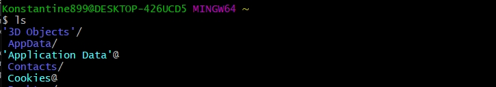

На самом деле **ls** не встроен в **bash**. Это просто программа которая лежит где то в какой то папке.

Для того что бы увидеть что конкретно будет запущено мы можем набрать 

```shell
which ls
```
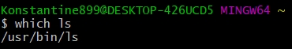

И вот мы видим по какому пути она лежит **/usr/bin/ls**

мы можем зайти в папку **bin** и увидеть большое количество программ.

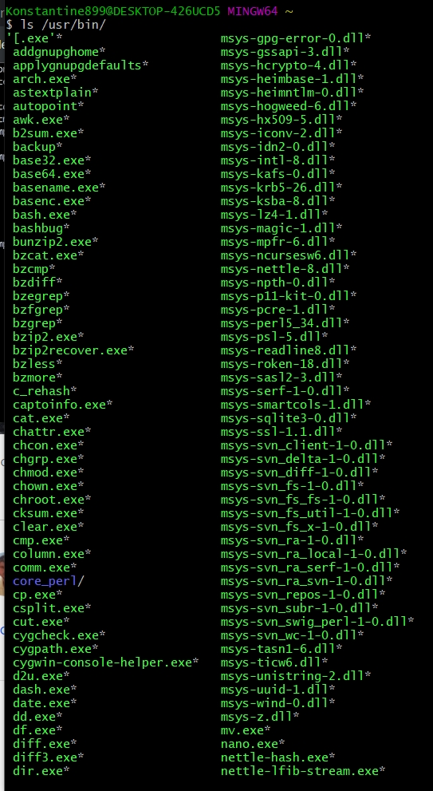

Это далео не все что существует в нашей оперционной системе. Все программы лежат в разных папках и **bash** об этом как то узнает. Так вот для этого используется такой механизм  который называется ПЕРЕМЕННЫЕ ОКРУЖЕНИЯ.

Как это выглядит?

Создадим свою переменную и выведем ее.

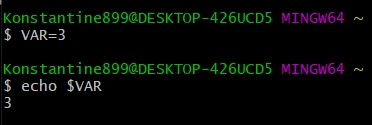

Для вывода использую оператор **echo** и для вывода переменной использую **$**.

Для того что бы посмотреть список переменных окружения которые у нас установлены в текущей сессии для этого мы можем набрать команду **env**.

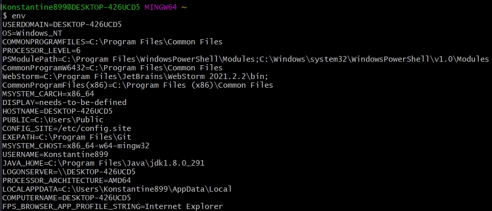

Здесь их достаточно много. Большинство из этих переменных являются стандартными.

К примеру здесь есть переменная указывающая имя пользователя 

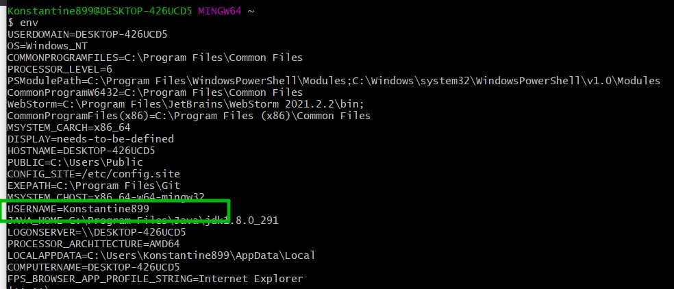

Текущая директория пользователя

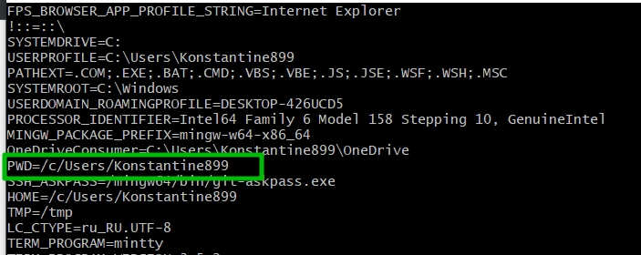

И самое главное, то что нам поможет ответить на вопрос, каким образом запускаются прораммы? Находяться их исходные файлы?

Это переменная **PATH**. Если на нее внимательно посмотреть то можно увидеть что она содержит набор путей которые разделены двоеточием.

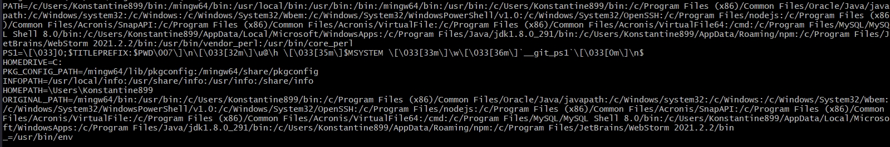

Именно так и работает запуск. Идет просто последовательный поиск той программы которую мы запускаем.

Переменная **PATH** создается и появляется по умолчанию. При этом в процессе жизни **ОС** ее можно менять, разбавлять и добавлять.

Самое главное и полезное что есть в переменных окружения - это то что их можно использовать в программах 
И так я как у него создал файл **printer** и написал скрипт.

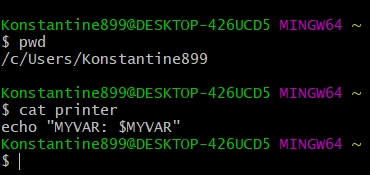

Он внутри себя выводит переменную **$MYVAR**. И как видим при первом запуске **MYVAR** нисему не равно.

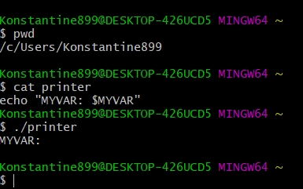

Устанавливаю **MYVAR=5** и запускаю скрипт

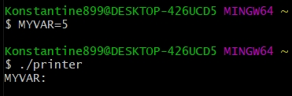

Но если я данную переменную выведу через **echo**

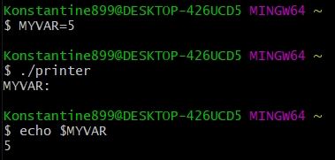

То мы видим что все-таки переменная **$MYVAR = 5**.

Это связано с тем что при такой такой установке, когда мы пишем **KEY=VALUE** т.е. присваиваю переменной значение **MYVAR=5**, то переменная будет доступнп в рамках текущей сессии.

При запуске новой прграммы **./printer** запускается новая сессия, и в этой новой переменной присвоенное значение переменной **MYVAR** не доступно, так как это уже абсолютно другая переменная, в другой сессии.

Для того что бы ее сделать доступной существует два пути.

1. **inline** создание переменной, т.е. когда мы перед запуском прораммы присваиваем значение переменной.

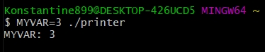

Любую программу можно запускать таким образом. И переменную которую вы определите окажется внутри.

2. Это export переменной. Т.е. она становится доступной для всех вообще 

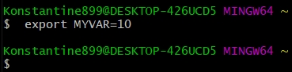

Теперь мы через **env** можем увидеть эту переменную.

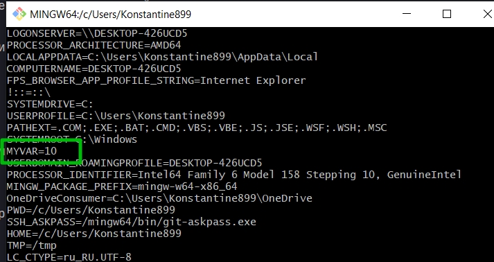

И теперь кода я запущу скрипт она будет равна **10**

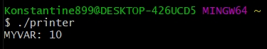

С переменной **PATH** можно поэксперементировать. Смотрите если я сейчас запущу **printer** то у меня будет ошибка о том что такая команда не найдена

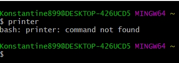

Но если я переменной **PATH** присвою путь до скрипта, то данная команда станет доступной.

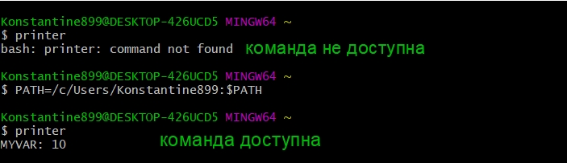

Наш скрипт заработал потому что путь **/c/Users/Konstantine899** оказался в переменной **PATH**.


Так же мы можем проделать обратную операцию. Для этого использую оператор **unset** который позволяет удалять переменные.

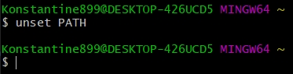

И сейчас если мы запустим совершенно стандартную команду, то **bash** ее найти не сможет.

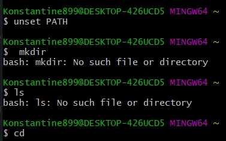

Но в этом ничего страшного нет потому что удаление, установка переменных таким способом работает только в рамках текущей сессии. Просто нужно открыть новый терминал.

>И последнее переменные регистрозависимые!!!!!
