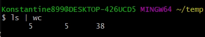

#Перенаправление и потоки

<https://habr.com/ru/post/55136/>

Когда мы работаем с такими командами как **ls**, то ее вывод печатается на экран. На самом деле с точки зрения прораммы она печатает не на экран, а выводит данные в стандартный поток вывода, так называемый **STDOUT**. И **bash** так работает что по умолчанию он печатает на экран. При этом мы можем делать перенаправления и вывести этот поток не на экран, а в файл.

```shell
ls > output
```
Создается файл **output**

и вывожу его содержимое 


Точно так же мы можем читать файл. Для этого уже используется стандартный поток ввода **STDING**. Для этого используется знак меньше **<** .

И так для удобства я перенес все файлы в папку **temp**. Там создал файл с фруктами **unsorted**.


С помощью команды **sort** мы можем их отсортировать и прочитать прямо из файла.


Как видите произошла сортировка.

Более того мы можем это объеденять и вывести сортировку в файл.


Но на самом деле мы можем пойти еще дальше и использовать передачу не из файла в файл, а из программы в программу. Потому что как вы знаете в **Linux** существует огромное количество различных команд, которые позволяют делать с текстом различные изменения, фильтры. И большинство из них позволяют работать и с **STDIN** и с **STDUOT**. Соответственно мы можем строит цепочки. Эта штука называется конвеер и делается с помощью вертикальной черты.

Пример: у нас есть команда **sort**, мы можем передать ей команду **unsorted** не через перенаправление потока а вот так. Через **cat** вывести содержимое файла **|** а затем данный вывод перенаправить в команду **sort**


В конвеере можно подставлять любое количество элеентов. К примеру использовать команду **unig** которая выведе все уникальное


Частый вариант использования конвеера это **grep** когда нам в каком-то файле нужно найти только часть данных.


Если несколько файлов с одинаковым названием, но сразным рассширением, то я так же могу вывесть интересующие меня файлы с интересующим меня расирением

```shell
ls | grep file | grep txt
```

Так же есть интересный фильтр который показывает количество строк, слов, и букв **wc**.



Количество строк, слов, букв которые были в выводе команды **ls**.

