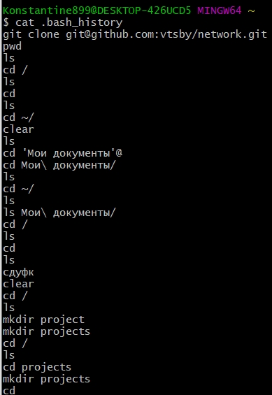
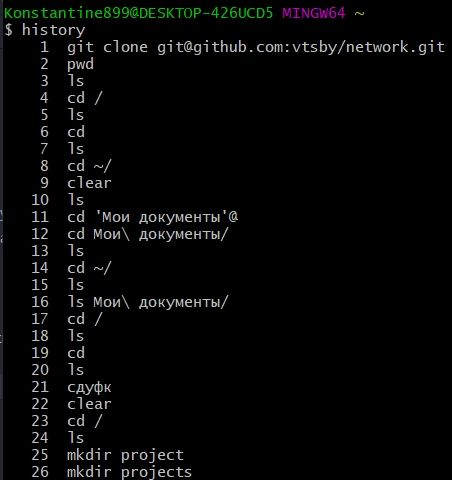
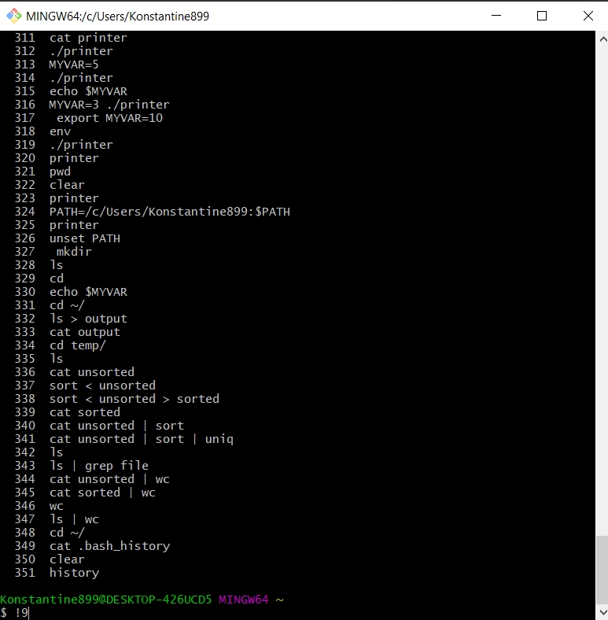
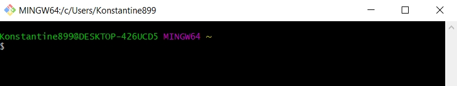
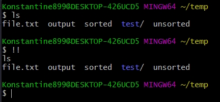
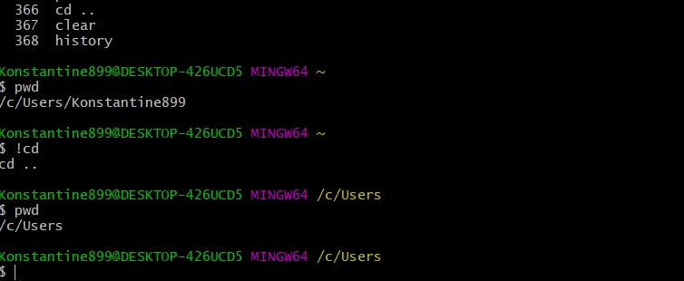
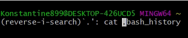
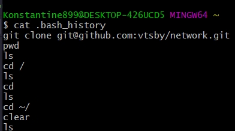
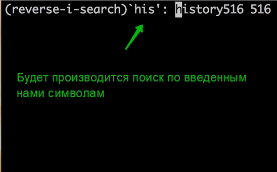

# Истории

В процессе использования **bush** накапливается история команд. У каждого пользователя она своя и ее можно посмотреть. Она сохраняется внутри файла домашней директории **.bash_history**

Но так с ним не удобно работать. По этому существует большое количество различных способов взаимодействия с историей.

Самый простой это **history**

Мы можем запустить какую-то конкретную команду, которая была в истории, набрав **!** и номер команды. Например наберу **!9** очистка экрана.

Есть еще один способ. К примеру запуск той команды которая была запущена последней. Для этого можно набрать **!!**

Есть еще один интересный способ запуска. Когда мы набираем восклицательный знак и дальше начало команды, которую мы помним что набирали в последнее время. Будет выполнена та команда которая находтся в **history**  с конца первая.

И еще очень полезная комбинация которую не все знают **Ctrl + R**. Это инкрементный поиск по все истории. Т.е. мы можем искать не сначало, а слюбой части команды которая была введена. Начинаю набирать  **.** или **bash** или **history**

При этом команд может быть много. И если мы видим что жто не та команда, то мы можем продолжать нажимать **Ctrl + R** до тех пор пока не найдем то что нам нужно.

