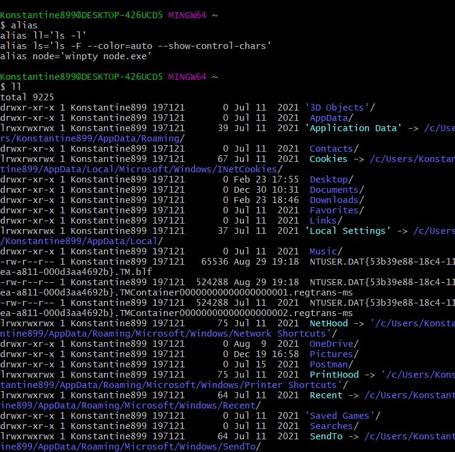

# Псевдонимы

Многие команды в bash настолько часто используются вместе со своими арументами что было бы удобно иметь механизм shortcut(кратчайший путь). Такой механизм есть. Он называется ПСЕВДОНИМЫ или alias(псевдоним).

Существует одноименная команда которая позволяет этим управлять. Если мы набираем ее без аргументов, то увидим список alias установленных в нашу систему.

у него этот список на много больше.

У меня этого не видно. Но вызываем эту команду и передаем ей ключ и значение

Сответственно сам alias потом просто вызывается по своему имени.
Мы видим что ll позволяет нам выводить список файлов,директорий  в расширенном формате

Существует обратнаякоманда которая позволяет удалять alias это команда unalias

Иногда alias бывает достаточно сложный и если вы хотите увидеть что происходит внутри то для этого есть команда type

