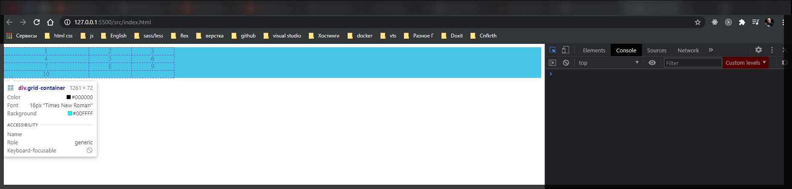
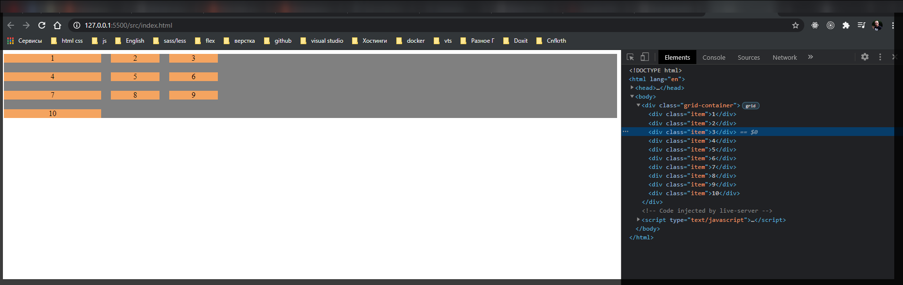
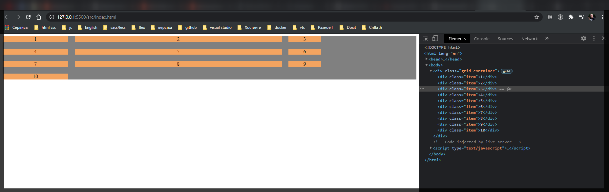
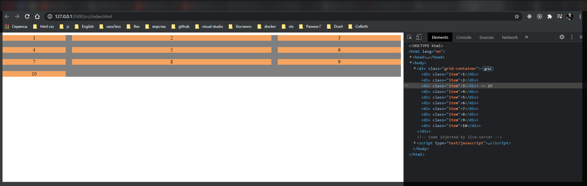
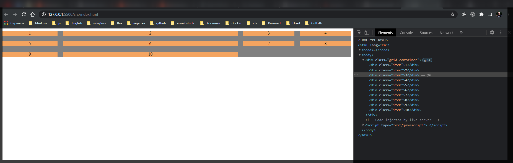
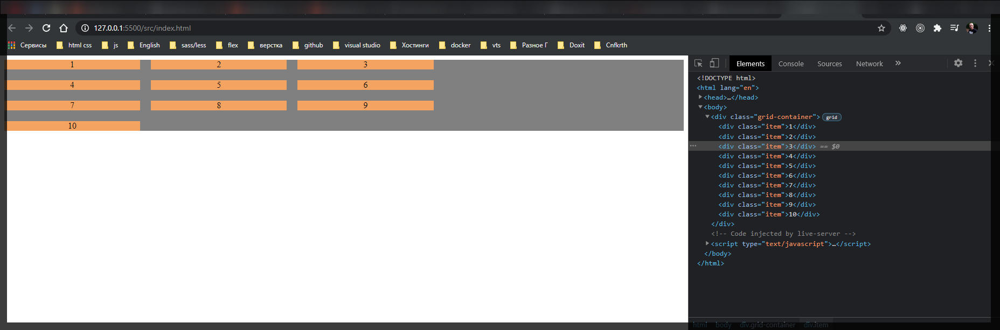
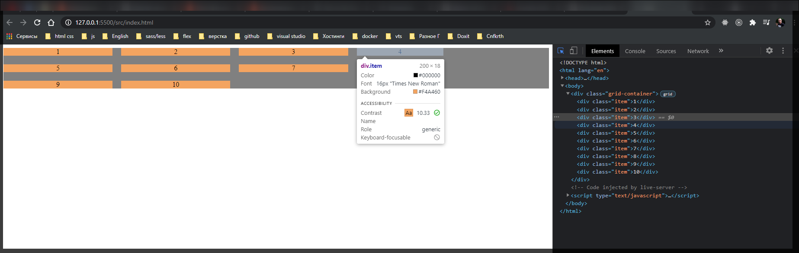
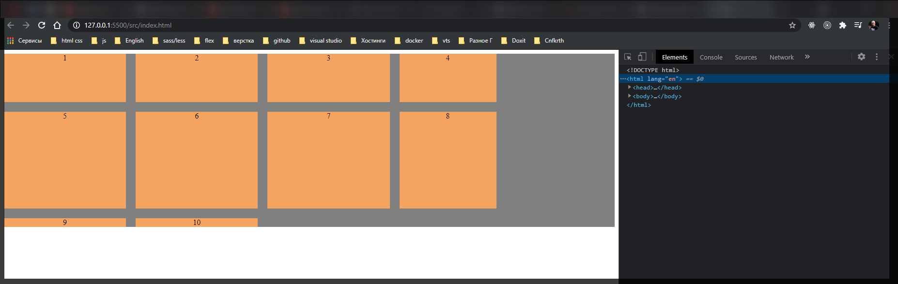
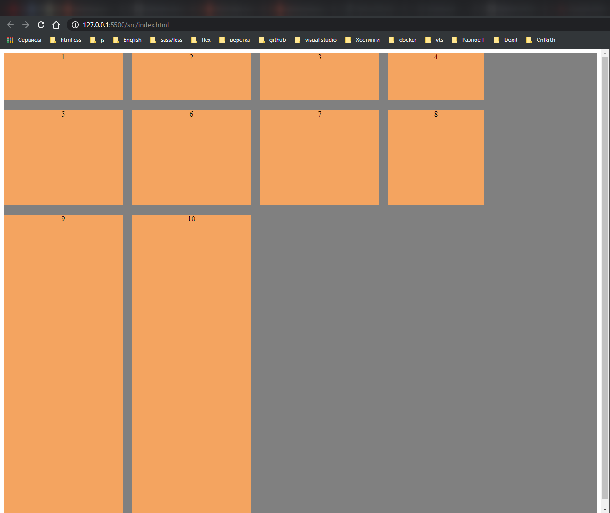

# Введение

Базовая разметка

```html
<!DOCTYPE html>
<html lang="en">
  <head>
    <meta charset="UTF-8" />
    <meta http-equiv="X-UA-Compatible" content="IE=edge" />
    <meta name="viewport" content="width=device-width, initial-scale=1.0" />
    <link rel="stylesheet" href="./styles/styles.css" />
    <title>Grid</title>
  </head>
  <body>
    <div class="grid-container">
      <div class="item">1</div>
      <div class="item">2</div>
      <div class="item">3</div>
      <div class="item">4</div>
      <div class="item">5</div>
      <div class="item">6</div>
      <div class="item">7</div>
      <div class="item">8</div>
      <div class="item">9</div>
      <div class="item">10</div>
    </div>
  </body>
</html>
```

```css
.grid-container {
  background-color: aqua;
  text-align: center;
}
```

Начнем с базовых свойств. Для того что бы начать мы должны на контейнер задать **display: grid;** при этом ничего не поменяется.

Для того что бы начать использовать сетку и начать использовать элементы в рамках этой сетки мы должны указать сколько калонок у нас будет в данной сетке для этого мы используем **grid-template-columns:** в котором можно просто через пробел указать количество колонок и размер каждой колонки.

```css
.grid-container {
  display: grid;
  grid-template-columns: 200px 100px 100px;
  background-color: aqua;
  text-align: center;
}
```



Для отступов используется свойство **grid-gap: 20px;**

```css
.grid-container {
  display: grid;
  grid-template-columns: 200px 100px 100px;
  grid-gap: 20px;
  background-color: aqua;
  text-align: center;
}
```



Так же я могу задавать в процентах ширину калонок.

```css
.grid-container {
  display: grid;
  grid-template-columns: 200px 50% 100px;
  grid-gap: 20px;
  background-color: gray;
  text-align: center;
}

.item {
  background-color: sandybrown;
}
```



Так же мы можем указать автоматическую ширину калонки.

```css
.grid-container {
  display: grid;
  grid-template-columns: 200px 50% auto;
  grid-gap: 20px;
  background-color: gray;
  text-align: center;
}

.item {
  background-color: sandybrown;
}
```



При auto калонка будет расширятся на все свободное пространство которое будет оставаться от остальных колонок. И таких колонок может быть много.

```css
.grid-container {
  display: grid;
  grid-template-columns: 200px 50% auto auto;
  grid-gap: 20px;
  background-color: gray;
  text-align: center;
}

.item {
  background-color: sandybrown;
}
```



Так же мы можем определять строки т.е. сейчас мы определили колонки. Но так же мы можем определять и строки.

Так же для генерации определенноего количества колонок я могу использовать функцию **repeat()**

```css
.grid-container {
  display: grid;
  grid-template-columns: repeat(3, 20%);
  grid-gap: 20px;
  background-color: gray;
  text-align: center;
}

.item {
  background-color: sandybrown;
}
```



При этом я могу определить еще колонку и поставить например **200px**

```css
.grid-container {
  display: grid;
  grid-template-columns: repeat(3, 20%) 200px;
  grid-gap: 20px;
  background-color: gray;
  text-align: center;
}

.item {
  background-color: sandybrown;
}
```



И у меня одна колонка всегда будет фиксированного размера. Как видно четвертый элемент **200px**.

Так же я могу использовать размеры определения количества строк и их размеры

```css
.grid-container {
  display: grid;
  grid-template-columns: repeat(3, 20%) 200px;
  grid-template-rows: 100px 200px auto;
  grid-gap: 20px;
  background-color: gray;
  text-align: center;
}

.item {
  background-color: sandybrown;
}
```



Так как у нас нет высоты контейнера то так примерно и получается. Если я контейнеру задам высоту **100vh** то смотрите что получается.

```css
.grid-container {
  display: grid;
  grid-template-columns: repeat(3, 20%) 200px;
  grid-template-rows: 100px 200px auto;
  grid-gap: 20px;
  height: 100vh;
  background-color: gray;
  text-align: center;
}

.item {
  background-color: sandybrown;
}
```



как вы видите у нас тянется последняя строка на всю оставшуюся высоту потому же принципу как это было с колонками.
