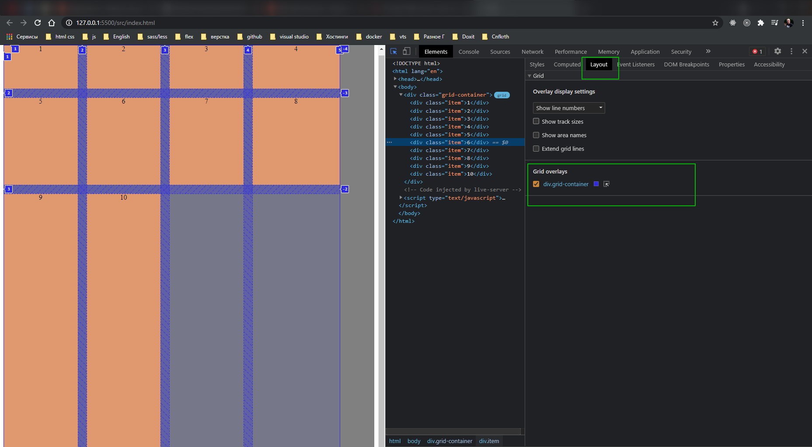
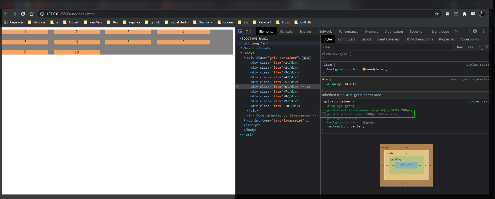

# 002 Dev tools. Grid auto rows

[https://www.udemy.com/course/html-css-from-zero/learn/lecture/16483784#overview](https://www.udemy.com/course/html-css-from-zero/learn/lecture/16483784#overview)

Познакомимся с Dev tools который можно использовать с grid. Так же познакомимся с неявно определяемыми строками и колонками.

У него конечно сетка по лучше. Однако он рассматривате на примере firefox.

Косая штриховка это наши отступы.

Далее у нас есть явные и не явные определения строк. Колонок разберем чуть позже.

Предположим что я отключаю grid-template-rows.

То он у меня сам определяет что у меня есть 4-е колонки и что все 4 ре элемента в эти колонки не влазят и соответственно он переносит их не следующую строку. Т.е. создает новые строки не явно определяя их.

Если я уберу grid-grap то можно увидить что явно определенные отделяются сплошной линией. В hrome все такой линией.

короче смотри если что по видео. По моему здесь больше хрень порет.
