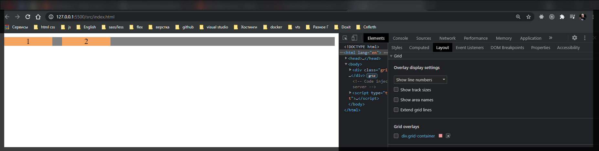
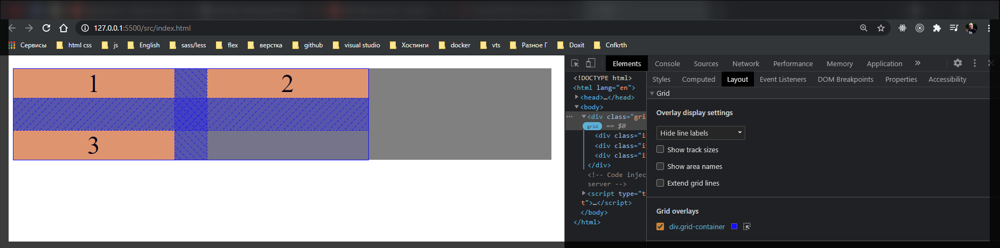
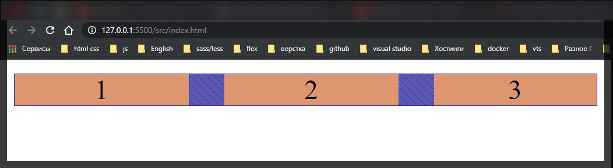
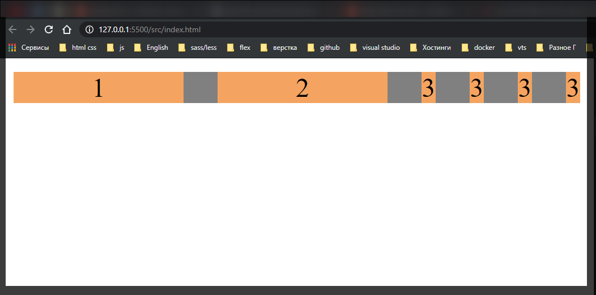
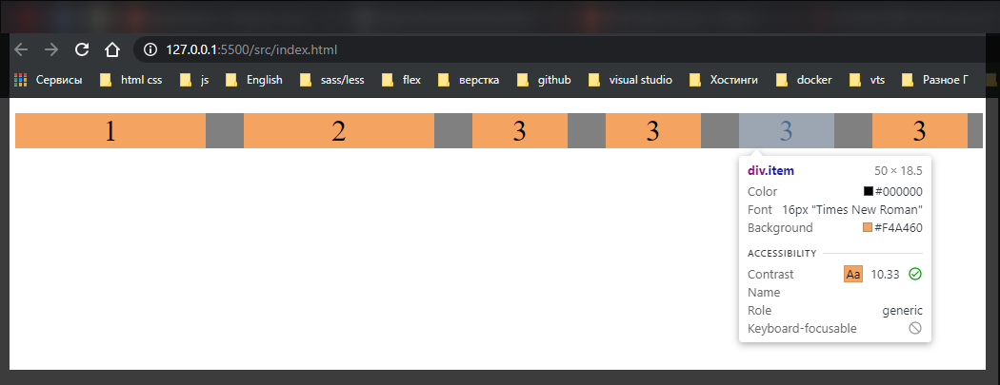

# Grid auto flow, grid auto columns

[https://www.udemy.com/course/html-css-from-zero/learn/lecture/16483822#overview](https://www.udemy.com/course/html-css-from-zero/learn/lecture/16483822#overview)

У нас когда браузер не знает какое количество есть колонок или строк он их формирует автоматически

```html
<!DOCTYPE html>
<html lang="en">
  <head>
    <meta charset="UTF-8" />
    <meta http-equiv="X-UA-Compatible" content="IE=edge" />
    <meta name="viewport" content="width=device-width, initial-scale=1.0" />
    <link rel="stylesheet" href="./styles/styles.css" />
    <title>Grid</title>
  </head>
  <body>
    <div class="grid-container">
      <div class="item">1</div>
      <div class="item">2</div>
    </div>
  </body>
</html>
```

```css
.grid-container {
  display: grid;
  grid-gap: 20px;
  grid-template-columns: 100px 100px;
  background-color: gray;
  text-align: center;
}

.item {
  background-color: sandybrown;
}
```



По линии вокруг элемента можно видеть где заканчиваются сетка **grid** т.е. из явно определенных элементов т.е. те которые мы задали.

Если я в разметке укажу еще один элемен, то он автоматически будет перенесен на следующую строку.

```html
<!DOCTYPE html>
<html lang="en">
  <head>
    <meta charset="UTF-8" />
    <meta http-equiv="X-UA-Compatible" content="IE=edge" />
    <meta name="viewport" content="width=device-width, initial-scale=1.0" />
    <link rel="stylesheet" href="./styles/styles.css" />
    <title>Grid</title>
  </head>
  <body>
    <div class="grid-container">
      <div class="item">1</div>
      <div class="item">2</div>
      <div class="item">3</div>
    </div>
  </body>
</html>
```



Создав дополнительный элемент он у нас переносится вниз в следующий **row**.

Что делать если я хочу что бы он становился справо в пустое место? Для этого есть специальное свойство **grid-auto-flow: row;** оно определяет как мы хотим располагать элементы для которых небыло явно обозначена сетка. Соответственно по умолчанию у нас идет **row**, все переносится на следующую строку если не помещаюься. Но мы можем менять на **column**.

```css
.grid-container {
  display: grid;
  grid-gap: 20px;
  grid-template-columns: 100px 100px;
  grid-auto-flow: column;
  background-color: gray;
  text-align: center;
}

.item {
  background-color: sandybrown;
}
```



Если присмотрется то по второму элементу идет сплошная линия которая определяет что данные элементы, первый и воторой были созданы явно, а третий элемент не явно. мы можем таких элементов создать кучу и все они будут пытаться уместиться в новых колонках.

```html
<!DOCTYPE html>
<html lang="en">
  <head>
    <meta charset="UTF-8" />
    <meta http-equiv="X-UA-Compatible" content="IE=edge" />
    <meta name="viewport" content="width=device-width, initial-scale=1.0" />
    <link rel="stylesheet" href="./styles/styles.css" />
    <title>Grid</title>
  </head>
  <body>
    <div class="grid-container">
      <div class="item">1</div>
      <div class="item">2</div>
      <div class="item">3</div>
      <div class="item">3</div>
      <div class="item">3</div>
      <div class="item">3</div>
    </div>
  </body>
</html>
```



При этом используя **grid-auto-columns** задать им размер

```css
.grid-container {
  display: grid;
  grid-gap: 20px;
  grid-template-columns: 100px 100px;
  grid-auto-flow: column;
  grid-auto-columns: 50px;
  background-color: gray;
  text-align: center;
}

.item {
  background-color: sandybrown;
}
```


