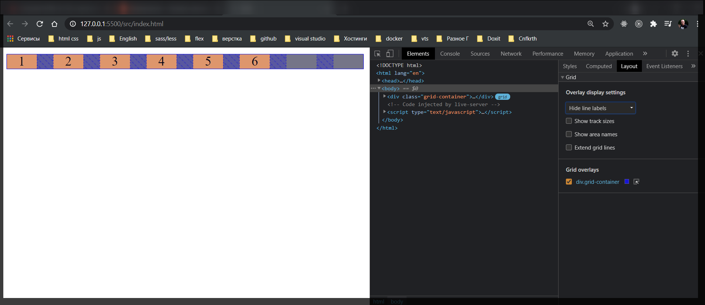

# 004 Sizing grid. Единицы измерения fr

Познакомимся с еденицей измерения **fr** или **fractional unit (т.е. дробная еденица)**.

Давайте посмотрим в общем то сначало какая у нас проблема возникает и как мы ее решим.

Предположим мы хотим сделать три четыре элемента, равные по ширине. Например четыре колонки. К примеру будем использовать вот так **grid-template-columns: 25% 25% 25% 25%;**

```css
.grid-container {
  display: grid;
  grid-template-columns: 25% 25% 25% 25%;
  grid-gap: 20px;
  background-color: gray;
  text-align: center;
}

.item {
  background-color: sandybrown;
}
```

```html
<!DOCTYPE html>
<html lang="en">
  <head>
    <meta charset="UTF-8" />
    <meta http-equiv="X-UA-Compatible" content="IE=edge" />
    <meta name="viewport" content="width=device-width, initial-scale=1.0" />
    <link rel="stylesheet" href="./styles/styles.css" />
    <title>Grid</title>
  </head>
  <body>
    <div class="grid-container">
      <div class="item">1</div>
      <div class="item">2</div>
      <div class="item">3</div>
      <div class="item">4</div>
      <div class="item">5</div>
      <div class="item">6</div>
    </div>
  </body>
</html>
```

и я получаю **scroll**


Происходит это потому что ширина была посчитана относительно контейнера, но здесь не учитывается **20px grid-grap**. Соответственно элемент начинает вылазить за пределы контенера.

Что бы от этого избавится мы можем использовать специальную единицу измерения **fr**. **fr** можно воспринимать как единицу измерения пустого пространства т.е. после того как мы распределили по колонкам у нас остается пустое пространство в контейнере. Мы можем указать сколько следующая колонка может занимать пустого пространства. Например **1fr** - это значит что она будет занимать все пустое пространство которое остается от первой колонки. При этом будет автоматически высчитываться отступ который у нас есть между колонками.

```css
.grid-container {
  display: grid;
  grid-template-columns: 100px 1fr;
  grid-gap: 20px;
  background-color: gray;
  text-align: center;
}

.item {
  background-color: sandybrown;
}
```


Я могу поставить еще **1fr**

```css
.grid-container {
  display: grid;
  grid-template-columns: 100px 1fr 1fr;
  grid-gap: 20px;
  background-color: gray;
  text-align: center;
}

.item {
  background-color: sandybrown;
}
```


Это похоже на **flex-grow** когда мы можем задавать сколько пустого места может занамать элемент в рамках контейнера. При этом можно задавать больше едениц **2fr**.

```css
.grid-container {
  display: grid;
  grid-template-columns: 100px 2fr 1fr;
  grid-gap: 20px;
  background-color: gray;
  text-align: center;
}

.item {
  background-color: sandybrown;
}
```


Это значит что вторая колонка будет занимать в два раза больше пустого пространства чем 3-я колонка.

Таким образом мы можем распределять колонки. Делать их **responcive** что бы они у нас тянулись под размеры блока. Совмещая их с фиксированными колонками.

Инрересно поведение когда мы используем значение **auto**

```css
.grid-container {
  display: grid;
  grid-template-columns: auto 2fr 1fr;
  grid-gap: 20px;
  background-color: gray;
  text-align: center;
}

.item {
  background-color: sandybrown;
}
```


В таком формате это работает следующим образом. Когда у нас есть auto он будет высчитывать ширину элемента т.е. ширину его контента.

```html
<!DOCTYPE html>
<html lang="en">
  <head>
    <meta charset="UTF-8" />
    <meta http-equiv="X-UA-Compatible" content="IE=edge" />
    <meta name="viewport" content="width=device-width, initial-scale=1.0" />
    <link rel="stylesheet" href="./styles/styles.css" />
    <title>Grid</title>
  </head>
  <body>
    <div class="grid-container">
      <div class="item">1 hello world</div>
      <div class="item">2</div>
      <div class="item">3</div>
      <div class="item">4</div>
      <div class="item">5</div>
      <div class="item">6</div>
    </div>
  </body>
</html>
```


Данная колонка расширяется и у других автоматически пересчитывается ширина.

Теперь что касается функции **repeat()**

```css
.grid-container {
  display: grid;
  grid-template-columns: repeat(4, 1fr);
  grid-gap: 20px;
  background-color: gray;
  text-align: center;
}

.item {
  background-color: sandybrown;
}
```


Мы так же можем прописать еще одно значение **fr** вот так

```css
.grid-container {
  display: grid;
  grid-template-columns: repeat(4, 1fr 1fr);
  grid-gap: 20px;
  background-color: gray;
  text-align: center;
}

.item {
  background-color: sandybrown;
}
```



У нас элементов не хватает, но он создал пустые ячейки. Мы файктически с вами генерируем четыре раза по два элемента каждый из которых **1fr** и **1fr**.

```css
<!DOCTYPE html>
<html lang="en">
  <head>
    <meta charset="UTF-8" />
    <meta http-equiv="X-UA-Compatible" content="IE=edge" />
    <meta name="viewport" content="width=device-width, initial-scale=1.0" />
    <link rel="stylesheet" href="./styles/styles.css" />
    <title>Grid</title>
  </head>
  <body>
    <div class="grid-container">
      <div class="item">1</div>
      <div class="item">2</div>
      <div class="item">3</div>
      <div class="item">4</div>
      <div class="item">5</div>
      <div class="item">6</div>
      <div class="item">7</div>
      <div class="item">8</div>
    </div>
  </body>
</html>
```

```css
.grid-container {
  display: grid;
  grid-template-columns: repeat(4, 1fr 100px);
  grid-gap: 20px;
  background-color: gray;
  text-align: center;
}

.item {
  background-color: sandybrown;
}
```


Каждый четный элемент **100px**, а не четные распределяют оставшееся пространство.
