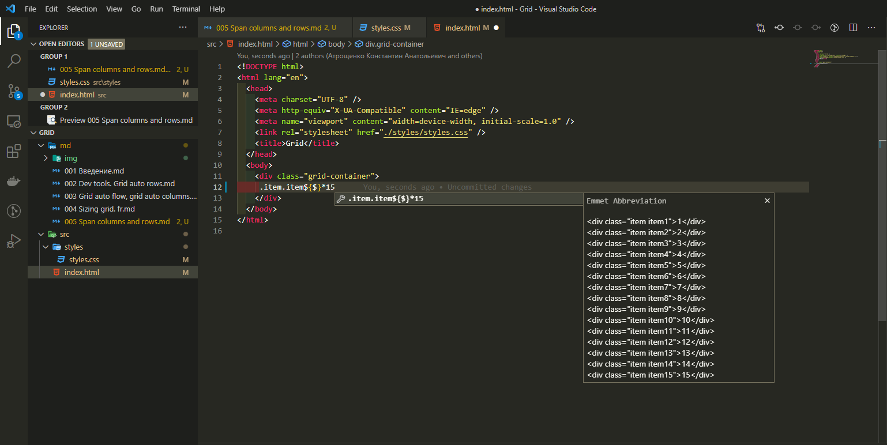
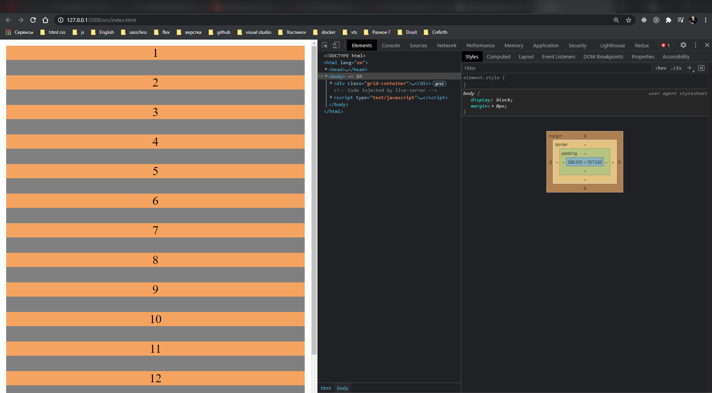
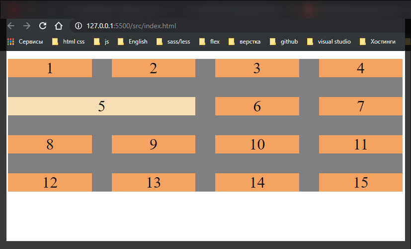
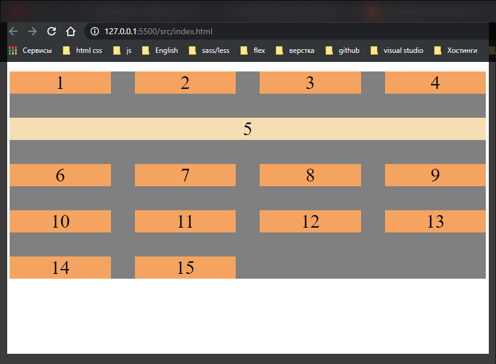
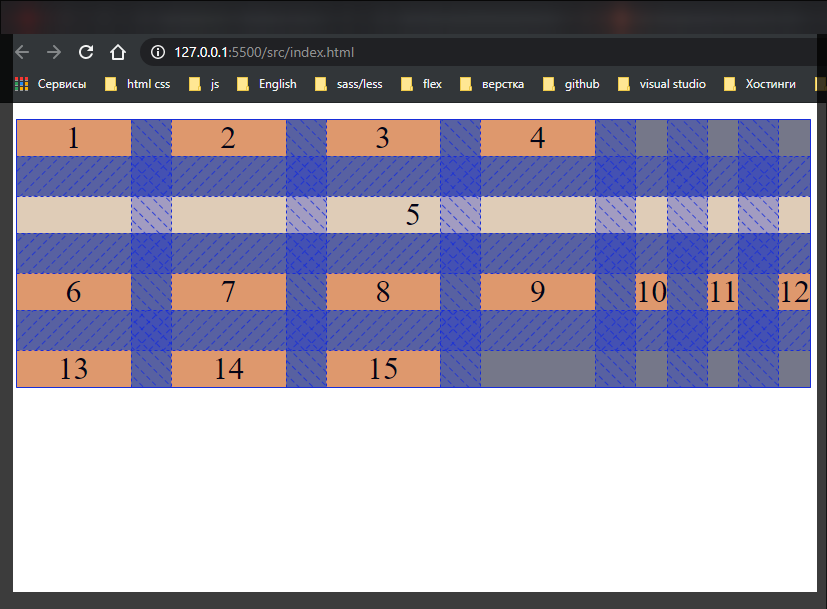
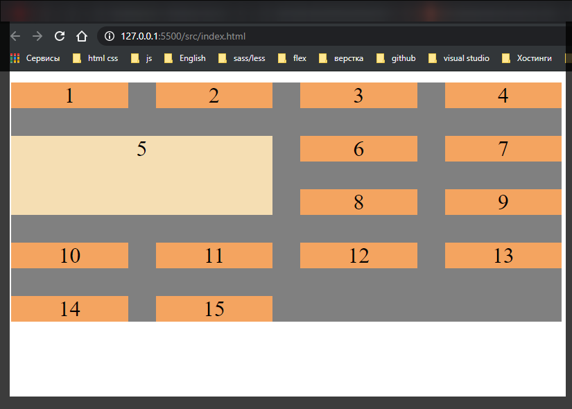

# Span columns and rows

Познакомимся с такими свойствами как **grid-column** и **grid-row** и как мы можем задать некоторые размеры для наших **grid-item**. **grid-item** это дочерние элементы **grid-container**



```html
<!DOCTYPE html>
<html lang="en">
  <head>
    <meta charset="UTF-8" />
    <meta http-equiv="X-UA-Compatible" content="IE=edge" />
    <meta name="viewport" content="width=device-width, initial-scale=1.0" />
    <link rel="stylesheet" href="./styles/styles.css" />
    <title>Grid</title>
  </head>
  <body>
    <div class="grid-container">
      <div class="item item1">1</div>
      <div class="item item2">2</div>
      <div class="item item3">3</div>
      <div class="item item4">4</div>
      <div class="item item5">5</div>
      <div class="item item6">6</div>
      <div class="item item7">7</div>
      <div class="item item8">8</div>
      <div class="item item9">9</div>
      <div class="item item10">10</div>
      <div class="item item11">11</div>
      <div class="item item12">12</div>
      <div class="item item13">13</div>
      <div class="item item14">14</div>
      <div class="item item15">15</div>
    </div>
  </body>
</html>
```



```css
.grid-container {
  display: grid;
  grid-template-columns: repeat (4, 1fr);
  grid-gap: 20px;
  background-color: gray;
  text-align: center;
}

.item {
  background-color: sandybrown;
}
```

Мы можем обращаться к определенным элементам **grid-item** и задавать им какое количество колонок они будут занимать или строк они будут занимать в сетке. Это очень схоже с таблицами. Там есть похожие атрибуты **rowspan** или **collspan**.

Мы можем обратиться к классу **item-5** и задать ему **grid-column: span 2;**

```css
.grid-container {
  display: grid;
  grid-template-columns: repeat(4, 1fr);
  grid-gap: 20px;
  background-color: gray;
  text-align: center;
}

.item {
  background-color: sandybrown;
}

.item5 {
  background: wheat;
  grid-column: span 2;
}
```



Если задать 4-ре то он займет 4-ре колонки.

```css
.grid-container {
  display: grid;
  grid-template-columns: repeat(4, 1fr);
  grid-gap: 20px;
  background-color: gray;
  text-align: center;
}

.item {
  background-color: sandybrown;
}

.item5 {
  background: wheat;
  grid-column: span 4;
}
```



Интересно будет если я ему укажу 7-мь колонок.

```css
.grid-container {
  display: grid;
  grid-template-columns: repeat(4, 1fr);
  grid-gap: 20px;
  background-color: gray;
  text-align: center;
}

.item {
  background-color: sandybrown;
}

.item5 {
  background: wheat;
  grid-column: span 7;
}
```



Браузер создает еще не явные колонки находящиеся за сплошной линией.

Так же мы можем задавать и по строкам

```css
.grid-container {
  display: grid;
  grid-template-columns: repeat(4, 1fr);
  grid-gap: 20px;
  background-color: gray;
  text-align: center;
}

.item {
  background-color: sandybrown;
}

.item5 {
  background: wheat;
  grid-column: span 2;
  grid-row: span 2;
}
```


