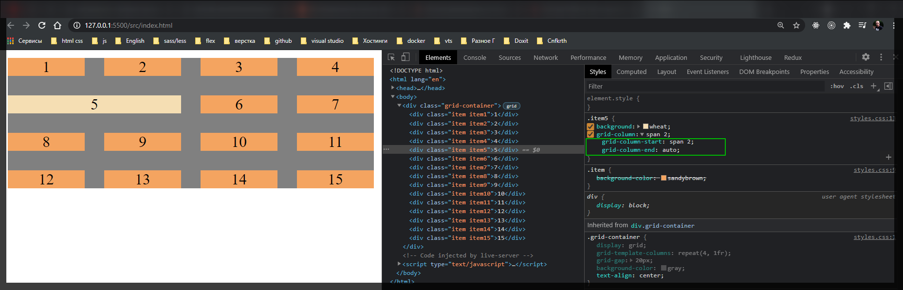
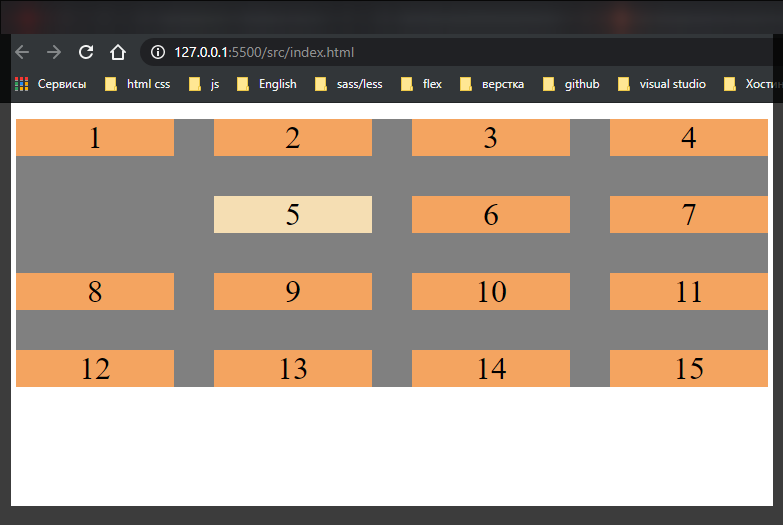
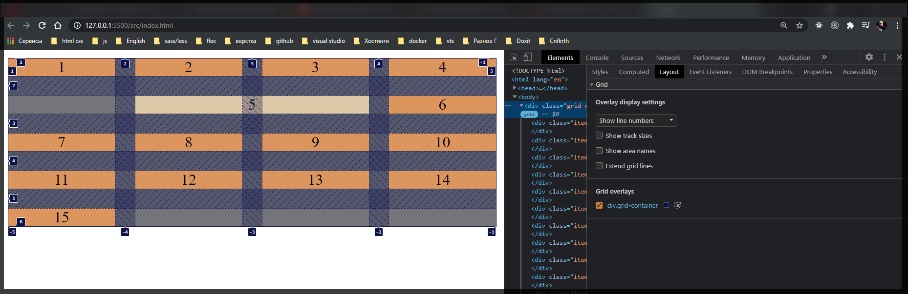
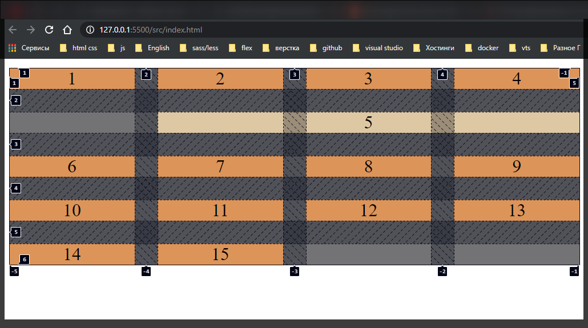
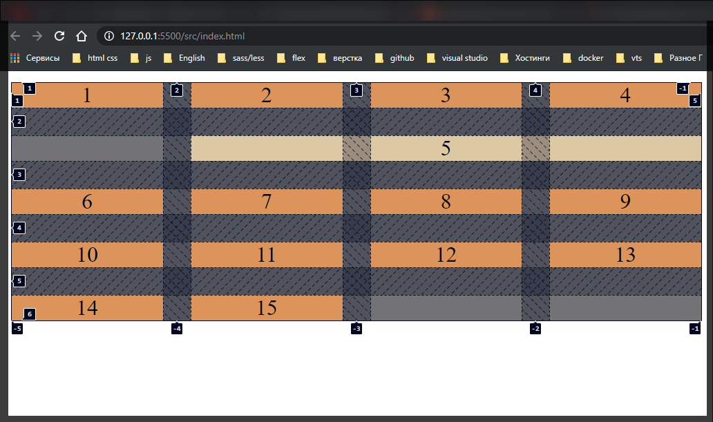
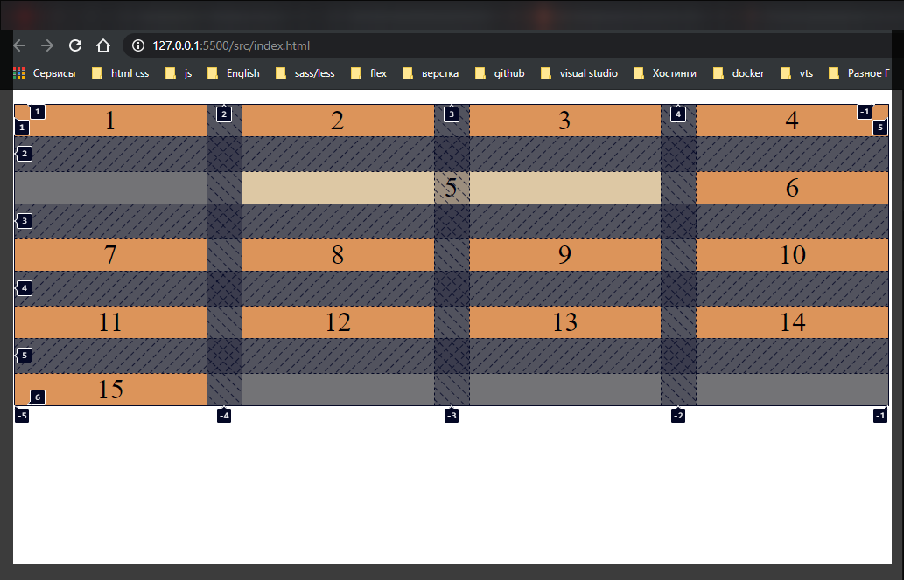
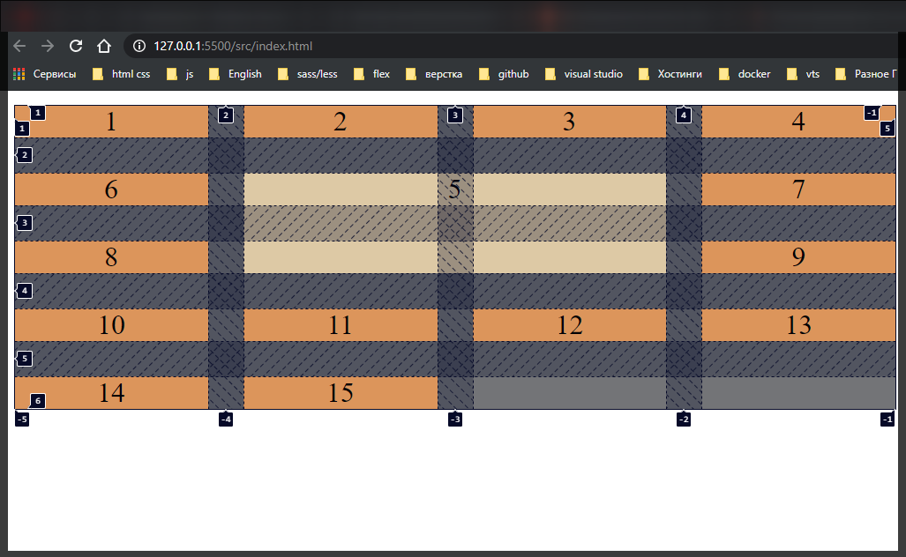
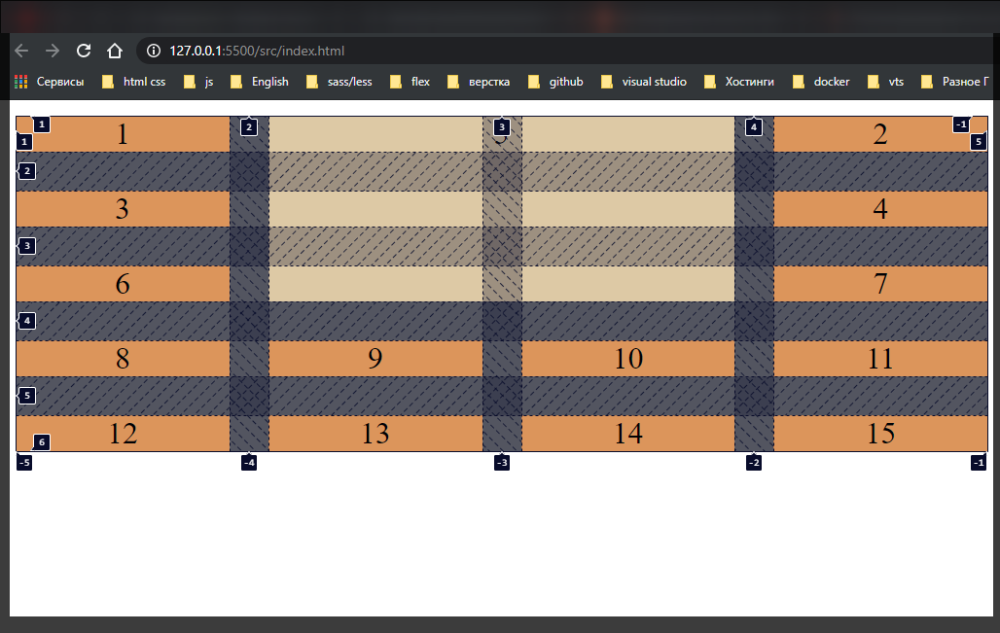
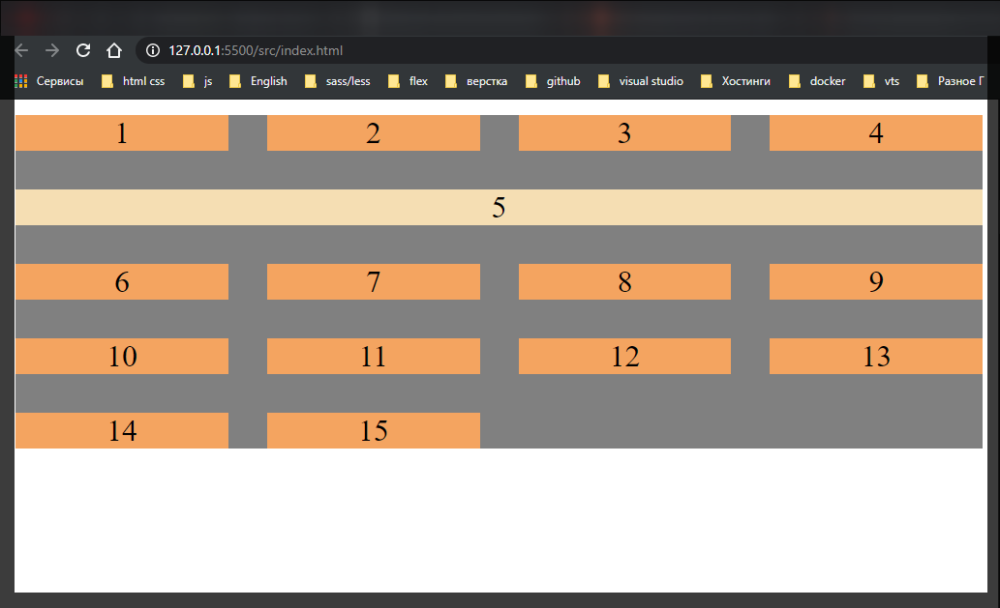
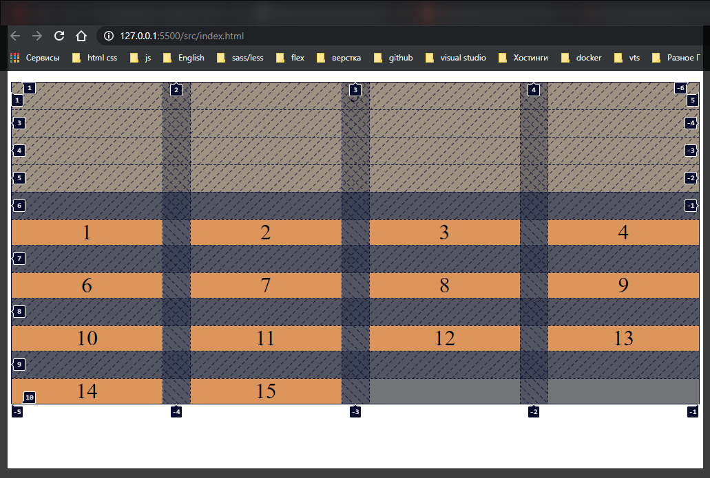

# 006 Размещение grid items

[https://www.udemy.com/course/html-css-from-zero/learn/lecture/16483930#overview](https://www.udemy.com/course/html-css-from-zero/learn/lecture/16483930#overview)

```html
<!DOCTYPE html>
<html lang="en">
  <head>
    <meta charset="UTF-8" />
    <meta http-equiv="X-UA-Compatible" content="IE=edge" />
    <meta name="viewport" content="width=device-width, initial-scale=1.0" />
    <link rel="stylesheet" href="./styles/styles.css" />
    <title>Grid</title>
  </head>
  <body>
    <div class="grid-container">
      <div class="item item1">1</div>
      <div class="item item2">2</div>
      <div class="item item3">3</div>
      <div class="item item4">4</div>
      <div class="item item5">5</div>
      <div class="item item6">6</div>
      <div class="item item7">7</div>
      <div class="item item8">8</div>
      <div class="item item9">9</div>
      <div class="item item10">10</div>
      <div class="item item11">11</div>
      <div class="item item12">12</div>
      <div class="item item13">13</div>
      <div class="item item14">14</div>
      <div class="item item15">15</div>
    </div>
  </body>
</html>
```

```css
.grid-container {
  display: grid;
  grid-template-columns: repeat(4, 1fr);
  grid-gap: 20px;
  background-color: gray;
  text-align: center;
}

.item {
  background-color: sandybrown;
}
```

Познакомимся как мы можем перемещать наши элементы в рамках нашей сетки.

В панели разработчиков включим показывать номера рядов. Это даст нам информацию о так называемых треках по вертикали и по горизонтали. Мы видим полосы определяющие нашу сетку. И в рамках этих полос мы можем с вами передвигаться. Если мы объеденим две колонки и посмотрим в инспектор мы увидим два свойства **grid-column-start: span 2;** и **grid-column-end: auto;**

```css
.grid-container {
  display: grid;
  grid-template-columns: repeat(4, 1fr);
  grid-gap: 20px;
  background-color: gray;
  text-align: center;
}

.item {
  background-color: sandybrown;
}

.item5 {
  background: wheat;
  grid-column: span 2;
}
```



**grid-column** определяет два значения **grid-column-start:** и **grid-column-end:**.

**grid-column-start:** определяет трек с которого мы хотим начинать и **grid-column-end:** это на какой позиции мы хотим закончить. span говорит что мы будем начинать с текущего положения там где мы находимся и занимать мы будем две колонки.

Но мы можем задавать и числовые значения. Мы можем их задавать либо отдельными свойствами такими как **grid-column-start:** и **grid-column-end:** Либо можно все объединять в **grid-column**.

Начнем с длинных свойств. Мы можем говорить что мы хотим наыинать со второго трека **grid-column-start: 2;**

```css
.grid-container {
  display: grid;
  grid-template-columns: repeat(4, 1fr);
  grid-gap: 20px;
  background-color: gray;
  text-align: center;
}

.item {
  background-color: sandybrown;
}

.item5 {
  background: wheat;
  grid-column-start: 2;
}
```



Наш элемент переместился на вторую колонку. И заканчивать я хочу на 4-ом

```css
.grid-container {
  display: grid;
  grid-template-columns: repeat(4, 1fr);
  grid-gap: 20px;
  background-color: gray;
  text-align: center;
}

.item {
  background-color: sandybrown;
}

.item5 {
  background: wheat;
  grid-column-start: 2;
  grid-column-end: 4;
}
```



И вот наш элемент начинается со второй колонки и заканчивает до 4-й колонки т.е. он занимает 2-ю и 3-ю колонку.

Это все мы можем объявить в короткой записи **grid-column: 2 / 4;**

```css
.grid-container {
  display: grid;
  grid-template-columns: repeat(4, 1fr);
  grid-gap: 20px;
  background-color: gray;
  text-align: center;
}

.item {
  background-color: sandybrown;
}

.item5 {
  background: wheat;
  grid-column: 2 / 5;
}
```



Бывает такое что мы не знаем какое у нас количество элементов и мы хотим расположить контейнер с какой-то позиции и до конца. Для того что бы указать что мы хотим рассполагать элемент до конца мы должны указать **-1**

```css
.grid-container {
  display: grid;
  grid-template-columns: repeat(4, 1fr);
  grid-gap: 20px;
  background-color: gray;
  text-align: center;
}

.item {
  background-color: sandybrown;
}

.item5 {
  background: wheat;
  grid-column: 2 / -1;
}
```



Если мы укажем **-2** то последний элемент у нас будет не торонутым.

```css
.grid-container {
  display: grid;
  grid-template-columns: repeat(4, 1fr);
  grid-gap: 20px;
  background-color: gray;
  text-align: center;
}

.item {
  background-color: sandybrown;
}

.item5 {
  background: wheat;
  grid-column: 2 / -2;
}
```



Тоже самое мы можем указывать и для row позиции

```css
.grid-container {
  display: grid;
  grid-template-columns: repeat(4, 1fr);
  grid-gap: 20px;
  background-color: gray;
  text-align: center;
}

.item {
  background-color: sandybrown;
}

.item5 {
  background: wheat;
  grid-column: 2 / -2;
  grid-row: 2 / 4;
}
```



или с первой строки.

```css
.grid-container {
  display: grid;
  grid-template-columns: repeat(4, 1fr);
  grid-gap: 20px;
  background-color: gray;
  text-align: center;
}

.item {
  background-color: sandybrown;
}

.item5 {
  background: wheat;
  grid-column: 2 / -2;
  grid-row: 1 / 4;
}
```



Т.е. мы можем указывать по обоим осям, по обоим линиям, по горизонтали по вертикали рассположении.

Если в **grid-column:** мы могли указать **-1** и тем самым растянуть элемент на всю ширину. То при таком базовом определении **grid-row** у нас ничего не произойдет. Не произойдет потому что мы не определили количество row в нашей сетке. Для этого их нужно определить **grid-template-rows: repeat(5, auto);**

```css
.grid-container {
  display: grid;
  grid-template-columns: repeat(4, 1fr);
  grid-template-rows: repeat(5, auto);
  grid-gap: 20px;
  background-color: gray;
  text-align: center;
}

.item {
  background-color: sandybrown;
}

.item5 {
  background: wheat;
  grid-column: 1 / -1;
}
```



Если я ему задаю что он должен занимать от начала и до конца **grid-row: 1 / -1;**

```css
.grid-container {
  display: grid;
  grid-template-columns: repeat(4, 1fr);
  grid-template-rows: repeat(5, auto);
  grid-gap: 20px;
  background-color: gray;
  text-align: center;
}

.item {
  background-color: sandybrown;
}

.item5 {
  background: wheat;
  grid-column: 1 / -1;
  grid-row: 1 / -1;
}
```



То получается не большой казус. Т.е. определенный грид элемент занимает все пространство. Как видите он занял всю верхнюю позицию. А все остальные элементы выпали из основного **grid** контейнера.
