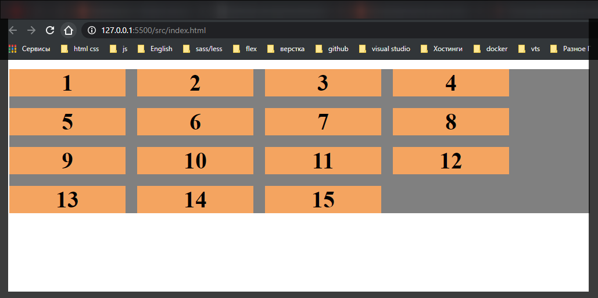
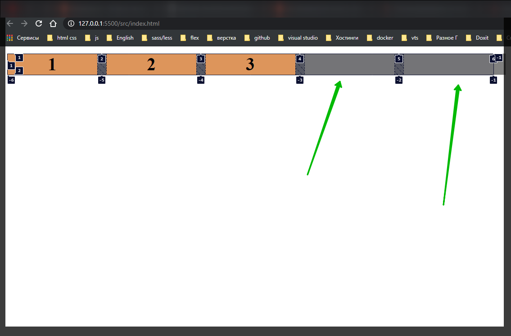
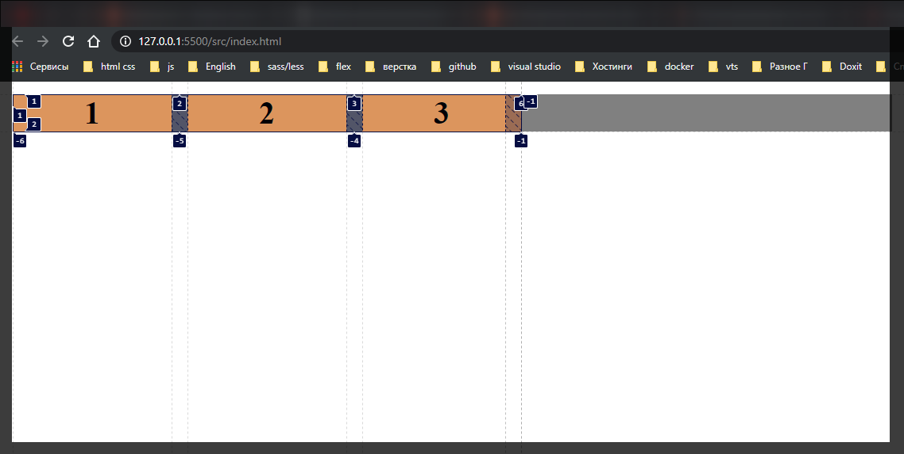
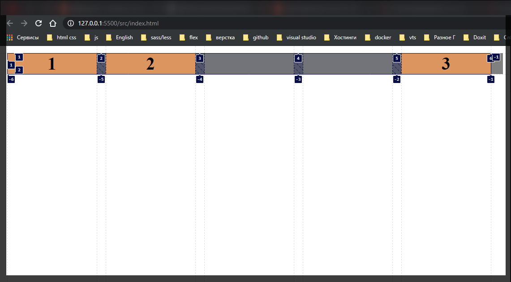

# Grid auto-fill, auto-fit

[https://www.udemy.com/course/html-css-from-zero/learn/lecture/16483942#overview](https://www.udemy.com/course/html-css-from-zero/learn/lecture/16483942#overview)

```css
.grid-container {
  display: grid;
  grid-gap: 10px;
  background-color: gray;
  text-align: center;
}

.item {
  background-color: sandybrown;
  font-size: 20px;
  font-weight: bold;
}
```

```html
<!DOCTYPE html>
<html lang="en">
  <head>
    <meta charset="UTF-8" />
    <meta http-equiv="X-UA-Compatible" content="IE=edge" />
    <meta name="viewport" content="width=device-width, initial-scale=1.0" />
    <link rel="stylesheet" href="./styles/styles.css" />
    <title>Grid</title>
  </head>
  <body>
    <div class="grid-container">
      <div class="item item1">1</div>
      <div class="item item2">2</div>
      <div class="item item3">3</div>
      <div class="item item4">4</div>
      <div class="item item5">5</div>
      <div class="item item6">6</div>
      <div class="item item7">7</div>
      <div class="item item8">8</div>
      <div class="item item9">9</div>
      <div class="item item10">10</div>
      <div class="item item11">11</div>
      <div class="item item12">12</div>
      <div class="item item13">13</div>
      <div class="item item14">14</div>
      <div class="item item15">15</div>
    </div>
  </body>
</html>
```

G**rid auto-fill, auto-fit** мы их можем задать когда мы например формируем сетку из колонок **grid-template-columns: repeat();** и мы можем указать что мы хотим сформировать столько колонок сколько влезет в наш контейнер. и мы для этого используем **grid-template-columns: repeat(auto-fill, 100px);** И у нас автоматически, не зависимо от размера, будет помещаться столько элементов сколько сколько их поместится с размером **100px**.



При изменении размера экрана они будут перестраиваться.

Если посмотреть что делает **auto-fit** то мы ни какой разницы не заметим

```css
.grid-container {
  display: grid;
  grid-gap: 10px;
  grid-template-columns: repeat(auto-fit, 100px);
  background-color: gray;
  text-align: center;
}

.item {
  background-color: sandybrown;
  font-size: 20px;
  font-weight: bold;
}
```

А разница заметна чуть-чуть при другом формате

```html
<!DOCTYPE html>
<html lang="en">
  <head>
    <meta charset="UTF-8" />
    <meta http-equiv="X-UA-Compatible" content="IE=edge" />
    <meta name="viewport" content="width=device-width, initial-scale=1.0" />
    <link rel="stylesheet" href="./styles/styles.css" />
    <title>Grid</title>
  </head>
  <body>
    <div class="grid-container">
      <div class="item item1">1</div>
      <div class="item item2">2</div>
      <div class="item item3">3</div>
    </div>
  </body>
</html>
```

```css
.grid-container {
  display: grid;
  grid-gap: 10px;
  grid-template-columns: repeat(auto-fill, 100px);
  background-color: gray;
  text-align: center;
}

.item {
  background-color: sandybrown;
  font-size: 20px;
  font-weight: bold;
}
```

Если мы посмотрим на скрин то увидим что **auto-fill** формирует колонки больше чем нужно.



Если мы возмем **fit**

```css
.grid-container {
  display: grid;
  grid-gap: 10px;
  grid-template-columns: repeat(auto-fit, 100px);
  background-color: gray;
  text-align: center;
}

.item {
  background-color: sandybrown;
  font-size: 20px;
  font-weight: bold;
}
```



Лишние контейнеры не создаются.

Спросите что с этим делать?

Если использовать **item-fill** совместно с **grid-column-end** то можно расположить контейнер в конце **grid** сетки.

```css
.grid-container {
  display: grid;
  grid-gap: 10px;
  grid-template-columns: repeat(auto-fill, 100px);
  background-color: gray;
  text-align: center;
}

.item {
  background-color: sandybrown;
  font-size: 20px;
  font-weight: bold;
}

.item3 {
  grid-column-end: -1;
}
```



Т.к. браузер расчитал количество мест которые есть еще под колонки, фактически сформировал эти колонки, которые нечем заполнять. Но мы можем по этим колонкам перемещать текущие элементы.
