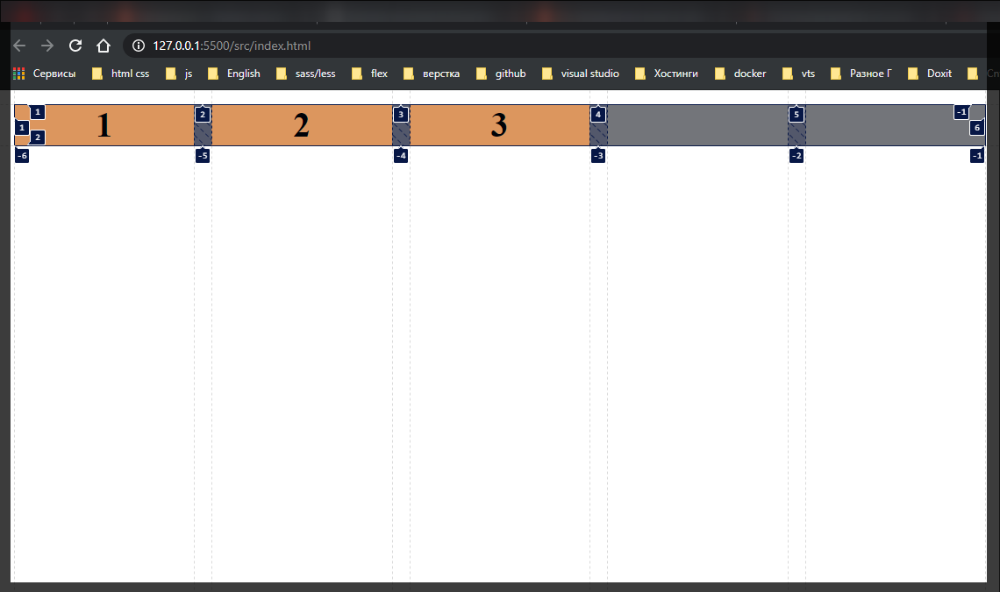
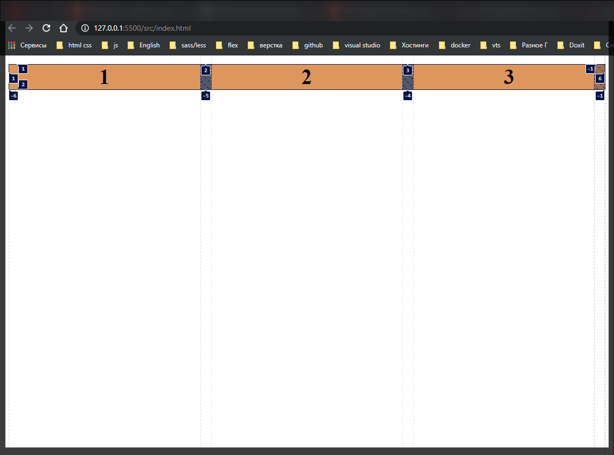
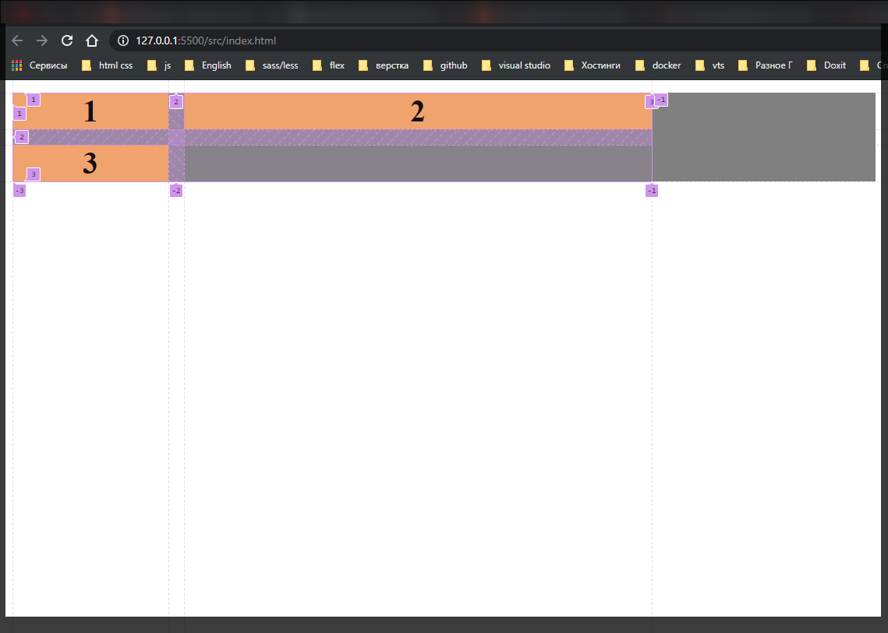

# Minmax function

Рассмотрим как можно задать диапазон размеров колонок. Для этого мы можем использовать **minmax()** в которую мы принимаем два параметра. Первый параметр минимальное значение, второй параметр максимальное значение.

```css
.grid-container {
  display: grid;
  grid-gap: 10px;
  grid-template-columns: repeat(auto-fill, minmax(100px, 1fr));
  background-color: gray;
  text-align: center;
}

.item {
  background-color: sandybrown;
  font-size: 20px;
  font-weight: bold;
}
```

Мы говорим что хотим использовать минимальное значение **100px**, а максимальное значение контейнеры будут занимать все свободное пространство. Таким образом при уменьшении экрана блоки доходят до **100px**. И если контейнерам не будет хватать места они будут перестраиваться. Это может уменьшить количество медиа запросов.

Вот так происходит если мы используем **auto-fill**



Т.е. контейнеры занимают **100%** ширины отведенной браузером при этом формирует дополнительные колонки. Но Если я буду использовать **auto-fit**

```css
.grid-container {
  display: grid;
  grid-gap: 10px;
  grid-template-columns: repeat(auto-fit, minmax(100px, 1fr));
  background-color: gray;
  text-align: center;
}

.item {
  background-color: sandybrown;
  font-size: 20px;
  font-weight: bold;
}
```



При этом эту функцию **minmax()** мы можем применять и просто для колонок.

```css
.grid-container {
  display: grid;
  grid-gap: 10px;
  grid-template-columns: repeat(
    auto-fit,
    minmax(100px, 200px) minmax(100px, 300px)
  );
  background-color: gray;
  text-align: center;
}

.item {
  background-color: sandybrown;
  font-size: 20px;
  font-weight: bold;
}
```


