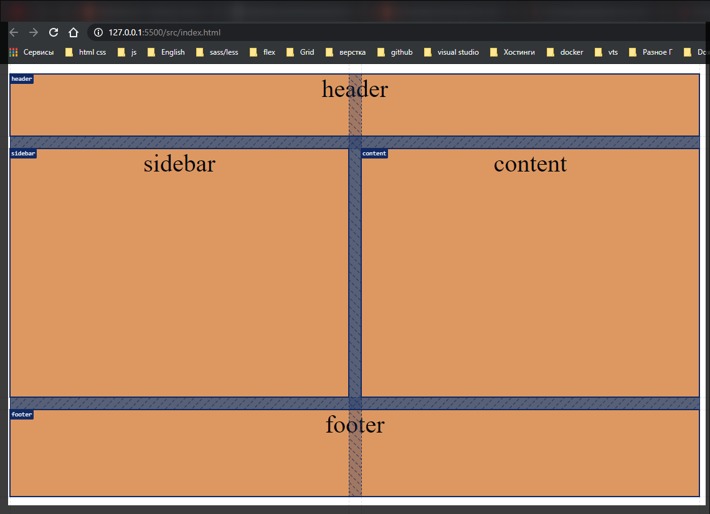

# Grid template areas

[https://www.udemy.com/course/html-css-from-zero/learn/lecture/16483968#overview](https://www.udemy.com/course/html-css-from-zero/learn/lecture/16483968#overview)

```html
<!DOCTYPE html>
<html lang="en">
  <head>
    <meta charset="UTF-8" />
    <meta http-equiv="X-UA-Compatible" content="IE=edge" />
    <meta name="viewport" content="width=device-width, initial-scale=1.0" />
    <link rel="stylesheet" href="./styles/styles.css" />
    <title>Grid</title>
  </head>
  <body>
    <div class="grid-container">
      <div class="item header">header</div>
      <div class="item sidebar">sidebar</div>
      <div class="item content">content</div>
      <div class="item footer">footer</div>
    </div>
  </body>
</html>
```

```css
.grid-container {
  display: grid;
  grid-gap: 10px;
  background-color: gray;
  text-align: center;
}

.item {
  background-color: sandybrown;
}
```


Познокомимся с очень крутой штукой в **grid** это **grid-template-area**.

У нас есть довольно класическая ситуация когда у нас есть какой-то контейнер. В нем есть **header**, **sidebar**, **content**, **footer**. Так вот мы можем задать нашей сетке определенные области и дать им имена, а потом в них расположить нужные нам элементы.

Допустим мы хотим разбить на две колонки. У нас будет сверху на всю ширину шапка. По середине будет два блока **sidebar** и **content**. И внизу будет **footer**.

Мы создаем **grid-template-columns:** и говорим что у нс будет две колонки по **1fr**. И у нас будет 3-ри row так как у нас будет фактически три сущности **heder**, **sidebar** и **content** в одной линии, и **footer**. Я создаю **grid-template-rows** и говорю что шапка будет **50px**, контентная часть **200px** и **70px** **footer**.

```css
.grid-container {
  display: grid;
  grid-gap: 10px;
  grid-template-columns: 1fr 1fr;
  grid-template-rows: 50px 200px 70px;
  background-color: gray;
  text-align: center;
}

.item {
  font-size: 20px;
  background-color: sandybrown;
}
```


Теперь мы можем создать области и дать им имена. Для этого я использую **grid-template-areas**. И здесь это выглядит следующим образом. Открываю кавычки и пишу **"heder heder"**, далее без всяких точек с запятыми и запятыми пишу **"sidebar content"** и третьей пишу **"footer footer"**

```css
.grid-container {
  display: grid;
  grid-gap: 10px;
  grid-template-columns: 1fr 1fr;
  grid-template-rows: 50px 200px 70px;
  grid-template-areas:
    'header header'
    'sidebar content'
    'footer footer';
  background-color: gray;
  text-align: center;
}

.item {
  font-size: 20px;
  background-color: sandybrown;
}
```

Т.е. мы что сделали? Мы с вами как бы описали те колонки которые у нас есть в том количестве рядов которые у нас есть т.е. у нас есть две колонки в три ряда.

Теперь в панели разработчика мы можем включить отображение названия панели областей.


И мы теперь можем очень легко сделать следующее. Обратиться к классу **header** и через **grid-area** указать его область т.е. **header**.

```css
.grid-container {
  display: grid;
  grid-gap: 10px;
  grid-template-columns: 1fr 1fr;
  grid-template-rows: 50px 200px 70px;
  grid-template-areas:
    'header header'
    'sidebar content'
    'footer footer';
  background-color: gray;
  text-align: center;
}

.item {
  font-size: 20px;
  background-color: sandybrown;
}

.header {
  grid-area: header;
}
```


И он растягивается на все ширину. Нам не надо указывать количество колонок которое он должен содержать и т.д.
Далее я могу обратиться к классу **sidebar** и указать у него область **grid-area: sidebar;**

```css
.grid-container {
  display: grid;
  grid-gap: 10px;
  grid-template-columns: 1fr 1fr;
  grid-template-rows: 50px 200px 70px;
  grid-template-areas:
    'header header'
    'sidebar content'
    'footer footer';
  background-color: gray;
  text-align: center;
}

.item {
  font-size: 20px;
  background-color: sandybrown;
}

.header {
  grid-area: header;
}

.sidebar {
  grid-area: sidebar;
}
```


теперь тоже самое для **content**

```css
.grid-container {
  display: grid;
  grid-gap: 10px;
  grid-template-columns: 1fr 1fr;
  grid-template-rows: 50px 200px 70px;
  grid-template-areas:
    'header header'
    'sidebar content'
    'footer footer';
  background-color: gray;
  text-align: center;
}

.item {
  font-size: 20px;
  background-color: sandybrown;
}

.header {
  grid-area: header;
}

.sidebar {
  grid-area: sidebar;
}

.content {
  grid-area: content;
}
```


и **footer**

```css
.grid-container {
  display: grid;
  grid-gap: 10px;
  grid-template-columns: 1fr 1fr;
  grid-template-rows: 50px 200px 70px;
  grid-template-areas:
    'header header'
    'sidebar content'
    'footer footer';
  background-color: gray;
  text-align: center;
}

.item {
  font-size: 20px;
  background-color: sandybrown;
}

.header {
  grid-area: header;
}

.sidebar {
  grid-area: sidebar;
}

.content {
  grid-area: content;
}

.footer {
  grid-area: footer;
}
```



И как мы видим элементы стали в четко нужные области.

При это если я увеличу количество колонок

```css
.grid-container {
  display: grid;
  grid-gap: 10px;
  grid-template-columns: 1fr 1fr 1fr;
  grid-template-rows: 50px 200px 70px;
  grid-template-areas:
    'header header'
    'sidebar content'
    'footer footer';
  background-color: gray;
  text-align: center;
}

.item {
  font-size: 20px;
  background-color: sandybrown;
}

.header {
  grid-area: header;
}

.sidebar {
  grid-area: sidebar;
}

.content {
  grid-area: content;
}

.footer {
  grid-area: footer;
}
```


Появляется пустая колонка. Теперь мне нужно обновить мою **grid-template-areas**

```css
.grid-container {
  display: grid;
  grid-gap: 10px;
  grid-template-columns: 1fr 1fr 1fr;
  grid-template-rows: 50px 200px 70px;
  grid-template-areas:
    'header header header'
    'sidebar content content'
    'footer footer footer';
  background-color: gray;
  text-align: center;
}

.item {
  font-size: 20px;
  background-color: sandybrown;
}

.header {
  grid-area: header;
}

.sidebar {
  grid-area: sidebar;
}

.content {
  grid-area: content;
}

.footer {
  grid-area: footer;
}
```


Если мы хотим какую-то область пропустить то в конце мы просто ставим точку.

```css
.grid-container {
  display: grid;
  grid-gap: 10px;
  grid-template-columns: 1fr 1fr 1fr;
  grid-template-rows: 50px 200px 70px;
  grid-template-areas:
    'header header header'
    'sidebar content content'
    'footer footer .';
  background-color: gray;
  text-align: center;
}

.item {
  font-size: 20px;
  background-color: sandybrown;
}

.header {
  grid-area: header;
}

.sidebar {
  grid-area: sidebar;
}

.content {
  grid-area: content;
}

.footer {
  grid-area: footer;
}
```


При этом **grid-template-areas:** мы можем менять прямо в адаптиве. Я могу сказать как при адаптиве должна меняться **area** т.е. меняться мои колонки и т.д. просто поменяв их нужное положение.

Так же что очень интересно то что мы можем не указывать количество

```css
grid-template-columns: 1fr 1fr 1fr;
grid-template-rows: 50px 200px 70px;
```

Здесь мы указываем их размеры, но тем не менее мы можем убрать их размеры.

```css
.grid-container {
  display: grid;
  grid-gap: 10px;
  /* grid-template-columns: 1fr 1fr 1fr;
  grid-template-rows: 50px 200px 70px; */
  grid-template-areas:
    'header header header'
    'sidebar content content'
    'footer footer footer';
  background-color: gray;
  text-align: center;
}

.item {
  font-size: 20px;
  background-color: sandybrown;
}

.header {
  grid-area: header;
}

.sidebar {
  grid-area: sidebar;
}

.content {
  grid-area: content;
}

.footer {
  grid-area: footer;
}
```


Происходит это потому что мы в **grid-area** определяем какое количество колонок у нас будет и количество строк которые у нас будут.

При этом что еще интересно. Это то что мы можем указывать расположение элемента. Если мы раньше его указывали при помощи **grid-column** или **grid-row**, непосредственно на элементе, указывая цифры.

То здесь мы теперь можем использовать имена областей и по именам областей позиционировать элементы в нужную область.

```css
.grid-container {
  display: grid;
  grid-gap: 10px;
  /* grid-template-columns: 1fr 1fr 1fr;
  grid-template-rows: 50px 200px 70px; */
  grid-template-areas:
    'header header header'
    'sidebar content content'
    'footer footer footer';
  background-color: gray;
  text-align: center;
}

.item {
  font-size: 20px;
  background-color: sandybrown;
}

.header {
  /* grid-area: header; */
  grid-row: header-start / sidebar-end;
}

/* .sidebar {
  grid-area: sidebar;
}

.content {
  grid-area: content;
}

.footer {
  grid-area: footer;
} */
```


И то же самое могу делать по колонкам.
