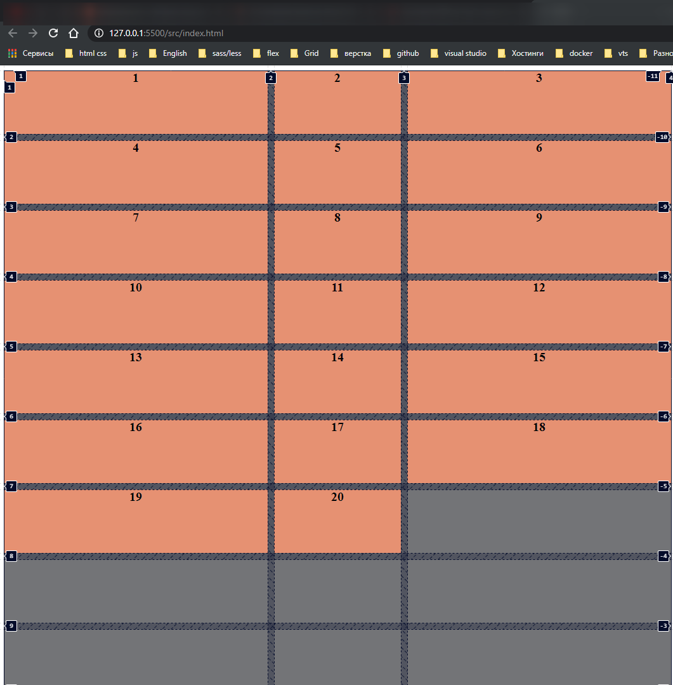
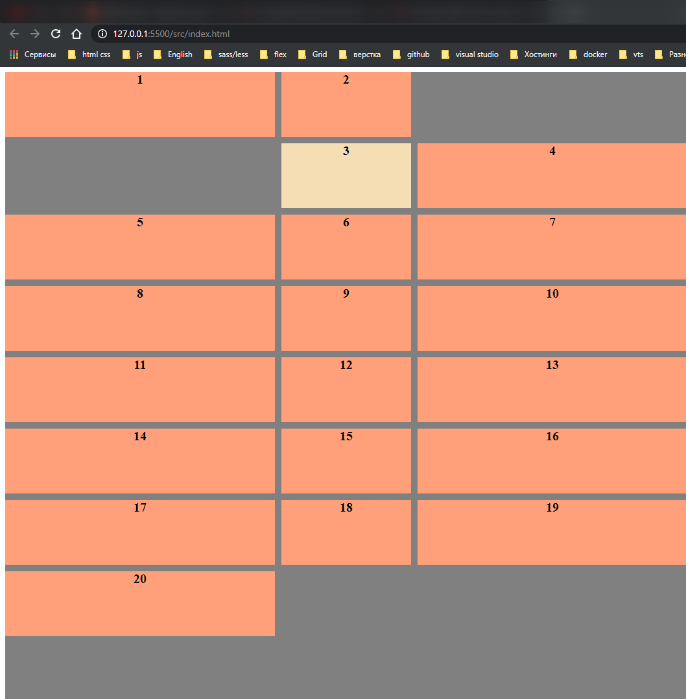
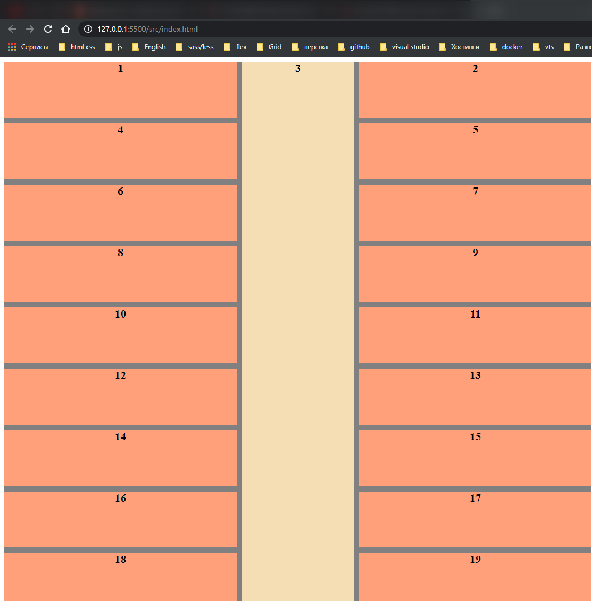

# Именованные линии

[https://www.udemy.com/course/html-css-from-zero/learn/lecture/16483986#overview](https://www.udemy.com/course/html-css-from-zero/learn/lecture/16483986#overview)

```html
<!DOCTYPE html>
<html lang="en">
  <head>
    <meta charset="UTF-8" />
    <meta http-equiv="X-UA-Compatible" content="IE=edge" />
    <meta name="viewport" content="width=device-width, initial-scale=1.0" />
    <link rel="stylesheet" href="./styles/styles.css" />
    <title>Grid</title>
  </head>
  <body>
    <div class="grid-container">
      <div class="item item1">1</div>
      <div class="item item2">2</div>
      <div class="item item3">3</div>
      <div class="item item4">4</div>
      <div class="item item5">5</div>
      <div class="item item6">6</div>
      <div class="item item7">7</div>
      <div class="item item8">8</div>
      <div class="item item9">9</div>
      <div class="item item10">10</div>
      <div class="item item11">11</div>
      <div class="item item12">12</div>
      <div class="item item13">13</div>
      <div class="item item14">14</div>
      <div class="item item15">15</div>
      <div class="item item16">16</div>
      <div class="item item17">17</div>
      <div class="item item18">18</div>
      <div class="item item19">19</div>
      <div class="item item20">20</div>
    </div>
  </body>
</html>
```

```css
.grid-container {
  display: grid;
  grid-template-columns: 1fr 200px 1fr;
  grid-template-rows: repeat(10, 100px);
  grid-gap: 10px;
  background-color: gray;
}

.item {
  font-size: 20px;
  text-align: center;
  font-weight: bold;
  background-color: lightsalmon;
}
```



Что мы можем сделать в плане именования линий?

Для начало расположим элемент.

```css
.grid-container {
  display: grid;
  grid-template-columns: 1fr 200px 1fr;
  grid-template-rows: repeat(10, 100px);
  grid-gap: 10px;
  background-color: gray;
}

.item {
  font-size: 20px;
  text-align: center;
  font-weight: bold;
  background-color: lightsalmon;
}

.item3 {
  background: wheat;
  grid-column: 2;
  grid-row: 1 / -1;
}
```

Мы можем задать как раз таки этим линиям имена. Для этого мы например с колонками **grid-template-columns: 1fr 200px 1fr;** Перед определением размера мы можем в квадратных скобках задать имя, например **[site-left]**, вторая колонка **[content-start]** и третья **[content-end]** и **[site-right]**

```css
.grid-container {
  display: grid;
  grid-template-columns: [site-left] 1fr [content-start] 200px [content-end] 1fr [site-right];
  grid-template-rows: repeat(10, 100px);
  grid-gap: 10px;
  background-color: gray;
}

.item {
  font-size: 20px;
  text-align: center;
  font-weight: bold;
  background-color: lightsalmon;
}

.item3 {
  background: wheat;
  grid-column: 2;
  grid-row: 1 / -1;
}
```

Кароче это оказывается своего рода переменные которые мы можем использовать. Теперь в **item3** я могу в **grid-column** я могу в место цифры написать. И это работает.

```css
.grid-container {
  display: grid;
  grid-template-columns: [site-left] 1fr [content-start] 200px [content-end] 1fr [site-right];
  grid-template-rows: repeat(10, 100px);
  grid-gap: 10px;
  background-color: gray;
}

.item {
  font-size: 20px;
  text-align: center;
  font-weight: bold;
  background-color: lightsalmon;
}

.item3 {
  background: wheat;
  grid-column: content-start;
  /* grid-row: 1 / -1; */
}
```



И так же для grid-row я могу так же определить. Сначало задаю имена **grid-template-rows: [content-top] repeat(10, 100px) [content-bottom];** т.е. между этими линиями у нас будут 10-ть рядов.
И теперь в item3 я могу определить

```css
.grid-container {
  display: grid;
  grid-template-columns: [site-left] 1fr [content-start] 200px [content-end] 1fr [site-right];
  grid-template-rows: [content-top] repeat(10, 100px) [content-bottom];
  grid-gap: 10px;
  background-color: gray;
}

.item {
  font-size: 20px;
  text-align: center;
  font-weight: bold;
  background-color: lightsalmon;
}

.item3 {
  background: wheat;
  grid-column: content-start;
  grid-row: content-top / content-bottom;
}
```



Мы получаем точно такой же результат, но более читабельный.
