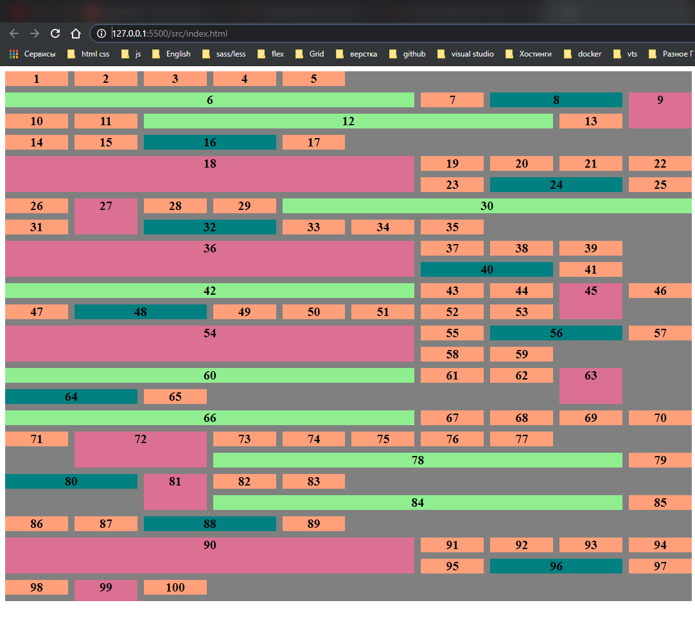
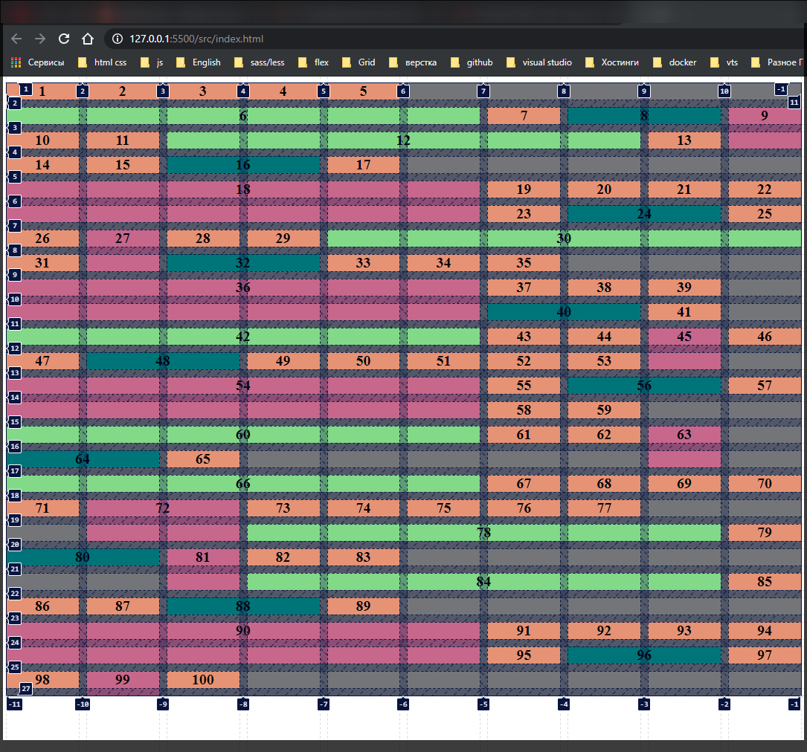

# Grid auto flow dense

[https://www.udemy.com/course/html-css-from-zero/learn/lecture/16508336#overview](https://www.udemy.com/course/html-css-from-zero/learn/lecture/16508336#overview)

В **Grid auto flow** у нас осталось не рассмотренным одно значение а именно **dense**.

И так сгенерирую 100 **div** и разделим на 10 колонок.

```html
<!DOCTYPE html>
<html lang="en">
  <head>
    <meta charset="UTF-8" />
    <meta http-equiv="X-UA-Compatible" content="IE=edge" />
    <meta name="viewport" content="width=device-width, initial-scale=1.0" />
    <link rel="stylesheet" href="./styles/styles.css" />
    <title>Grid</title>
  </head>
  <body>
    <div class="grid-container">
      <div class="item item1">1</div>
      <div class="item item2">2</div>
      <div class="item item3">3</div>
      <div class="item item4">4</div>
      <div class="item item5">5</div>
      <div class="item item6">6</div>
      <div class="item item7">7</div>
      <div class="item item8">8</div>
      <div class="item item9">9</div>
      <div class="item item10">10</div>
      <div class="item item11">11</div>
      <div class="item item12">12</div>
      <div class="item item13">13</div>
      <div class="item item14">14</div>
      <div class="item item15">15</div>
      <div class="item item16">16</div>
      <div class="item item17">17</div>
      <div class="item item18">18</div>
      <div class="item item19">19</div>
      <div class="item item20">20</div>
      <div class="item item21">21</div>
      <div class="item item22">22</div>
      <div class="item item23">23</div>
      <div class="item item24">24</div>
      <div class="item item25">25</div>
      <div class="item item26">26</div>
      <div class="item item27">27</div>
      <div class="item item28">28</div>
      <div class="item item29">29</div>
      <div class="item item30">30</div>
      <div class="item item31">31</div>
      <div class="item item32">32</div>
      <div class="item item33">33</div>
      <div class="item item34">34</div>
      <div class="item item35">35</div>
      <div class="item item36">36</div>
      <div class="item item37">37</div>
      <div class="item item38">38</div>
      <div class="item item39">39</div>
      <div class="item item40">40</div>
      <div class="item item41">41</div>
      <div class="item item42">42</div>
      <div class="item item43">43</div>
      <div class="item item44">44</div>
      <div class="item item45">45</div>
      <div class="item item46">46</div>
      <div class="item item47">47</div>
      <div class="item item48">48</div>
      <div class="item item49">49</div>
      <div class="item item50">50</div>
      <div class="item item51">51</div>
      <div class="item item52">52</div>
      <div class="item item53">53</div>
      <div class="item item54">54</div>
      <div class="item item55">55</div>
      <div class="item item56">56</div>
      <div class="item item57">57</div>
      <div class="item item58">58</div>
      <div class="item item59">59</div>
      <div class="item item60">60</div>
      <div class="item item61">61</div>
      <div class="item item62">62</div>
      <div class="item item63">63</div>
      <div class="item item64">64</div>
      <div class="item item65">65</div>
      <div class="item item66">66</div>
      <div class="item item67">67</div>
      <div class="item item68">68</div>
      <div class="item item69">69</div>
      <div class="item item70">70</div>
      <div class="item item71">71</div>
      <div class="item item72">72</div>
      <div class="item item73">73</div>
      <div class="item item74">74</div>
      <div class="item item75">75</div>
      <div class="item item76">76</div>
      <div class="item item77">77</div>
      <div class="item item78">78</div>
      <div class="item item79">79</div>
      <div class="item item80">80</div>
      <div class="item item81">81</div>
      <div class="item item82">82</div>
      <div class="item item83">83</div>
      <div class="item item84">84</div>
      <div class="item item85">85</div>
      <div class="item item86">86</div>
      <div class="item item87">87</div>
      <div class="item item88">88</div>
      <div class="item item89">89</div>
      <div class="item item90">90</div>
      <div class="item item91">91</div>
      <div class="item item92">92</div>
      <div class="item item93">93</div>
      <div class="item item94">94</div>
      <div class="item item95">95</div>
      <div class="item item96">96</div>
      <div class="item item97">97</div>
      <div class="item item98">98</div>
      <div class="item item99">99</div>
      <div class="item item100">100</div>
    </div>
  </body>
</html>
```

```css
.grid-container {
  display: grid;
  grid-gap: 10px;
  grid-template-columns: repeat(10, 1fr);
  background-color: gray;
}

.item {
  font-size: 20px;
  text-align: center;
  font-weight: bold;
  background-color: lightsalmon;
}
```


теперь каждому **item** через псевдокласс **ntn-child** задам каждому шестому элементу задам другой **background**.

```css
.grid-container {
  display: grid;
  grid-gap: 10px;
  grid-template-columns: repeat(10, 1fr);
  background-color: gray;
}

.item {
  font-size: 20px;
  text-align: center;
  font-weight: bold;
  background-color: lightsalmon;
}

.item:nth-child(6n) {
  background-color: lightgreen;
  grid-column: span 6;
}
.item:nth-child(8n) {
  background-color: teal;
  grid-column: span 2;
}

.item:nth-child(9n) {
  background-color: palevioletred;
  grid-row: span 2;
}
```



Получается вот такая вот каша.

Логично было бы что бы в пустое пространство влазили другие элементы.



Для того что бы это сделать нам достаточно задать корневому контейнеру свойство **grid-auto-flow** и задать значение **dense**.

```css
.grid-container {
  display: grid;
  grid-gap: 10px;
  grid-template-columns: repeat(10, 1fr);
  grid-auto-flow: dense;
  background-color: gray;
}

.item {
  font-size: 20px;
  text-align: center;
  font-weight: bold;
  background-color: lightsalmon;
}

.item:nth-child(6n) {
  background-color: lightgreen;
  grid-column: span 6;
}
.item:nth-child(8n) {
  background-color: teal;
  grid-column: span 2;
}

.item:nth-child(9n) {
  background-color: palevioletred;
  grid-row: span 2;
}
```


теперь браузер автоматически высчитывает где есть пустое пространство и подстраивает туда элементы.
