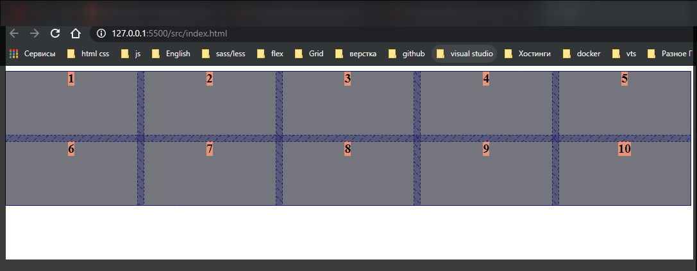

# Выравнивание и центрование

[https://www.udemy.com/course/html-css-from-zero/learn/lecture/16508356#overview](https://www.udemy.com/course/html-css-from-zero/learn/lecture/16508356#overview)

```html
<!DOCTYPE html>
<html lang="en">
  <head>
    <meta charset="UTF-8" />
    <meta http-equiv="X-UA-Compatible" content="IE=edge" />
    <meta name="viewport" content="width=device-width, initial-scale=1.0" />
    <link rel="stylesheet" href="./styles/styles.css" />
    <title>Grid</title>
  </head>
  <body>
    <div class="grid-container">
      <div class="item item1">1</div>
      <div class="item item2">2</div>
      <div class="item item3">3</div>
      <div class="item item4">4</div>
      <div class="item item5">5</div>
      <div class="item item6">6</div>
      <div class="item item7">7</div>
      <div class="item item8">8</div>
      <div class="item item9">9</div>
      <div class="item item10">10</div>
    </div>
  </body>
</html>
```

```css
.grid-container {
  display: grid;
  grid-gap: 10px;
  background-color: gray;
}

.item {
  font-size: 20px;
  text-align: center;
  font-weight: bold;
  background-color: lightsalmon;
}
```

Вообще существует три вида выравнивания.

Это выравнивание непосредственно в рамках **item** т.е. в рамках колонок. Даже можно сказать в рамках ячеек. Мы можем выравниваться по горизонтали, вертикали. Мы можем выравниваться в рамках всего контейнера. И мы можем выравнивать отдельно взятый элемент.

Рассмотрим выравнивание **item**. Это знакомое нам свойство **justify-items**, **align-items** которые нам известны из **flex-box**.

создаю колонки

```css
.grid-container {
  display: grid;
  grid-gap: 10px;
  grid-template-columns: repeat(5, 1fr);
  background-color: gray;
}

.item {
  font-size: 20px;
  text-align: center;
  font-weight: bold;
  background-color: lightsalmon;
}
```


Теперь я могу задать **justify-items**. Он всегда работает по горизонтальной оси т.е. как бы в рамках **row**.

**align** не важно какая у него будет приставка, **items**, **content** или **self**, всегда работает в рамках вертикальной колонки.

Начну с **justify-items: center**.

```css
.grid-container {
  display: grid;
  grid-gap: 10px;
  grid-template-columns: repeat(5, 1fr);
  justify-items: center;
  background-color: gray;
}

.item {
  font-size: 20px;
  text-align: center;
  font-weight: bold;
  background-color: lightsalmon;
}
```


Как мы видим все сузилось до размера контента и выставилось в центр ячейки.

Так почему же мы изначально видим все растянутым? А все потому что по умолчанию стоит значение **stretch**.

Так же есть значения **end** и **start**.

```css
.grid-container {
  display: grid;
  grid-gap: 10px;
  grid-template-columns: repeat(5, 1fr);
  justify-items: end;
  background-color: gray;
}

.item {
  font-size: 20px;
  text-align: center;
  font-weight: bold;
  background-color: lightsalmon;
}
```


```css
.grid-container {
  display: grid;
  grid-gap: 10px;
  grid-template-columns: repeat(5, 1fr);
  justify-items: start;
  background-color: gray;
}

.item {
  font-size: 20px;
  text-align: center;
  font-weight: bold;
  background-color: lightsalmon;
}
```


Так же у нас есть **align-items**, но для этого должна быть высота у строк.

```css
.grid-container {
  display: grid;
  grid-gap: 10px;
  grid-template-columns: repeat(5, 1fr);
  justify-items: center;
  align-items: center;
  grid-template-rows: repeat(2, 100px);
  background-color: gray;
}

.item {
  font-size: 20px;
  text-align: center;
  font-weight: bold;
  background-color: lightsalmon;
}
```


```css
.grid-container {
  display: grid;
  grid-gap: 10px;
  grid-template-columns: repeat(5, 1fr);
  justify-items: center;
  align-items: flex-start;
  grid-template-rows: repeat(2, 100px);
  background-color: gray;
}

.item {
  font-size: 20px;
  text-align: center;
  font-weight: bold;
  background-color: lightsalmon;
}
```

Или start просто тоже работает



```css
.grid-container {
  display: grid;
  grid-gap: 10px;
  grid-template-columns: repeat(5, 1fr);
  justify-items: center;
  align-items: flex-end;
  grid-template-rows: repeat(2, 100px);
  background-color: gray;
}

.item {
  font-size: 20px;
  text-align: center;
  font-weight: bold;
  background-color: lightsalmon;
}
```


stretch по умолчанию элементы все тянутся.

```css
.grid-container {
  display: grid;
  grid-gap: 10px;
  grid-template-columns: repeat(5, 1fr);
  justify-items: center;
  align-items: stretch;
  grid-template-rows: repeat(2, 100px);
  background-color: gray;
}

.item {
  font-size: 20px;
  text-align: center;
  font-weight: bold;
  background-color: lightsalmon;
}
```


т.е. **justify-items** и **align-items** они как бы работают в рамках ячейки. Т.е. вы можете себе представить одну ячейку в которой происходит данная магия.

Так же у нас есть возможность выравнивать всю контентную часть т.е. все наши колонки выравнивать в рамках контейнера.

Для этого нам нужно изменить так что бы наши колонки имели фиксированную ширину. И еще задам высоту всего контейнера.

```css
.grid-container {
  display: grid;
  grid-gap: 10px;
  height: 500px;
  grid-template-columns: repeat(5, 100px);
  justify-items: center;
  align-items: center;
  grid-template-rows: repeat(2, 100px);
  background-color: gray;
}

.item {
  font-size: 20px;
  text-align: center;
  font-weight: bold;
  background-color: lightsalmon;
}
```


Для выравнивания контента у нас есть свойство **justify-content**. Здесь у нас есть так же **center**

```css
.grid-container {
  display: grid;
  grid-gap: 10px;
  height: 500px;
  grid-template-columns: repeat(5, 100px);
  justify-items: center;
  align-items: center;
  justify-content: center;
  grid-template-rows: repeat(2, 100px);
  background-color: gray;
}

.item {
  font-size: 20px;
  text-align: center;
  font-weight: bold;
  background-color: lightsalmon;
}
```


```css
.grid-container {
  display: grid;
  grid-gap: 10px;
  height: 500px;
  grid-template-columns: repeat(5, 100px);
  justify-items: center;
  align-items: center;
  justify-content: end;
  grid-template-rows: repeat(2, 100px);
  background-color: gray;
}

.item {
  font-size: 20px;
  text-align: center;
  font-weight: bold;
  background-color: lightsalmon;
}
```


Можно **start**

```css
.grid-container {
  display: grid;
  grid-gap: 10px;
  height: 500px;
  grid-template-columns: repeat(5, 100px);
  justify-items: center;
  align-items: center;
  justify-content: start;
  grid-template-rows: repeat(2, 100px);
  background-color: gray;
}

.item {
  font-size: 20px;
  text-align: center;
  font-weight: bold;
  background-color: lightsalmon;
}
```


Так же можно использовать **space-around**.


**justify-content: space-between;**

```css
.grid-container {
  display: grid;
  grid-gap: 10px;
  height: 500px;
  grid-template-columns: repeat(5, 100px);
  justify-items: center;
  align-items: center;
  justify-content: space-between;
  grid-template-rows: repeat(2, 100px);
  background-color: gray;
}

.item {
  font-size: 20px;
  text-align: center;
  font-weight: bold;
  background-color: lightsalmon;
}
```


Все те же свойства как в **flex-box**

и тоже самое я могу делать с **align-content**

```css
.grid-container {
  display: grid;
  grid-gap: 10px;
  height: 500px;
  grid-template-columns: repeat(5, 100px);
  justify-items: center;
  align-items: center;
  justify-content: space-between;
  align-content: center;
  grid-template-rows: repeat(2, 100px);
  background-color: gray;
}

.item {
  font-size: 20px;
  text-align: center;
  font-weight: bold;
  background-color: lightsalmon;
}
```


**align-content: space-around;**

```css
.grid-container {
  display: grid;
  grid-gap: 10px;
  height: 500px;
  grid-template-columns: repeat(5, 100px);
  justify-items: center;
  align-items: center;
  justify-content: space-between;
  align-content: space-around;
  grid-template-rows: repeat(2, 100px);
  background-color: gray;
}

.item {
  font-size: 20px;
  text-align: center;
  font-weight: bold;
  background-color: lightsalmon;
}
```


**align-content: space-between;**

```css
.grid-container {
  display: grid;
  grid-gap: 10px;
  height: 500px;
  grid-template-columns: repeat(5, 100px);
  justify-items: center;
  align-items: center;
  justify-content: space-between;
  align-content: space-between;
  grid-template-rows: repeat(2, 100px);
  background-color: gray;
}

.item {
  font-size: 20px;
  text-align: center;
  font-weight: bold;
  background-color: lightsalmon;
}
```


Так же мы можем выравнивать отдельный элемент в сетке. Для этого я использую на элементе свойство **lustify-self**

```css
.grid-container {
  display: grid;
  grid-gap: 10px;
  height: 500px;
  grid-template-columns: repeat(5, 100px);
  /* justify-items: center;
  align-items: center; */
  justify-content: space-between;
  align-content: space-between;
  grid-template-rows: repeat(2, 100px);
  background-color: gray;
}

.item {
  font-size: 20px;
  text-align: center;
  font-weight: bold;
  background-color: lightsalmon;
}

.item3 {
  justify-self: center;
}
```


**align-self: center;**

```css
.grid-container {
  display: grid;
  grid-gap: 10px;
  height: 500px;
  grid-template-columns: repeat(5, 100px);
  /* justify-items: center;
  align-items: center; */
  justify-content: space-between;
  align-content: space-between;
  grid-template-rows: repeat(2, 100px);
  background-color: gray;
}

.item {
  font-size: 20px;
  text-align: center;
  font-weight: bold;
  background-color: lightsalmon;
}

.item3 {
  justify-self: center;
  align-self: center;
}
```


Т.е. он может выравниваться в рамках своей ячейки.
