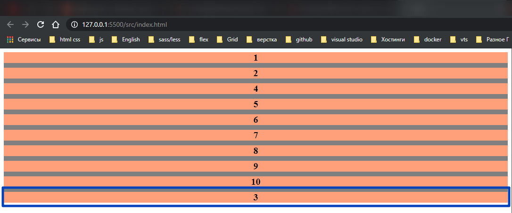
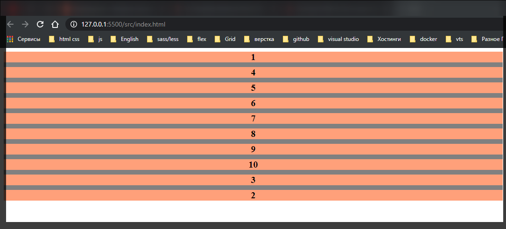
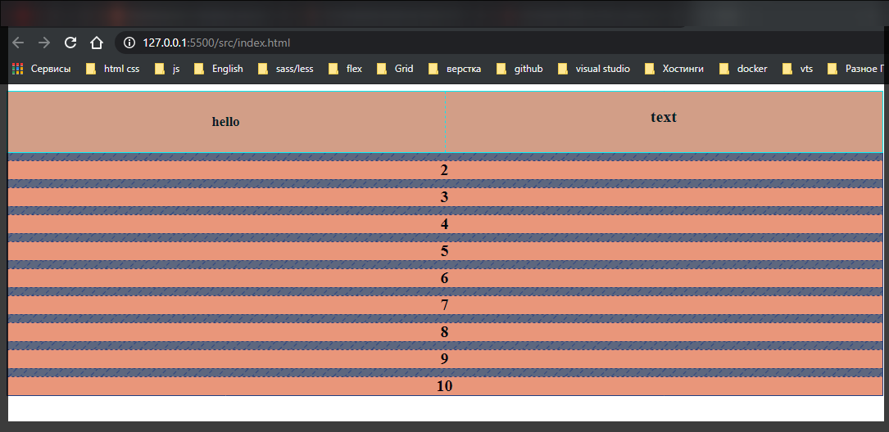

# Порядок grid items и вложенный grid

[https://www.udemy.com/course/html-css-from-zero/learn/lecture/16508360#overview](https://www.udemy.com/course/html-css-from-zero/learn/lecture/16508360#overview)

```css
.grid-container {
  display: grid;
  grid-gap: 10px;
  background-color: gray;
}

.item {
  font-size: 20px;
  text-align: center;
  font-weight: bold;
  background-color: lightsalmon;
}
```

```css
<!DOCTYPE html>
<html lang="en">
  <head>
    <meta charset="UTF-8" />
    <meta http-equiv="X-UA-Compatible" content="IE=edge" />
    <meta name="viewport" content="width=device-width, initial-scale=1.0" />
    <link rel="stylesheet" href="./styles/styles.css" />
    <title>Grid</title>
  </head>
  <body>
    <div class="grid-container">
      <div class="item item1">1</div>
      <div class="item item2">2</div>
      <div class="item item3">3</div>
      <div class="item item4">4</div>
      <div class="item item5">5</div>
      <div class="item item6">6</div>
      <div class="item item7">7</div>
      <div class="item item8">8</div>
      <div class="item item9">9</div>
      <div class="item item10">10</div>
    </div>
  </body>
</html>
```

Будем знакомится с **order** или порядком. Это тоже самое что во **flex-box**. Мы можем определить порядковый номер элемента т.е. где он должен находится.

Например мы можем взять **item3** и задать ему **order:1**.

```css
.grid-container {
  display: grid;
  grid-gap: 10px;
  background-color: gray;
}

.item {
  font-size: 20px;
  text-align: center;
  font-weight: bold;
  background-color: lightsalmon;
}

.item3 {
  order: 1;
}
```

И у нас элемент падает вниз.



Как во **flex-box** так и в **grid** все элементы имеют по умолчанию **order:0;** Если у всех **order:0;** значит они все идут по порядку как в разметке

```html
<!DOCTYPE html>
<html lang="en">
  <head>
    <meta charset="UTF-8" />
    <meta http-equiv="X-UA-Compatible" content="IE=edge" />
    <meta name="viewport" content="width=device-width, initial-scale=1.0" />
    <link rel="stylesheet" href="./styles/styles.css" />
    <title>Grid</title>
  </head>
  <body>
    <div class="grid-container">
      <div class="item item1">1</div>
      <div class="item item2">2</div>
      <div class="item item3">3</div>
      <div class="item item4">4</div>
      <div class="item item5">5</div>
      <div class="item item6">6</div>
      <div class="item item7">7</div>
      <div class="item item8">8</div>
      <div class="item item9">9</div>
      <div class="item item10">10</div>
    </div>
  </body>
</html>
```

Если я меняю **order:1;** Значит у **item3** самый большой **order**. Т.к. элеметы сортируются по **order** то у всех элементов **0** а у **item3 order:1** по этому он становится в конце.

И таким образом с помощью **order** мы можем перемещать элементы

```css
.grid-container {
  display: grid;
  grid-gap: 10px;
  background-color: gray;
}

.item {
  font-size: 20px;
  text-align: center;
  font-weight: bold;
  background-color: lightsalmon;
}

.item3 {
  order: 1;
}
.item2 {
  order: 2;
}
```



Но с **order** будьте внимательны.

Рассмотрим вложенный **grid**.

Вы знаете что все дочерние элементы у **grid** контейнера становятся **grid** элементами. Но внутри их могут быть **grid** элементы.

```html
<!DOCTYPE html>
<html lang="en">
  <head>
    <meta charset="UTF-8" />
    <meta http-equiv="X-UA-Compatible" content="IE=edge" />
    <meta name="viewport" content="width=device-width, initial-scale=1.0" />
    <link rel="stylesheet" href="./styles/styles.css" />
    <title>Grid</title>
  </head>
  <body>
    <div class="grid-container">
      <div class="item item1">
        <div class="nested-item">
          <h5>hello</h5>
          <p>text</p>
        </div>
      </div>
      <div class="item item2">2</div>
      <div class="item item3">3</div>
      <div class="item item4">4</div>
      <div class="item item5">5</div>
      <div class="item item6">6</div>
      <div class="item item7">7</div>
      <div class="item item8">8</div>
      <div class="item item9">9</div>
      <div class="item item10">10</div>
    </div>
  </body>
</html>
```

Теперь мы можем нашему **item1** задать **display-grid** Теперь у нас внутри может быть соответствующая разметка. Только сделаю это все на **nested-item**.

```css
.grid-container {
  display: grid;
  grid-gap: 10px;
  background-color: gray;
}

.item {
  font-size: 20px;
  text-align: center;
  font-weight: bold;
  background-color: lightsalmon;
}

.nested-item {
  display: grid;
  grid-template-columns: repeat(2, 1fr);
}
```


