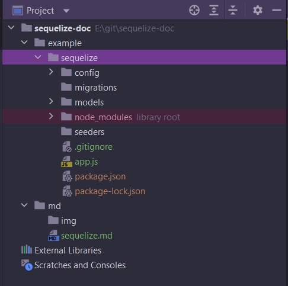
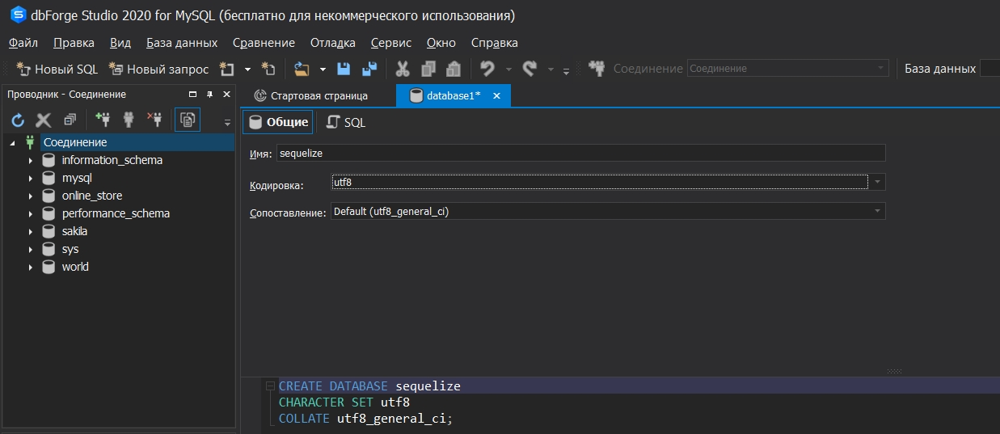
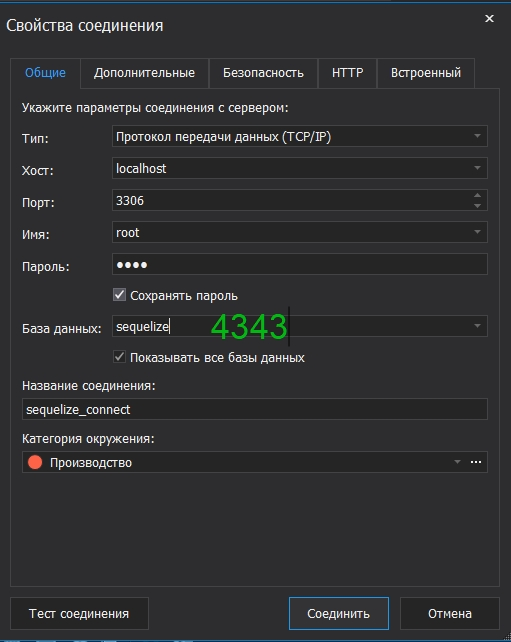
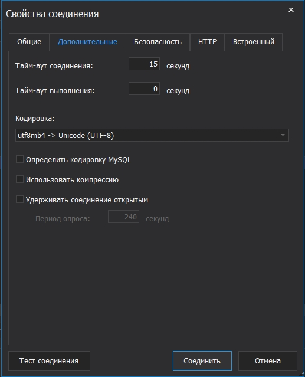
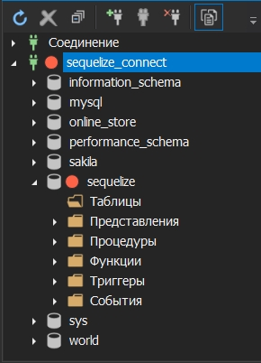
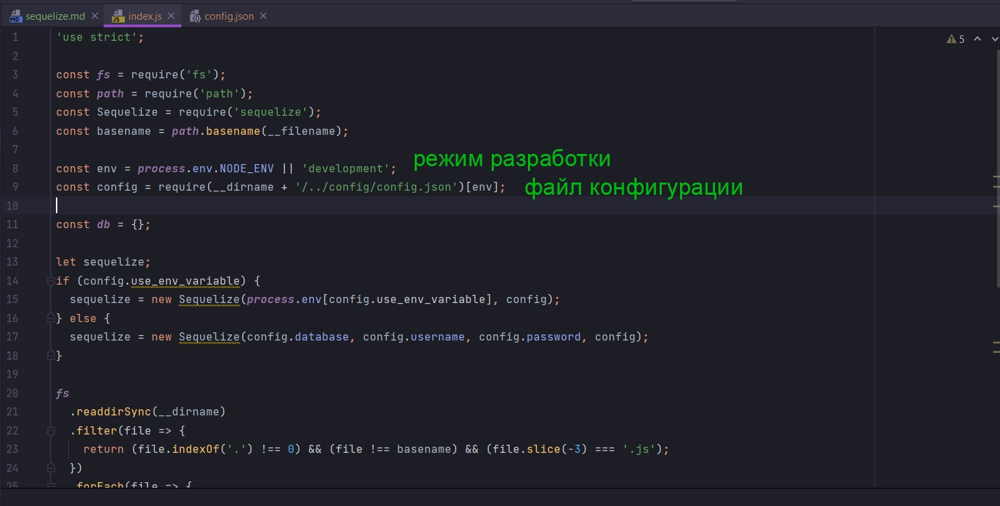
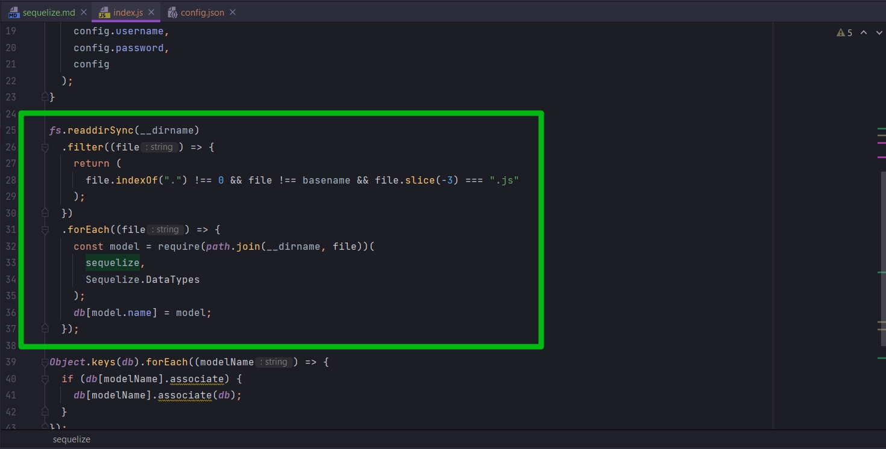
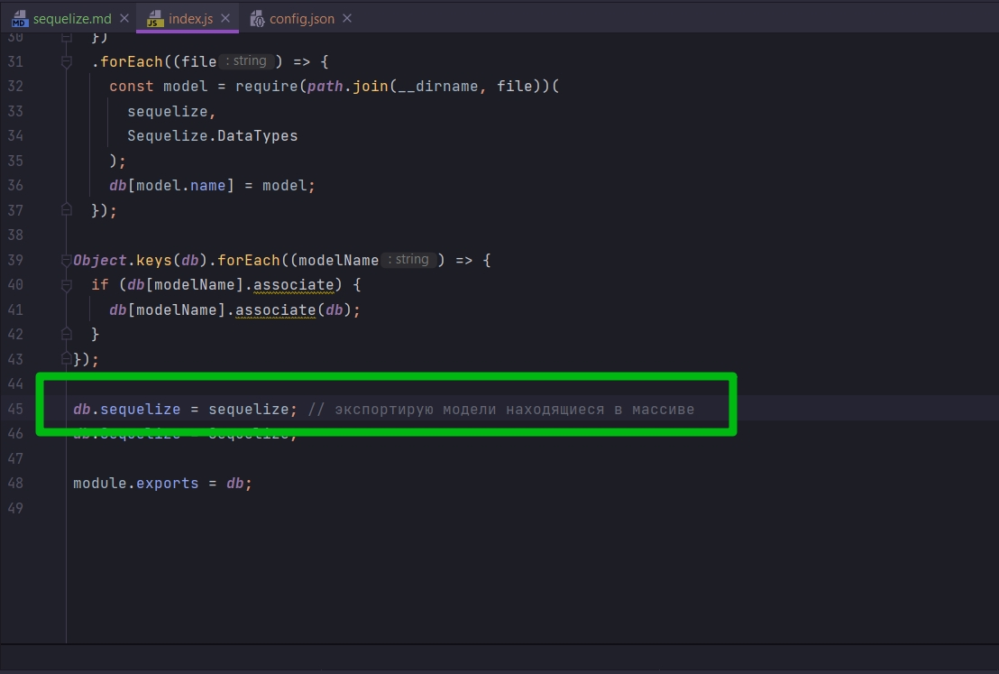

# sequelize

Официальный сайт [https://sequelize.org/](https://sequelize.org/)

Ссылка на видео [https://www.youtube.com/watch?v=3qlnR9hK-lQ&t=1078s](https://www.youtube.com/watch?v=3qlnR9hK-lQ&t=1078s)

РАссмотрим как мы можем использовать sequelize с БД. 

**Sequelize** - это b(**Object-Relational Mapping** ). По русски это Объектно Реляционное Отображение или Преобразование.

Что такое ORM [https://ru.wikipedia.org/wiki/ORM](https://ru.wikipedia.org/wiki/ORM)

Sequelize это просто библиотека, которая позволяет нам подключаться к нашей БД, и выполнять операции без необходимости писать  sql-запросы. Данная библиотека абстрагирует sql код и дает нам некоторые функции javascript для работы. Они, функции, довольно круто упрощают взаимодействие с нашими моделями Баз Данных. UH-таблицами как объектами. 

sequelize основан на sql. По этому он работает со всеми базами данных на основе sql.

Он рассматривает на Postgres. Я же буду переписывать на имеющийся у меня MySql.

На сайте Официальный сайт [https://sequelize.org/](https://sequelize.org/)
перехожу с документации 6v [https://sequelize.org/master](https://sequelize.org/master)

Перехожу в раздел Getting Started. И здесь говориться что нам нужно установить 

```shell
npm install --save sequelize

```

Так же нужно вручную установить драйвер для выбранной вами базы данных:

```shell
# One of the following:
 npm install --save pg pg-hstore # Postgres
 npm install --save mysql2
 npm install --save mariadb
 npm install --save sqlite3
 npm install --save tedious # Microsoft SQL Server

```

В этом же проекте создаю папку example в ней папку sequelize. В ней app.js.

Далее установим наши зависимости. В папке sequelize

```shell
npm init -y
```

```shell
npm install --save sequelize mysql2
```

В руководстве довольно не плохо описано то как создать подключение.

Но так же мы можем использовать так называемое sqlite cli. Что довольно круто. Установим данную зависимость глобально, потому что это нам понадобится позже.

```shell
npm install -g sequelize-cli
```

Это хороший инструмент который позволит нам делать многие вещи с sqlize. По этому первое что мы собираемся сделать это сказать sqlize что я хочу провести инициализацию.

```shell
sequelize init
```

И так после инициализации структура проекта у меня выглядит следующим образом 



Он создает кучу вещей.

Рассмотрим их сверху вниз.

У нас есть папка config с файлом config.json

```json
{
  "development": {
    "username": "root",
    "password": null,
    "database": "database_development",
    "host": "127.0.0.1",
    "dialect": "mysql"
  },
  "test": {
    "username": "root",
    "password": null,
    "database": "database_test",
    "host": "127.0.0.1",
    "dialect": "mysql"
  },
  "production": {
    "username": "root",
    "password": null,
    "database": "database_production",
    "host": "127.0.0.1",
    "dialect": "mysql"
  }
}

```

Он содержит пару подключений к БД. По этому есть development тестовая и production. И конечно же мы в development.

Создаю новую БД.










Далее указываю настройки в конфигурационном файле.

```json
{
  "development": {
    "username": "root",
    "password": "4343",
    "database": "sequelize",
    "host": "127.0.0.1",
    "dialect": "mysql"
  },
  "test": {
    "username": "root",
    "password": null,
    "database": "database_test",
    "host": "127.0.0.1",
    "dialect": "mysql"
  },
  "production": {
    "username": "root",
    "password": null,
    "database": "database_production",
    "host": "127.0.0.1",
    "dialect": "mysql"
  }
}

```


"host": "127.0.0.1", стандартный порт на котором работает localhost.


Идем дальше. У нас есть папка migrations. Что она означает и что она включает в себя мы рассмотрим позже.

Далее у нас есть папка models в которой есть index.js

```js
'use strict';

const fs = require('fs');
const path = require('path');
const Sequelize = require('sequelize');
const basename = path.basename(__filename);
const env = process.env.NODE_ENV || 'development';
const config = require(__dirname + '/../config/config.json')[env];
const db = {};

let sequelize;
if (config.use_env_variable) {
  sequelize = new Sequelize(process.env[config.use_env_variable], config);
} else {
  sequelize = new Sequelize(config.database, config.username, config.password, config);
}

fs
  .readdirSync(__dirname)
  .filter(file => {
    return (file.indexOf('.') !== 0) && (file !== basename) && (file.slice(-3) === '.js');
  })
  .forEach(file => {
    const model = require(path.join(__dirname, file))(sequelize, Sequelize.DataTypes);
    db[model.name] = model;
  });

Object.keys(db).forEach(modelName => {
  if (db[modelName].associate) {
    db[modelName].associate(db);
  }
});

db.sequelize = sequelize;
db.Sequelize = Sequelize;

module.exports = db;

```

В этом файле импортируется конфигурация которую мы только что рассмотрели. И использует среду которую мы используем прямо сейчас, которая является development.



В переменную env мы получаем учетные данные. Затем идем и создаем экземпляр класса sequelize


Этот экземпляр похож на экземпляр соединения с БД который мы будем использовать.

Экземпляр класса sequelize будет проходить через этот каталог



В этом каталоге он будет импортировать любой другой файл, который является моделью БД если он находится внутри этой папки models. sequelize будет проходиться по нашим моделям, инициализировать их и заносить в массив.


Затем нужно экспортировать наши модели вместе с экземпляром класса  экземпляром класса db.sequelize = sequelize; так же здесь экспортируется instance соединения с БД.



 В db.Sequelize = Sequelize; экспортируется то что является самой библиотекой. Так как я это использовать не буду просто удалю.

```js
"use strict";

const fs = require("fs");
const path = require("path");
const Sequelize = require("sequelize");
const basename = path.basename(__filename);

const env = process.env.NODE_ENV || "development";
const config = require(__dirname + "/../config/config.json")[env];

const db = {};

let sequelize;
if (config.use_env_variable) {
  sequelize = new Sequelize(process.env[config.use_env_variable], config);
} else {
  sequelize = new Sequelize(
    config.database,
    config.username,
    config.password,
    config
  );
}

fs.readdirSync(__dirname)
  .filter((file) => {
    return (
      file.indexOf(".") !== 0 && file !== basename && file.slice(-3) === ".js"
    );
  })
  .forEach((file) => {
    const model = require(path.join(__dirname, file))(
      sequelize,
      Sequelize.DataTypes
    );
    db[model.name] = model;
  });

Object.keys(db).forEach((modelName) => {
  if (db[modelName].associate) {
    db[modelName].associate(db);
  }
});

db.sequelize = sequelize; // экспортирую модели находящиеся в массиве

module.exports = db;

```


