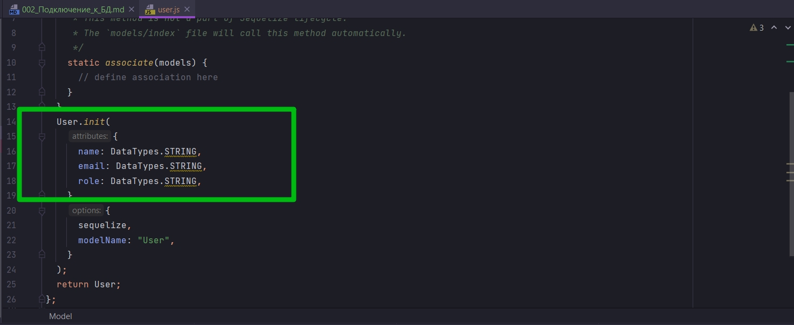

# 002_Подключение_к_БД

Перехожу в app.js 

БД я создал в прошлом примере.

Что бы посмотреть подсказки

```shell
sequelize
```


И так я заинтерисован в создании БД

```shell
sequelize db:create
```


И теперь он фактически создал БД.

И теперь что бы это проверить я открываю новый терминал

```shell
psql
```


И так для создания модели я могу использовать sequelize-cli. Возвращаюсь к документации. Перехожу в Model Basics.

Одна вещь с которой мы должны быть осторожны в документации sequelize. Это то что они показывают вам как делать тоже самое несколькими способами. Например здесь они используют define.


А дальше они показывают как создать модель используя ES6 классы.


Создание моделей с помощью синтаксиса ES6 является предпочтительным. По этому я буду придерживаться cli, потому что он вроде как потдерживает то же самое соглашение, если вы просто используете cli.

Теперь я говорю sequelize сгенерировать модель.

```shell
sequelize model:generate
```

И далее мне понадобится два флага.

- Первый флаг --name это имя модели. C заглавной буквы указываю User
- Второй флаг --attributes. У нас есть три атрибута это name: после двоеточия указываю тип string, запятой разделяю, email:string, role:string.


```shell
sequelize model:generate --name User --attributes name:string, email:string, role:string
```


```js
'use strict';
const {
  Model
} = require('sequelize');
module.exports = (sequelize, DataTypes) => {
  class User extends Model {
    /**
     * Helper method for defining associations.
     * This method is not a part of Sequelize lifecycle.
     * The `models/index` file will call this method automatically.
     */
    static associate(models) {
      // define association here
    }
  };
  User.init({
    name: DataTypes.STRING,
    email: DataTypes.STRING,
    role: DataTypes.STRING
  }, {
    sequelize,
    modelName: 'User',
  });
  return User;
};
```

Кстати таким же образом мы можем еще добавить атрибутов.

Как видим здесь происходит импорт Model из sequelize


Затем когда я создаю класс я наследуюсь от этой модели. Далее я инициализирую модель пользователя



После инициализации модели она попадает в массив в index.js.


Как только он импортирует модель из файла user.js. Он сразу же передает ему эти две вещи.


sequelize, // Экземпляр соединения, и так же DataTypes в Sequelize.DataTypes для того что бы модель могла использовать их для инициализации.


Возвращаюсь к app.js. И импортирую этот sequelize connection

```js
//app.js
const { sequelize } = require("./models");

```

Поскольку все по умолчанию возмется из index.js я не указываю этот файл.
Далее создаю асинхронную функцию в которой мы собираемся подождать пока sequelize.sync() посмотри на наши модели и создай таблицы в БД в зависимости от того какие модели у нас есть.

Далее я должен вызвать эту функцию.

```js
//app.js
const { sequelize } = require("./models");
async function main() {
  await sequelize.sync();
}

main();

```

Возвращаюсь к терминалу

```shell
node app.js
```


Бывают проблемы с созданием имен таблиц. Для того что бы этого не было при инициализации модели указываю атрибут tableName:


```js
"use strict";
const { Model } = require("sequelize");
module.exports = (sequelize, DataTypes) => {
  class User extends Model {
    /**
     * Helper method for defining associations.
     * This method is not a part of Sequelize lifecycle.
     * The `models/index` file will call this method automatically.
     */
    static associate(models) {
      // define association here
    }
  }
  User.init(
    {
      name: DataTypes.STRING,
      email: DataTypes.STRING,
      role: DataTypes.STRING,
    },
    {
      sequelize,
      tableName: "users",
      modelName: "User",
    }
  );
  return User;
};

```

Далее для того что бы добавить дополнительные настройки в интересующие меня поля превращаю их значения в объекты.


```js
"use strict";
const { Model } = require("sequelize");
module.exports = (sequelize, DataTypes) => {
  class User extends Model {
    /**
     * Helper method for defining associations.
     * This method is not a part of Sequelize lifecycle.
     * The `models/index` file will call this method automatically.
     */
    static associate(models) {
      // define association here
    }
  }
  User.init(
    {
      name: {
        type: DataTypes.STRING,
        allowNull: false, //По умолчинию true т.е поле может быть пустым
      },
      email: {
        type: DataTypes.STRING,
        allowNull: false, //По умолчинию true т.е поле может быть пустым
      },
      role: {
        type: DataTypes.STRING,
        allowNull: false, //По умолчинию true т.е поле может быть пустым
      },
    },
    {
      sequelize,
      tableName: "users",
      modelName: "User",
    }
  );
  return User;
};

```

```shell
node app.js
```


Однако это ничего не поменяло на самом деле. Мне пришлось удалить старую таблицу, и лишь после того как я проект пересобрал создалась новая таблица с примененными изменениями. 

Для того что бы такого не происходило необходимо в функцию sync передать некоторые опции. 

На самом деле сейчас функция sync выполняется синхронно. Для того что бы эту функцию сделать асинхронной и что бы она следила за изменениями мне нужно передать параметр alert:true.

```js
//app.js
const { sequelize } = require("./models");
async function main() {
  await sequelize.sync({ alert: true });
}

main();

```

По идее он создает новую таблицу и оставляет старую. По этому мы можем использовать другой вариант force:true. Данный параметр следит за изменениями а так же удаляет не используемые таблицы.

```js
//app.js
const { sequelize } = require("./models");
async function main() {
  await sequelize.sync({ force: true });
}

main();

```

