# 003_sql_api_доступ_к_БД

Для начало устанавливаю express.

```shell
npm install express
```

Далее перехожу в app.js.

```js

//app.js
const express = require("express");
const { sequelize } = require("./models");

const app = express();// создаю экземпляр класса express

async function main() {
  await sequelize.sync({ force: true });
}

main();

```

И здесь я собираюсь использовать первый маршрут который позволит нам создать пользователя в нашей БД.

```js
//app.js
const express = require("express");
const { sequelize } = require("./models");
const { request, response } = require("express");

const app = express(); // создаю экземпляр класса express

app.post("/users", async (request, response) => {
  const { name, email, role } = request.body; //Достаю из тела запроса
});

async function main() {
  await sequelize.sync({ force: true });
}

main();

```

Далее мне нужно использовать парсер json для того что бы мы могли передать тело как json. Через app.use регистрирую middleware. Далее из express вытаскиваю функцию json.

```js
//app.js
const express = require("express");
const { sequelize } = require("./models");
const { request, response } = require("express");

const app = express(); // создаю экземпляр класса express
app.use(express.json()); //регистрирую middleware парсер json

app.post("/users", async (request, response) => {
  const { name, email, role } = request.body; //Достаю из тела запроса
});

async function main() {
  await sequelize.sync({ force: true });
}

main();

```

Далее я получаю name, email, role из тела. Далее указываю блок try catch. В котором создаю нового пользователя. Так же не забываю импортировать модель User.

```js
//app.js
const express = require("express");
const { sequelize, User } = require("./models");

const app = express(); // создаю экземпляр класса express
app.use(express.json()); //регистрирую middleware парсер json

app.post("/users", async (request, response) => {
  const { name, email, role } = request.body; //Достаю из тела запроса
  try {
    const user = await User.create({ name, email, role });
    return response.json(user);
  } catch (error) {
    console.log(error);
    return response.status(500).json(error);
  }
});

async function main() {
  await sequelize.sync({ force: true });
}

main();

```

Теперь нам нужно запустить приложение.

```js
//app.js
const express = require("express");
const { sequelize, User } = require("./models");

const app = express(); // создаю экземпляр класса express
app.use(express.json()); //регистрирую middleware парсер json

app.post("/users", async (request, response) => {
  const { name, email, role } = request.body; //Достаю из тела запроса
  try {
    const user = await User.create({ name, email, role });
    return response.json(user);
  } catch (error) {
    console.log(error);
    return response.status(500).json(error);
  }
});

app.listen({ port: 5000 }, async () => {
  console.log(`Сервер запущен на http://localhost:5000`);
  await sequelize.sync({ force: true });
  console.log(`База Данных синхронизирована`);
});

```

```shell
node app.js

```

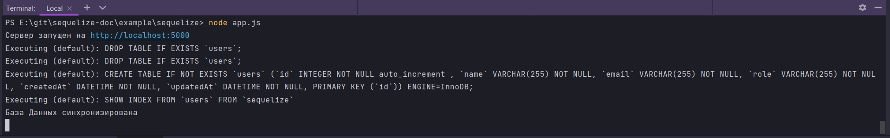

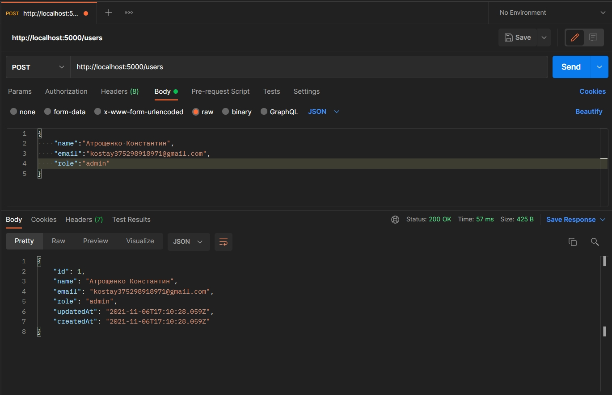

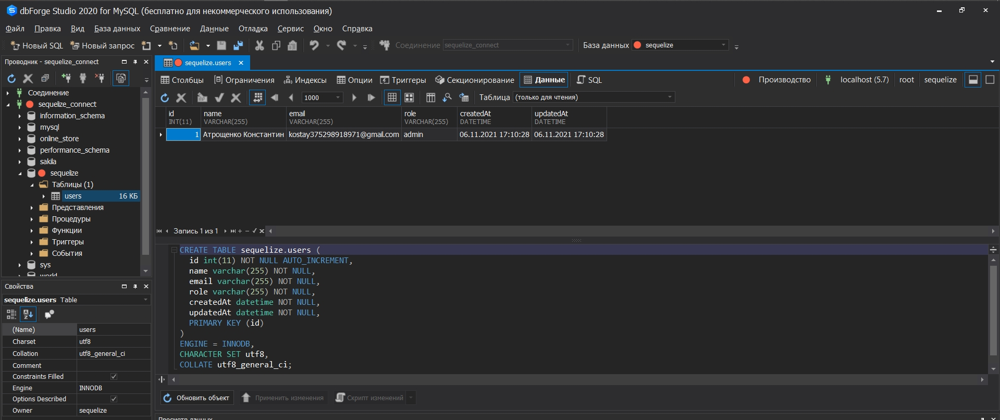

Нам возвращается количество пользователей. На самом деле это плохая практика. Возвращаюсь к модели и добавляю здесь поле uuid. И говорю что ее тип UUID. Так же я могу дать значение по умолчанию defaultValue:DataTypes.UUIDV4.

```js
"use strict";
const { Model } = require("sequelize");
module.exports = (sequelize, DataTypes) => {
  class User extends Model {
    /**
     * Helper method for defining associations.
     * This method is not a part of Sequelize lifecycle.
     * The `models/index` file will call this method automatically.
     */
    static associate(models) {
      // define association here
    }
  }
  User.init(
    {
      uuid: {
        type: DataTypes.UUID,
        defaultValue: DataTypes.UUIDV4,
      },
      name: {
        type: DataTypes.STRING,
        allowNull: false, //По умолчинию true т.е поле может быть пустым
      },
      email: {
        type: DataTypes.STRING,
        allowNull: false, //По умолчинию true т.е поле может быть пустым
      },
      role: {
        type: DataTypes.STRING,
        allowNull: false, //По умолчинию true т.е поле может быть пустым
      },
    },
    {
      sequelize,
      tableName: "users",
      modelName: "User",
    }
  );
  return User;
};

```

Теперь каждый раз когда мы будем создавать пользователя он будет генерировать для него id.

```shell
node app.js

```

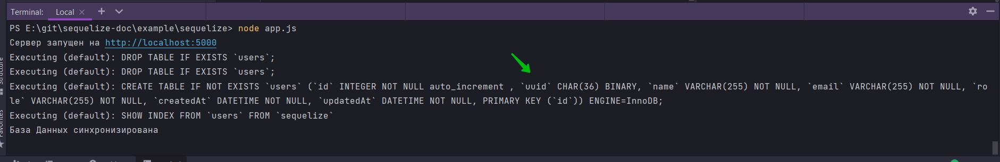

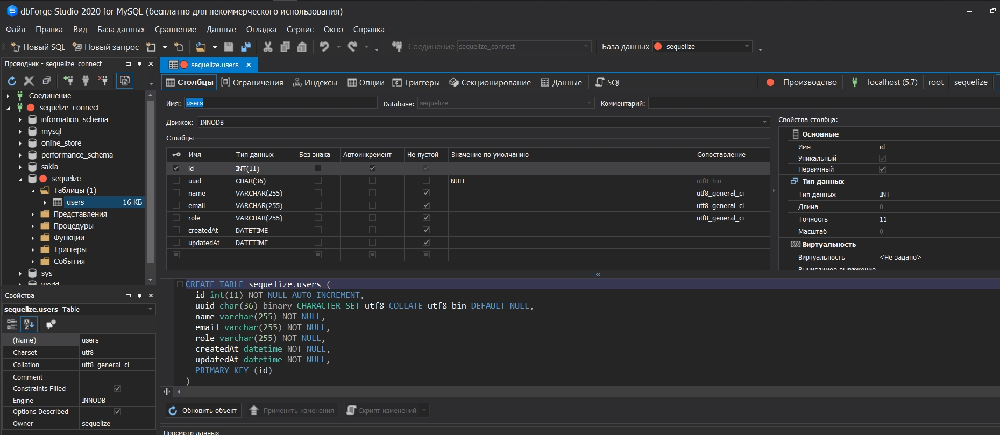

Кстати проблема с этим подходом заключается в том что если я выберу из моих пользователей, я увижу что они были удалены.

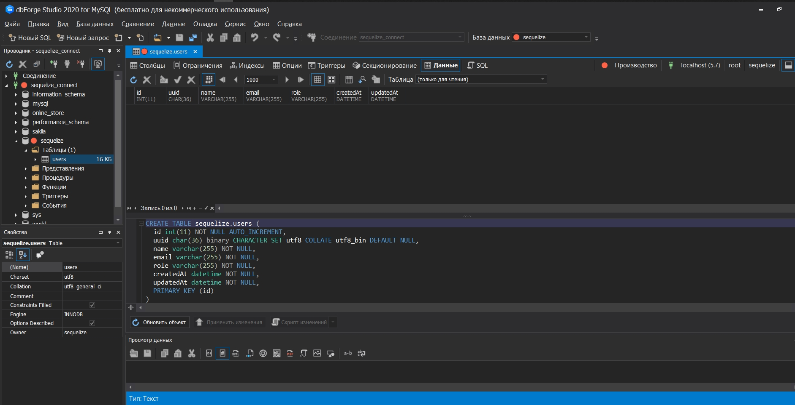

По этому каждый раз когда мы синхронизируем БД, мы отбрасываем таблицу и теряем все наши данные. Так что это не очень хорошая практика.

Так что по этому в production мы собираемся использовать не sync а что-то под названием миграциями.

Миграции будут создавать таблицы которые нам нужны на основе наших моделей.

По этому если я перейду в папку migrations. То я увижу что она уже сгенерировала миграцию создания пользователя.

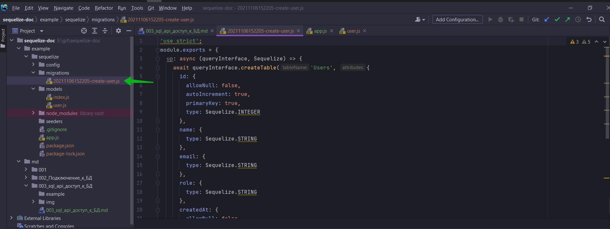

```js
'use strict';
module.exports = {
  up: async (queryInterface, Sequelize) => {
    await queryInterface.createTable('Users', {
      id: {
        allowNull: false,
        autoIncrement: true,
        primaryKey: true,
        type: Sequelize.INTEGER
      },
      name: {
        type: Sequelize.STRING
      },
      email: {
        type: Sequelize.STRING
      },
      role: {
        type: Sequelize.STRING
      },
      createdAt: {
        allowNull: false,
        type: Sequelize.DATE
      },
      updatedAt: {
        allowNull: false,
        type: Sequelize.DATE
      }
    });
  },
  down: async (queryInterface, Sequelize) => {
    await queryInterface.dropTable('Users');
  }
};
```

Мы можем использовать это для создания таблицы вместо синхронизации. По этому я собираюсь изменить имя таблицы.

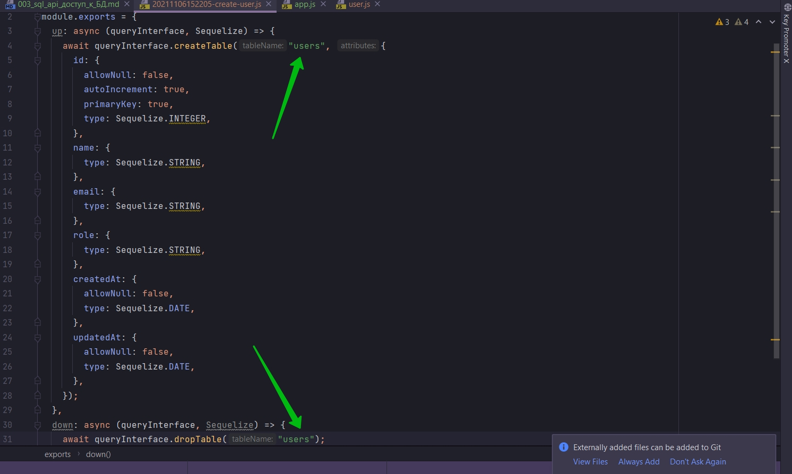

Кстати если вы не знаете как работают миграции. У них есть функция up 

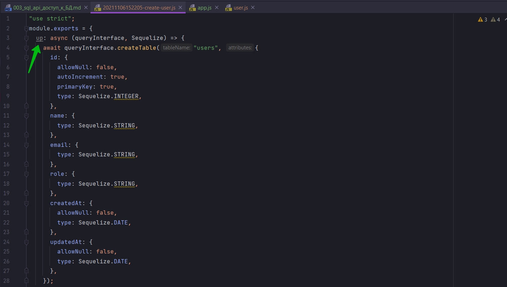

которая когда вы запускаете миграцию выполняет ее. По этому в этом случае она создаст таблицу со всеми этими полями.

И если вы хотите отменить миграцию она запускает функцию down.

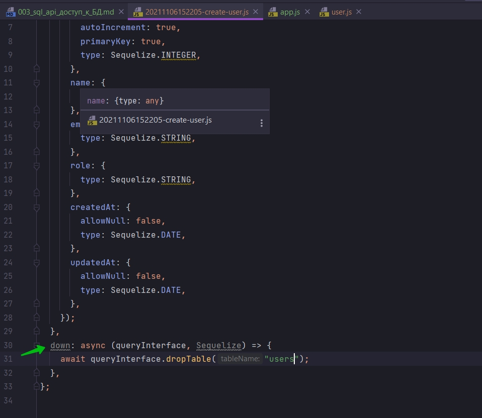

Данная функция просто отменяет изменения которые были применены в таблице. По этому здесь я добавляю что эти поля не могут быть NULL.

И так же добавляю поле uuid

```js
"use strict";
module.exports = {
  up: async (queryInterface, Sequelize) => {
    await queryInterface.createTable("users", {
      id: {
        allowNull: false,
        autoIncrement: true,
        primaryKey: true,
        type: Sequelize.INTEGER,
      },
      uuid: {
        type: DataTypes.UUID,
        defaultValue: DataTypes.UUIDV4,
      },
      name: {
        type: Sequelize.STRING,
        allowNull: false,
      },
      email: {
        type: Sequelize.STRING,
        allowNull: false,
      },
      role: {
        type: Sequelize.STRING,
        allowNull: false,
      },
      createdAt: {
        allowNull: false,
        type: Sequelize.DATE,
      },
      updatedAt: {
        allowNull: false,
        type: Sequelize.DATE,
      },
    });
  },
  down: async (queryInterface, Sequelize) => {
    await queryInterface.dropTable("users");
  },
};

```

Кстати в миграциях БД называется Sequelize что странно. Следите за типами данных потому что они здесь это представляют. Заменяю Sequelize на DataTypes

```js
"use strict";
module.exports = {
  up: async (queryInterface, DataTypes) => {
    await queryInterface.createTable("users", {
      id: {
        allowNull: false,
        autoIncrement: true,
        primaryKey: true,
        type: DataTypes.INTEGER,
      },
      uuid: {
        type: DataTypes.UUID,
        defaultValue: DataTypes.UUIDV4,
      },
      name: {
        type: DataTypes.STRING,
        allowNull: false,
      },
      email: {
        type: DataTypes.STRING,
        allowNull: false,
      },
      role: {
        type: DataTypes.STRING,
        allowNull: false,
      },
      createdAt: {
        allowNull: false,
        type: DataTypes.DATE,
      },
      updatedAt: {
        allowNull: false,
        type: DataTypes.DATE,
      },
    });
  },
  down: async (queryInterface, DataTypes) => {
    await queryInterface.dropTable("users");
  },
};

```

Далее в app.js удаляю sync. А вместо этого говорю sequelize.authenticate

```js
//app.js
const express = require("express");
const { sequelize, User } = require("./models");

const app = express(); // создаю экземпляр класса express
app.use(express.json()); //регистрирую middleware парсер json

app.post("/users", async (request, response) => {
  const { name, email, role } = request.body; //Достаю из тела запроса
  try {
    const user = await User.create({ name, email, role });
    return response.json(user);
  } catch (error) {
    console.log(error);
    return response.status(500).json(error);
  }
});

app.listen({ port: 5000 }, async () => {
  console.log(`Сервер запущен на http://localhost:5000`);
  await sequelize.authenticate();
  console.log(`База Данных подключена`);
});

```

Т.е. для получения таблицы мы просто запускаем миграцию.

```shell
 sequelize db:migrate
```

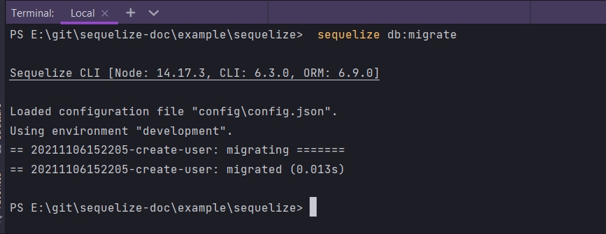

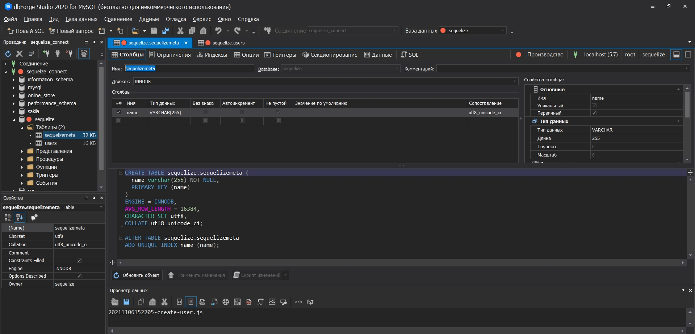

Появляется таблица с именем sequelizemeta.

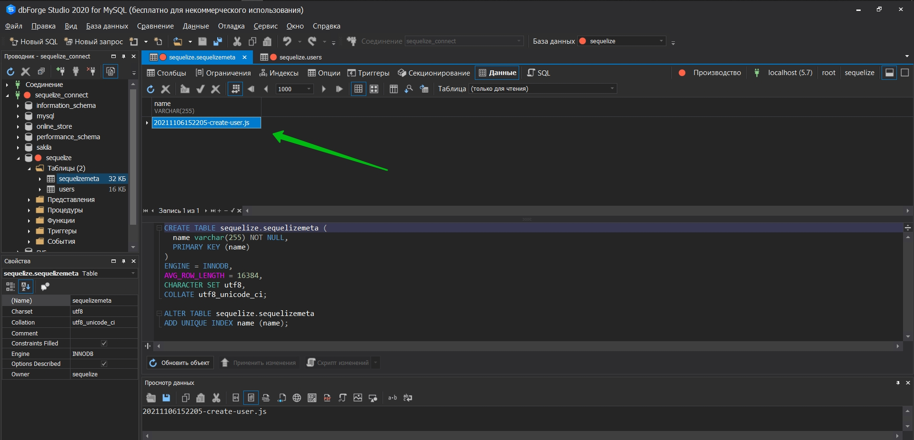

Мы видим что он хранит фактически каждую миграцию которую вы запускаете что бы отслеживать и знать какие миграции были выполнены.

Устанавливаю nodemon.

```shell
npm i nodemon
```

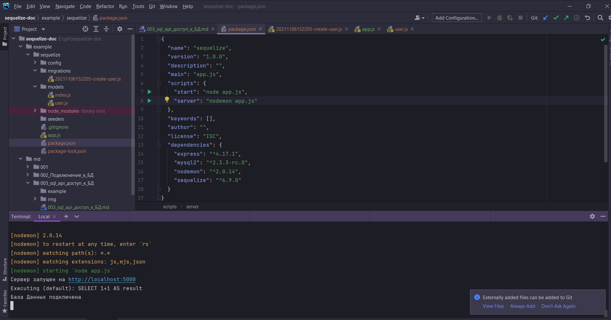

