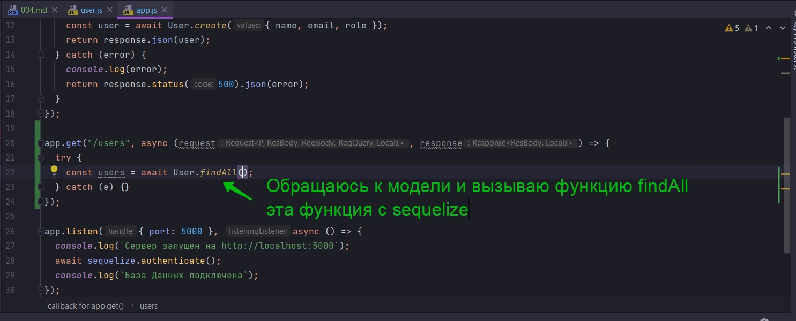

Теперь смотрите на POSTMAN. Когда я делаю запрос на сервер я получаю ответ в котором содержится и id пользователя и uuid. По хорошему когда мы создаем API хотелось бы скрыть id от пользователя. Я не хочу что бы другие знали фактический индификатор в БД.

Я возвращаюсь к нашей модел. Мы знаем, что каждый раз, когда мы выбираем пользователя в нашем приложении, мы можем использовать индификатор. Но как только мы возвращаем его пользователю, нам нужно скрыть его. Есть функция которая присутствует в каждом классе модели. Эта функция называется toJSON

В нашей модели есть функция associate в которой мы определяем ассоциации.

После этой функции прописываю функцию toJSON.


Каждый раз когда мы возвращаем пользователя user в ответе от api в качестве объекта json. Выполняется функция toJSON и переопределяет какие-то поля. Если я переопределяю поля в объекте, то я их должен вернуть. С помощью деструктуризации разворачиваю объект. Через контекст this обращаюсь к функции get. Это функция которая получает поля нашего объекта, могу ошибаться. Далее вторым параметром переопределяю интересующее меня поле. Указываю id: undefined


```js
"use strict";
const { Model } = require("sequelize");
module.exports = (sequelize, DataTypes) => {
  class User extends Model {
    /**
     * Helper method for defining associations.
     * This method is not a part of Sequelize lifecycle.
     * The `models/index` file will call this method automatically.
     */
    static associate(models) {
      // define association here
      // определите ассоциацию здесь
    }
    toJSON() {
      return { ...this.get(), id: undefined };
    }
  }
  User.init(
    {
      uuid: {
        type: DataTypes.UUID,
        defaultValue: DataTypes.UUIDV4,
      },
      name: {
        type: DataTypes.STRING,
        allowNull: false, //По умолчинию true т.е поле может быть пустым
      },
      email: {
        type: DataTypes.STRING,
        allowNull: false, //По умолчинию true т.е поле может быть пустым
      },
      role: {
        type: DataTypes.STRING,
        allowNull: false, //По умолчинию true т.е поле может быть пустым
      },
    },
    {
      sequelize,
      tableName: "users",
      modelName: "User",
    }
  );
  return User;
};

```


Фактически индификатор создается и существует в базе данных. Но он скрыт от наших пользователей.

Теперь давайте создадим конечную точку из которой мы извлекаем всех наших users. Поэтому возвращаемся к нашему app.js. Создаю get запрос.



Возвращаю ответ response вызываю функцию json в которую помещаю ответ от сервера.


```js
//app.js
const express = require("express");
const { sequelize, User } = require("./models");
const { request, response } = require("express");

const app = express(); // создаю экземпляр класса express
app.use(express.json()); //регистрирую middleware парсер json

app.post("/users", async (request, response) => {
    const { name, email, role } = request.body; //Достаю из тела запроса
    try {
        const user = await User.create({ name, email, role });
        return response.json(user);
    } catch (error) {
        console.log(error);
        return response.status(500).json(error);
    }
});

app.get("/users", async (request, response) => {
    try {
        const users = await User.findAll();
        return response.json(users);
    } catch (error) {
        console.log(error);
        return response.status(500).json({ error: "Что-то пошло не так" });
    }
});

app.listen({ port: 5000 }, async () => {
    console.log(`Сервер запущен на http://localhost:5000`);
    await sequelize.authenticate();
    console.log(`База Данных подключена`);
});

```


Для наглядности создаю второго пользователя.


Теперь получаю один объект пользователя.


```js

//app.js
const express = require("express");
const { sequelize, User } = require("./models");
const { request, response } = require("express");

const app = express(); // создаю экземпляр класса express
app.use(express.json()); //регистрирую middleware парсер json

app.post("/users", async (request, response) => {
  const { name, email, role } = request.body; //Достаю из тела запроса
  try {
    const user = await User.create({ name, email, role });
    return response.json(user);
  } catch (error) {
    console.log(error);
    return response.status(500).json(error);
  }
});

app.get("/users", async (request, response) => {
  try {
    const users = await User.findAll();
    return response.json(users);
  } catch (error) {
    console.log(error);
    return response.status(500).json({ error: "Что-то пошло не так" });
  }
});

app.get("/users/:uuid", async (request, response) => {
  const { uuid } = request.params; // получаю из строки запроса
  try {
    const users = await User.findOne({
      where: {
        uuid: uuid,
      },
    });
    return response.json(users);
  } catch (error) {
    console.log(error);
    return response.status(500).json({ error: "Что-то пошло не так" });
  }
});

app.listen({ port: 5000 }, async () => {
  console.log(`Сервер запущен на http://localhost:5000`);
  await sequelize.authenticate();
  console.log(`База Данных подключена`);
});

```

Копирую из БД или из POSTMAN полученный uuid и делаю запрос на получение одного пользвателя.


Все отрабатывает так ка нужно.


