Допустим мы хотим создать другую модель БД называемую сообщения т.е. Post. Пользователи могут создавать сообщения в нашей БД. А затем они могут их получать.

Возвращаюсь к терминалу

```shell
sequelize model:generate --name Post --attributes body:string
```


Как видим создана новая миграция и новая модель.

```js

"use strict";
const { Model } = require("sequelize");
module.exports = (sequelize, DataTypes) => {
  class Post extends Model {
    /**
     * Helper method for defining associations.
     * This method is not a part of Sequelize lifecycle.
     * The `models/index` file will call this method automatically.
     */
    static associate(models) {
      // define association here
    }
  }
  Post.init(
    {
      body: DataTypes.STRING,
    },
    {
      sequelize,
      modelName: "Post",
    }
  );
  return Post;
};

```

Что бы небыло конфликтов сразу задаю имя таблицы. И переписываю body, делаю объектом с интересующими меня полями.

```js
"use strict";
const { Model } = require("sequelize");
module.exports = (sequelize, DataTypes) => {
  class Post extends Model {
    /**
     * Helper method for defining associations.
     * This method is not a part of Sequelize lifecycle.
     * The `models/index` file will call this method automatically.
     */
    static associate(models) {
      // define association here
    }
  }
  Post.init(
    {
      body: {
        type:DataTypes.STRING,
        allowNull:false
      }
    },
    {
      sequelize,
      tableName:'posts',
      modelName: "Post",
    }
  );
  return Post;
};

```

Все типы можно псмотреть в документации [Data Types](https://sequelize.org/master/manual/model-basics.html#data-types).

Пока что я использую только строку. Однако здесь можно найти огромное количество различных типов.

На самом деле я так же хочу дать публикации uuid. При инициализации так же  указываю настройки uuid.

```js
"use strict";
const { Model } = require("sequelize");
module.exports = (sequelize, DataTypes) => {
  class Post extends Model {
    /**
     * Helper method for defining associations.
     * This method is not a part of Sequelize lifecycle.
     * The `models/index` file will call this method automatically.
     */
    static associate(models) {
      // define association here
    }
  }
  Post.init(
    {
      uuid: {
        type: DataTypes.UUID,
        defaultValue: DataTypes.UUIDV4,
      },
      body: {
        type: DataTypes.STRING,
        allowNull: false,
      },
    },
    {
      sequelize,
      tableName: "posts",
      modelName: "Post",
    }
  );
  return Post;
};

```

Перехожу к миграции 20211107103421-create-post.js. И здесь мне так же нужно указать настройки что body не может быть пустым. И так же указать uuid.

Sequelize поменять на DataTypes и так же указать имя таблицы как в начале так и в конце файла posts.

```js
"use strict";
module.exports = {
  up: async (queryInterface, DataTypes) => {
    await queryInterface.createTable("posts", {
      id: {
        allowNull: false,
        autoIncrement: true,
        primaryKey: true,
        type: DataTypes.INTEGER,
      },
      uuid: {
        type: DataTypes.UUID,
        defaultValue: DataTypes.UUIDV4,
      },
      body: {
        type: DataTypes.STRING,
        allowNull: false,
      },
      createdAt: {
        allowNull: false,
        type: DataTypes.DATE,
      },
      updatedAt: {
        allowNull: false,
        type: DataTypes.DATE,
      },
    });
  },
  down: async (queryInterface, DataTypes) => {
    await queryInterface.dropTable("posts");
  },
};

```

Запускаю миграцию.

```shell
sequelize db:migrate:status
```


Мы запустили миграцию. Но у нас еще нет ни одного созданного сообщения. По этому сейчас когда мы выполняем миграцию он запускает миграцию создания сообщения и создает таблицу создания сообщений. 

Одну вещь которую мы не добавили это то что я хочу что бы внутри модели Post и в нутри таблицы posts был индификатор пользователя. Потому что каждое сообщение принадлежит пользователю. Его нельзя просто связат не с одним пользователем. А так же у пользователя может быть много сообщений.

Это называется ассоциацией. В sql это называется отношениями. Конкретно это отношение One-To_Many т.е. один комногим.

Для того что бы установить отношения мы можем перейти к ассоциированию или ассоциации. В этом frameworks они называются associate. В каждой модели содержится такая функция.

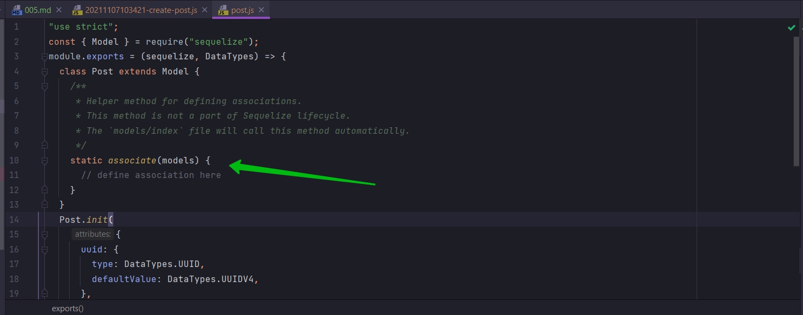

Аргументом эта функция принимает интересующую нас модель. Аргумент modals это подсказка. Такак как этот аргумент принимает все модели я могу сделать проще и просто с помощи деструктуризации указать интересующую меня модель. Модель User.

Далее в теле функции мы можем сказать, что это относится, и указываю отношение к чему belongsTo() куда помещаю деструктурированную модель пользователя.

```js

"use strict";
const { Model } = require("sequelize");
module.exports = (sequelize, DataTypes) => {
  class Post extends Model {
    /**
     * Helper method for defining associations.
     * This method is not a part of Sequelize lifecycle.
     * The `models/index` file will call this method automatically.
     */
    static associate({ User }) {
      // define association here
      this.belongsTo(User);
    }
  }
  Post.init(
    {
      uuid: {
        type: DataTypes.UUID,
        defaultValue: DataTypes.UUIDV4,
      },
      body: {
        type: DataTypes.STRING,
        allowNull: false,
      },
    },
    {
      sequelize,
      tableName: "posts",
      modelName: "Post",
    }
  );
  return Post;
};

```

Теперь как работает sequelize по умолчанию? Если вы ему не передалите внешний ключ foreign key, который должен искать. Он будет искать имя модели плюс первичный ключ primary key, т.е. имя модели User, а затем первичный ключ primary key - это индификатор. По этому он будет искать это поле.

Но я хочу назвать его нашим user в нижнем регистре. Таким образом что бы переопределить поведение по умолчанию, мы можем просто добавить к нему некоторые options т.е. параметры. Во втором параметре belongsTo я могу передать объект с options в котором указываю foreignKey:'userId'

```js
"use strict";
const { Model } = require("sequelize");
module.exports = (sequelize, DataTypes) => {
  class Post extends Model {
    /**
     * Helper method for defining associations.
     * This method is not a part of Sequelize lifecycle.
     * The `models/index` file will call this method automatically.
     */
    static associate({ User }) {
      // define association here
      this.belongsTo(User, { foreignKey: "userId" });
    }
  }
  Post.init(
    {
      uuid: {
        type: DataTypes.UUID,
        defaultValue: DataTypes.UUIDV4,
      },
      body: {
        type: DataTypes.STRING,
        allowNull: false,
      },
    },
    {
      sequelize,
      tableName: "posts",
      modelName: "Post",
    }
  );
  return Post;
};

```

Теперь давайте настроим другую сторону отношения или ассоциации. Перехожу к модели User.

Внутри функции associate деструктурирую модель Post. Здесь внешним ключом будет так же индификатор пользователя.

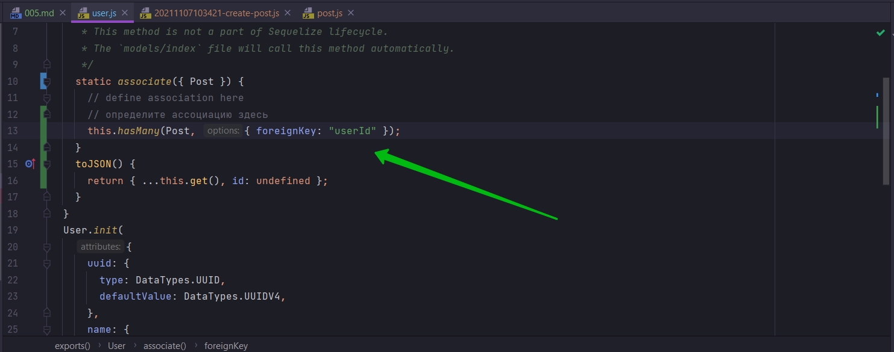

И да это так же нам нужно добавить к миграции. Добавляю еще одно поле userId. Перехожу к 20211107103421-create-post.js. типом данных указываю type: DataTypes.INTEGER, и так же что поле не может быть пустым.

```js
"use strict";
module.exports = {
  up: async (queryInterface, DataTypes) => {
    await queryInterface.createTable("posts", {
      id: {
        allowNull: false,
        autoIncrement: true,
        primaryKey: true,
        type: DataTypes.INTEGER,
      },
      uuid: {
        type: DataTypes.UUID,
        defaultValue: DataTypes.UUIDV4,
      },
      body: {
        type: DataTypes.STRING,
        allowNull: false,
      },
      userId: {
        type: DataTypes.INTEGER,
        allowNull: false,
      },
      createdAt: {
        allowNull: false,
        type: DataTypes.DATE,
      },
      updatedAt: {
        allowNull: false,
        type: DataTypes.DATE,
      },
    });
  },
  down: async (queryInterface, DataTypes) => {
    await queryInterface.dropTable("posts");
  },
};

```

Теперь нам нужно пвторно запустить миграцию 

```shell
sequelize db:migrate:undo
```


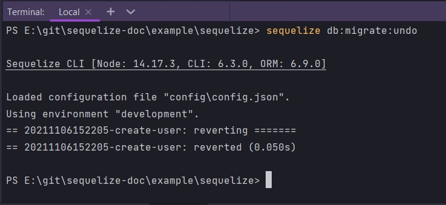

Это фактически отменяет последнюю миграцию  если я снова мигрирую


Он сделает миграцию, но в этот раз он соберет и создаст индификатор пользователя


Как видим таблица posts имеет индификатор пользователя.

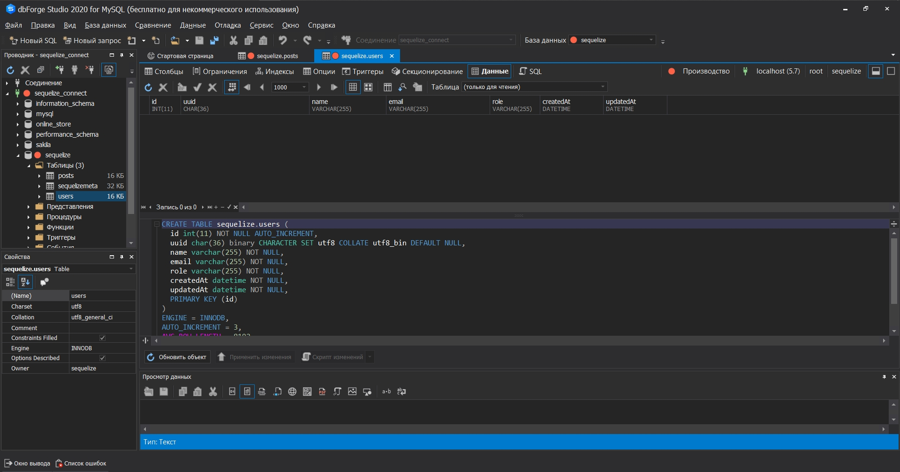

но как видим в таблице users все пользователи пропали.

userId в таблице posts теперь ссылается на таблицу users.

Теперь давайте создадим конечную точку для создания сообщения. 

Создаю POST запрос.


давайте представим что у вас есть аутентификация и мы можем узнать что это за пользователь просто из тела запроса.

```js
//app.js
const express = require("express");
const { sequelize, User, Post } = require("./models");

const app = express(); // создаю экземпляр класса express
app.use(express.json()); //регистрирую middleware парсер json

app.post("/users", async (request, response) => {
  const { name, email, role } = request.body; //Достаю из тела запроса
  try {
    const user = await User.create({ name, email, role });
    return response.json(user);
  } catch (error) {
    console.log(error);
    return response.status(500).json(error);
  }
});

app.get("/users", async (request, response) => {
  try {
    const users = await User.findAll();
    return response.json(users);
  } catch (error) {
    console.log(error);
    return response.status(500).json({ error: "Что-то пошло не так" });
  }
});

app.get("/users/:uuid", async (request, response) => {
  const { uuid } = request.params; // получаю из строки запроса
  try {
    const users = await User.findOne({
      where: {
        uuid: uuid,
      },
    });
    return response.json(users);
  } catch (error) {
    console.log(error);
    return response.status(500).json({ error: "Что-то пошло не так" });
  }
});

app.post("/posts", async (request, response) => {
  const { userUuid, body } = request.body; // Получаю из тела запроса body это переменная тела запроса а на само тело запроса
  try {
    //Ищу пользователя
    const user = await User.findOne({
      where: {
        uuid: userUuid,
      },
    });
    //Создаю сообщение
    //связываю сообщение с определенным пользователем
    const post = await Post.create({ body, userId: user.id });
    return response.jsonp(post);
  } catch (error) {
    console.log(error);
    return response.status(500).json(error);
  }
});

app.listen({ port: 5000 }, async () => {
  console.log(`Сервер запущен на http://localhost:5000`);
  await sequelize.authenticate();
  console.log(`База Данных подключена`);
});

```


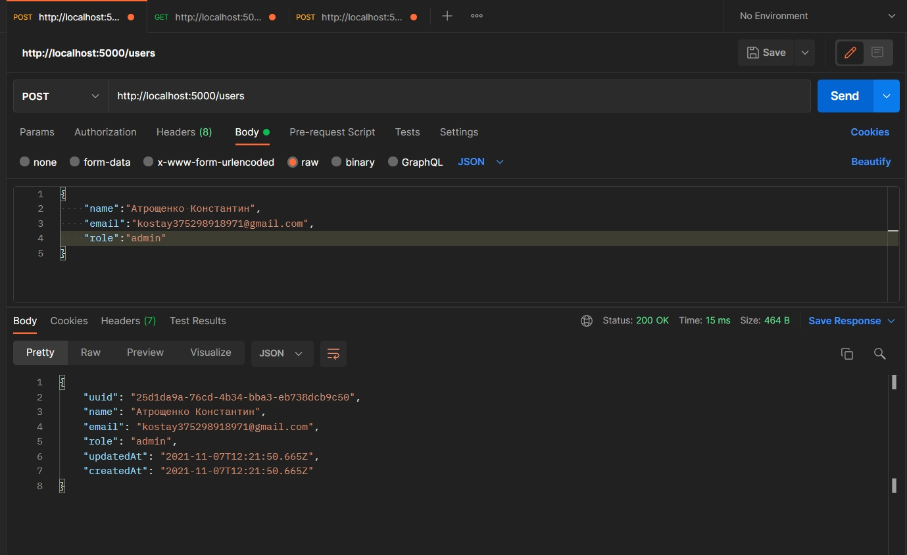

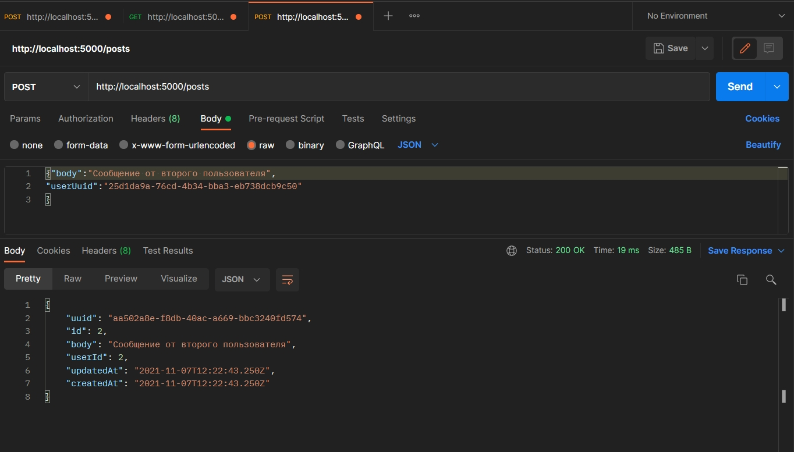

Здесь мы так же наблюдаем id пользователя который не мешало бы скрыть.

```js
"use strict";
const { Model } = require("sequelize");
module.exports = (sequelize, DataTypes) => {
  class Post extends Model {
    /**
     * Helper method for defining associations.
     * This method is not a part of Sequelize lifecycle.
     * The `models/index` file will call this method automatically.
     */
    static associate({ User }) {
      // define association here
      this.belongsTo(User, { foreignKey: "userId" });
    }
    toJSON() {
      return { ...this.get(), id: undefined, userId: undefined }; //скрываю id пользователя
    }
  }
  Post.init(
    {
      uuid: {
        type: DataTypes.UUID,
        defaultValue: DataTypes.UUIDV4,
      },
      body: {
        type: DataTypes.STRING,
        allowNull: false,
      },
    },
    {
      sequelize,
      tableName: "posts",
      modelName: "Post",
    }
  );
  return Post;
};

```

Допустим мы хотим получить сообщения пользователя. Для этого так же нужны ассоциации.

создам end point получения сообщений.

```js
//app.js
const express = require("express");
const { sequelize, User, Post } = require("./models");
const { request, response } = require("express");

const app = express(); // создаю экземпляр класса express
app.use(express.json()); //регистрирую middleware парсер json

app.post("/users", async (request, response) => {
  const { name, email, role } = request.body; //Достаю из тела запроса
  try {
    const user = await User.create({ name, email, role });
    return response.json(user);
  } catch (error) {
    console.log(error);
    return response.status(500).json(error);
  }
});

app.get("/users", async (request, response) => {
  try {
    const users = await User.findAll();
    return response.json(users);
  } catch (error) {
    console.log(error);
    return response.status(500).json({ error: "Что-то пошло не так" });
  }
});

app.get("/users/:uuid", async (request, response) => {
  const { uuid } = request.params; // получаю из строки запроса
  try {
    const users = await User.findOne({
      where: {
        uuid: uuid,
      },
    });
    return response.json(users);
  } catch (error) {
    console.log(error);
    return response.status(500).json({ error: "Что-то пошло не так" });
  }
});

app.post("/posts", async (request, response) => {
  const { userUuid, body } = request.body; // Получаю из тела запроса body это переменная тела запроса а на само тело запроса
  try {
    //Ищу пользователя
    const user = await User.findOne({
      where: {
        uuid: userUuid,
      },
    });
    //Создаю сообщение
    //связываю сообщение с определенным пользователем
    const post = await Post.create({ body, userId: user.id });
    return response.jsonp(post);
  } catch (error) {
    console.log(error);
    return response.status(500).json(error);
  }
});

app.get("/posts", async (request, response) => {
  try {
    const posts = await Post.findAll();
    return response.json(posts);
  } catch (error) {
    console.log(error);
    return response.status(500).json(error);
  }
});

app.listen({ port: 5000 }, async () => {
  console.log(`Сервер запущен на http://localhost:5000`);
  await sequelize.authenticate();
  console.log(`База Данных подключена`);
});

```

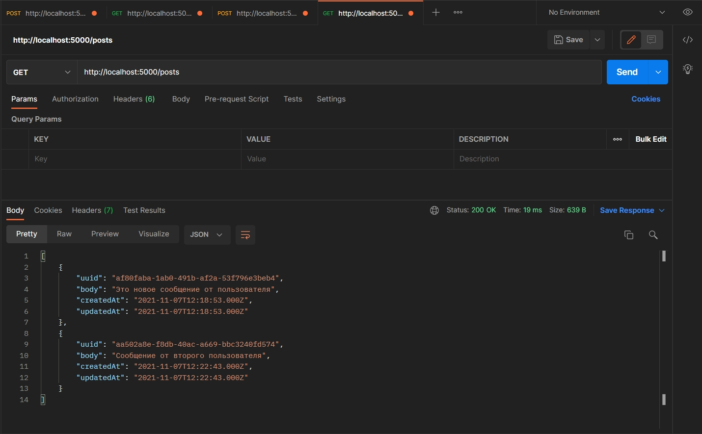

Вот я получаю абсолютно все сообщения.

По этому если мы хотим что бы он находил сообщения пользователя мы должны в findAll передать некоторые options. Мы можем с помощью ключевого слова include т.е. включать. Парадаю массив моделей. Мы бы могли просто сказать User.

```js
//app.js
const express = require("express");
const { sequelize, User, Post } = require("./models");
const { request, response } = require("express");

const app = express(); // создаю экземпляр класса express
app.use(express.json()); //регистрирую middleware парсер json

app.post("/users", async (request, response) => {
  const { name, email, role } = request.body; //Достаю из тела запроса
  try {
    const user = await User.create({ name, email, role });
    return response.json(user);
  } catch (error) {
    console.log(error);
    return response.status(500).json(error);
  }
});

app.get("/users", async (request, response) => {
  try {
    const users = await User.findAll();
    return response.json(users);
  } catch (error) {
    console.log(error);
    return response.status(500).json({ error: "Что-то пошло не так" });
  }
});

app.get("/users/:uuid", async (request, response) => {
  const { uuid } = request.params; // получаю из строки запроса
  try {
    const users = await User.findOne({
      where: {
        uuid: uuid,
      },
    });
    return response.json(users);
  } catch (error) {
    console.log(error);
    return response.status(500).json({ error: "Что-то пошло не так" });
  }
});

app.post("/posts", async (request, response) => {
  const { userUuid, body } = request.body; // Получаю из тела запроса body это переменная тела запроса а на само тело запроса
  try {
    //Ищу пользователя
    const user = await User.findOne({
      where: {
        uuid: userUuid,
      },
    });
    //Создаю сообщение
    //связываю сообщение с определенным пользователем
    const post = await Post.create({ body, userId: user.id });
    return response.jsonp(post);
  } catch (error) {
    console.log(error);
    return response.status(500).json(error);
  }
});

app.get("/posts", async (request, response) => {
  try {
    const posts = await Post.findAll({ include: [User] });
    return response.json(posts);
  } catch (error) {
    console.log(error);
    return response.status(500).json(error);
  }
});

app.listen({ port: 5000 }, async () => {
  console.log(`Сервер запущен на http://localhost:5000`);
  await sequelize.authenticate();
  console.log(`База Данных подключена`);
});

```

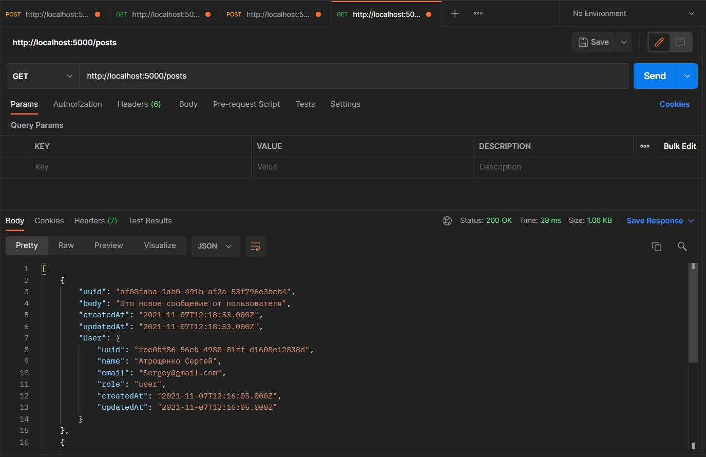

И если проскролить чуть вниз 

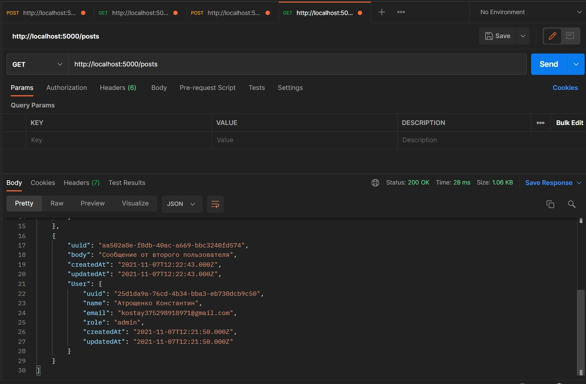

Это действительно работает. Теперь к каждому сообщению прикреплен пользователь. Я хочу изменить User на нижний регистр.

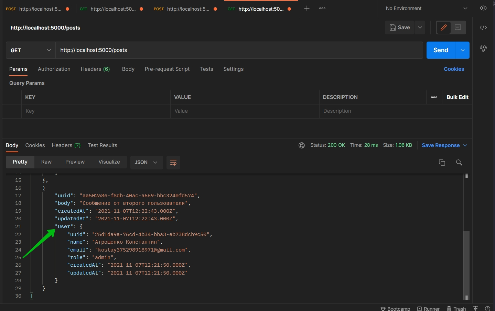

Это поле должно быть в нижнем регистре. Для этого в функцию findAll, в значение поля include, в массив передаю объект и указываю интересующие поля. const posts = await Post.findAll({ include: [{ model: User , as:'user'}] }); т.е. с помощью ключевого слова as переопределяю название поля в объекте. 

Однако Sequelize выдает ошибку

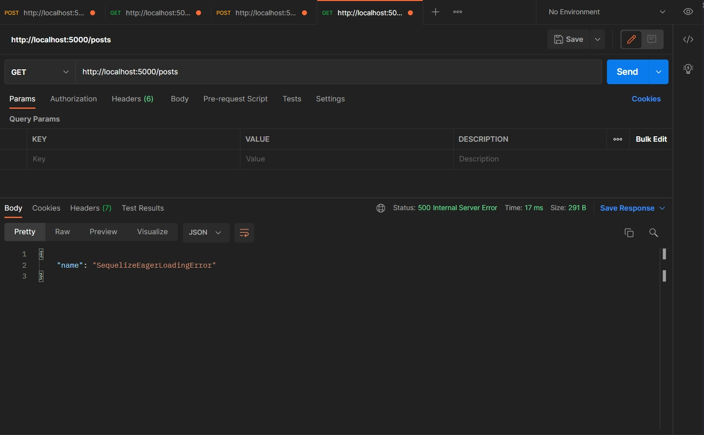

Связано это с тем что мы должны определить свою связь с этим псевдонимом user. 

Так что в модели Post в функции associate асооциации где я указываю к кому принадлежит эта связь belongTo, а именно User, в options вторым параметром я могу сказать, что я хочу использовать эту ассоциацию как as:'user'.

```js
"use strict";
const { Model } = require("sequelize");
module.exports = (sequelize, DataTypes) => {
  class Post extends Model {
    /**
     * Helper method for defining associations.
     * This method is not a part of Sequelize lifecycle.
     * The `models/index` file will call this method automatically.
     */
    static associate({ User }) {
      // define association here
      this.belongsTo(User, { foreignKey: "userId", as: "user" });
    }
    toJSON() {
      return { ...this.get(), id: undefined, userId: undefined }; //скрываю id пользователя
    }
  }
  Post.init(
    {
      uuid: {
        type: DataTypes.UUID,
        defaultValue: DataTypes.UUIDV4,
      },
      body: {
        type: DataTypes.STRING,
        allowNull: false,
      },
    },
    {
      sequelize,
      tableName: "posts",
      modelName: "Post",
    }
  );
  return Post;
};

```

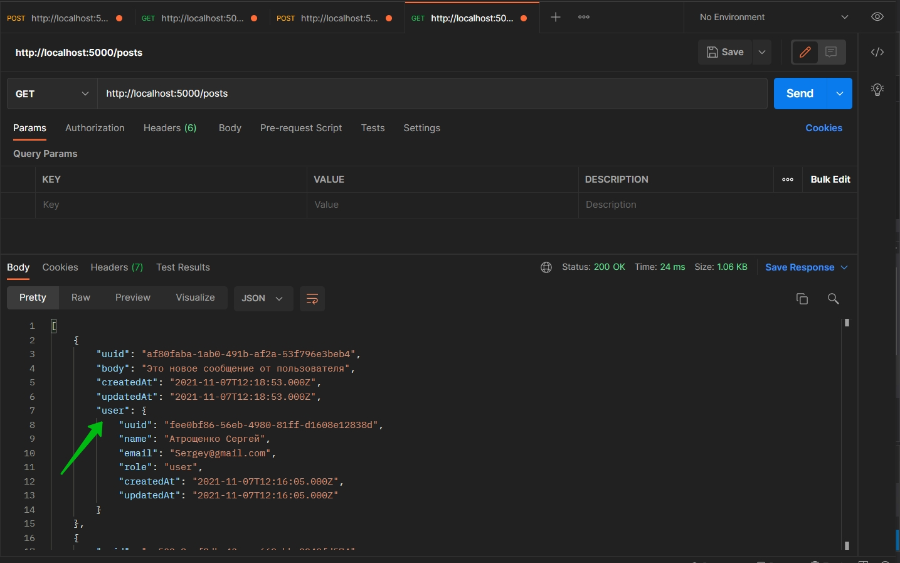

Еще одно приимущество определения вашей ассоциации здесь

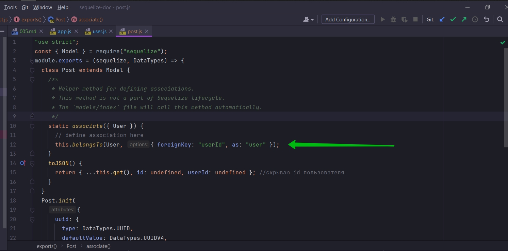

И предоставление здесь псевдонима

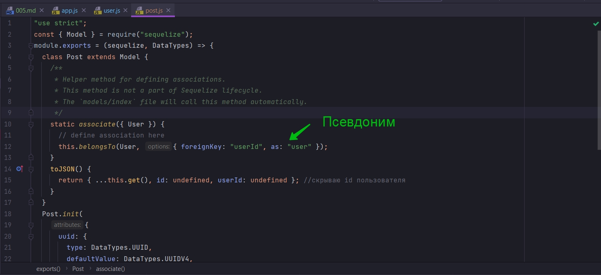

Заключается в том что каждый раз когда вы хотите получить пользователя, вам не нужно писать об этом  в поле include. Вы ожете просто сказать, а затем передать его как строку т.е. передать псевдоним как строку и все будет работать.

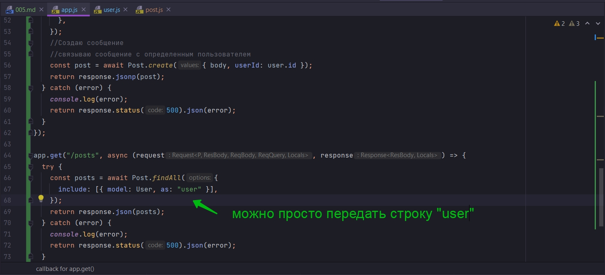

```js
//app.js
const express = require("express");
const { sequelize, User, Post } = require("./models");
const { request, response } = require("express");

const app = express(); // создаю экземпляр класса express
app.use(express.json()); //регистрирую middleware парсер json

app.post("/users", async (request, response) => {
  const { name, email, role } = request.body; //Достаю из тела запроса
  try {
    const user = await User.create({ name, email, role });
    return response.json(user);
  } catch (error) {
    console.log(error);
    return response.status(500).json(error);
  }
});

app.get("/users", async (request, response) => {
  try {
    const users = await User.findAll();
    return response.json(users);
  } catch (error) {
    console.log(error);
    return response.status(500).json({ error: "Что-то пошло не так" });
  }
});

app.get("/users/:uuid", async (request, response) => {
  const { uuid } = request.params; // получаю из строки запроса
  try {
    const users = await User.findOne({
      where: {
        uuid: uuid,
      },
    });
    return response.json(users);
  } catch (error) {
    console.log(error);
    return response.status(500).json({ error: "Что-то пошло не так" });
  }
});

app.post("/posts", async (request, response) => {
  const { userUuid, body } = request.body; // Получаю из тела запроса body это переменная тела запроса а на само тело запроса
  try {
    //Ищу пользователя
    const user = await User.findOne({
      where: {
        uuid: userUuid,
      },
    });
    //Создаю сообщение
    //связываю сообщение с определенным пользователем
    const post = await Post.create({ body, userId: user.id });
    return response.jsonp(post);
  } catch (error) {
    console.log(error);
    return response.status(500).json(error);
  }
});

app.get("/posts", async (request, response) => {
  try {
    const posts = await Post.findAll({
      include: ["user"],
    });
    return response.json(posts);
  } catch (error) {
    console.log(error);
    return response.status(500).json(error);
  }
});

app.listen({ port: 5000 }, async () => {
  console.log(`Сервер запущен на http://localhost:5000`);
  await sequelize.authenticate();
  console.log(`База Данных подключена`);
});

```

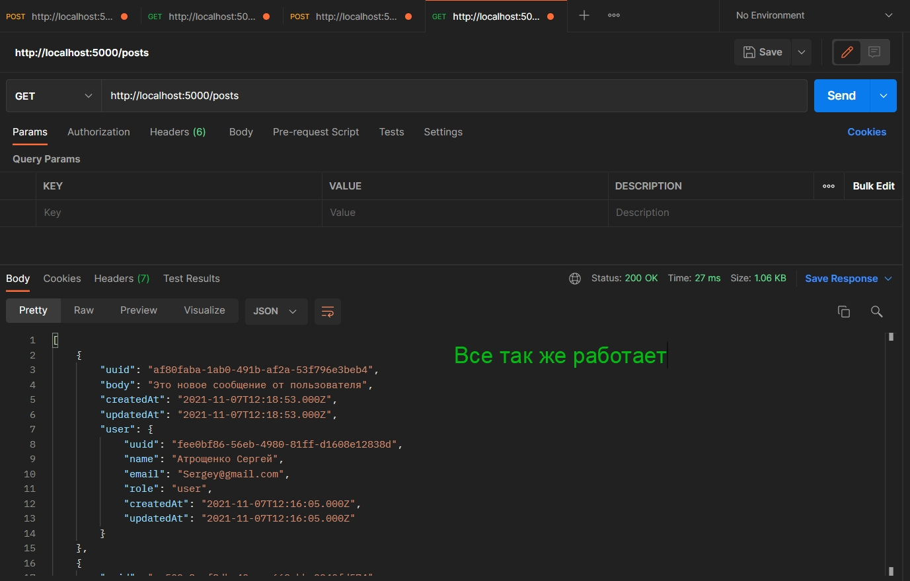

Если вам нужно несколько отношений, ассоциаций, вы передаете их в массив а затем передаете user и другие псевдонимы. Но если нам нужен один псевдоним мы можем не передавать его в массив.


Теперь сделаю тоже самое для получения пользователя. Возвращаюсь к модели User  и в ассоциации прописываю псевдоним модели сообщений posts.

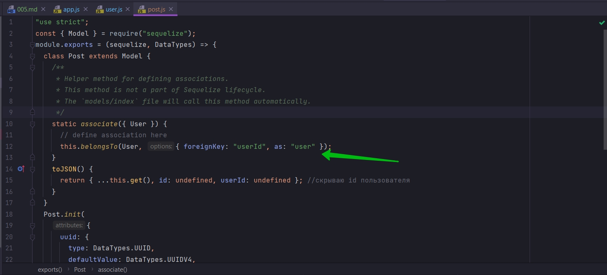

```js
"use strict";
const { Model } = require("sequelize");
module.exports = (sequelize, DataTypes) => {
  class Post extends Model {
    /**
     * Helper method for defining associations.
     * This method is not a part of Sequelize lifecycle.
     * The `models/index` file will call this method automatically.
     */
    static associate({ User }) {
      // define association here
      this.belongsTo(User, { foreignKey: "userId", as: "user" });
    }
    toJSON() {
      return { ...this.get(), id: undefined, userId: undefined }; //скрываю id пользователя
    }
  }
  Post.init(
    {
      uuid: {
        type: DataTypes.UUID,
        defaultValue: DataTypes.UUIDV4,
      },
      body: {
        type: DataTypes.STRING,
        allowNull: false,
      },
    },
    {
      sequelize,
      tableName: "posts",
      modelName: "Post",
    }
  );
  return Post;
};

```

Возвращаюсь в app.js и в функции findOne  вторым параметром указываю include:["posts"]

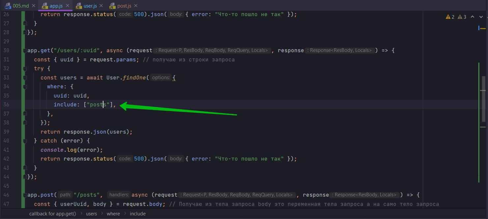

```js
//app.js
const express = require("express");
const { sequelize, User, Post } = require("./models");
const { request, response } = require("express");

const app = express(); // создаю экземпляр класса express
app.use(express.json()); //регистрирую middleware парсер json

app.post("/users", async (request, response) => {
    const { name, email, role } = request.body; //Достаю из тела запроса
    try {
        const user = await User.create({ name, email, role });
        return response.json(user);
    } catch (error) {
        console.log(error);
        return response.status(500).json(error);
    }
});

app.get("/users", async (request, response) => {
    try {
        const users = await User.findAll();
        return response.json(users);
    } catch (error) {
        console.log(error);
        return response.status(500).json({ error: "Что-то пошло не так" });
    }
});

app.get("/users/:uuid", async (request, response) => {
    const { uuid } = request.params; // получаю из строки запроса
    try {
        const users = await User.findOne({
            where: {
                uuid: uuid,
            },
            include: ["posts"], // указываю всевдоним модели Post
        });
        return response.json(users);
    } catch (error) {
        console.log(error);
        return response.status(500).json({ error: "Что-то пошло не так" });
    }
});

app.post("/posts", async (request, response) => {
    const { userUuid, body } = request.body; // Получаю из тела запроса body это переменная тела запроса а на само тело запроса
    try {
        //Ищу пользователя
        const user = await User.findOne({
            where: {
                uuid: userUuid,
            },
        });
        //Создаю сообщение
        //связываю сообщение с определенным пользователем
        const post = await Post.create({ body, userId: user.id });
        return response.jsonp(post);
    } catch (error) {
        console.log(error);
        return response.status(500).json(error);
    }
});

app.get("/posts", async (request, response) => {
    try {
        const posts = await Post.findAll({
            include: ["user"],
        });
        return response.json(posts);
    } catch (error) {
        console.log(error);
        return response.status(500).json(error);
    }
});

app.listen({ port: 5000 }, async () => {
    console.log(`Сервер запущен на http://localhost:5000`);
    await sequelize.authenticate();
    console.log(`База Данных подключена`);
});


```


Теперь мы извлекаем обе стороны ассоциации как со стороны сообщений Posts так и со стороны User.