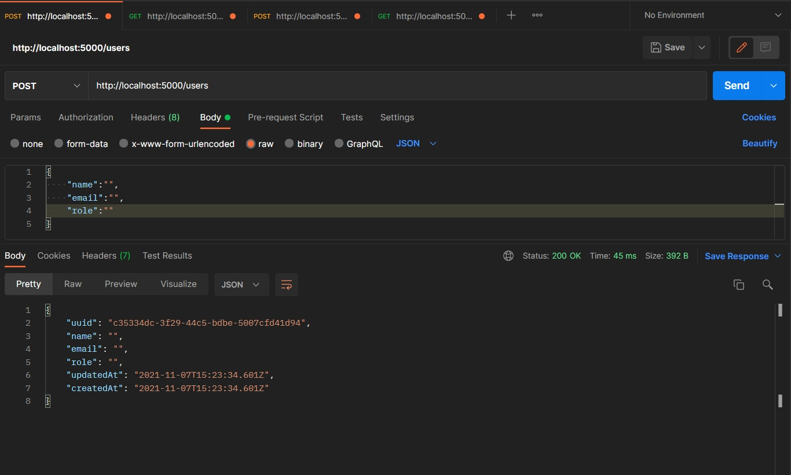
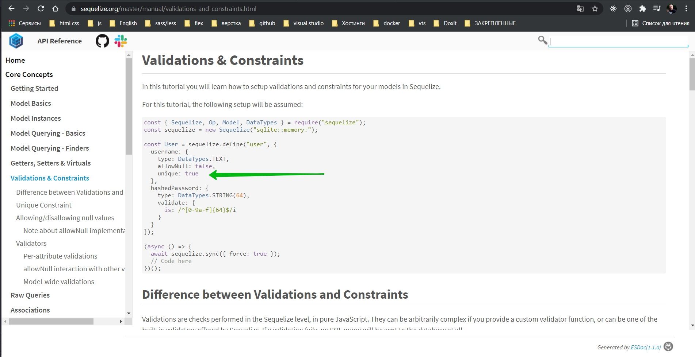
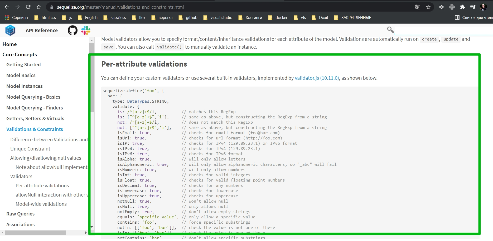
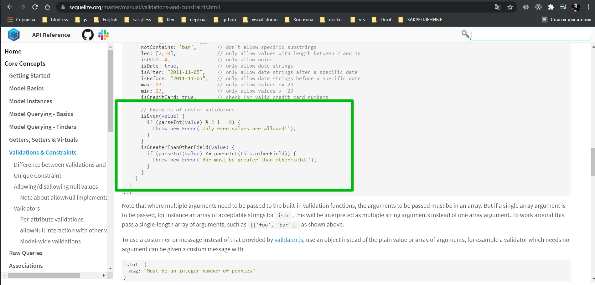
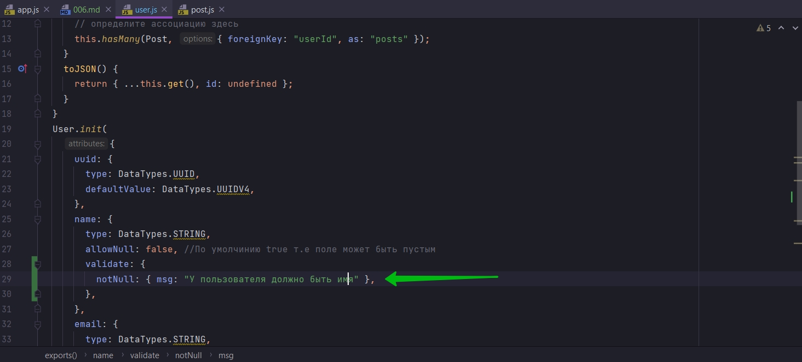
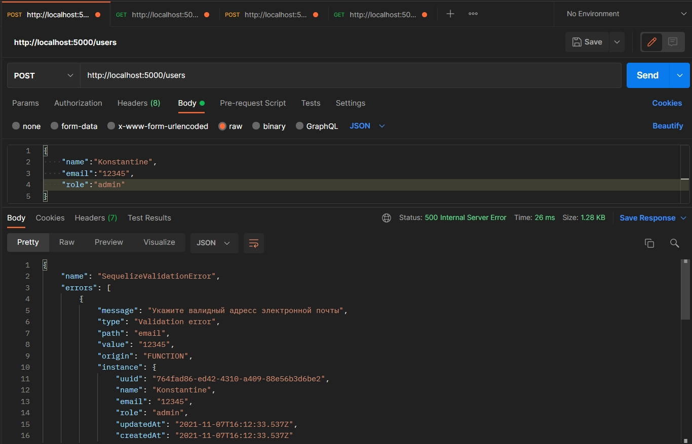

Еще одна вещь которую я хотел продемострировать. Если я сейчас отправлю post запрос в котором будут содержаться поля с пустыми значениями, то у нас все по идее пройдет успешно и создастся строка в таблице БД с пустыми значениями.

Как бы это плохой experience. Сейчас у нас нет проверки на пустые значения. На самом деле пустые поля это не путые поля.



Как мы видим создался объект в БД с пустыми полями. Данные поля создаются потому что они не равны NULL. 

Как бы очевидно что такое поведение мы не хотим.

Мы должны иметь какую-то проверку.

Мы конечно можем написать javascript проверку прежде чем мы запустим этот код. Где в методе создания произойдет проверка. 

Однако лучше как можно больше пользоваться sequelize.

По этому если мы вернемся к нашей модели User. Внутри наших полей мы можем добавить поле validate:{}. И здесь внутри валидации мы можем иметь несколько правил валидации. Если мы нажмем на контрольну область то увидим список в котором присутствует огромное количество методов проверки.

Все эти правила можно рассмотреть в документации [Validations & Constraints](https://sequelize.org/master/manual/validations-and-constraints.html). 

Вот к примеру проверка на то что значение в каком либо поле должно быть уникальным.



Если мы проскролим вниз, то мы увидим что существует так много разных правил проверки,которые вы можете использовать. 



```js
sequelize.define('foo', {
  bar: {
    type: DataTypes.STRING,
    validate: {
      is: /^[a-z]+$/i,          // matches this RegExp
      is: ["^[a-z]+$",'i'],     // same as above, but constructing the RegExp from a string
      not: /^[a-z]+$/i,         // does not match this RegExp
      not: ["^[a-z]+$",'i'],    // same as above, but constructing the RegExp from a string
      isEmail: true,            // checks for email format (foo@bar.com)
      isUrl: true,              // checks for url format (http://foo.com)
      isIP: true,               // checks for IPv4 (129.89.23.1) or IPv6 format
      isIPv4: true,             // checks for IPv4 (129.89.23.1)
      isIPv6: true,             // checks for IPv6 format
      isAlpha: true,            // will only allow letters
      isAlphanumeric: true,     // will only allow alphanumeric characters, so "_abc" will fail
      isNumeric: true,          // will only allow numbers
      isInt: true,              // checks for valid integers
      isFloat: true,            // checks for valid floating point numbers
      isDecimal: true,          // checks for any numbers
      isLowercase: true,        // checks for lowercase
      isUppercase: true,        // checks for uppercase
      notNull: true,            // won't allow null
      isNull: true,             // only allows null
      notEmpty: true,           // don't allow empty strings
      equals: 'specific value', // only allow a specific value
      contains: 'foo',          // force specific substrings
      notIn: [['foo', 'bar']],  // check the value is not one of these
      isIn: [['foo', 'bar']],   // check the value is one of these
      notContains: 'bar',       // don't allow specific substrings
      len: [2,10],              // only allow values with length between 2 and 10
      isUUID: 4,                // only allow uuids
      isDate: true,             // only allow date strings
      isAfter: "2011-11-05",    // only allow date strings after a specific date
      isBefore: "2011-11-05",   // only allow date strings before a specific date
      max: 23,                  // only allow values <= 23
      min: 23,                  // only allow values >= 23
      isCreditCard: true,       // check for valid credit card numbers

      // Examples of custom validators:
      isEven(value) {
        if (parseInt(value) % 2 !== 0) {
          throw new Error('Only even values are allowed!');
        }
      }
      isGreaterThanOtherField(value) {
        if (parseInt(value) <= parseInt(this.otherField)) {
          throw new Error('Bar must be greater than otherField.');
        }
      }
    }
  }
});
```

Это фактически применяется до запуска sql - запроса. Так что уровнение делает свое волшебство. И вы  так же можете создавать свои кастомные пользовательские правила проверки, что довольно приятно.



По этому я воспользуюсь простой валидацией validate:{}. И здесь скажем я хочу использовать простое правило проверки notNull которое предотвращает отправку нулевых значений. И вы так же можете вместо того, что бы просто установить для него значение true, выполнить какие-то опции. 

Я могу передать ему объект. В объекте указать сообщение.



```js
"use strict";
const { Model } = require("sequelize");
module.exports = (sequelize, DataTypes) => {
  class User extends Model {
    /**
     * Helper method for defining associations.
     * This method is not a part of Sequelize lifecycle.
     * The `models/index` file will call this method automatically.
     */
    static associate({ Post }) {
      // define association here
      // определите ассоциацию здесь
      this.hasMany(Post, { foreignKey: "userId", as: "posts" });
    }
    toJSON() {
      return { ...this.get(), id: undefined };
    }
  }
  User.init(
    {
      uuid: {
        type: DataTypes.UUID,
        defaultValue: DataTypes.UUIDV4,
      },
      name: {
        type: DataTypes.STRING,
        allowNull: false, //По умолчинию true т.е поле может быть пустым
        validate: {
          notNull: { msg: "У пользователя должно быть имя" },
        },
      },
      email: {
        type: DataTypes.STRING,
        allowNull: false, //По умолчинию true т.е поле может быть пустым
      },
      role: {
        type: DataTypes.STRING,
        allowNull: false, //По умолчинию true т.е поле может быть пустым
      },
    },
    {
      sequelize,
      tableName: "users",
      modelName: "User",
    }
  );
  return User;
};

```

Так же я могу указать что поле не должно быть пустой строкой. Делаю это с помощью notEmpty. Все тоже самое и с остальными полями.

```js
"use strict";
const { Model } = require("sequelize");
module.exports = (sequelize, DataTypes) => {
    class User extends Model {
        /**
         * Helper method for defining associations.
         * This method is not a part of Sequelize lifecycle.
         * The `models/index` file will call this method automatically.
         */
        static associate({ Post }) {
            // define association here
            // определите ассоциацию здесь
            this.hasMany(Post, { foreignKey: "userId", as: "posts" });
        }
        toJSON() {
            return { ...this.get(), id: undefined };
        }
    }
    User.init(
        {
            uuid: {
                type: DataTypes.UUID,
                defaultValue: DataTypes.UUIDV4,
            },
            name: {
                type: DataTypes.STRING,
                allowNull: false, //По умолчинию true т.е поле может быть пустым
                validate: {
                    notNull: { msg: "У пользователя должно быть имя" },
                    notEmpty: { msg: "Поле Имя не должно быть пустым" },
                },
            },
            email: {
                type: DataTypes.STRING,
                allowNull: false, //По умолчинию true т.е поле может быть пустым
                validate: {
                    notNull: { msg: "У пользователя должен быть email" },
                    notEmpty: { msg: "Поле Email не должно быть пустым" },
                },
            },
            role: {
                type: DataTypes.STRING,
                allowNull: false, //По умолчинию true т.е поле может быть пустым
                validate: {
                    notNull: { msg: "У пользователя должна быть указана роль" },
                    notEmpty: { msg: "Поле Role не должно быть пустым" },
                },
            },
        },
        {
            sequelize,
            tableName: "users",
            modelName: "User",
        }
    );
    return User;
};

```

И вот при последующей отправке я получаю вот такое сообщение

```json
{
    "name": "SequelizeValidationError",
    "errors": [
        {
            "message": "Поле Имя не должно быть пустым",
            "type": "Validation error",
            "path": "name",
            "value": "",
            "origin": "FUNCTION",
            "instance": {
                "uuid": "c3ab95ec-34d0-4351-b3d1-c7273828cf08",
                "name": "",
                "email": "",
                "role": "",
                "updatedAt": "2021-11-07T16:05:47.793Z",
                "createdAt": "2021-11-07T16:05:47.793Z"
            },
            "validatorKey": "notEmpty",
            "validatorName": "notEmpty",
            "validatorArgs": [
                {
                    "msg": "Поле Имя не должно быть пустым"
                }
            ],
            "original": {
                "validatorName": "notEmpty",
                "validatorArgs": [
                    {
                        "msg": "Поле Имя не должно быть пустым"
                    }
                ]
            }
        },
        {
            "message": "Поле Email не должно быть пустым",
            "type": "Validation error",
            "path": "email",
            "value": "",
            "origin": "FUNCTION",
            "instance": {
                "uuid": "c3ab95ec-34d0-4351-b3d1-c7273828cf08",
                "name": "",
                "email": "",
                "role": "",
                "updatedAt": "2021-11-07T16:05:47.793Z",
                "createdAt": "2021-11-07T16:05:47.793Z"
            },
            "validatorKey": "notEmpty",
            "validatorName": "notEmpty",
            "validatorArgs": [
                {
                    "msg": "Поле Email не должно быть пустым"
                }
            ],
            "original": {
                "validatorName": "notEmpty",
                "validatorArgs": [
                    {
                        "msg": "Поле Email не должно быть пустым"
                    }
                ]
            }
        },
        {
            "message": "Поле Role не должно быть пустым",
            "type": "Validation error",
            "path": "role",
            "value": "",
            "origin": "FUNCTION",
            "instance": {
                "uuid": "c3ab95ec-34d0-4351-b3d1-c7273828cf08",
                "name": "",
                "email": "",
                "role": "",
                "updatedAt": "2021-11-07T16:05:47.793Z",
                "createdAt": "2021-11-07T16:05:47.793Z"
            },
            "validatorKey": "notEmpty",
            "validatorName": "notEmpty",
            "validatorArgs": [
                {
                    "msg": "Поле Role не должно быть пустым"
                }
            ],
            "original": {
                "validatorName": "notEmpty",
                "validatorArgs": [
                    {
                        "msg": "Поле Role не должно быть пустым"
                    }
                ]
            }
        }
    ]
}
```

Если я удалю какое-то из полей и отправлю объект он так же провалидирует и скажет что удаленное поле не должно быть пустым.

Для проверки email я так же могу добавить правило isEmail

```js
"use strict";
const { Model } = require("sequelize");
module.exports = (sequelize, DataTypes) => {
  class User extends Model {
    /**
     * Helper method for defining associations.
     * This method is not a part of Sequelize lifecycle.
     * The `models/index` file will call this method automatically.
     */
    static associate({ Post }) {
      // define association here
      // определите ассоциацию здесь
      this.hasMany(Post, { foreignKey: "userId", as: "posts" });
    }
    toJSON() {
      return { ...this.get(), id: undefined };
    }
  }
  User.init(
    {
      uuid: {
        type: DataTypes.UUID,
        defaultValue: DataTypes.UUIDV4,
      },
      name: {
        type: DataTypes.STRING,
        allowNull: false, //По умолчинию true т.е поле может быть пустым
        validate: {
          notNull: { msg: "У пользователя должно быть имя" },
          notEmpty: { msg: "Поле Имя не должно быть пустым" },
        },
      },
      email: {
        type: DataTypes.STRING,
        allowNull: false, //По умолчинию true т.е поле может быть пустым
        validate: {
          notNull: { msg: "У пользователя должен быть email" },
          notEmpty: { msg: "Поле Email не должно быть пустым" },
          isEmail: { msg: "Укажите валидный адресс электронной почты" },
        },
      },
      role: {
        type: DataTypes.STRING,
        allowNull: false, //По умолчинию true т.е поле может быть пустым
        validate: {
          notNull: { msg: "У пользователя должна быть указана роль" },
          notEmpty: { msg: "Поле Role не должно быть пустым" },
        },
      },
    },
    {
      sequelize,
      tableName: "users",
      modelName: "User",
    }
  );
  return User;
};

```



Нам не нужно писать валидацию на клиенте.


