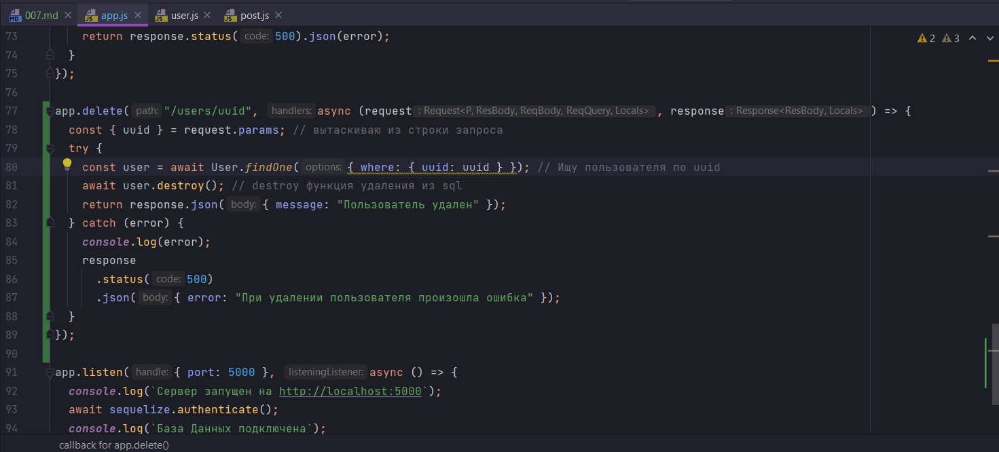
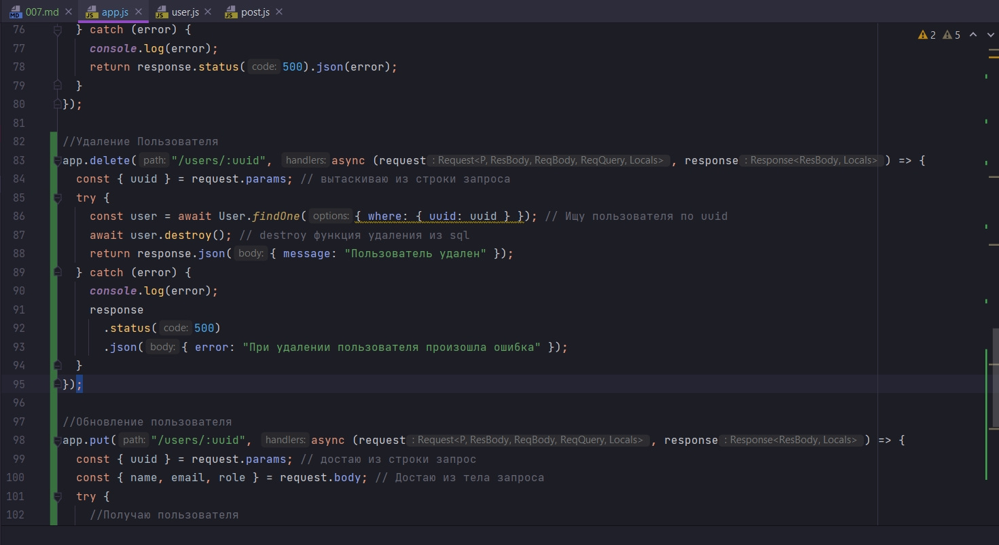
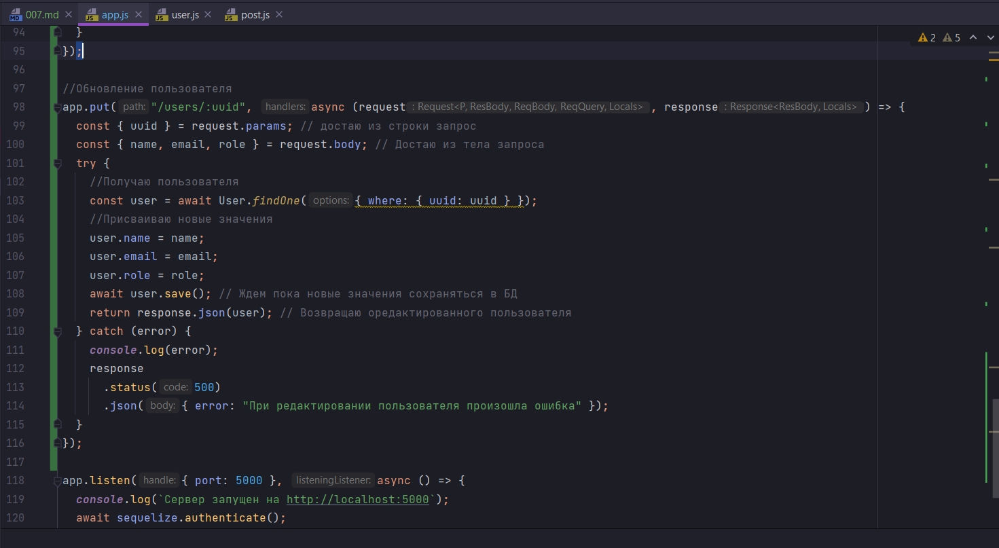
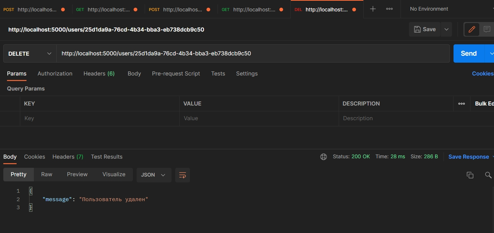
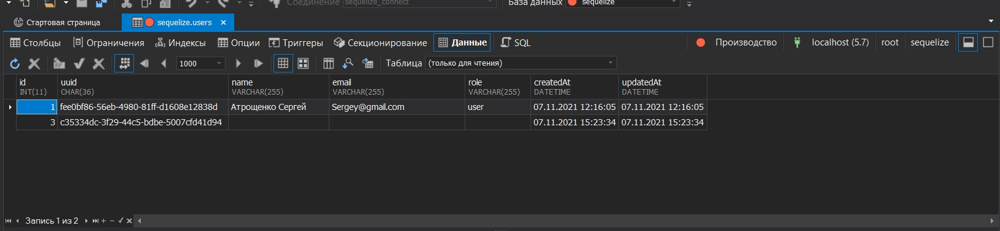
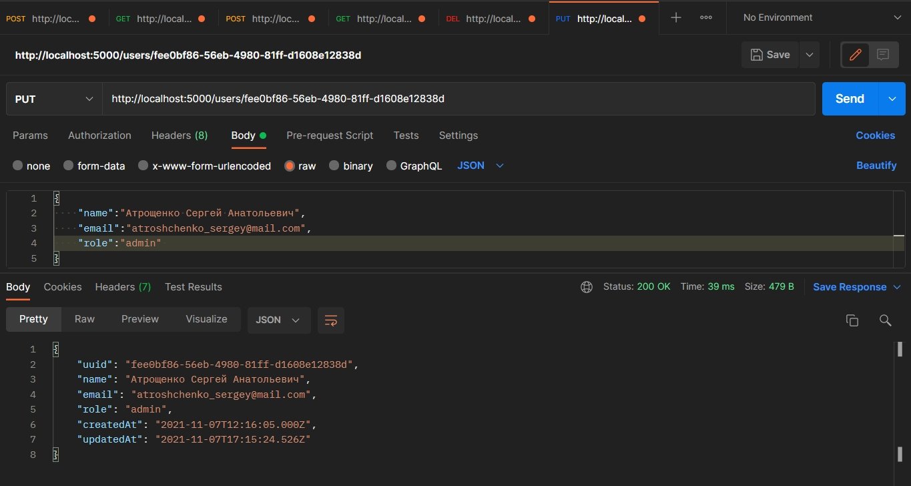
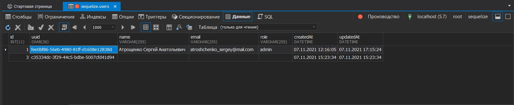

Здесь дописываю удаление и редактирование. Кароче завершаю CRUD.



```js
//app.js
const express = require("express");
const { sequelize, User, Post } = require("./models");
const { request, response } = require("express");

const app = express(); // создаю экземпляр класса express
app.use(express.json()); //регистрирую middleware парсер json

app.post("/users", async (request, response) => {
  const { name, email, role } = request.body; //Достаю из тела запроса
  try {
    const user = await User.create({ name, email, role });
    return response.json(user);
  } catch (error) {
    console.log(error);
    return response.status(500).json(error);
  }
});

app.get("/users", async (request, response) => {
  try {
    const users = await User.findAll();
    return response.json(users);
  } catch (error) {
    console.log(error);
    return response.status(500).json({ error: "Что-то пошло не так" });
  }
});

app.get("/users/:uuid", async (request, response) => {
  const { uuid } = request.params; // получаю из строки запроса
  try {
    const users = await User.findOne({
      where: {
        uuid: uuid,
      },
      include: ["posts"], // указываю всевдоним модели Post
    });
    return response.json(users);
  } catch (error) {
    console.log(error);
    return response.status(500).json({ error: "Что-то пошло не так" });
  }
});

app.post("/posts", async (request, response) => {
  const { userUuid, body } = request.body; // Получаю из тела запроса body это переменная тела запроса а на само тело запроса
  try {
    //Ищу пользователя
    const user = await User.findOne({
      where: {
        uuid: userUuid,
      },
    });
    //Создаю сообщение
    //связываю сообщение с определенным пользователем
    const post = await Post.create({ body, userId: user.id });
    return response.jsonp(post);
  } catch (error) {
    console.log(error);
    return response.status(500).json(error);
  }
});

app.get("/posts", async (request, response) => {
  try {
    const posts = await Post.findAll({
      include: ["user"],
    });
    return response.json(posts);
  } catch (error) {
    console.log(error);
    return response.status(500).json(error);
  }
});

app.delete("/users/:uuid", async (request, response) => {
  const { uuid } = request.params; // вытаскиваю из строки запроса
  try {
    const user = await User.findOne({ where: { uuid: uuid } }); // Ищу пользователя по uuid
    await user.destroy(); // destroy функция удаления из sql
    return response.json({ message: "Пользователь удален" });
  } catch (error) {
    console.log(error);
    response
      .status(500)
      .json({ error: "При удалении пользователя произошла ошибка" });
  }
});

app.listen({ port: 5000 }, async () => {
  console.log(`Сервер запущен на http://localhost:5000`);
  await sequelize.authenticate();
  console.log(`База Данных подключена`);
});

```



```js
//app.js
const express = require("express");
const { sequelize, User, Post } = require("./models");
const { request, response } = require("express");

const app = express(); // создаю экземпляр класса express
app.use(express.json()); //регистрирую middleware парсер json

//Создание пользователя
app.post("/users", async (request, response) => {
    const { name, email, role } = request.body; //Достаю из тела запроса
    try {
        const user = await User.create({ name, email, role });
        return response.json(user);
    } catch (error) {
        console.log(error);
        return response.status(500).json(error);
    }
});

//Получение пользователей
app.get("/users", async (request, response) => {
    try {
        const users = await User.findAll();
        return response.json(users);
    } catch (error) {
        console.log(error);
        return response.status(500).json({ error: "Что-то пошло не так" });
    }
});

//Получение пользователя
app.get("/users/:uuid", async (request, response) => {
    const { uuid } = request.params; // получаю из строки запроса
    try {
        const users = await User.findOne({
            where: {
                uuid: uuid,
            },
            include: ["posts"], // указываю всевдоним модели Post
        });
        return response.json(users);
    } catch (error) {
        console.log(error);
        return response.status(500).json({ error: "Что-то пошло не так" });
    }
});

//Добавление поста
app.post("/posts", async (request, response) => {
    const { userUuid, body } = request.body; // Получаю из тела запроса body это переменная тела запроса а на само тело запроса
    try {
        //Ищу пользователя
        const user = await User.findOne({
            where: {
                uuid: userUuid,
            },
        });
        //Создаю сообщение
        //связываю сообщение с определенным пользователем
        const post = await Post.create({ body, userId: user.id });
        return response.jsonp(post);
    } catch (error) {
        console.log(error);
        return response.status(500).json(error);
    }
});

// Получение постов
app.get("/posts", async (request, response) => {
    try {
        const posts = await Post.findAll({
            include: ["user"],
        });
        return response.json(posts);
    } catch (error) {
        console.log(error);
        return response.status(500).json(error);
    }
});

//Удаление Пользователя
app.delete("/users/:uuid", async (request, response) => {
    const { uuid } = request.params; // вытаскиваю из строки запроса
    try {
        const user = await User.findOne({ where: { uuid: uuid } }); // Ищу пользователя по uuid
        await user.destroy(); // destroy функция удаления из sql
        return response.json({ message: "Пользователь удален" });
    } catch (error) {
        console.log(error);
        response
            .status(500)
            .json({ error: "При удалении пользователя произошла ошибка" });
    }
});

//Обновление пользователя
app.put("/users/:uuid", async (request, response) => {
    const { uuid } = request.params; // достаю из строки запрос
    const { name, email, role } = request.body; // Достаю из тела запроса
    try {
        //Получаю пользователя
        const user = await User.findOne({ where: { uuid: uuid } });
        //Присваиваю новые значения
        user.name = name;
        user.email = email;
        user.role = role;
        await user.save(); // Ждем пока новые значения сохраняться в БД
        return response.json(user); // Возвращаю оредактированного пользователя
    } catch (error) {
        console.log(error);
        response
            .status(500)
            .json({ error: "При редактировании пользователя произошла ошибка" });
    }
});

app.listen({ port: 5000 }, async () => {
    console.log(`Сервер запущен на http://localhost:5000`);
    await sequelize.authenticate();
    console.log(`База Данных подключена`);
});

```

Как видим в БД у меня есть несколько пользователей







И теперь обновление






