* [model_instances](003_model_instances)

* [Вставка_данных_с_помощью_Build_и_Save](#Вставка_данных_с_помощью_Build_и_Save)
* [Вставка_данных_с_помощью_Create](#Вставка_данных_с_помощью_Create)
* [Обновление_вставленных_данных_с_помощью_Save](#Обновление_вставленных_данных_с_помощью_Save)
* [Удаление_вставленных_данных_с_помощью_Destroy](#Удаление_вставленных_данных_с_помощью_Destroy)
* [Восстановление_исходных_данных_пользователя_с_помощью_Reload](#Восстановление_исходных_данных_пользователя_с_помощью_Reload)
* [Обновление_определенных_полей_с_помощью_Save](#Обновление_определенных_полей_с_помощью_Save)
* [Incrementing_and_Decrementing](#Incrementing_and_Decrementing)
* [Вставка_значений_по_умолчанию](#Вставка_значений_по_умолчанию)
* [Inserting_Multiple_Rows_at_Once_with_BulkCreate](#Inserting_Multiple_Rows_at_Once_with_BulkCreate)
* [Validating_Inserted_Data](#Validating_Inserted_Data)


# 003_model_instances

Мы собираемся вставлять данные в нашу таблицу. В предыдущем видео мы настроили нашу таблицу.

Прежде чем продолжить я хочу внести изменения. Во-первых я могу сразу деструктурировать из sequelize DataTypes. Это позволяет не писать такие длинные обращения как раньше type: Sequelize.DataTypes.STRING,

```js
const Sequelize = require("sequelize");
const { DataTypes } = Sequelize;

const sequelize = new Sequelize("sequelize_002", "root", "4343", {
  host: "localhost",
  port: 3306,
  dialect: "mysql",
}); // создаю экземпляр класса

sequelize.sync({ alter: true }); //Будет синхронизировать каждую таблицу по отдельности не пересобирая все таблицы

const User = sequelize.define(
  "user",
  {
    user_id: {
      type: DataTypes.INTEGER,
      primaryKey: true, // Первичный ключ
      autoIncrement: true, //Автоматическое приращение
    },
    username: {
      type: DataTypes.STRING,
      allowNull: false,
    },
    password: {
      type: DataTypes.STRING,
    },
    age: {
      type: DataTypes.INTEGER,
      defaultValue: 21,
    },
  },
  {
    freezeTableName: true, // указываю что бы имя нашей модели совпадало с именем нашей таблицы
  }
); // Определяю модель пользователей
User.sync({ force: true }); // Синхронизирую модель с таблицей При любом изменении в модели будет происходить удаление старой таблицы и создание новой

```

Далее с помощью промися я собираюсь обработать. Так как я на самом деле собираюсь внести не мало изменений. Я собираюсь каждый раз когда это приложение будет запущено, sequelize будет удостоверяться что эта таблица обновлена, а затем что мы работаем в обновленной таблице.

```js
const Sequelize = require("sequelize");
const { DataTypes } = Sequelize;

const sequelize = new Sequelize("sequelize_002", "root", "4343", {
  host: "localhost",
  port: 3306,
  dialect: "mysql",
}); // создаю экземпляр класса

sequelize.sync({ alter: true }); //Будет синхронизировать каждую таблицу по отдельности не пересобирая все таблицы

const User = sequelize.define(
  "user",
  {
    user_id: {
      type: DataTypes.INTEGER,
      primaryKey: true, // Первичный ключ
      autoIncrement: true, //Автоматическое приращение
    },
    username: {
      type: DataTypes.STRING,
      allowNull: false,
    },
    password: {
      type: DataTypes.STRING,
    },
    age: {
      type: DataTypes.INTEGER,
      defaultValue: 21,
    },
  },
  {
    freezeTableName: true, // указываю что бы имя нашей модели совпадало с именем нашей таблицы
  }
); // Определяю модель пользователей
User.sync({ force: true }).then(() => {
  //working with our updated table
}).catch(()=>{})

```

Теперь по сути начинаем вставлять наши денные в таблицу. Для вставки данных в таблицу я буду использовать метод build вызванный у модели.

# Вставка_данных_с_помощью_Build_и_Save

```js
const Sequelize = require("sequelize");
const { DataTypes } = Sequelize;

const sequelize = new Sequelize("sequelize_002", "root", "4343", {
  host: "localhost",
  port: 3306,
  dialect: "mysql",
}); // создаю экземпляр класса

sequelize.sync({ alter: true }); //Будет синхронизировать каждую таблицу по отдельности не пересобирая все таблицы

const User = sequelize.define(
  "user",
  {
    user_id: {
      type: DataTypes.INTEGER,
      primaryKey: true, // Первичный ключ
      autoIncrement: true, //Автоматическое приращение
    },
    username: {
      type: DataTypes.STRING,
      allowNull: false,
    },
    password: {
      type: DataTypes.STRING,
    },
    age: {
      type: DataTypes.INTEGER,
      defaultValue: 21,
    },
    WittCodeRocks: {
      type: DataTypes.BOOLEAN,
      defaultValue: true,
    },
  },

  {
    freezeTableName: true, // указываю что бы имя нашей модели совпадало с именем нашей таблицы
  }
); // Определяю модель пользователей
User.sync({ force: true })
  .then(() => {
    //working with our updated table
    const user = User.build({
      username: "WittCode",
      password: "123",
      age: 25,
      WittCodeRocks: true,
    });
    return user.save(); //сохраняю
  })
  .then((data) => {
    console.log(`Пользователь добавлен в БД`);
  })
  .catch((error) => {
    console.log(error);
  });

```

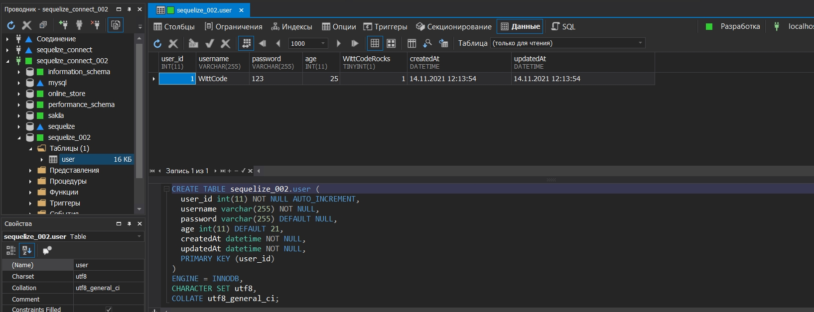

Теперь вы видите у нас есть id пользователя 1, password 123. Т.е. все то что у нас есть в модели.

<br/>

# Вставка_данных_с_помощью_Create

Все что нам нужно это вызвать у модели метод create, и затем все что мы делаем это передаем объект.

```js
const Sequelize = require("sequelize");
const { DataTypes } = Sequelize;

const sequelize = new Sequelize("sequelize_002", "root", "4343", {
    host: "localhost",
    port: 3306,
    dialect: "mysql",
}); // создаю экземпляр класса

sequelize.sync({ alter: true }); //Будет синхронизировать каждую таблицу по отдельности не пересобирая все таблицы

const User = sequelize.define(
    "user",
    {
        user_id: {
            type: DataTypes.INTEGER,
            primaryKey: true, // Первичный ключ
            autoIncrement: true, //Автоматическое приращение
        },
        username: {
            type: DataTypes.STRING,
            allowNull: false,
        },
        password: {
            type: DataTypes.STRING,
        },
        age: {
            type: DataTypes.INTEGER,
            defaultValue: 21,
        },
        WittCodeRocks: {
            type: DataTypes.BOOLEAN,
            defaultValue: true,
        },
    },

    {
        freezeTableName: true, // указываю что бы имя нашей модели совпадало с именем нашей таблицы
    }
); // Определяю модель пользователей
User.sync({ force: true })
    .then(() => {
        //working with our updated table
        return User.create({
            username: "WittCode",
            password: "123",
            age: 32,
            WittCodeRocks: false,
        });
    })
    .then((data) => {
        console.log(`Пользователь добавлен в БД`);
    })
    .catch((error) => {
        console.log(error);
    });

```

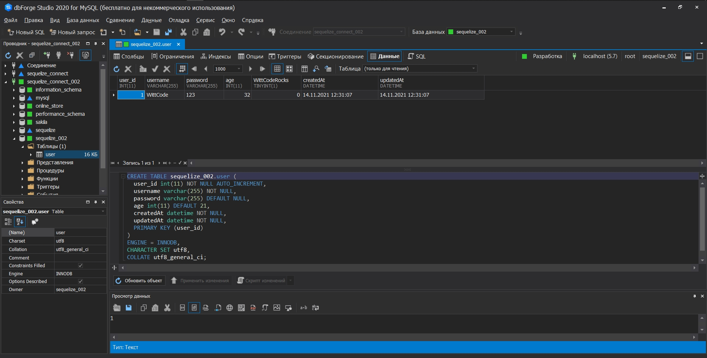

Как видим данные успешно сохранены. create это более быстрый способ сделать сборку и сохранить.

Выведем в консоль и посмотрим как это происходит.

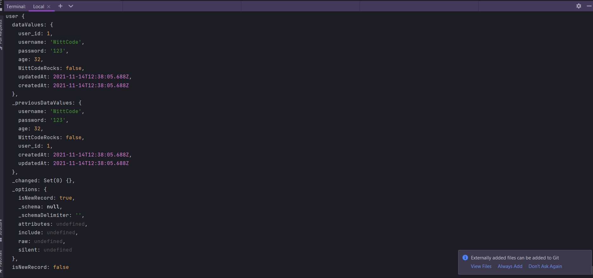

У нас есть много информации. У нас есть предыдущие значения данных

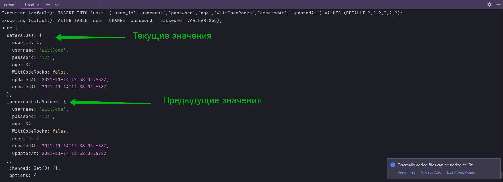

Большую часть этого мы рассмотрим позже. Пока что вы просто должны знать что с помощью метода toJSON()

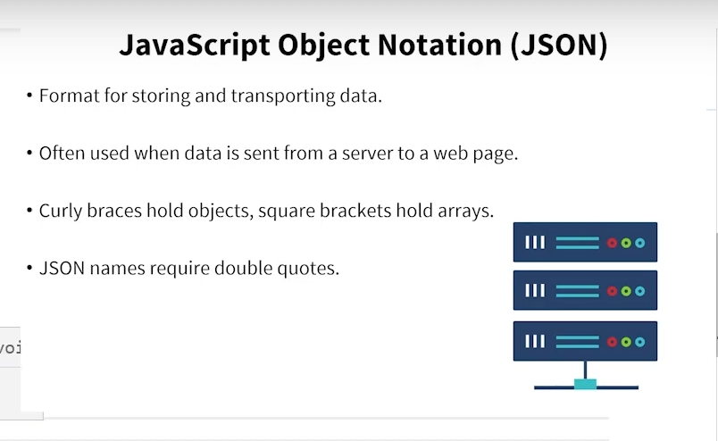

```js
const Sequelize = require("sequelize");
const { DataTypes } = Sequelize;

const sequelize = new Sequelize("sequelize_002", "root", "4343", {
  host: "localhost",
  port: 3306,
  dialect: "mysql",
}); // создаю экземпляр класса

sequelize.sync({ alter: true }); //Будет синхронизировать каждую таблицу по отдельности не пересобирая все таблицы

const User = sequelize.define(
  "user",
  {
    user_id: {
      type: DataTypes.INTEGER,
      primaryKey: true, // Первичный ключ
      autoIncrement: true, //Автоматическое приращение
    },
    username: {
      type: DataTypes.STRING,
      allowNull: false,
    },
    password: {
      type: DataTypes.STRING,
    },
    age: {
      type: DataTypes.INTEGER,
      defaultValue: 21,
    },
    WittCodeRocks: {
      type: DataTypes.BOOLEAN,
      defaultValue: true,
    },
  },

  {
    freezeTableName: true, // указываю что бы имя нашей модели совпадало с именем нашей таблицы
  }
); // Определяю модель пользователей
User.sync({ force: true })
  .then(() => {
    //working with our updated table
    return User.create({
      username: "WittCode",
      password: "123",
      age: 32,
      WittCodeRocks: false,
    });
  })
  .then((data) => {
    console.log(data.toJSON());
    console.log(`Пользователь добавлен в БД`);
  })
  .catch((error) => {
    console.log(error);
  });

```

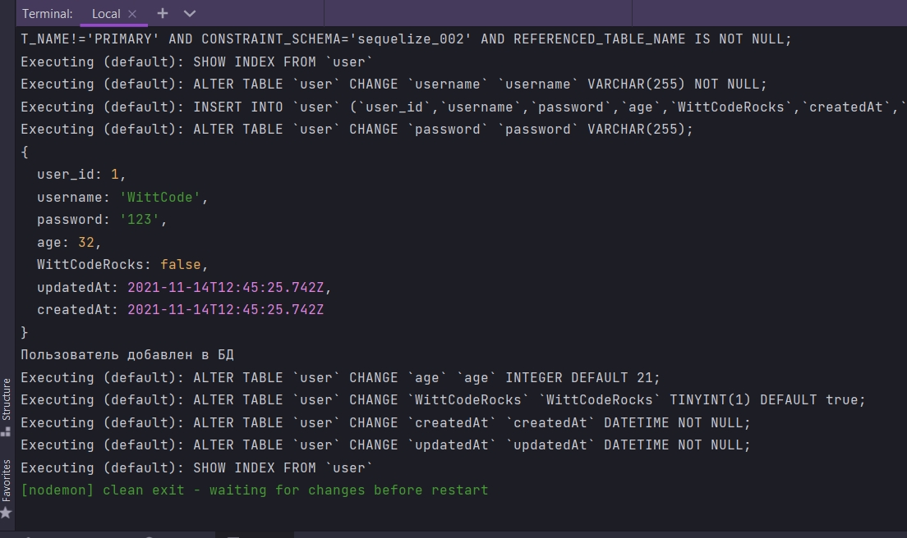

И как видите у нас есть просто объект. Т.е. просто те данные которые мы передаем в таблицу БД.


<br/>
<br/>
<br/>

# Обновление_вставленных_данных_с_помощью_Save

Метод create() на самом деле имеет дополнительные функции. Мы можеи использовать метод save для обновления записи в нашей БД. Например после того как мы использовали create, поместили нашего пользователя в БД. Мы можем работать с данными возвращенными из promise. По этому мы работаем с данными здесь.

```js
const Sequelize = require("sequelize");
const { DataTypes } = Sequelize;

const sequelize = new Sequelize("sequelize_002", "root", "4343", {
    host: "localhost",
    port: 3306,
    dialect: "mysql",
}); // создаю экземпляр класса

sequelize.sync({ alter: true }); //Будет синхронизировать каждую таблицу по отдельности не пересобирая все таблицы

const User = sequelize.define(
    "user",
    {
        user_id: {
            type: DataTypes.INTEGER,
            primaryKey: true, // Первичный ключ
            autoIncrement: true, //Автоматическое приращение
        },
        username: {
            type: DataTypes.STRING,
            allowNull: false,
        },
        password: {
            type: DataTypes.STRING,
        },
        age: {
            type: DataTypes.INTEGER,
            defaultValue: 21,
        },
        WittCodeRocks: {
            type: DataTypes.BOOLEAN,
            defaultValue: true,
        },
    },

    {
        freezeTableName: true, // указываю что бы имя нашей модели совпадало с именем нашей таблицы
    }
); // Определяю модель пользователей
User.sync({ force: true })
    .then(() => {
        //working with our updated table
        return User.create({
            username: "WittCode",
            password: "123",
            age: 32,
            WittCodeRocks: false,
        });
    })
    .then((data) => {
        console.log(`Пользователь добавлен в БД`);
        data.username = "pizza"; //обновляю данные
        return data.save(); // но эти данные нужно вернуть и сохранить
        //поскольку мы возвращаем promise эти данные нужно обработать
    })
    .then((data) => {
        console.log(`Пользователь обновлен!`);
        console.log(data);
    })
    .catch((error) => {
        console.log(error);
    });

```

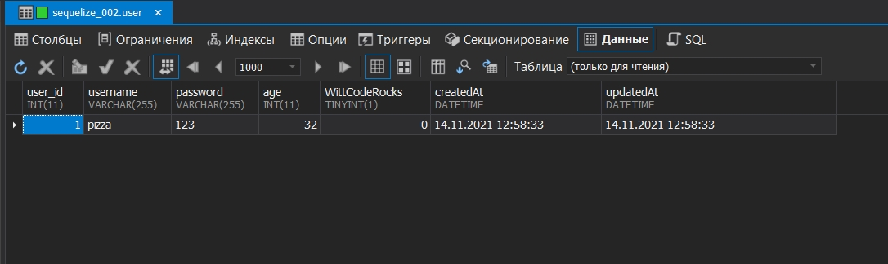

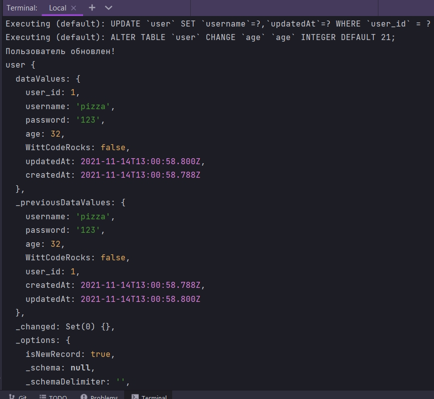

<br/>
<br/>
<br/>
<br/>


# Удаление_вставленных_данных_с_помощью_Destroy

```js
const Sequelize = require("sequelize");
const { DataTypes } = Sequelize;

const sequelize = new Sequelize("sequelize_002", "root", "4343", {
  host: "localhost",
  port: 3306,
  dialect: "mysql",
}); // создаю экземпляр класса

sequelize.sync({ alter: true }); //Будет синхронизировать каждую таблицу по отдельности не пересобирая все таблицы

const User = sequelize.define(
  "user",
  {
    user_id: {
      type: DataTypes.INTEGER,
      primaryKey: true, // Первичный ключ
      autoIncrement: true, //Автоматическое приращение
    },
    username: {
      type: DataTypes.STRING,
      allowNull: false,
    },
    password: {
      type: DataTypes.STRING,
    },
    age: {
      type: DataTypes.INTEGER,
      defaultValue: 21,
    },
    WittCodeRocks: {
      type: DataTypes.BOOLEAN,
      defaultValue: true,
    },
  },

  {
    freezeTableName: true, // указываю что бы имя нашей модели совпадало с именем нашей таблицы
  }
); // Определяю модель пользователей
User.sync({ force: true })
  .then(() => {
    //working with our updated table
    return User.create({
      username: "WittCode",
      password: "123",
      age: 32,
      WittCodeRocks: false,
    });
  })
  .then((data) => {
    console.log(`Пользователь добавлен в БД`);
    data.username = "pizza"; //обновляю данные
    return data.destroy();
    //поскольку мы возвращаем promise эти данные нужно обработать
  })

  .catch((error) => {
    console.log(error);
  });

```
<br/>
<br/>
<br/>


# Восстановление_исходных_данных_пользователя_с_помощью_Reload

```js
const Sequelize = require("sequelize");
const { DataTypes } = Sequelize;

const sequelize = new Sequelize("sequelize_002", "root", "4343", {
    host: "localhost",
    port: 3306,
    dialect: "mysql",
}); // создаю экземпляр класса

sequelize.sync({ alter: true }); //Будет синхронизировать каждую таблицу по отдельности не пересобирая все таблицы

const User = sequelize.define(
    "user",
    {
        user_id: {
            type: DataTypes.INTEGER,
            primaryKey: true, // Первичный ключ
            autoIncrement: true, //Автоматическое приращение
        },
        username: {
            type: DataTypes.STRING,
            allowNull: false,
        },
        password: {
            type: DataTypes.STRING,
        },
        age: {
            type: DataTypes.INTEGER,
            defaultValue: 21,
        },
        WittCodeRocks: {
            type: DataTypes.BOOLEAN,
            defaultValue: true,
        },
    },

    {
        freezeTableName: true, // указываю что бы имя нашей модели совпадало с именем нашей таблицы
    }
); // Определяю модель пользователей
User.sync({ force: true })
    .then(() => {
        //working with our updated table
        return User.create({
            username: "WittCode",
            password: "123",
            age: 32,
            WittCodeRocks: false,
        });
    })
    .then((data) => {
        console.log(`Пользователь добавлен в БД`);
        data.username = "pizza"; //обновляю данные
        data.age = 45; //обновляю
        return data.reload(); // Просто перезагрузит и обновленные данные не пременяться
        //поскольку мы возвращаем promise эти данные нужно обработать
    })

    .catch((error) => {
        console.log(error);
    });


```

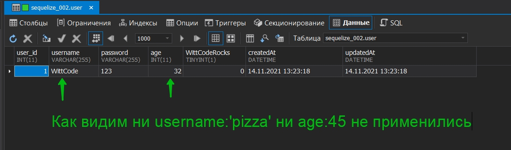

<br/>
<br/>
<br/>

# Обновление_определенных_полей_с_помощью_Save

Другими словами нам не нужно сохранять каждое поле.

```js
const Sequelize = require("sequelize");
const { DataTypes } = Sequelize;

const sequelize = new Sequelize("sequelize_002", "root", "4343", {
  host: "localhost",
  port: 3306,
  dialect: "mysql",
}); // создаю экземпляр класса

sequelize.sync({ alter: true }); //Будет синхронизировать каждую таблицу по отдельности не пересобирая все таблицы

const User = sequelize.define(
  "user",
  {
    user_id: {
      type: DataTypes.INTEGER,
      primaryKey: true, // Первичный ключ
      autoIncrement: true, //Автоматическое приращение
    },
    username: {
      type: DataTypes.STRING,
      allowNull: false,
    },
    password: {
      type: DataTypes.STRING,
    },
    age: {
      type: DataTypes.INTEGER,
      defaultValue: 21,
    },
    WittCodeRocks: {
      type: DataTypes.BOOLEAN,
      defaultValue: true,
    },
  },

  {
    freezeTableName: true, // указываю что бы имя нашей модели совпадало с именем нашей таблицы
  }
); // Определяю модель пользователей
User.sync({ force: true })
  .then(() => {
    //working with our updated table
    return User.create({
      username: "WittCode",
      password: "123",
      age: 32,
      WittCodeRocks: false,
    });
  })
  .then((data) => {
    console.log(`Пользователь добавлен в БД`);
    data.username = "pizza"; //обновляю данные
    data.age = 45; //обновляю
    return data.save({ fields: ["age"] }); // Просто перезагрузит и обновленные данные не пременяться
    //поскольку мы возвращаем promise эти данные нужно обработать
  })

  .catch((error) => {
    console.log(error);
  });

```

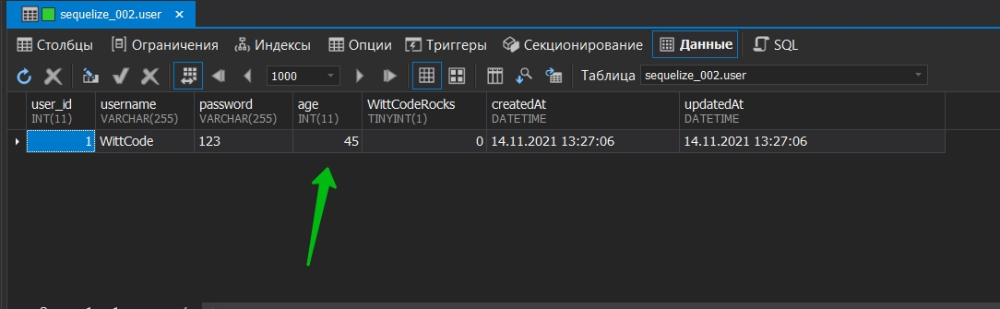

Так же несколько примечаний к методо save. Метод save обновляет только поля, которые фактически изменились. Другими словами если вы ничего не меняете, а затем используете метод save то sequelize на самом деле ничего не сделает. Кроме того если при вызове save изменилось только несколько атрибутов, то в запросе на обновление будут отправлены только эти поля. Например если здесь мы вызовет save без указания полей return data.save(); То будут обновлены только username и age. Другие поля будут проигнорированы. И это хорошо по соображениям эффективности.

<br/>
<br/>
<br/>

# Incrementing_and_Decrementing 


Увеличение () и уменьшение () вставленных целочисленных данных

Мы можем увеличивать или уменьшать значение нашего возраста. Это может быть полезно если например день рождения пользователя, т.е. его возраст мы могли бы увеличить на 1. 

```js
const Sequelize = require("sequelize");
const { DataTypes } = Sequelize;

const sequelize = new Sequelize("sequelize_002", "root", "4343", {
  host: "localhost",
  port: 3306,
  dialect: "mysql",
}); // создаю экземпляр класса

sequelize.sync({ alter: true }); //Будет синхронизировать каждую таблицу по отдельности не пересобирая все таблицы

const User = sequelize.define(
  "user",
  {
    user_id: {
      type: DataTypes.INTEGER,
      primaryKey: true, // Первичный ключ
      autoIncrement: true, //Автоматическое приращение
    },
    username: {
      type: DataTypes.STRING,
      allowNull: false,
    },
    password: {
      type: DataTypes.STRING,
    },
    age: {
      type: DataTypes.INTEGER,
      defaultValue: 21,
    },
    WittCodeRocks: {
      type: DataTypes.BOOLEAN,
      defaultValue: true,
    },
  },

  {
    freezeTableName: true, // указываю что бы имя нашей модели совпадало с именем нашей таблицы
  }
); // Определяю модель пользователей
User.sync({ force: true })
  .then(() => {
    //working with our updated table
    return User.create({
      username: "WittCode",
      password: "123",
      age: 32,
      WittCodeRocks: false,
    });
  })
  .then((data) => {
    data.decrement({ age: 2 }); // уменьшаем возраст пользователя
  })
  .catch((error) => {
    console.log(error);
  });

```

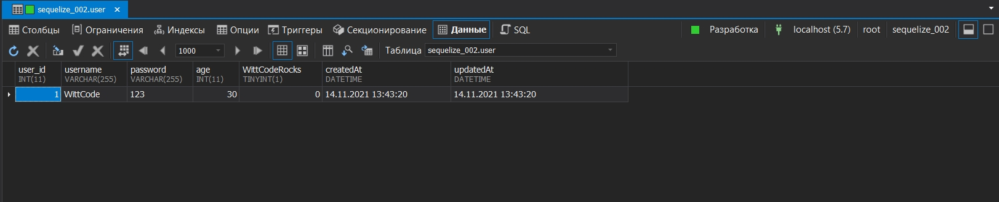


```js
const Sequelize = require("sequelize");
const { DataTypes } = Sequelize;

const sequelize = new Sequelize("sequelize_002", "root", "4343", {
  host: "localhost",
  port: 3306,
  dialect: "mysql",
}); // создаю экземпляр класса

sequelize.sync({ alter: true }); //Будет синхронизировать каждую таблицу по отдельности не пересобирая все таблицы

const User = sequelize.define(
  "user",
  {
    user_id: {
      type: DataTypes.INTEGER,
      primaryKey: true, // Первичный ключ
      autoIncrement: true, //Автоматическое приращение
    },
    username: {
      type: DataTypes.STRING,
      allowNull: false,
    },
    password: {
      type: DataTypes.STRING,
    },
    age: {
      type: DataTypes.INTEGER,
      defaultValue: 21,
    },
    WittCodeRocks: {
      type: DataTypes.BOOLEAN,
      defaultValue: true,
    },
  },

  {
    freezeTableName: true, // указываю что бы имя нашей модели совпадало с именем нашей таблицы
  }
); // Определяю модель пользователей
User.sync({ force: true })
  .then(() => {
    //working with our updated table
    return User.create({
      username: "WittCode",
      password: "123",
      age: 32,
      WittCodeRocks: false,
    });
  })
  .then((data) => {
    data.increment({ age: 2 }); // уменьшаем возраст пользователя
  })
  .catch((error) => {
    console.log(error);
  });

```

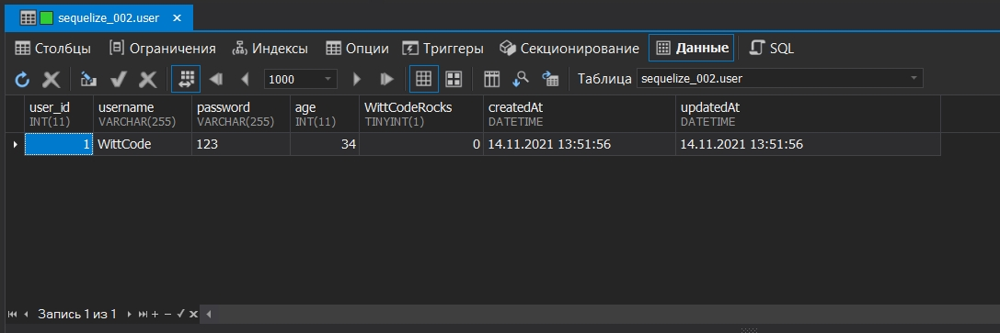

Ну и конечно вы можете и увеличить и уменьшить сразу несколько полей.


<br/>
<br/>
<br/>


# Вставка_значений_по_умолчанию

Допустим мы создадим пользователя. К примеру мы создаем пользователя без указания полей age и WittCodeRocks

```js
const Sequelize = require("sequelize");
const { DataTypes } = Sequelize;

const sequelize = new Sequelize("sequelize_002", "root", "4343", {
  host: "localhost",
  port: 3306,
  dialect: "mysql",
}); // создаю экземпляр класса

sequelize.sync({ alter: true }); //Будет синхронизировать каждую таблицу по отдельности не пересобирая все таблицы

const User = sequelize.define(
  "user",
  {
    user_id: {
      type: DataTypes.INTEGER,
      primaryKey: true, // Первичный ключ
      autoIncrement: true, //Автоматическое приращение
    },
    username: {
      type: DataTypes.STRING,
      allowNull: false,
    },
    password: {
      type: DataTypes.STRING,
    },
    age: {
      type: DataTypes.INTEGER,
      defaultValue: 21,
    },
    WittCodeRocks: {
      type: DataTypes.BOOLEAN,
      defaultValue: true,
    },
  },

  {
    freezeTableName: true, // указываю что бы имя нашей модели совпадало с именем нашей таблицы
  }
); // Определяю модель пользователей
User.sync({ force: true })
  .then(() => {
    //working with our updated table
    return User.create({
      username: "WittCode",
      password: "123",
    });
  })
  .then((data) => {
    console.log(data.toJSON());
  })
  .catch((error) => {
    console.log(error);
  });

```
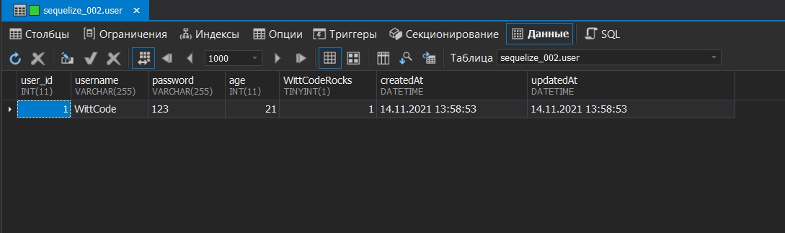

как видим создается пользователь с полями  age и WittCodeRocks и со значениями указанными в них по умолчанию.

<br/>
<br/>
<br/>

# Inserting_Multiple_Rows_at_Once_with_BulkCreate

Последнее что я хочу показать вам это как создать несколько записей одновременно. И это делается с помощью функции bulkCreate. Это используется для создания нескольких пользователей. 

И реальная разница между этой функцией и функцией create заключается в том что массовое создание требует массив объектов, а не один объект. 

```js
const Sequelize = require("sequelize");
const { DataTypes } = Sequelize;

const sequelize = new Sequelize("sequelize_002", "root", "4343", {
  host: "localhost",
  port: 3306,
  dialect: "mysql",
}); // создаю экземпляр класса

sequelize.sync({ alter: true }); //Будет синхронизировать каждую таблицу по отдельности не пересобирая все таблицы

const User = sequelize.define(
  "user",
  {
    user_id: {
      type: DataTypes.INTEGER,
      primaryKey: true, // Первичный ключ
      autoIncrement: true, //Автоматическое приращение
    },
    username: {
      type: DataTypes.STRING,
      allowNull: false,
    },
    password: {
      type: DataTypes.STRING,
    },
    age: {
      type: DataTypes.INTEGER,
      defaultValue: 21,
    },
    WittCodeRocks: {
      type: DataTypes.BOOLEAN,
      defaultValue: true,
    },
  },

  {
    freezeTableName: true, // указываю что бы имя нашей модели совпадало с именем нашей таблицы
  }
); // Определяю модель пользователей
User.sync({ force: true })
  .then(() => {
    //working with our updated table
    return User.bulkCreate([
      {
        username: "WittCode",
        password: "123",
        age: "32",
      },
      {
        username: "Mike",
        password: "123456789",
        age: "31",
      },
    ]);
  })
  .then((data) => {
    console.log(data.toJSON());
  })
  .catch((error) => {
    console.log(error);
  });

```

После запуска первое что я должен увидеть это то что json не является функцией

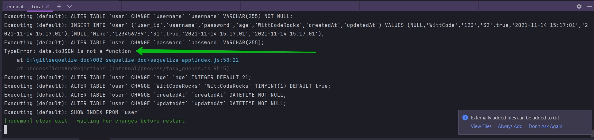


Т.к. мы возвращаем массив объектов мы не можем использовать функцию json для данных которые возвращает нам promise. Но мы можем выполнить цикл и затем применить два метода json к каждому из элементов.

```js
const Sequelize = require("sequelize");
const { DataTypes } = Sequelize;

const sequelize = new Sequelize("sequelize_002", "root", "4343", {
  host: "localhost",
  port: 3306,
  dialect: "mysql",
}); // создаю экземпляр класса

sequelize.sync({ alter: true }); //Будет синхронизировать каждую таблицу по отдельности не пересобирая все таблицы

const User = sequelize.define(
  "user",
  {
    user_id: {
      type: DataTypes.INTEGER,
      primaryKey: true, // Первичный ключ
      autoIncrement: true, //Автоматическое приращение
    },
    username: {
      type: DataTypes.STRING,
      allowNull: false,
    },
    password: {
      type: DataTypes.STRING,
    },
    age: {
      type: DataTypes.INTEGER,
      defaultValue: 21,
    },
    WittCodeRocks: {
      type: DataTypes.BOOLEAN,
      defaultValue: true,
    },
  },

  {
    freezeTableName: true, // указываю что бы имя нашей модели совпадало с именем нашей таблицы
  }
); // Определяю модель пользователей
User.sync({ force: true })
  .then(() => {
    //working with our updated table
    return User.bulkCreate([
      {
        username: "WittCode",
        password: "123",
        age: "32",
      },
      {
        username: "Mike",
        password: "123456789",
        age: "31",
      },
    ]);
  })
  .then((data) => {
    data.forEach((element) => {
      console.log(element.toJSON());
    });
  })
  .catch((error) => {
    console.log(error);
  });

```

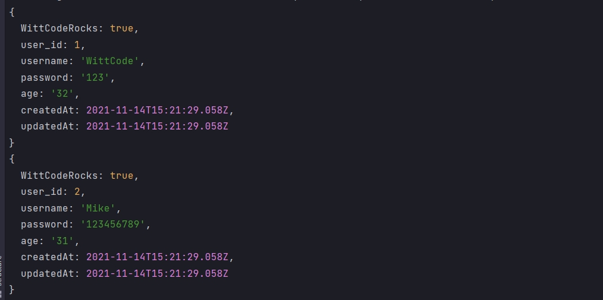

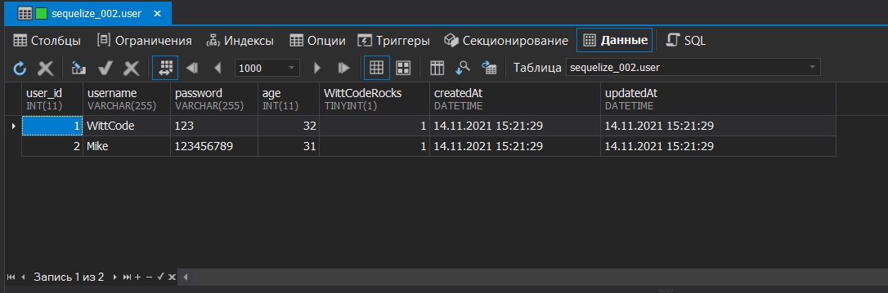


<br/>
<br/>
<br/>


# Validating_Inserted_Data 

Проверка вставленных данных.

Вы должны быть осторожны при использовании массового создания потому что он не запускает проверки для каждого объекта который будет создан. Я имею ввиду то что у нас есть ограниченное количество символов, разрешенных для нашего имени пользователя и определения нашей таблицы.

Допустим у нас есть validate.

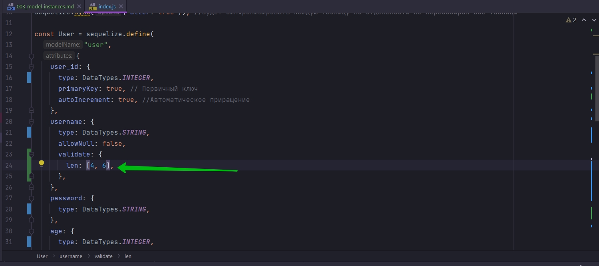

```js
const Sequelize = require("sequelize");
const { DataTypes } = Sequelize;

const sequelize = new Sequelize("sequelize_002", "root", "4343", {
  host: "localhost",
  port: 3306,
  dialect: "mysql",
}); // создаю экземпляр класса

sequelize.sync({ alter: true }); //Будет синхронизировать каждую таблицу по отдельности не пересобирая все таблицы

const User = sequelize.define(
  "user",
  {
    user_id: {
      type: DataTypes.INTEGER,
      primaryKey: true, // Первичный ключ
      autoIncrement: true, //Автоматическое приращение
    },
    username: {
      type: DataTypes.STRING,
      allowNull: false,
      validate: {
        len: [4, 6],
      },
    },
    password: {
      type: DataTypes.STRING,
    },
    age: {
      type: DataTypes.INTEGER,
      defaultValue: 21,
    },
    WittCodeRocks: {
      type: DataTypes.BOOLEAN,
      defaultValue: true,
    },
  },

  {
    freezeTableName: true, // указываю что бы имя нашей модели совпадало с именем нашей таблицы
  }
); // Определяю модель пользователей
User.sync({ force: true })
  .then(() => {
    //working with our updated table
    return User.bulkCreate([
      {
        username: "WittCode",
        password: "123",
        age: "32",
      },
      {
        username: "Mike",
        password: "123456789",
        age: "31",
      },
    ]);
  })
  .then((data) => {
    data.forEach((element) => {
      console.log(element.toJSON());
    });
  })
  .catch((error) => {
    console.log(error);
  });

```

массовое создание будет игнорировать валидацию. Если я сейчас запущу код валидация не сработает. 

Для того что бы при массовом создании валидация отрабатывала корректно необходимо в функцию bulkCreate вторым параметром передать объект опций в котором указать validate:true.

```js
const Sequelize = require("sequelize");
const { DataTypes } = Sequelize;

const sequelize = new Sequelize("sequelize_002", "root", "4343", {
  host: "localhost",
  port: 3306,
  dialect: "mysql",
}); // создаю экземпляр класса

sequelize.sync({ alter: true }); //Будет синхронизировать каждую таблицу по отдельности не пересобирая все таблицы

const User = sequelize.define(
  "user",
  {
    user_id: {
      type: DataTypes.INTEGER,
      primaryKey: true, // Первичный ключ
      autoIncrement: true, //Автоматическое приращение
    },
    username: {
      type: DataTypes.STRING,
      allowNull: false,
      validate: {
        len: [4, 6],
      },
    },
    password: {
      type: DataTypes.STRING,
    },
    age: {
      type: DataTypes.INTEGER,
      defaultValue: 21,
    },
    WittCodeRocks: {
      type: DataTypes.BOOLEAN,
      defaultValue: true,
    },
  },

  {
    freezeTableName: true, // указываю что бы имя нашей модели совпадало с именем нашей таблицы
  }
); // Определяю модель пользователей
User.sync({ force: true })
  .then(() => {
    //working with our updated table
    return User.bulkCreate(
      [
        {
          username: "WittCode",
          password: "123",
          age: "32",
        },
        {
          username: "Mike",
          password: "123456789",
          age: "31",
        },
      ],
      {
        validate: true,
      }
    );
  })
  .then((data) => {
    data.forEach((element) => {
      console.log(element.toJSON());
    });
  })
  .catch((error) => {
    console.log(error);
  });

```

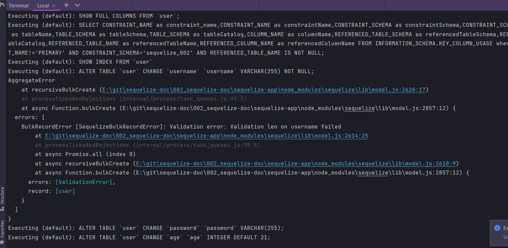

И теперь я получаю ошибку валидации.