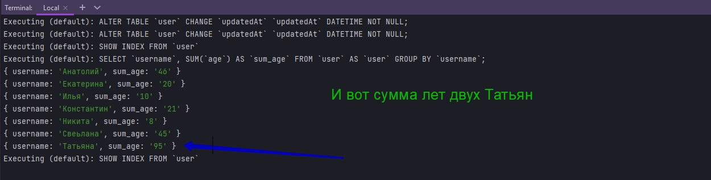

# 004_model_querying

* [Select_Rows_with_FindAll](#Select_Rows_with_FindAll)
* [Select_Specific_Columns_with_FindAll](#Select_Specific_Columns_with_FindAll)
* [Selecting_Columns_with_an_Alias](#Selecting_Columns_with_an_Alias)
* [Aggregations_with_Sequelize.fn](#Aggregations_with_Sequelize.fn)
* [Excluding_Specific_Columns_with_FindAll](#Excluding_Specific_Columns_with_FindAll)
* [Selecting_Rows_with_Where_Filter](#Selecting_Rows_with_Where_Filter)
* [Limiting_Amount_of_Returned_Rows](#Limiting_Amount_of_Returned_Rows)
* [Grouping_and_Ordering_Returned_Rows](#Grouping_and_Ordering_Returned_Rows)
* [Selecting_Rows_with_Operators](#Selecting_Rows_with_Operators)
* [Functions_in_Where_Clause](#Functions_in_Where_Clause)
* [Updating_Rows_with_Update](#Updating_Rows_with_Update)
* [Deleting_Rows_with_Destroy](#Deleting_Rows_with_Destroy)
* [Deleting_Every_Row_with_Truncate](#Deleting_Every_Row_with_Truncate)
* [Utility_Methods](#Utility_Methods)


# Select_Rows_with_FindAll

Выбор из БД делается с помощью метода **findAll**


Привожу проект к такому вот виду

```js
const Sequelize = require("sequelize");
const { DataTypes } = Sequelize;

const sequelize = new Sequelize("sequelize_002", "root", "4343", {
  host: "localhost",
  port: 3306,
  dialect: "mysql",
}); // создаю экземпляр класса

sequelize.sync({ alter: true }); //Будет синхронизировать каждую таблицу по отдельности не пересобирая все таблицы

const User = sequelize.define(
  "user",
  {
    user_id: {
      type: DataTypes.INTEGER,
      primaryKey: true, // Первичный ключ
      autoIncrement: true, //Автоматическое приращение
    },
    username: {
      type: DataTypes.STRING,
      allowNull: false,
      validate: {
        len: [4, 6],
      },
    },
    password: {
      type: DataTypes.STRING,
    },
    age: {
      type: DataTypes.INTEGER,
      defaultValue: 21,
    },
    WittCodeRocks: {
      type: DataTypes.BOOLEAN,
      defaultValue: true,
    },
  },

  {
    freezeTableName: true, // указываю что бы имя нашей модели совпадало с именем нашей таблицы
  }
); // Определяю модель пользователей
User.sync({ force: true })
  .then(() => {
    //working with our updated table
  })

  .catch((error) => {
    console.log(error);
  });

```

Выхываю модель **User** и у него метод **findAll**. Посмотрим что это вернет.

```js
const Sequelize = require("sequelize");
const { DataTypes } = Sequelize;

const sequelize = new Sequelize("sequelize_002", "root", "4343", {
    host: "localhost",
    port: 3306,
    dialect: "mysql",
}); // создаю экземпляр класса

sequelize.sync({ alter: true }); //Будет синхронизировать каждую таблицу по отдельности не пересобирая все таблицы

const User = sequelize.define(
    "user",
    {
        user_id: {
            type: DataTypes.INTEGER,
            primaryKey: true, // Первичный ключ
            autoIncrement: true, //Автоматическое приращение
        },
        username: {
            type: DataTypes.STRING,
            allowNull: false,
            validate: {
                len: [4, 6],
            },
        },
        password: {
            type: DataTypes.STRING,
        },
        age: {
            type: DataTypes.INTEGER,
            defaultValue: 21,
        },
    },

    {
        freezeTableName: true, // указываю что бы имя нашей модели совпадало с именем нашей таблицы
    }
); // Определяю модель пользователей
User.sync({ alter: true })
    .then(() => {
        return User.findAll();
    })
    .then((data) => {
        //promise возвращает массив который нужно обработать
        data.forEach((element) => {
            console.log(element.toJSON());
        });
    })
    .catch((error) => {
        console.log(error);
    });

```


Мы вернули все с БД


<br/>
<br/>
<br/>

# Select_Specific_Columns_with_FindAll

Конечно мы можем указать определенные атрибуты которые мы хотим вернуть. Например мы хотим что бы возвращались только столбцы **name** и **password**. Мы можем сделать это передав параметр **attributes:[]**  и в массиве указать интересующие атрибуты

```js
const Sequelize = require("sequelize");
const { DataTypes } = Sequelize;

const sequelize = new Sequelize("sequelize_002", "root", "4343", {
  host: "localhost",
  port: 3306,
  dialect: "mysql",
}); // создаю экземпляр класса

sequelize.sync({ alter: true }); //Будет синхронизировать каждую таблицу по отдельности не пересобирая все таблицы

const User = sequelize.define(
  "user",
  {
    user_id: {
      type: DataTypes.INTEGER,
      primaryKey: true, // Первичный ключ
      autoIncrement: true, //Автоматическое приращение
    },
    username: {
      type: DataTypes.STRING,
      allowNull: false,
      validate: {
        len: [4, 6],
      },
    },
    password: {
      type: DataTypes.STRING,
    },
    age: {
      type: DataTypes.INTEGER,
      defaultValue: 21,
    },
  },

  {
    freezeTableName: true, // указываю что бы имя нашей модели совпадало с именем нашей таблицы
  }
); // Определяю модель пользователей
User.sync({ alter: true })
  .then(() => {
    return User.findAll({ attributes: ["username", "password"] });
  })
  .then((data) => {
    //promise возвращает массив который нужно обработать
    data.forEach((element) => {
      console.log(element.toJSON());
    });
  })
  .catch((error) => {
    console.log(error);
  });

```


<br/>
<br/>
<br/>

# Selecting_Columns_with_an_Alias

Мы можем создать псевдоним для этих имен. Что бы сказать что мы хотим изменить name пользователя на псевдоним. Мы можем передать вложенный массив т.е. **attributes:[['username'], ['password']]**. Вторым параметром в каждый массив передаю псевдоним. Это то как я хочу вернуть данный массив.

```js
const Sequelize = require("sequelize");
const { DataTypes } = Sequelize;

const sequelize = new Sequelize("sequelize_002", "root", "4343", {
    host: "localhost",
    port: 3306,
    dialect: "mysql",
}); // создаю экземпляр класса

sequelize.sync({ alter: true }); //Будет синхронизировать каждую таблицу по отдельности не пересобирая все таблицы

const User = sequelize.define(
    "user",
    {
        user_id: {
            type: DataTypes.INTEGER,
            primaryKey: true, // Первичный ключ
            autoIncrement: true, //Автоматическое приращение
        },
        username: {
            type: DataTypes.STRING,
            allowNull: false,
            validate: {
                len: [4, 6],
            },
        },
        password: {
            type: DataTypes.STRING,
        },
        age: {
            type: DataTypes.INTEGER,
            defaultValue: 21,
        },
    },

    {
        freezeTableName: true, // указываю что бы имя нашей модели совпадало с именем нашей таблицы
    }
); // Определяю модель пользователей
User.sync({ alter: true })
    .then(() => {
        return User.findAll({
            attributes: [
                ["username", "myName"], //myName псевдоним
                ["password", "pwd"], //pwd псевдоним
            ],
        });
    })
    .then((data) => {
        //promise возвращает массив который нужно обработать
        data.forEach((element) => {
            console.log(element.toJSON());
        });
    })
    .catch((error) => {
        console.log(error);
    });

```


<br/>
<br/>
<br/>

# Aggregations_with_Sequelize.fn

Еще очень классная вещь которую мы можем сделать с **sequelize** это агрегации. Это можно сделать с помощью функции **Sequelize.fn()**

Сначало избавляюсь от атрибутов в функции **findAll**. И затем то что я собираюсь передать в эту функцию это массив с **attributes**. И в массиве будет функция **sequelize.fn()**. И конечно же эта функция принимает аргументы. Первый аргумент это строка которую мы действительно хотим вызвать. Например мы бы хотели вычислить сумму возростов в столбце **age**. Другими словами мы хотим сложить каждое значение в нашем столбце. Что бы мы могли это сделать в кавычки передаю **"SUM"**. Вторым аргументом укаываю столбец к которому будет применяться данное действие. Для этого вызываю функцию **sequelize.col()** в которой укакзываю называние колонки

```js
const Sequelize = require("sequelize");
const { DataTypes } = Sequelize;

// DB=network
// USER=asu8
// PASSWORD=123
// DIALECT=mysql
// HOST=10.178.4.52

const sequelize = new Sequelize("network", "asu8", "123", {
  host: "10.178.4.52",
  dialect: "mysql",
}); // создаю экземпляр класса

sequelize.sync({ alter: true }); //Будет синхронизировать каждую таблицу по отдельности не пересобирая все таблицы

const User = sequelize.define(
  "user",
  {
    user_id: {
      type: DataTypes.INTEGER,
      primaryKey: true, // Первичный ключ
      autoIncrement: true, //Автоматическое приращение
    },
    username: {
      type: DataTypes.STRING,
      allowNull: false,
      validate: {
        len: [4, 6],
      },
    },
    password: {
      type: DataTypes.STRING,
    },
    age: {
      type: DataTypes.INTEGER,
      defaultValue: 21,
    },
  },

  {
    freezeTableName: true, // указываю что бы имя нашей модели совпадало с именем нашей таблицы
  }
); // Определяю модель пользователей
User.sync({ alter: true })
  .then(() => {
    return User.findAll({
      attributes: [[sequelize.fn("SUM", sequelize.col("age"))]], //агрегация суммирую все значения в колонке
    });
  })
  .then((data) => {
    //promise возвращает массив который нужно обработать
    data.forEach((element) => {
      console.log(element.toJSON());
    });
  })
  .catch((error) => {
    console.log(error);
  });

```

И конечно же мы можем задавать всевдонимы. По этому в этом случае мы зададим псевдоним. Вторым атрибутом в массив **attributes** передаю имя псевдонима **'howOld'**.

```js
const Sequelize = require("sequelize");
const { DataTypes } = Sequelize;

// DB=network
// USER=asu8
// PASSWORD=123
// DIALECT=mysql
// HOST=10.178.4.52

const sequelize = new Sequelize("network", "asu8", "123", {
  host: "10.178.4.52",
  dialect: "mysql",
}); // создаю экземпляр класса

sequelize.sync({ alter: true }); //Будет синхронизировать каждую таблицу по отдельности не пересобирая все таблицы

const User = sequelize.define(
  "user",
  {
    user_id: {
      type: DataTypes.INTEGER,
      primaryKey: true, // Первичный ключ
      autoIncrement: true, //Автоматическое приращение
    },
    username: {
      type: DataTypes.STRING,
      allowNull: false,
      validate: {
        len: [4, 6],
      },
    },
    password: {
      type: DataTypes.STRING,
    },
    age: {
      type: DataTypes.INTEGER,
      defaultValue: 21,
    },
  },

  {
    freezeTableName: true, // указываю что бы имя нашей модели совпадало с именем нашей таблицы
  }
); // Определяю модель пользователей
User.sync({ alter: true })
  .then(() => {
    return User.findAll({
      attributes: [[sequelize.fn("SUM", sequelize.col("age")), "howOld"]], //агрегация суммирую все значения в колонке
    });
  })
  .then((data) => {
    //promise возвращает массив который нужно обработать
    data.forEach((element) => {
      console.log(element.toJSON());
    });
  })
  .catch((error) => {
    console.log(error);
  });

```


Таким же образом мы можем определить среднее значение в столбце.


```js
const Sequelize = require("sequelize");
const { DataTypes } = Sequelize;

// DB=network
// USER=asu8
// PASSWORD=123
// DIALECT=mysql
// HOST=10.178.4.52

const sequelize = new Sequelize("network", "asu8", "123", {
  host: "10.178.4.52",
  dialect: "mysql",
}); // создаю экземпляр класса

sequelize.sync({ alter: true }); //Будет синхронизировать каждую таблицу по отдельности не пересобирая все таблицы

const User = sequelize.define(
  "user",
  {
    user_id: {
      type: DataTypes.INTEGER,
      primaryKey: true, // Первичный ключ
      autoIncrement: true, //Автоматическое приращение
    },
    username: {
      type: DataTypes.STRING,
      allowNull: false,
      validate: {
        len: [4, 6],
      },
    },
    password: {
      type: DataTypes.STRING,
    },
    age: {
      type: DataTypes.INTEGER,
      defaultValue: 21,
    },
  },

  {
    freezeTableName: true, // указываю что бы имя нашей модели совпадало с именем нашей таблицы
  }
); // Определяю модель пользователей
User.sync({ alter: true })
  .then(() => {
    return User.findAll({
      attributes: [[sequelize.fn("AVG", sequelize.col("age")), "howOld"]], //агрегация вычисляю среднее значение в столбце
    });
  })
  .then((data) => {
    //promise возвращает массив который нужно обработать
    data.forEach((element) => {
      console.log(element.toJSON());
    });
  })
  .catch((error) => {
    console.log(error);
  });

```


<br/>
<br/>
<br/>

# Excluding_Specific_Columns_with_FindAll

Исключение определенных столбцов с помощью **findAll**. в аттрибутах я указываю что я хочу получить все кроме **password**. В exclude я передаю массив того что я хочу исключить.

```js
const Sequelize = require("sequelize");
const { DataTypes } = Sequelize;

// DB=network
// USER=asu8
// PASSWORD=123
// DIALECT=mysql
// HOST=10.178.4.52

const sequelize = new Sequelize("network", "asu8", "123", {
  host: "10.178.4.52",
  dialect: "mysql",
}); // создаю экземпляр класса

sequelize.sync({ alter: true }); //Будет синхронизировать каждую таблицу по отдельности не пересобирая все таблицы

const User = sequelize.define(
  "user",
  {
    user_id: {
      type: DataTypes.INTEGER,
      primaryKey: true, // Первичный ключ
      autoIncrement: true, //Автоматическое приращение
    },
    username: {
      type: DataTypes.STRING,
      allowNull: false,
      validate: {
        len: [4, 6],
      },
    },
    password: {
      type: DataTypes.STRING,
    },
    age: {
      type: DataTypes.INTEGER,
      defaultValue: 21,
    },
  },

  {
    freezeTableName: true, // указываю что бы имя нашей модели совпадало с именем нашей таблицы
  }
); // Определяю модель пользователей
User.sync({ alter: true })
  .then(() => {
    return User.findAll({
      attributes: {
        exclude: ["password"], // исключение получения калонки password
      }, //агрегация вычисляю среднее значение в столбце
    });
  })
  .then((data) => {
    //promise возвращает массив который нужно обработать
    data.forEach((element) => {
      console.log(element.toJSON());
    });
  })
  .catch((error) => {
    console.log(error);
  });

```


<br/>
<br/>
<br/>

# Selecting_Rows_with_Where_Filter

Выбор строк с фильтром where. Where используется для фильтрации запроса на основе определенного условия. Например скажем вы хотите выбрать каждое имя пользователя с возрастом **21**.

```js
const Sequelize = require("sequelize");
const { DataTypes } = Sequelize;

// DB=network
// USER=asu8
// PASSWORD=123
// DIALECT=mysql
// HOST=10.178.4.52

const sequelize = new Sequelize("network", "asu8", "123", {
  host: "10.178.4.52",
  dialect: "mysql",
}); // создаю экземпляр класса

sequelize.sync({ alter: true }); //Будет синхронизировать каждую таблицу по отдельности не пересобирая все таблицы

const User = sequelize.define(
  "user",
  {
    user_id: {
      type: DataTypes.INTEGER,
      primaryKey: true, // Первичный ключ
      autoIncrement: true, //Автоматическое приращение
    },
    username: {
      type: DataTypes.STRING,
      allowNull: false,
      validate: {
        len: [4, 6],
      },
    },
    password: {
      type: DataTypes.STRING,
    },
    age: {
      type: DataTypes.INTEGER,
      defaultValue: 21,
    },
  },

  {
    freezeTableName: true, // указываю что бы имя нашей модели совпадало с именем нашей таблицы
  }
); // Определяю модель пользователей
User.sync({ alter: true })
  .then(() => {
    return User.findAll({ where: { age: 21 } }); // фильтрую запрос с помощью where
  })
  .then((data) => {
    //promise возвращает массив который нужно обработать
    data.forEach((element) => {
      console.log(element.toJSON());
    });
  })
  .catch((error) => {
    console.log(error);
  });

```


Но теперь я хочу получить и имя пользователя. Для этого в объект options функции **findAll** первым параметром указываю массив атрибутов **attributes:['username']** а вторым параметром указываю фильтр where по которому делая фильтрацию **where:{age:21}**.

```js
const Sequelize = require("sequelize");
const { DataTypes } = Sequelize;

// DB=network
// USER=asu8
// PASSWORD=123
// DIALECT=mysql
// HOST=10.178.4.52

const sequelize = new Sequelize("network", "asu8", "123", {
  host: "10.178.4.52",
  dialect: "mysql",
}); // создаю экземпляр класса

sequelize.sync({ alter: true }); //Будет синхронизировать каждую таблицу по отдельности не пересобирая все таблицы

const User = sequelize.define(
  "user",
  {
    user_id: {
      type: DataTypes.INTEGER,
      primaryKey: true, // Первичный ключ
      autoIncrement: true, //Автоматическое приращение
    },
    username: {
      type: DataTypes.STRING,
      allowNull: false,
      validate: {
        len: [4, 6],
      },
    },
    password: {
      type: DataTypes.STRING,
    },
    age: {
      type: DataTypes.INTEGER,
      defaultValue: 21,
    },
  },

  {
    freezeTableName: true, // указываю что бы имя нашей модели совпадало с именем нашей таблицы
  }
); // Определяю модель пользователей
User.sync({ alter: true })
  .then(() => {
    return User.findAll({
      attributes: ["username", "age"],
      where: { age: 21 },
    }); // фильтрую запрос с помощью where
  })
  .then((data) => {
    //promise возвращает массив который нужно обработать
    data.forEach((element) => {
      console.log(element.toJSON());
    });
  })
  .catch((error) => {
    console.log(error);
  });

```


Такие запросы могут стать довольно сложными. Я бы порекомендовал просто поискать их в интернете. Обычно они находятся на **github** для вашего конкретного запроса. По крайней мере можно найти похожий на него.

Конечно мы можем указать несколько условий **where**.

```js
const Sequelize = require("sequelize");
const { DataTypes } = Sequelize;

// DB=network
// USER=asu8
// PASSWORD=123
// DIALECT=mysql
// HOST=10.178.4.52

const sequelize = new Sequelize("network", "asu8", "123", {
  host: "10.178.4.52",
  dialect: "mysql",
}); // создаю экземпляр класса

sequelize.sync({ alter: true }); //Будет синхронизировать каждую таблицу по отдельности не пересобирая все таблицы

const User = sequelize.define(
  "user",
  {
    user_id: {
      type: DataTypes.INTEGER,
      primaryKey: true, // Первичный ключ
      autoIncrement: true, //Автоматическое приращение
    },
    username: {
      type: DataTypes.STRING,
      allowNull: false,
      validate: {
        len: [4, 6],
      },
    },
    password: {
      type: DataTypes.STRING,
    },
    age: {
      type: DataTypes.INTEGER,
      defaultValue: 21,
    },
  },

  {
    freezeTableName: true, // указываю что бы имя нашей модели совпадало с именем нашей таблицы
  }
); // Определяю модель пользователей
User.sync({ alter: true })
  .then(() => {
    return User.findAll({
      where: { age: 10, username: "Илья" },
    }); // фильтрую запрос с помощью where
  })
  .then((data) => {
    //promise возвращает массив который нужно обработать
    data.forEach((element) => {
      console.log(element.toJSON());
    });
  })
  .catch((error) => {
    console.log(error);
  });

```


<br/>
<br/>
<br/>

# Limiting_Amount_of_Returned_Rows

Ограничение количества возвращаемых строк.

Рассмотрим другое ключевое слово в **sql** это **limit**. Оно устанавливает ограничение на то, сколько элементов возвращается, обновлено, удалено или что-то еще. При использовании с **sequelize** передаем ключевое слово **limit** оно ограничивает поиск всего объекта. К примеру из всего того что я получаю из БД я хочу выбрать только два элемента.

```js
const Sequelize = require("sequelize");
const { DataTypes } = Sequelize;

// DB=network
// USER=asu8
// PASSWORD=123
// DIALECT=mysql
// HOST=10.178.4.52

const sequelize = new Sequelize("network", "asu8", "123", {
  host: "10.178.4.52",
  dialect: "mysql",
}); // создаю экземпляр класса

sequelize.sync({ alter: true }); //Будет синхронизировать каждую таблицу по отдельности не пересобирая все таблицы

const User = sequelize.define(
  "user",
  {
    user_id: {
      type: DataTypes.INTEGER,
      primaryKey: true, // Первичный ключ
      autoIncrement: true, //Автоматическое приращение
    },
    username: {
      type: DataTypes.STRING,
      allowNull: false,
      validate: {
        len: [4, 6],
      },
    },
    password: {
      type: DataTypes.STRING,
    },
    age: {
      type: DataTypes.INTEGER,
      defaultValue: 21,
    },
  },

  {
    freezeTableName: true, // указываю что бы имя нашей модели совпадало с именем нашей таблицы
  }
); // Определяю модель пользователей
User.sync({ alter: true })
  .then(() => {
    return User.findAll({ limit: 2 }); // фильтрую запрос с помощью where
  })
  .then((data) => {
    //promise возвращает массив который нужно обработать
    data.forEach((element) => {
      console.log(element.toJSON());
    });
  })
  .catch((error) => {
    console.log(error);
  });

```


<br/>
<br/>
<br/>
<br/>

# Grouping_and_Ordering_Returned_Rows

Теперь поговрим о порядке и группировке возвращаемых строк. По этому в операторах выбора **sql** вы можете использовать порядок ключевых слов и группировать по порядку. by используется для сортировки результатов в порядке возростания или в порядке убывания. А **group by** используется для группировки строк с одинаковыми значениями. И вы можете использовать эти ключевые слова в **sequelize** в качестве **options**.
Например давайте упорядочим наши рузультаты по возрасту. Мы можем использовать это используя порядок ключей. Для этого использую ключевое слово **order** в который передаю миссив с другим массивом, который принимает два значения. Первое значение это столбец по которому мы хотим упорядочить значения. Второе значение это нисходящее или восходящее направление. И я хочу использовать **DESC**

```js
const Sequelize = require("sequelize");
const { DataTypes } = Sequelize;

// DB=network
// USER=asu8
// PASSWORD=123
// DIALECT=mysql
// HOST=10.178.4.52

const sequelize = new Sequelize("network", "asu8", "123", {
  host: "10.178.4.52",
  dialect: "mysql",
}); // создаю экземпляр класса

sequelize.sync({ alter: true }); //Будет синхронизировать каждую таблицу по отдельности не пересобирая все таблицы

const User = sequelize.define(
  "user",
  {
    user_id: {
      type: DataTypes.INTEGER,
      primaryKey: true, // Первичный ключ
      autoIncrement: true, //Автоматическое приращение
    },
    username: {
      type: DataTypes.STRING,
      allowNull: false,
      validate: {
        len: [4, 6],
      },
    },
    password: {
      type: DataTypes.STRING,
    },
    age: {
      type: DataTypes.INTEGER,
      defaultValue: 21,
    },
  },

  {
    freezeTableName: true, // указываю что бы имя нашей модели совпадало с именем нашей таблицы
  }
); // Определяю модель пользователей
User.sync({ alter: true })
  .then(() => {
    return User.findAll({ order: [["age", "DESC"]] }); // сортировка от большего к меньшему
  })
  .then((data) => {
    //promise возвращает массив который нужно обработать
    data.forEach((element) => {
      console.log(element.toJSON());
    });
  })
  .catch((error) => {
    console.log(error);
  });

```


И так все возраста указаны в порядке убывания.

И соответственно если мы все изменим на возростание, то будет все наоборот.

```js
const Sequelize = require("sequelize");
const { DataTypes } = Sequelize;

// DB=network
// USER=asu8
// PASSWORD=123
// DIALECT=mysql
// HOST=10.178.4.52

const sequelize = new Sequelize("network", "asu8", "123", {
  host: "10.178.4.52",
  dialect: "mysql",
}); // создаю экземпляр класса

sequelize.sync({ alter: true }); //Будет синхронизировать каждую таблицу по отдельности не пересобирая все таблицы

const User = sequelize.define(
  "user",
  {
    user_id: {
      type: DataTypes.INTEGER,
      primaryKey: true, // Первичный ключ
      autoIncrement: true, //Автоматическое приращение
    },
    username: {
      type: DataTypes.STRING,
      allowNull: false,
      validate: {
        len: [4, 6],
      },
    },
    password: {
      type: DataTypes.STRING,
    },
    age: {
      type: DataTypes.INTEGER,
      defaultValue: 21,
    },
  },

  {
    freezeTableName: true, // указываю что бы имя нашей модели совпадало с именем нашей таблицы
  }
); // Определяю модель пользователей
User.sync({ alter: true })
  .then(() => {
    return User.findAll({ order: [["age", "ASC"]] }); // сортировка от меньшего к большему
  })
  .then((data) => {
    //promise возвращает массив который нужно обработать
    data.forEach((element) => {
      console.log(element.toJSON());
    });
  })
  .catch((error) => {
    console.log(error);
  });

```


Ести и другие способы котрые вы можете найти в документации.

Теперь поработаем над группировкой. Группировка работает очень похожим образом. За исключением того что она не принимает направление в качестве последнего аргумента в массиве. Другими словами нет восходящего, нисходящего и т.д. Но то что вы передаете является строкой непосредственно к ключу группы.

Обращаюсь к ключевому слову group. Если вы знаете **sql** то группировка обычно выполняется с помощью агрегатных функций. По этому давайте сделаем более сложный запрос. Выберем имя пользователя и сумму каждого возраста, и сруппируем их по имени.

```js
const Sequelize = require("sequelize");
const { DataTypes } = Sequelize;

// DB=network
// USER=asu8
// PASSWORD=123
// DIALECT=mysql
// HOST=10.178.4.52

const sequelize = new Sequelize("network", "asu8", "123", {
  host: "10.178.4.52",
  dialect: "mysql",
}); // создаю экземпляр класса

sequelize.sync({ alter: true }); //Будет синхронизировать каждую таблицу по отдельности не пересобирая все таблицы

const User = sequelize.define(
  "user",
  {
    user_id: {
      type: DataTypes.INTEGER,
      primaryKey: true, // Первичный ключ
      autoIncrement: true, //Автоматическое приращение
    },
    username: {
      type: DataTypes.STRING,
      allowNull: false,
      validate: {
        len: [4, 6],
      },
    },
    password: {
      type: DataTypes.STRING,
    },
    age: {
      type: DataTypes.INTEGER,
      defaultValue: 21,
    },
  },

  {
    freezeTableName: true, // указываю что бы имя нашей модели совпадало с именем нашей таблицы
  }
); // Определяю модель пользователей
User.sync({ alter: true })
  .then(() => {
    return User.findAll({
      attributes: [
        "username",
        [sequelize.fn("SUM", sequelize.col("age")), "sum_age"], //суммирую все в колонке age и задаю псувдоним sum_age
      ],
      group: "username", //группирую по username
    });
  })
  .then((data) => {
    //promise возвращает массив который нужно обработать
    data.forEach((element) => {
      console.log(element.toJSON());
    });
  })
  .catch((error) => {
    console.log(error);
  });

```


Для наглядности добавлю еще одну Татьяну.



Т.е. sql запрос выбирает username, суммирует возраста, а затем группирует их по **username**.


<br/>
<br/>
<br/>


# Selecting_Rows_with_Operators

Выбор строк с оператором.

То что по сути является оператором, похоже на указание **where: username:'Илья' $ age:10**.

Эти операторы выполняются с ключевым словом **Op**. Мы его так же можем деструктурировать из **Sequelize**.
Теперь допустим мы хотим выбрать всех пользователей из нашей таблицы, где их **username:'Татьяна'** и **age:45**.

```js
const Sequelize = require("sequelize");
const { DataTypes, Op } = Sequelize;

// DB=network
// USER=asu8
// PASSWORD=123
// DIALECT=mysql
// HOST=10.178.4.52

const sequelize = new Sequelize("network", "asu8", "123", {
  host: "10.178.4.52",
  dialect: "mysql",
}); // создаю экземпляр класса

sequelize.sync({ alter: true }); //Будет синхронизировать каждую таблицу по отдельности не пересобирая все таблицы

const User = sequelize.define(
  "user",
  {
    user_id: {
      type: DataTypes.INTEGER,
      primaryKey: true, // Первичный ключ
      autoIncrement: true, //Автоматическое приращение
    },
    username: {
      type: DataTypes.STRING,
      allowNull: false,
      validate: {
        len: [4, 6],
      },
    },
    password: {
      type: DataTypes.STRING,
    },
    age: {
      type: DataTypes.INTEGER,
      defaultValue: 21,
    },
  },

  {
    freezeTableName: true, // указываю что бы имя нашей модели совпадало с именем нашей таблицы
  }
); // Определяю модель пользователей
User.sync({ alter: true })
  .then(() => {
    return User.findAll({
      where: { [Op.or]: { username: "Татьяна", age: 45 } },
    });
  })
  .then((data) => {
    //promise возвращает массив который нужно обработать
    data.forEach((element) => {
      console.log(element.toJSON());
    });
  })
  .catch((error) => {
    console.log(error);
  });

```

И вот произошла выборка либо по имени Татьяна или все кому 45 лет.


Например я хочу что бы выборка происходила по username и **age**. Т.е. я хочу что бы в возвращаемом объекте совпадали поля **username** и **age**. Для этого у **Op** вызываю метод **and**. 

```js
const Sequelize = require("sequelize");
const { DataTypes, Op } = Sequelize;

// DB=network
// USER=asu8
// PASSWORD=123
// DIALECT=mysql
// HOST=10.178.4.52

const sequelize = new Sequelize("network", "asu8", "123", {
  host: "10.178.4.52",
  dialect: "mysql",
}); // создаю экземпляр класса

sequelize.sync({ alter: true }); //Будет синхронизировать каждую таблицу по отдельности не пересобирая все таблицы

const User = sequelize.define(
  "user",
  {
    user_id: {
      type: DataTypes.INTEGER,
      primaryKey: true, // Первичный ключ
      autoIncrement: true, //Автоматическое приращение
    },
    username: {
      type: DataTypes.STRING,
      allowNull: false,
      validate: {
        len: [4, 6],
      },
    },
    password: {
      type: DataTypes.STRING,
    },
    age: {
      type: DataTypes.INTEGER,
      defaultValue: 21,
    },
  },

  {
    freezeTableName: true, // указываю что бы имя нашей модели совпадало с именем нашей таблицы
  }
); // Определяю модель пользователей
User.sync({ alter: true })
  .then(() => {
    return User.findAll({
      where: { [Op.and]: { username: "Татьяна", age: 45 } },
    });
  })
  .then((data) => {
    //promise возвращает массив который нужно обработать
    data.forEach((element) => {
      console.log(element.toJSON());
    });
  })
  .catch((error) => {
    console.log(error);
  });

```


И теперь еще один оператор который мы могли бы здесь использовать. Это опрератор сравнения чисел. Например мы скажем что мы хотим выбрать каждую запись данных, где их возраст больше 25.

Теперь делаю выборку с помощью фильтра where. Выбираю age и в объекте указываю массив. В нем **Op** и обращаюсь к его методу **gt**

```js
const Sequelize = require("sequelize");
const { DataTypes, Op } = Sequelize;

// DB=network
// USER=asu8
// PASSWORD=123
// DIALECT=mysql
// HOST=10.178.4.52

const sequelize = new Sequelize("network", "asu8", "123", {
  host: "10.178.4.52",
  dialect: "mysql",
}); // создаю экземпляр класса

sequelize.sync({ alter: true }); //Будет синхронизировать каждую таблицу по отдельности не пересобирая все таблицы

const User = sequelize.define(
  "user",
  {
    user_id: {
      type: DataTypes.INTEGER,
      primaryKey: true, // Первичный ключ
      autoIncrement: true, //Автоматическое приращение
    },
    username: {
      type: DataTypes.STRING,
      allowNull: false,
      validate: {
        len: [4, 6],
      },
    },
    password: {
      type: DataTypes.STRING,
    },
    age: {
      type: DataTypes.INTEGER,
      defaultValue: 21,
    },
  },

  {
    freezeTableName: true, // указываю что бы имя нашей модели совпадало с именем нашей таблицы
  }
); // Определяю модель пользователей
User.sync({ alter: true })
  .then(() => {
    return User.findAll({
      where: { age: { [Op.gt]: 25 } }, // выбираю пользователей куму болше 25
    });
  })
  .then((data) => {
    //promise возвращает массив который нужно обработать
    data.forEach((element) => {
      console.log(element.toJSON());
    });
  })
  .catch((error) => {
    console.log(error);
  });

```


Но мы так же можем сделать более сложные запросы что бы мы могли иметь вложенные логические сравнения. По этому это по сути логическое сравнение, означающее больше чем простое сравнение.

Допустим мы хотим выбрать все где возраст меньше 45 или равен 0.

```js
const Sequelize = require("sequelize");
const { DataTypes, Op } = Sequelize;

// DB=network
// USER=asu8
// PASSWORD=123
// DIALECT=mysql
// HOST=10.178.4.52

const sequelize = new Sequelize("network", "asu8", "123", {
  host: "10.178.4.52",
  dialect: "mysql",
}); // создаю экземпляр класса

sequelize.sync({ alter: true }); //Будет синхронизировать каждую таблицу по отдельности не пересобирая все таблицы

const User = sequelize.define(
  "user",
  {
    user_id: {
      type: DataTypes.INTEGER,
      primaryKey: true, // Первичный ключ
      autoIncrement: true, //Автоматическое приращение
    },
    username: {
      type: DataTypes.STRING,
      allowNull: false,
      validate: {
        len: [4, 6],
      },
    },
    password: {
      type: DataTypes.STRING,
    },
    age: {
      type: DataTypes.INTEGER,
      defaultValue: 21,
    },
  },

  {
    freezeTableName: true, // указываю что бы имя нашей модели совпадало с именем нашей таблицы
  }
); // Определяю модель пользователей
User.sync({ alter: true })
  .then(() => {
    return User.findAll({
      where: {
        age: {
          [Op.or]: {
            [Op.lt]: 45, // найти все где возраст меньше 45 или равен null
            [Op.eq]: null,
          },
        },
      }, // выбираю пользователей куму болше 25
    });
  })
  .then((data) => {
    //promise возвращает массив который нужно обработать
    data.forEach((element) => {
      console.log(element.toJSON());
    });
  })
  .catch((error) => {
    console.log(error);
  });

```


<br/>
<br/>
<br/>

# Functions_in_Where_Clause

Функции в предложении **Where**.

Можно использовать функции аналогично тому что мы делаем с оператором **select**. Например: что если мы хотим выбрать только те записи БД в которых длинна имени пользователя составляет 6 символов. Для этого мы так же можем использовать **sequelize.fn** для вызова функции **sql** **char** **length** и использовать ее в нашем **where**.

Для того что бы использовать функции вызываю where: далее вызываю функцию **sequelize** и ее метод **where()**. Эта функция нужна для того что бы использовать функцию **sequelize.fn()**.

```js
const Sequelize = require("sequelize");
const { DataTypes, Op } = Sequelize;

// DB=network
// USER=asu8
// PASSWORD=123
// DIALECT=mysql
// HOST=10.178.4.52

const sequelize = new Sequelize("network", "asu8", "123", {
  host: "10.178.4.52",
  dialect: "mysql",
}); // создаю экземпляр класса

sequelize.sync({ alter: true }); //Будет синхронизировать каждую таблицу по отдельности не пересобирая все таблицы

const User = sequelize.define(
  "user",
  {
    user_id: {
      type: DataTypes.INTEGER,
      primaryKey: true, // Первичный ключ
      autoIncrement: true, //Автоматическое приращение
    },
    username: {
      type: DataTypes.STRING,
      allowNull: false,
      validate: {
        len: [4, 6],
      },
    },
    password: {
      type: DataTypes.STRING,
    },
    age: {
      type: DataTypes.INTEGER,
      defaultValue: 21,
    },
  },

  {
    freezeTableName: true, // указываю что бы имя нашей модели совпадало с именем нашей таблицы
  }
); // Определяю модель пользователей
User.sync({ alter: true })
  .then(() => {
    return User.findAll({
        // для работы с функциями вызываю sequelize.where
      where: sequelize.where(
        sequelize.fn("char_length", sequelize.col("username")), // char_length из sql для проверки длинны символов
        6 //количество символов
      ),
    });
  })
  .then((data) => {
    //promise возвращает массив который нужно обработать
    data.forEach((element) => {
      console.log(element.toJSON());
    });
  })
  .catch((error) => {
    console.log(error);
  });

```


И вот она выборка username количество символов которого равно 6. И теперь конечно вы можете даже объеденить это с операциями, которые мы использовали ранее и сделать эти запросы на столько сложными на сколько вы хотите.


<br/>
<br/>
<br/>

# Updating_Rows_with_Update

Обновление строк с функцией **Update**.

Для запроса на обновление мы используем метод обновления. Так же мы знаем что запрос на обновление принимает параметр **where**. И фактический синтаксис для обновления - это таблица обновления, затем имя таблицы и установка и установка столбца равного чему-то.


Вместо функции **findAll** вызываю у модели функцию **update**. В первую очередь в этой функции я указываю что я хочу обновить **username:'Nik'** указываю то на что хочу обновить. Вторым параметром тоже указываю объект в котором указываю где я хочу обновить **where:{age:8}**.

Сразу вылазит ошибка из-за функции toJSON(). По этому просто возвращаю данные

```js
const Sequelize = require("sequelize");
const { log } = require("nodemon/lib/utils");
const { DataTypes, Op } = Sequelize;

// DB=network
// USER=asu8
// PASSWORD=123
// DIALECT=mysql
// HOST=10.178.4.52

const sequelize = new Sequelize("network", "asu8", "123", {
  host: "10.178.4.52",
  dialect: "mysql",
}); // создаю экземпляр класса

sequelize.sync({ alter: true }); //Будет синхронизировать каждую таблицу по отдельности не пересобирая все таблицы

const User = sequelize.define(
  "user",
  {
    user_id: {
      type: DataTypes.INTEGER,
      primaryKey: true, // Первичный ключ
      autoIncrement: true, //Автоматическое приращение
    },
    username: {
      type: DataTypes.STRING,
      allowNull: false,
    },
    password: {
      type: DataTypes.STRING,
    },
    age: {
      type: DataTypes.INTEGER,
      defaultValue: 21,
    },
  },

  {
    freezeTableName: true, // указываю что бы имя нашей модели совпадало с именем нашей таблицы
  }
); // Определяю модель пользователей
User.sync({ alter: true })
  .then(() => {
    return User.update({ username: "Nik" }, { where: { age: 8 } });
  })
  .then((data) => {
    //promise возвращает массив который нужно обработать
    console.log(data);
  })
  .catch((error) => {
    console.log(error);
  });

```

И вот он возвращает количество затронутых строк.


Давайте это сделаем при помощи оператора.

```js
const Sequelize = require("sequelize");
const { log } = require("nodemon/lib/utils");
const { DataTypes, Op } = Sequelize;

// DB=network
// USER=asu8
// PASSWORD=123
// DIALECT=mysql
// HOST=10.178.4.52

const sequelize = new Sequelize("network", "asu8", "123", {
  host: "10.178.4.52",
  dialect: "mysql",
}); // создаю экземпляр класса

sequelize.sync({ alter: true }); //Будет синхронизировать каждую таблицу по отдельности не пересобирая все таблицы

const User = sequelize.define(
  "user",
  {
    user_id: {
      type: DataTypes.INTEGER,
      primaryKey: true, // Первичный ключ
      autoIncrement: true, //Автоматическое приращение
    },
    username: {
      type: DataTypes.STRING,
      allowNull: false,
    },
    password: {
      type: DataTypes.STRING,
    },
    age: {
      type: DataTypes.INTEGER,
      defaultValue: 21,
    },
  },

  {
    freezeTableName: true, // указываю что бы имя нашей модели совпадало с именем нашей таблицы
  }
); // Определяю модель пользователей
User.sync({ alter: true })
  .then(() => {
    return User.update(
      { username: "При помощи оператора" },
      { where: { age: { [Op.gt]: 1 } } }
    );
  })
  .then((data) => {
    //promise возвращает массив который нужно обработать
    console.log(data);
  })
  .catch((error) => {
    console.log(error);
  });

```


 

<br/>
<br/>
<br/>

# Deleting_Rows_with_Destroy


Рассмотрим запросы которые удаляют строку из БД. И для этого мы используем метод **destroy()**. Вызываем у модели этот метод. Передаю объект, в нем where и значение к примеру **username:"При помощи оператора"**.

```js
const Sequelize = require("sequelize");
const { log } = require("nodemon/lib/utils");
const { DataTypes, Op } = Sequelize;

// DB=network
// USER=asu8
// PASSWORD=123
// DIALECT=mysql
// HOST=10.178.4.52

const sequelize = new Sequelize("network", "asu8", "123", {
  host: "10.178.4.52",
  dialect: "mysql",
}); // создаю экземпляр класса

sequelize.sync({ alter: true }); //Будет синхронизировать каждую таблицу по отдельности не пересобирая все таблицы

const User = sequelize.define(
  "user",
  {
    user_id: {
      type: DataTypes.INTEGER,
      primaryKey: true, // Первичный ключ
      autoIncrement: true, //Автоматическое приращение
    },
    username: {
      type: DataTypes.STRING,
      allowNull: false,
    },
    password: {
      type: DataTypes.STRING,
    },
    age: {
      type: DataTypes.INTEGER,
      defaultValue: 21,
    },
  },

  {
    freezeTableName: true, // указываю что бы имя нашей модели совпадало с именем нашей таблицы
  }
); // Определяю модель пользователей
User.sync({ alter: true })
  .then(() => {
    return User.destroy({ where: { username: "При помощи оператора" } });
  })
  .then((data) => {
    //promise возвращает массив который нужно обработать
    console.log(data);
  })
  .catch((error) => {
    console.log(error);
  });

```


# Deleting_Every_Row_with_Truncate

Если мы вторым параметром в функцию **destroy** передаем **truncate:true** это приведет к удалению каждой записи в нашей таблице. Можно и просто передать в функцию **truncate:true**.

```js
const Sequelize = require("sequelize");
const { log } = require("nodemon/lib/utils");
const { DataTypes, Op } = Sequelize;

// DB=network
// USER=asu8
// PASSWORD=123
// DIALECT=mysql
// HOST=10.178.4.52

const sequelize = new Sequelize("network", "asu8", "123", {
  host: "10.178.4.52",
  dialect: "mysql",
}); // создаю экземпляр класса

sequelize.sync({ alter: true }); //Будет синхронизировать каждую таблицу по отдельности не пересобирая все таблицы

const User = sequelize.define(
  "user",
  {
    user_id: {
      type: DataTypes.INTEGER,
      primaryKey: true, // Первичный ключ
      autoIncrement: true, //Автоматическое приращение
    },
    username: {
      type: DataTypes.STRING,
      allowNull: false,
    },
    password: {
      type: DataTypes.STRING,
    },
    age: {
      type: DataTypes.INTEGER,
      defaultValue: 21,
    },
  },

  {
    freezeTableName: true, // указываю что бы имя нашей модели совпадало с именем нашей таблицы
  }
); // Определяю модель пользователей
User.sync({ alter: true })
  .then(() => {
    return User.destroy({ truncate: true }); //Удалит все записи в таблице
  })
  .then((data) => {
    //promise возвращает массив который нужно обработать
    console.log(data);
  })
  .catch((error) => {
    console.log(error);
  });

```

<br/>
<br/>
<br/>


# Utility_Methods

Рассмотрим некоторые служебные методы.

Служебным методом обычно является простая математическая операция. Такие как сумма, нахождение максимума и т.д. Указываю модель, вызываю метод max и передаю имя колонки.

```js
const Sequelize = require("sequelize");
const { log } = require("nodemon/lib/utils");
const { DataTypes, Op } = Sequelize;

// DB=network
// USER=asu8
// PASSWORD=123
// DIALECT=mysql
// HOST=10.178.4.52

const sequelize = new Sequelize("network", "asu8", "123", {
  host: "10.178.4.52",
  dialect: "mysql",
}); // создаю экземпляр класса

sequelize.sync({ alter: true }); //Будет синхронизировать каждую таблицу по отдельности не пересобирая все таблицы

const User = sequelize.define(
  "user",
  {
    user_id: {
      type: DataTypes.INTEGER,
      primaryKey: true, // Первичный ключ
      autoIncrement: true, //Автоматическое приращение
    },
    username: {
      type: DataTypes.STRING,
      allowNull: false,
    },
    password: {
      type: DataTypes.STRING,
    },
    age: {
      type: DataTypes.INTEGER,
      defaultValue: 21,
    },
  },

  {
    freezeTableName: true, // указываю что бы имя нашей модели совпадало с именем нашей таблицы
  }
); // Определяю модель пользователей
User.sync({ alter: true })
  .then(() => {
    return User.max("age");
  })
  .then((data) => {
    //promise возвращает массив который нужно обработать
    console.log(data);
  })
  .catch((error) => {
    console.log(error);
  });

```


Сумма 

```js
const Sequelize = require("sequelize");
const { log } = require("nodemon/lib/utils");
const { DataTypes, Op } = Sequelize;

// DB=network
// USER=asu8
// PASSWORD=123
// DIALECT=mysql
// HOST=10.178.4.52

const sequelize = new Sequelize("network", "asu8", "123", {
  host: "10.178.4.52",
  dialect: "mysql",
}); // создаю экземпляр класса

sequelize.sync({ alter: true }); //Будет синхронизировать каждую таблицу по отдельности не пересобирая все таблицы

const User = sequelize.define(
  "user",
  {
    user_id: {
      type: DataTypes.INTEGER,
      primaryKey: true, // Первичный ключ
      autoIncrement: true, //Автоматическое приращение
    },
    username: {
      type: DataTypes.STRING,
      allowNull: false,
    },
    password: {
      type: DataTypes.STRING,
    },
    age: {
      type: DataTypes.INTEGER,
      defaultValue: 21,
    },
  },

  {
    freezeTableName: true, // указываю что бы имя нашей модели совпадало с именем нашей таблицы
  }
); // Определяю модель пользователей
User.sync({ alter: true })
  .then(() => {
    return User.sum("age");
  })
  .then((data) => {
    //promise возвращает массив который нужно обработать
    console.log(data);
  })
  .catch((error) => {
    console.log(error);
  });

```


Так же вторым параметром я могу передать фильтр **where**

```js
const Sequelize = require("sequelize");
const { log } = require("nodemon/lib/utils");
const { where } = require("sequelize");
const { DataTypes, Op } = Sequelize;

// DB=network
// USER=asu8
// PASSWORD=123
// DIALECT=mysql
// HOST=10.178.4.52

const sequelize = new Sequelize("network", "asu8", "123", {
  host: "10.178.4.52",
  dialect: "mysql",
}); // создаю экземпляр класса

sequelize.sync({ alter: true }); //Будет синхронизировать каждую таблицу по отдельности не пересобирая все таблицы

const User = sequelize.define(
  "user",
  {
    user_id: {
      type: DataTypes.INTEGER,
      primaryKey: true, // Первичный ключ
      autoIncrement: true, //Автоматическое приращение
    },
    username: {
      type: DataTypes.STRING,
      allowNull: false,
    },
    password: {
      type: DataTypes.STRING,
    },
    age: {
      type: DataTypes.INTEGER,
      defaultValue: 21,
    },
  },

  {
    freezeTableName: true, // указываю что бы имя нашей модели совпадало с именем нашей таблицы
  }
); // Определяю модель пользователей
User.sync({ alter: true })
  .then(() => {
    return User.sum("age", { where: { age: 2 } });
  })
  .then((data) => {
    //promise возвращает массив который нужно обработать
    console.log(data);
  })
  .catch((error) => {
    console.log(error);
  });

```


