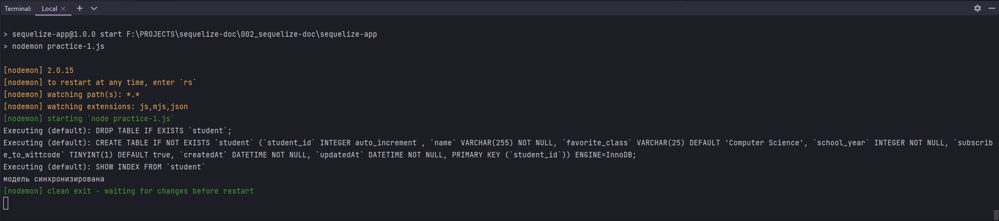
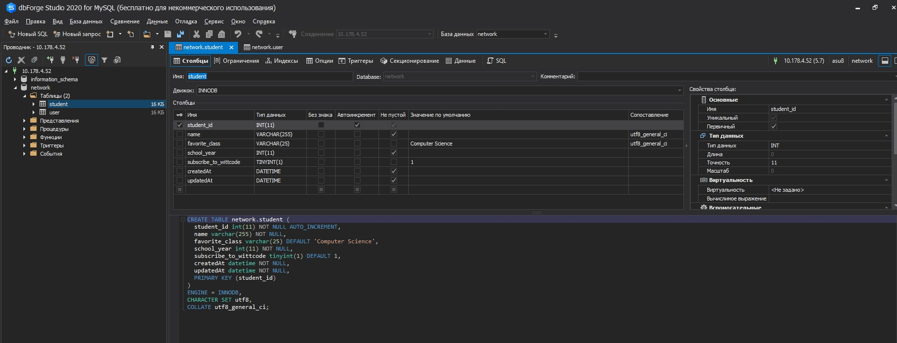
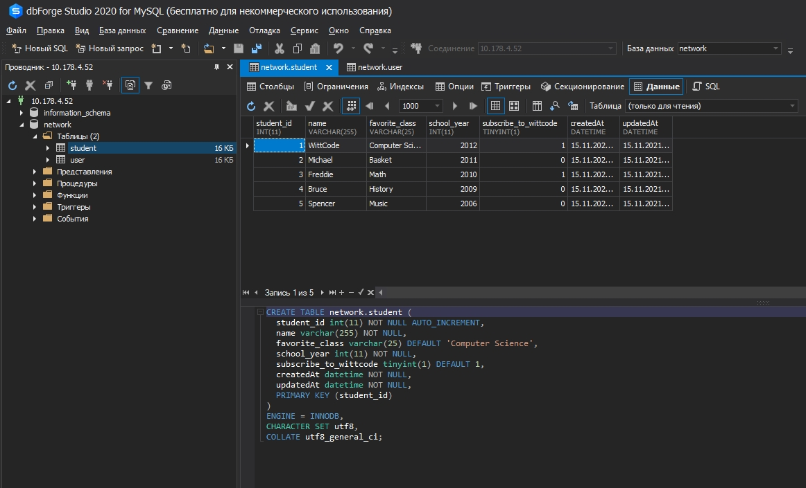
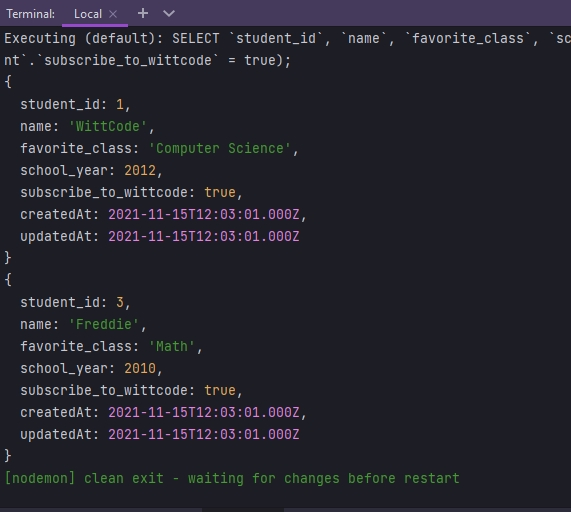
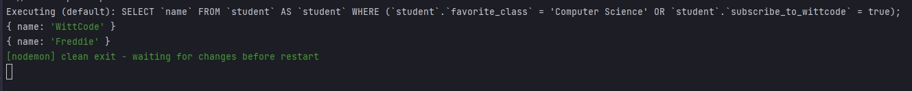
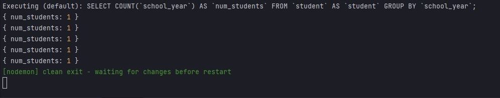
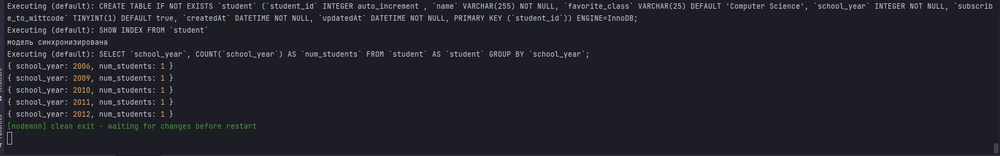

# 005_test_your_knowledge

* [Creating_the_Student_Table](#Creating_the_Student_Table)
* [Bulk_Creating_Users](#Bulk_Creating_Users)
* [Querying_the_Students_Table](#Querying_the_Students_Table)


# Creating_the_Student_Table

```js
const Sequelize = require("sequelize");
const { DataTypes } = Sequelize;

const sequelize = new Sequelize("network", "asu8", "123", {
  host: "10.178.4.52",
  dialect: "mysql",
}); // создаю экземпляр класса

const Student = sequelize.define(
  "student",
  {
    student_id: {
      type: DataTypes.INTEGER,
      autoIncrement: true,
      primaryKey: true,
    },
    name: {
      type: DataTypes.STRING,
      allowNull: false,
      validate: {
        len: [4, 20],
      },
    },
    favorite_class: {
      type: DataTypes.STRING(25), // в данной строке может быть не более 25 символов
      defaultValue: "Computer Science",
    },
    school_year: {
      type: DataTypes.INTEGER,
      allowNull: false,
    },
    subscribe_to_wittcode: {
      type: DataTypes.BOOLEAN,
      defaultValue: true,
    },
  },
  {
    freezeTableName: true,
  }
);

Student.sync({ force: true })
  .then(() => {
    console.log(`модель синхронизирована`);
  })
  .catch((error) => {
    console.log(`синхронизация модели с таблицей не произошло ${error}`);
  });

```






# Bulk_Creating_Users

Сейчас массово создам нескольких пользователей.

```js
const Sequelize = require("sequelize");
const { DataTypes } = Sequelize;

const sequelize = new Sequelize("network", "asu8", "123", {
  host: "10.178.4.52",
  dialect: "mysql",
}); // создаю экземпляр класса

const Student = sequelize.define(
  "student",
  {
    student_id: {
      type: DataTypes.INTEGER,
      autoIncrement: true,
      primaryKey: true,
    },
    name: {
      type: DataTypes.STRING,
      allowNull: false,
      validate: {
        len: [4, 20],
      },
    },
    favorite_class: {
      type: DataTypes.STRING(25), // в данной строке может быть не более 25 символов
      defaultValue: "Computer Science",
    },
    school_year: {
      type: DataTypes.INTEGER,
      allowNull: false,
    },
    subscribe_to_wittcode: {
      type: DataTypes.BOOLEAN,
      defaultValue: true,
    },
  },
  {
    freezeTableName: true,
  }
);

Student.sync({ force: true })
  .then(() => {
    console.log(`модель синхронизирована`);
    /*Массово создаю студентов*/
    Student.bulkCreate(
      [
        {
          name: "WittCode",
          school_year: 2012,
        },
        {
          name: "Michael",
          school_year: 2011,
          favorite_class: "Basket",
          subscribe_to_wittcode: false,
        },
        {
          name: "Freddie",
          school_year: 2010,
          favorite_class: "Math",
          subscribe_to_wittcode: true,
        },
        {
          name: "Bruce",
          school_year: 2009,
          favorite_class: "History",
          subscribe_to_wittcode: false,
        },
        {
          name: "Spencer",
          school_year: 2006,
          favorite_class: "Music",
          subscribe_to_wittcode: false,
        },
      ],
      { validate: true } // Так как при массовом создании валидация не работает указываю явно
    );
  })
  .catch((error) => {
    console.log(`синхронизация модели с таблицей не произошло ${error}`);
  });

```



<br/>
<br/>
<br/>
<br/>

# Querying_the_Students_Table

```js
const Sequelize = require("sequelize");
const { DataTypes, Op } = Sequelize;

const sequelize = new Sequelize("network", "asu8", "123", {
    host: "10.178.4.52",
    dialect: "mysql",
}); // создаю экземпляр класса

const Student = sequelize.define(
    "student",
    {
        student_id: {
            type: DataTypes.INTEGER,
            autoIncrement: true,
            primaryKey: true,
        },
        name: {
            type: DataTypes.STRING,
            allowNull: false,
            validate: {
                len: [4, 20],
            },
        },
        favorite_class: {
            type: DataTypes.STRING(25), // в данной строке может быть не более 25 символов
            defaultValue: "Computer Science",
        },
        school_year: {
            type: DataTypes.INTEGER,
            allowNull: false,
        },
        subscribe_to_wittcode: {
            type: DataTypes.BOOLEAN,
            defaultValue: true,
        },
    },
    {
        freezeTableName: true,
    }
);

Student.sync()
    .then(() => {
        console.log(`модель синхронизирована`);
        //Запоросы
        return Student.findAll({
            where: {
                [Op.or]: {
                    favorite_class: "Computer Science",
                    subscribe_to_wittcode: true,
                },
            },
        });
    })
    .then((data) => {
        data.forEach((element) => {
            console.log(element.toJSON());
        });
    })
    .catch((error) => {
        console.log(`синхронизация модели с таблицей не произошло ${error}`);
    });

```



К примеру как и раньше мне нужен весь объект полность. В **attribute** я могу конкретно указать какая строка из таблицы мне нужна 

```js
const Sequelize = require("sequelize");
const { DataTypes, Op } = Sequelize;

const sequelize = new Sequelize("network", "asu8", "123", {
  host: "10.178.4.52",
  dialect: "mysql",
}); // создаю экземпляр класса

const Student = sequelize.define(
  "student",
  {
    student_id: {
      type: DataTypes.INTEGER,
      autoIncrement: true,
      primaryKey: true,
    },
    name: {
      type: DataTypes.STRING,
      allowNull: false,
      validate: {
        len: [4, 20],
      },
    },
    favorite_class: {
      type: DataTypes.STRING(25), // в данной строке может быть не более 25 символов
      defaultValue: "Computer Science",
    },
    school_year: {
      type: DataTypes.INTEGER,
      allowNull: false,
    },
    subscribe_to_wittcode: {
      type: DataTypes.BOOLEAN,
      defaultValue: true,
    },
  },
  {
    freezeTableName: true,
  }
);

Student.sync()
  .then(() => {
    console.log(`модель синхронизирована`);
    //Запоросы
    return Student.findAll({
      attributes: ["name"],
      where: {
        [Op.or]: {
          favorite_class: "Computer Science",
          subscribe_to_wittcode: true,
        },
      },
    });
  })
  .then((data) => {
    data.forEach((element) => {
      console.log(element.toJSON());
    });
  })
  .catch((error) => {
    console.log(`синхронизация модели с таблицей не произошло ${error}`);
  });

```

И вот нам возвращаются только имена



И теперь я хочу подсчитать общее количество учеников и присвоить псевдоним **students**. Я хочу получить количество учеников в каждом учебном году

```js
const Sequelize = require("sequelize");
const { DataTypes, Op } = Sequelize;

const sequelize = new Sequelize("network", "asu8", "123", {
  host: "10.178.4.52",
  dialect: "mysql",
}); // создаю экземпляр класса

const Student = sequelize.define(
  "student",
  {
    student_id: {
      type: DataTypes.INTEGER,
      autoIncrement: true,
      primaryKey: true,
    },
    name: {
      type: DataTypes.STRING,
      allowNull: false,
      validate: {
        len: [4, 20],
      },
    },
    favorite_class: {
      type: DataTypes.STRING(25), // в данной строке может быть не более 25 символов
      defaultValue: "Computer Science",
    },
    school_year: {
      type: DataTypes.INTEGER,
      allowNull: false,
    },
    subscribe_to_wittcode: {
      type: DataTypes.BOOLEAN,
      defaultValue: true,
    },
  },
  {
    freezeTableName: true,
  }
);

Student.sync()
  .then(() => {
    console.log(`модель синхронизирована`);
    //Запоросы
    return Student.findAll({
      attributes: [
        [sequelize.fn("COUNT", sequelize.col("school_year")), "num_students"], // Подсчитываю количество студентов по колонке school_year задаю псувдоним num_students
      ],
      group: "school_year", // Гуппирую студентов по school_year
    });
  })
  .then((data) => {
    data.forEach((element) => {
      console.log(element.toJSON());
    });
  })
  .catch((error) => {
    console.log(`синхронизация модели с таблицей не произошло ${error}`);
  });

```



И вот у меня по однуму студенту на каждый год выпуска. Для наглядности выведу года. Добавляю в **attributes** **school_year**

```js
const Sequelize = require("sequelize");
const { DataTypes, Op } = Sequelize;

const sequelize = new Sequelize("network", "asu8", "123", {
  host: "10.178.4.52",
  dialect: "mysql",
}); // создаю экземпляр класса

const Student = sequelize.define(
  "student",
  {
    student_id: {
      type: DataTypes.INTEGER,
      autoIncrement: true,
      primaryKey: true,
    },
    name: {
      type: DataTypes.STRING,
      allowNull: false,
      validate: {
        len: [4, 20],
      },
    },
    favorite_class: {
      type: DataTypes.STRING(25), // в данной строке может быть не более 25 символов
      defaultValue: "Computer Science",
    },
    school_year: {
      type: DataTypes.INTEGER,
      allowNull: false,
    },
    subscribe_to_wittcode: {
      type: DataTypes.BOOLEAN,
      defaultValue: true,
    },
  },
  {
    freezeTableName: true,
  }
);

Student.sync()
  .then(() => {
    console.log(`модель синхронизирована`);
    //Запоросы
    return Student.findAll({
      attributes: [
        "school_year",
        [sequelize.fn("COUNT", sequelize.col("school_year")), "num_students"], // Подсчитываю количество студентов по колонке school_year задаю псувдоним num_students
      ],
      group: "school_year", // Гуппирую студентов по school_year
    });
  })
  .then((data) => {
    data.forEach((element) => {
      console.log(element.toJSON());
    });
  })
  .catch((error) => {
    console.log(`синхронизация модели с таблицей не произошло ${error}`);
  });

```



