# 008_validators_and_constraints

Поговорим об ограничениях и валидаторах.

* [Constraints](#Constraints)
* [Validators](#Validators)
* [Validating_Objects_with_Validate](#Validating_Objects_with_Validate)
* [Creating_Custom_Validator_Functions](#Creating_Custom_Validator_Functions)
* [Customizing_Built_in_Validators](#Customizing_Built_in_Validators)
* [Customizing_Validator_Error_Messages](#Customizing_Validator_Error_Messages)
* [Validators_and_Null_Values](#Validators_and_Null_Values)
* [Model_Wide_Validation](#Model_Wide_Validation)


<br/>
<br/>
<br/>
<br/>

# Constraints

**Ограничения** - это правила, определенные на уровне **sql**. На самом деле даже просто определение типа данных это ограничение, так как тип данных это правило которое гласит что это столбец должен быть целым числом. Или это должна быть строка. По этому здесь ограничение говорит для описания, что это должна быть строка. 

Однако есть более сложные ограничения. Например уникальное ограничение. Уникальное ограничение гарантирует что все значения в столбце или группе столбцов будут разными. Например если у вас есть столбец адресов электронной почты. Вы можете захотеть что бы каждый адрес электронной почты в этом столбце должен быть уникальным. Или например вы не хотите проверять адреса электронной почты


Если ограничение не выполняется БД выдает ошибку и **sequelize** перенаправит эту ошибку в **JS**. 

Я собираюсь создать новое поле в нашей БД. Это будет **email**.

```js
const Sequelize = require("sequelize");
const { DataTypes, Op } = Sequelize;
const bcrypt = require("bcrypt");
const zlib = require("zlib");

// DB=network
// USER=asu8
// PASSWORD=123
// DIALECT=mysql
// HOST=10.178.4.52

const sequelize = new Sequelize("network", "asu8", "123", {
  host: "10.178.4.52",
  dialect: "mysql",
}); // создаю экземпляр класса

sequelize.sync({ alter: true }); //Будет синхронизировать каждую таблицу по отдельности не пересобирая все таблицы

const User = sequelize.define(
  "user",
  {
    user_id: {
      type: DataTypes.INTEGER,
      primaryKey: true, // Первичный ключ
      autoIncrement: true, //Автоматическое приращение
    },
    username: {
      type: DataTypes.STRING,
      allowNull: false,
      get() {
        const rawValue = this.getDataValue("username"); //Получаю не обработанное значение от текущего пользователя
        return rawValue.toUpperCase();
      },
    },
    password: {
      type: DataTypes.STRING,
      set(value) {
        const salt = bcrypt.genSaltSync(12);
        const hash = bcrypt.hashSync(value, salt); // мфдгу переданное значение salt захэшированный пароль
        this.setDataValue("password", hash);
      },
    },
    age: {
      type: DataTypes.INTEGER,
      defaultValue: 21,
    },
    description: {
      type: DataTypes.STRING,
      set(value) {
        const compressed = zlib.deflateSync(value).toString("base64");
        this.setDataValue("description", compressed);
      },
      get() {
        const value = this.getDataValue("description");
        const uncompressed = zlib.inflateSync(Buffer.from(value, "base64")); //расспаковываю
        return uncompressed.toString(); // привожу buffer object к строке
      },
    },
    aboutUser: {
      type: DataTypes.VIRTUAL,
      get() {
        return `${this.username} ${this.description}`;
      },
    },
    email: {
      type: DataTypes.STRING,
      unique: true, // ограничение, поле email является уникальным.
    },
  },

  {
    freezeTableName: true, // указываю что бы имя нашей модели совпадало с именем нашей таблицы
  }
); // Определяю модель пользователей
User.sync({ alter: true })
  .then(() => {
    return User.findOne({ where: { username: "Константин" } });
  })
  .then((data) => {
    console.log(data.aboutUser);
  })
  .catch((error) => {
    console.log(error);
  });

```

**unique: true**, - это означает что в столбце не может быть повторений. Создаю пользователя.

```js
const Sequelize = require("sequelize");
const { DataTypes, Op } = Sequelize;
const bcrypt = require("bcrypt");
const zlib = require("zlib");

// DB=network
// USER=asu8
// PASSWORD=123
// DIALECT=mysql
// HOST=10.178.4.52

const sequelize = new Sequelize("network", "asu8", "123", {
  host: "10.178.4.52",
  dialect: "mysql",
}); // создаю экземпляр класса

sequelize.sync({ alter: true }); //Будет синхронизировать каждую таблицу по отдельности не пересобирая все таблицы

const User = sequelize.define(
  "user",
  {
    user_id: {
      type: DataTypes.INTEGER,
      primaryKey: true, // Первичный ключ
      autoIncrement: true, //Автоматическое приращение
    },
    username: {
      type: DataTypes.STRING,
      allowNull: false,
      get() {
        const rawValue = this.getDataValue("username"); //Получаю не обработанное значение от текущего пользователя
        return rawValue.toUpperCase();
      },
    },
    password: {
      type: DataTypes.STRING,
      // set(value) {
      //   const salt = bcrypt.genSaltSync(12);
      //   const hash = bcrypt.hashSync(value, salt); // мфдгу переданное значение salt захэшированный пароль
      //   this.setDataValue("password", hash);
      // },
    },
    age: {
      type: DataTypes.INTEGER,
      defaultValue: 21,
    },
    description: {
      type: DataTypes.STRING,
      // set(value) {
      //   const compressed = zlib.deflateSync(value).toString("base64");
      //   this.setDataValue("description", compressed);
      // },
      // get() {
      //   const value = this.getDataValue("description");
      //   const uncompressed = zlib.inflateSync(Buffer.from(value, "base64")); //расспаковываю
      //   return uncompressed.toString(); // привожу buffer object к строке
      // },
    },
    aboutUser: {
      type: DataTypes.VIRTUAL,
      get() {
        return `${this.username} ${this.description}`;
      },
    },
    email: {
      type: DataTypes.STRING,
      unique: true, // ограничение, поле email является уникальным.
    },
  },

  {
    freezeTableName: true, // указываю что бы имя нашей модели совпадало с именем нашей таблицы
  }
); // Определяю модель пользователей
User.sync({ alter: true })
  .then(() => {
    return User.create({
      username: "Арина",
      password: "12312312",
      email: "arina@gmail.com",
    });
  })
  .then((data) => {
    console.log(data.toJSON());
  })
  .catch((error) => {
    console.log(error);
  });

```

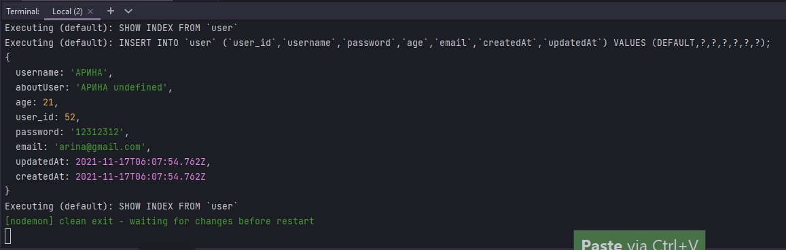

И теперь пробую создать этого пользователя еще раз.

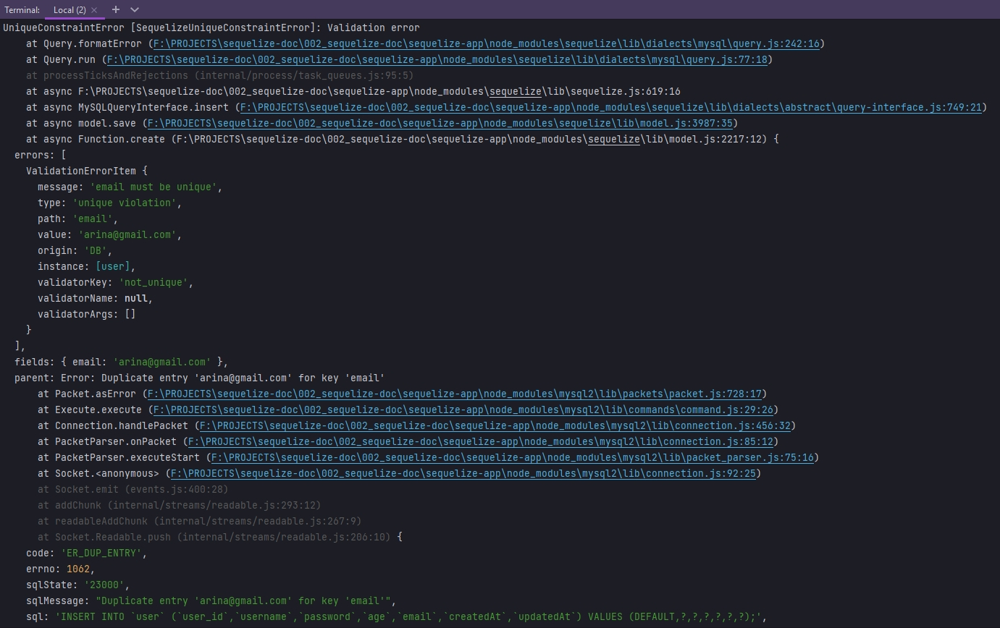

Мы получаем сообщение об ошибке которое исходит из нашего сообщения **catch**.

Кароче ограничения рассматривает только на уникальности и все.


<br/>
<br/>
<br/>

# Validators


**Validators** выполняют проверки, выполняемые **sequelize** c использованием **javascript**. И если проверка не удалась В БД вообще не будет отправлен запрос **sql**. И эти проверки могут быть очень сложными. Например если вы хотите предоставить настраиваемю функцию проверки или регулярного выражения. Или они могут быть одни из встроенных валидаторов **sequelize**. Например **sequelize** имеет встроенные валидаторы, такие как проверка ввода, это электронная почта, **URL-адресс**, **IP-адресс** и многое другое.

Что бы на самом деле использовать валидатор, мы указываем ключ проверки в нашем определении столбца. К примеру как мы делали валидацию в username

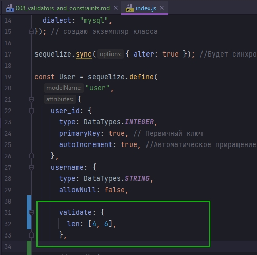

Здесь мы выполняем проверку на длинну в имени пользователя.

Давайте создадим валидатор для нашего столбца электронной почты. Потому что  **sequelize** имеет некоторые встроенные функции. Делаю проверку на то что к нам приходит является ли электронной почтой. 

```js
const Sequelize = require("sequelize");
const { DataTypes, Op } = Sequelize;
const bcrypt = require("bcrypt");
const zlib = require("zlib");

// DB=network
// USER=asu8
// PASSWORD=123
// DIALECT=mysql
// HOST=10.178.4.52

const sequelize = new Sequelize("network", "asu8", "123", {
    host: "10.178.4.52",
    dialect: "mysql",
}); // создаю экземпляр класса

sequelize.sync({ alter: true }); //Будет синхронизировать каждую таблицу по отдельности не пересобирая все таблицы

const User = sequelize.define(
    "user",
    {
        user_id: {
            type: DataTypes.INTEGER,
            primaryKey: true, // Первичный ключ
            autoIncrement: true, //Автоматическое приращение
        },
        username: {
            type: DataTypes.STRING,
            allowNull: false,

            validate: {
                len: [4, 6],
            },

            // get() {
            //   const rawValue = this.getDataValue("username"); //Получаю не обработанное значение от текущего пользователя
            //   return rawValue.toUpperCase();
            // },
        },
        password: {
            type: DataTypes.STRING,
            // set(value) {
            //   const salt = bcrypt.genSaltSync(12);
            //   const hash = bcrypt.hashSync(value, salt); // мфдгу переданное значение salt захэшированный пароль
            //   this.setDataValue("password", hash);
            // },
        },
        age: {
            type: DataTypes.INTEGER,
            defaultValue: 21,
        },
        description: {
            type: DataTypes.STRING,
            // set(value) {
            //   const compressed = zlib.deflateSync(value).toString("base64");
            //   this.setDataValue("description", compressed);
            // },
            // get() {
            //   const value = this.getDataValue("description");
            //   const uncompressed = zlib.inflateSync(Buffer.from(value, "base64")); //расспаковываю
            //   return uncompressed.toString(); // привожу buffer object к строке
            // },
        },
        aboutUser: {
            type: DataTypes.VIRTUAL,
            get() {
                return `${this.username} ${this.description}`;
            },
        },
        email: {
            type: DataTypes.STRING,
            unique: true, // ограничение, поле email является уникальным.
            validate: {
                isEmail: true, //Проверка электронного адреса на корректность
            },
        },
    },

    {
        freezeTableName: true, // указываю что бы имя нашей модели совпадало с именем нашей таблицы
    }
); // Определяю модель пользователей
User.sync({ alter: true })
    .then(() => {
        return User.create({
            username: "Арина",
            password: "12312312",
            email: "arinagmail.com",
        });
    })
    .then((data) => {
        console.log(data.toJSON());
    })
    .catch((error) => {
        console.log(error);
    });

```

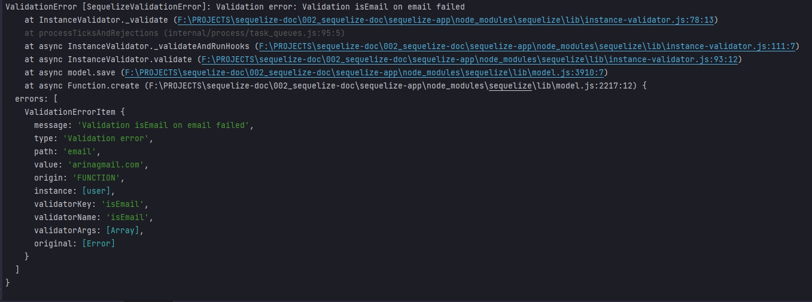


<br/>
<br/>
<br/>

# Validating_Objects_with_Validate

Мы можем провести еще проверку еще д проверки **email**. И проверить существует ли такой пользователь. Данную проверку мы можем использовать при создании пользователя. Для этого перед созданием пользователя создаю переменную **const user**. В значении вызываю модель **User**, у модели вызываю метод сборки **build()** который на самом деле ничего не вставляет в нашу БД и он не является асинхронным. Он просто возвращает объект. Скажем что мы отправляем электронное письмо **{email: "arina@gmail.com"}**. После чего возвращаю переменную **user** у которой вызываю метод **validate()**

```js
const Sequelize = require("sequelize");
const { DataTypes, Op } = Sequelize;
const bcrypt = require("bcrypt");
const zlib = require("zlib");

// DB=network
// USER=asu8
// PASSWORD=123
// DIALECT=mysql
// HOST=10.178.4.52

const sequelize = new Sequelize("network", "asu8", "123", {
  host: "10.178.4.52",
  dialect: "mysql",
}); // создаю экземпляр класса

sequelize.sync({ alter: true }); //Будет синхронизировать каждую таблицу по отдельности не пересобирая все таблицы

const User = sequelize.define(
  "user",
  {
    user_id: {
      type: DataTypes.INTEGER,
      primaryKey: true, // Первичный ключ
      autoIncrement: true, //Автоматическое приращение
    },
    username: {
      type: DataTypes.STRING,
      allowNull: false,

      validate: {
        len: [4, 6],
      },

      // get() {
      //   const rawValue = this.getDataValue("username"); //Получаю не обработанное значение от текущего пользователя
      //   return rawValue.toUpperCase();
      // },
    },
    password: {
      type: DataTypes.STRING,
      // set(value) {
      //   const salt = bcrypt.genSaltSync(12);
      //   const hash = bcrypt.hashSync(value, salt); // мфдгу переданное значение salt захэшированный пароль
      //   this.setDataValue("password", hash);
      // },
    },
    age: {
      type: DataTypes.INTEGER,
      defaultValue: 21,
    },
    description: {
      type: DataTypes.STRING,
      // set(value) {
      //   const compressed = zlib.deflateSync(value).toString("base64");
      //   this.setDataValue("description", compressed);
      // },
      // get() {
      //   const value = this.getDataValue("description");
      //   const uncompressed = zlib.inflateSync(Buffer.from(value, "base64")); //расспаковываю
      //   return uncompressed.toString(); // привожу buffer object к строке
      // },
    },
    aboutUser: {
      type: DataTypes.VIRTUAL,
      get() {
        return `${this.username} ${this.description}`;
      },
    },
    email: {
      type: DataTypes.STRING,
      unique: true, // ограничение, поле email является уникальным.
      validate: {
        isEmail: true, //Проверка электронного адреса на корректность
      },
    },
  },

  {
    freezeTableName: true, // указываю что бы имя нашей модели совпадало с именем нашей таблицы
  }
); // Определяю модель пользователей
User.sync({ alter: true })
  .then(() => {
    const user = User.build({ email: "arina@gmail.com" });
    return user.validate();
  })
  .then((data) => {
    console.log(data);
  })
  .catch((error) => {
    console.log(error);
  });

```

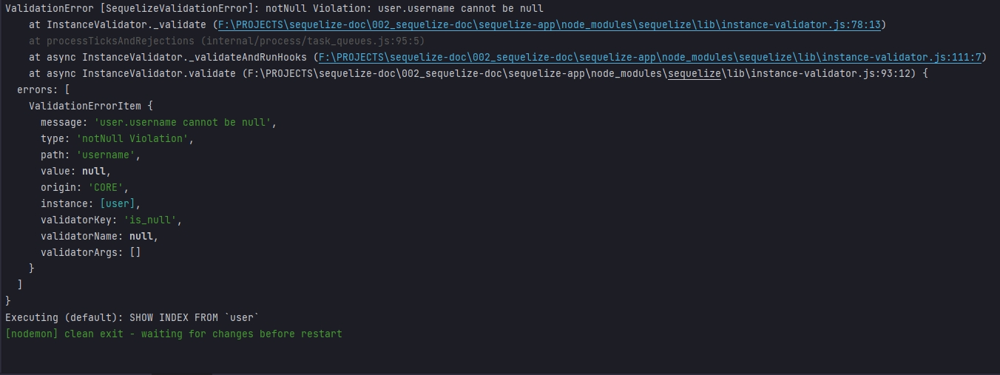

<br/>
<br/>
<br/>
<br/>

# Creating_Custom_Validator_Functions

Мы можем создать наши собственные пользовательские функции проверки. Создадим такую функцию в нашем столбце **age**. Создаю поле **validate:{}**. Сделаем проверку является ли пользоватьель 21 летним или старше. И если его возраст меньше 21 мы не будем давать ему возможность зарегистрироваться. Создаю функцию **isOldEnough(value) {}**, value это отловоенный возраст. Затем в функции пишу условие если **value > 21** тогда мы выдаем ошибку.

```js
const Sequelize = require("sequelize");
const { DataTypes, Op } = Sequelize;
const bcrypt = require("bcrypt");
const zlib = require("zlib");

// DB=network
// USER=asu8
// PASSWORD=123
// DIALECT=mysql
// HOST=10.178.4.52

const sequelize = new Sequelize("network", "asu8", "123", {
    host: "10.178.4.52",
    dialect: "mysql",
}); // создаю экземпляр класса

sequelize.sync({ alter: true }); //Будет синхронизировать каждую таблицу по отдельности не пересобирая все таблицы

const User = sequelize.define(
    "user",
    {
        user_id: {
            type: DataTypes.INTEGER,
            primaryKey: true, // Первичный ключ
            autoIncrement: true, //Автоматическое приращение
        },
        username: {
            type: DataTypes.STRING,
            allowNull: false,

            validate: {
                len: [4, 6],
            },

            // get() {
            //   const rawValue = this.getDataValue("username"); //Получаю не обработанное значение от текущего пользователя
            //   return rawValue.toUpperCase();
            // },
        },
        password: {
            type: DataTypes.STRING,
            // set(value) {
            //   const salt = bcrypt.genSaltSync(12);
            //   const hash = bcrypt.hashSync(value, salt); // мфдгу переданное значение salt захэшированный пароль
            //   this.setDataValue("password", hash);
            // },
        },
        age: {
            type: DataTypes.INTEGER,
            defaultValue: 21,
            validate: {
                isOldEnough(value) {
                    if (value < 21) {
                        throw new Error(`Too young!!!`);
                    }
                },
            },
        },
        description: {
            type: DataTypes.STRING,
            // set(value) {
            //   const compressed = zlib.deflateSync(value).toString("base64");
            //   this.setDataValue("description", compressed);
            // },
            // get() {
            //   const value = this.getDataValue("description");
            //   const uncompressed = zlib.inflateSync(Buffer.from(value, "base64")); //расспаковываю
            //   return uncompressed.toString(); // привожу buffer object к строке
            // },
        },
        aboutUser: {
            type: DataTypes.VIRTUAL,
            get() {
                return `${this.username} ${this.description}`;
            },
        },
        email: {
            type: DataTypes.STRING,
            unique: true, // ограничение, поле email является уникальным.
            validate: {
                isEmail: true, //Проверка электронного адреса на корректность
            },
        },
    },

    {
        freezeTableName: true, // указываю что бы имя нашей модели совпадало с именем нашей таблицы
    }
); // Определяю модель пользователей
User.sync({ alter: true })
    .then(() => {
        return User.create({
            username: "Никита",
            age: 10,
        });
    })
    .then((data) => {
        console.log(data);
    })
    .catch((error) => {
        console.log(error);
    });

```

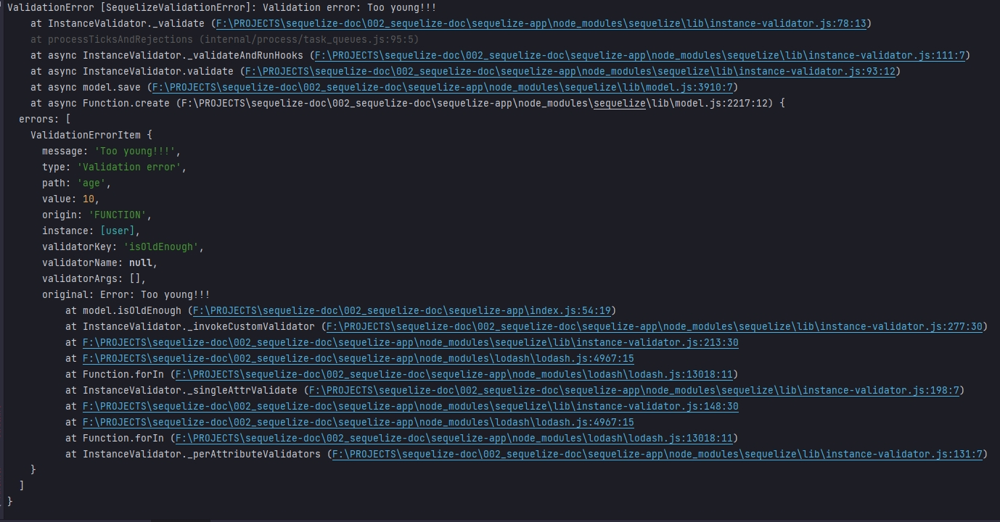


<br/>
<br/>
<br/>

# Customizing_Built_in_Validators

Настройка встроенных валидаторов

Вместо функции давайте использовать тот, который вызывается, в котором проверяется находится ли значение в одном из предоставленных значений.

В поле **email** удаляю **isEmail: true**. Создаю поле **isIn:['me@soccer.org', 'me@soccer.com']**. Все что будет пытаться вставиться в нас столбец, будет проверяться. Если предоставленное значение находится в этом массиве и если это не так, он выдаст ошибку. Поэтому давайте сначало вставим один из них 

```js
const Sequelize = require("sequelize");
const { DataTypes, Op } = Sequelize;
const bcrypt = require("bcrypt");
const zlib = require("zlib");

// DB=network
// USER=asu8
// PASSWORD=123
// DIALECT=mysql
// HOST=10.178.4.52

const sequelize = new Sequelize("network", "asu8", "123", {
  host: "10.178.4.52",
  dialect: "mysql",
}); // создаю экземпляр класса

sequelize.sync({ alter: true }); //Будет синхронизировать каждую таблицу по отдельности не пересобирая все таблицы

const User = sequelize.define(
  "user",
  {
    user_id: {
      type: DataTypes.INTEGER,
      primaryKey: true, // Первичный ключ
      autoIncrement: true, //Автоматическое приращение
    },
    username: {
      type: DataTypes.STRING,
      allowNull: false,

      validate: {
        len: [4, 6],
      },

      // get() {
      //   const rawValue = this.getDataValue("username"); //Получаю не обработанное значение от текущего пользователя
      //   return rawValue.toUpperCase();
      // },
    },
    password: {
      type: DataTypes.STRING,
      // set(value) {
      //   const salt = bcrypt.genSaltSync(12);
      //   const hash = bcrypt.hashSync(value, salt); // мфдгу переданное значение salt захэшированный пароль
      //   this.setDataValue("password", hash);
      // },
    },
    age: {
      type: DataTypes.INTEGER,
      defaultValue: 21,
      validate: {
        isOldEnough(value) {
          if (value < 21) {
            throw new Error(`Too young!!!`);
          }
        },
      },
    },
    description: {
      type: DataTypes.STRING,
      // set(value) {
      //   const compressed = zlib.deflateSync(value).toString("base64");
      //   this.setDataValue("description", compressed);
      // },
      // get() {
      //   const value = this.getDataValue("description");
      //   const uncompressed = zlib.inflateSync(Buffer.from(value, "base64")); //расспаковываю
      //   return uncompressed.toString(); // привожу buffer object к строке
      // },
    },
    aboutUser: {
      type: DataTypes.VIRTUAL,
      get() {
        return `${this.username} ${this.description}`;
      },
    },
    email: {
      type: DataTypes.STRING,
      unique: true, // ограничение, поле email является уникальным.
        validate: {
            isIn: ["me@soccer.org", "me@soccer.com"],
        },
    },
  },

  {
    freezeTableName: true, // указываю что бы имя нашей модели совпадало с именем нашей таблицы
  }
); // Определяю модель пользователей
User.sync({ alter: true })
  .then(() => {
    return User.create({
      username: "Никита",
      age: 31,
      email: "me@soccer.org",
    });
  })
  .then((data) => {
    console.log(data);
  })
  .catch((error) => {
    console.log(error);
  });

```


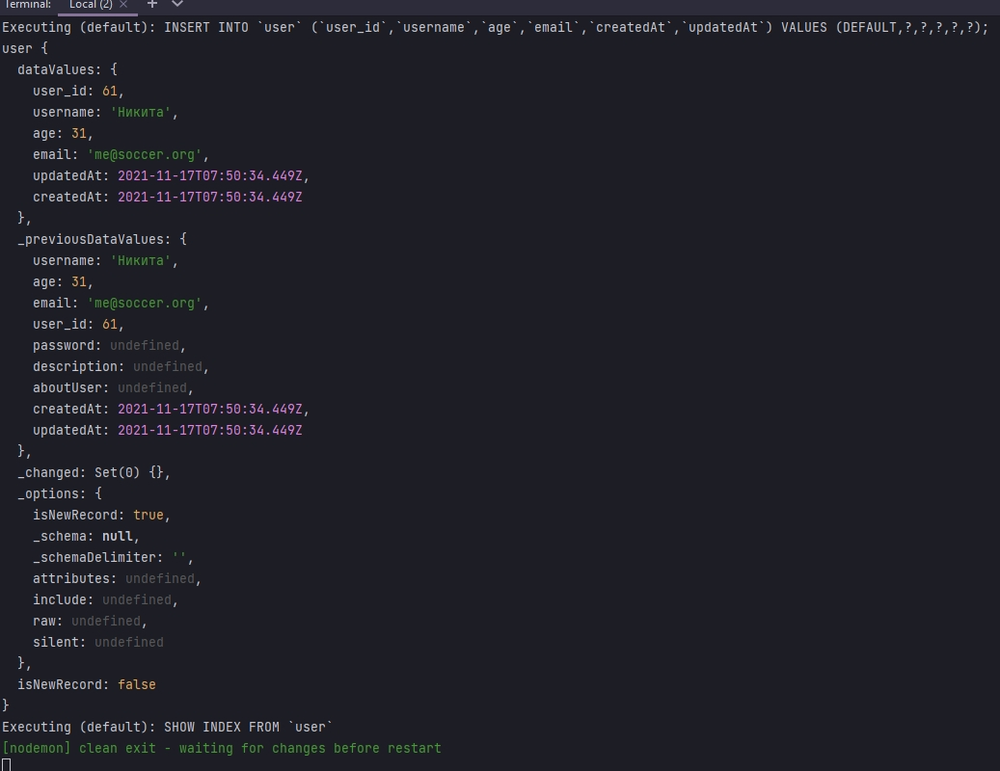

А теперь вернусь и создам адрес электронной почты который не совпадет с нашим валидатором

```js
const Sequelize = require("sequelize");
const { DataTypes, Op } = Sequelize;
const bcrypt = require("bcrypt");
const zlib = require("zlib");

// DB=network
// USER=asu8
// PASSWORD=123
// DIALECT=mysql
// HOST=10.178.4.52

const sequelize = new Sequelize("network", "asu8", "123", {
    host: "10.178.4.52",
    dialect: "mysql",
}); // создаю экземпляр класса

sequelize.sync({ alter: true }); //Будет синхронизировать каждую таблицу по отдельности не пересобирая все таблицы

const User = sequelize.define(
    "user",
    {
        user_id: {
            type: DataTypes.INTEGER,
            primaryKey: true, // Первичный ключ
            autoIncrement: true, //Автоматическое приращение
        },
        username: {
            type: DataTypes.STRING,
            allowNull: false,

            validate: {
                len: [4, 6],
            },

            // get() {
            //   const rawValue = this.getDataValue("username"); //Получаю не обработанное значение от текущего пользователя
            //   return rawValue.toUpperCase();
            // },
        },
        password: {
            type: DataTypes.STRING,
            // set(value) {
            //   const salt = bcrypt.genSaltSync(12);
            //   const hash = bcrypt.hashSync(value, salt); // мфдгу переданное значение salt захэшированный пароль
            //   this.setDataValue("password", hash);
            // },
        },
        age: {
            type: DataTypes.INTEGER,
            defaultValue: 21,
            validate: {
                isOldEnough(value) {
                    if (value < 21) {
                        throw new Error(`Too young!!!`);
                    }
                },
            },
        },
        description: {
            type: DataTypes.STRING,
            // set(value) {
            //   const compressed = zlib.deflateSync(value).toString("base64");
            //   this.setDataValue("description", compressed);
            // },
            // get() {
            //   const value = this.getDataValue("description");
            //   const uncompressed = zlib.inflateSync(Buffer.from(value, "base64")); //расспаковываю
            //   return uncompressed.toString(); // привожу buffer object к строке
            // },
        },
        aboutUser: {
            type: DataTypes.VIRTUAL,
            get() {
                return `${this.username} ${this.description}`;
            },
        },
        email: {
            type: DataTypes.STRING,
            unique: true, // ограничение, поле email является уникальным.
            validate: {
                isIn: ["me@soccer.org", "me@soccer.com"],
            },
        },
    },

    {
        freezeTableName: true, // указываю что бы имя нашей модели совпадало с именем нашей таблицы
    }
); // Определяю модель пользователей
User.sync({ alter: true })
    .then(() => {
        return User.create({
            username: "Никита",
            age: 31,
            email: "mewww@soccereeee.org",
        });
    })
    .then((data) => {
        console.log(data);
    })
    .catch((error) => {
        console.log(error);
    });

```

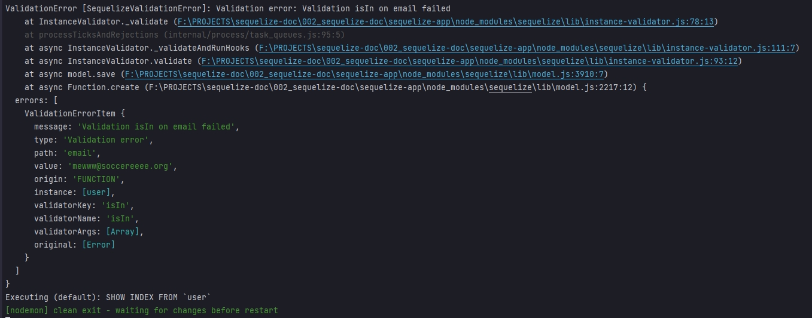


# Customizing_Validator_Error_Messages

Настройка Сообщений Об Ошибках Средства Проверки

Мы можем создать собственное сообщение. Делаю еще одну проверку **age**. В **validate** использую валидатор **isNumeric**.  В нем если я хочу настроить сообщение об ошибке указываю ключ **msg:** вы должны ввести число для возраста. При создании пользователя возраст отправляю строкой.

```js
const Sequelize = require("sequelize");
const { DataTypes, Op } = Sequelize;
const bcrypt = require("bcrypt");
const zlib = require("zlib");

// DB=network
// USER=asu8
// PASSWORD=123
// DIALECT=mysql
// HOST=10.178.4.52

const sequelize = new Sequelize("network", "asu8", "123", {
    host: "10.178.4.52",
    dialect: "mysql",
}); // создаю экземпляр класса

sequelize.sync({ alter: true }); //Будет синхронизировать каждую таблицу по отдельности не пересобирая все таблицы

const User = sequelize.define(
    "user",
    {
        user_id: {
            type: DataTypes.INTEGER,
            primaryKey: true, // Первичный ключ
            autoIncrement: true, //Автоматическое приращение
        },
        username: {
            type: DataTypes.STRING,
            allowNull: false,

            validate: {
                len: [4, 6],
            },

            // get() {
            //   const rawValue = this.getDataValue("username"); //Получаю не обработанное значение от текущего пользователя
            //   return rawValue.toUpperCase();
            // },
        },
        password: {
            type: DataTypes.STRING,
            // set(value) {
            //   const salt = bcrypt.genSaltSync(12);
            //   const hash = bcrypt.hashSync(value, salt); // мфдгу переданное значение salt захэшированный пароль
            //   this.setDataValue("password", hash);
            // },
        },
        age: {
            type: DataTypes.INTEGER,
            defaultValue: 21,
            validate: {
                isNumeric: {
                    msg: "Вы должны ввести число для возраста",
                },
            },
        },
        description: {
            type: DataTypes.STRING,
            // set(value) {
            //   const compressed = zlib.deflateSync(value).toString("base64");
            //   this.setDataValue("description", compressed);
            // },
            // get() {
            //   const value = this.getDataValue("description");
            //   const uncompressed = zlib.inflateSync(Buffer.from(value, "base64")); //расспаковываю
            //   return uncompressed.toString(); // привожу buffer object к строке
            // },
        },
        aboutUser: {
            type: DataTypes.VIRTUAL,
            get() {
                return `${this.username} ${this.description}`;
            },
        },
        email: {
            type: DataTypes.STRING,
            unique: true, // ограничение, поле email является уникальным.
        },
    },

    {
        freezeTableName: true, // указываю что бы имя нашей модели совпадало с именем нашей таблицы
    }
); // Определяю модель пользователей
User.sync({ alter: true })
    .then(() => {
        return User.create({
            username: "Никита",
            age: "31aa",
            email: "nik@gmail.com",
        });
    })
    .then((data) => {
        console.log(data);
    })
    .catch((error) => {
        console.log(error);
    });

```


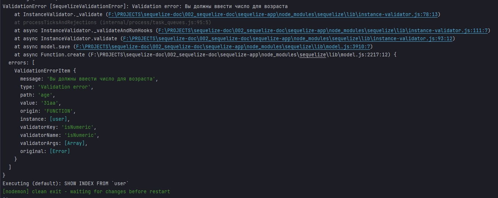

Но если я **isNumeric** установлю в **true** вы снова можете увидеть сообщение.

```js
const Sequelize = require("sequelize");
const { DataTypes, Op } = Sequelize;
const bcrypt = require("bcrypt");
const zlib = require("zlib");

// DB=network
// USER=asu8
// PASSWORD=123
// DIALECT=mysql
// HOST=10.178.4.52

const sequelize = new Sequelize("network", "asu8", "123", {
  host: "10.178.4.52",
  dialect: "mysql",
}); // создаю экземпляр класса

sequelize.sync({ alter: true }); //Будет синхронизировать каждую таблицу по отдельности не пересобирая все таблицы

const User = sequelize.define(
  "user",
  {
    user_id: {
      type: DataTypes.INTEGER,
      primaryKey: true, // Первичный ключ
      autoIncrement: true, //Автоматическое приращение
    },
    username: {
      type: DataTypes.STRING,
      allowNull: false,

      validate: {
        len: [4, 6],
      },

      // get() {
      //   const rawValue = this.getDataValue("username"); //Получаю не обработанное значение от текущего пользователя
      //   return rawValue.toUpperCase();
      // },
    },
    password: {
      type: DataTypes.STRING,
      // set(value) {
      //   const salt = bcrypt.genSaltSync(12);
      //   const hash = bcrypt.hashSync(value, salt); // мфдгу переданное значение salt захэшированный пароль
      //   this.setDataValue("password", hash);
      // },
    },
    age: {
      type: DataTypes.INTEGER,
      defaultValue: 21,
      validate: {
        isNumeric: true,
      },
    },
    description: {
      type: DataTypes.STRING,
      // set(value) {
      //   const compressed = zlib.deflateSync(value).toString("base64");
      //   this.setDataValue("description", compressed);
      // },
      // get() {
      //   const value = this.getDataValue("description");
      //   const uncompressed = zlib.inflateSync(Buffer.from(value, "base64")); //расспаковываю
      //   return uncompressed.toString(); // привожу buffer object к строке
      // },
    },
    aboutUser: {
      type: DataTypes.VIRTUAL,
      get() {
        return `${this.username} ${this.description}`;
      },
    },
    email: {
      type: DataTypes.STRING,
      unique: true, // ограничение, поле email является уникальным.
    },
  },

  {
    freezeTableName: true, // указываю что бы имя нашей модели совпадало с именем нашей таблицы
  }
); // Определяю модель пользователей
User.sync({ alter: true })
  .then(() => {
    return User.create({
      username: "Никита",
      age: "31aa",
      email: "nik@gmail.com",
    });
  })
  .then((data) => {
    console.log(data);
  })
  .catch((error) => {
    console.log(error);
  });

```

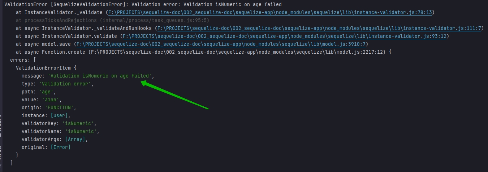

Я получаю стандартное сообщение об ошибке.

Если я хочу использовать кастомизацию на определенный валидатор, то я должен проверяемое значение передать в аргументы **args**. И после **args** я могу указать **msg**. Рассмотрим на примере **email**.

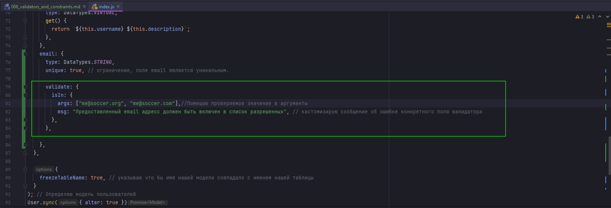

```js
const Sequelize = require("sequelize");
const { DataTypes, Op } = Sequelize;
const bcrypt = require("bcrypt");
const zlib = require("zlib");

// DB=network
// USER=asu8
// PASSWORD=123
// DIALECT=mysql
// HOST=10.178.4.52

const sequelize = new Sequelize("network", "asu8", "123", {
  host: "10.178.4.52",
  dialect: "mysql",
}); // создаю экземпляр класса

sequelize.sync({ alter: true }); //Будет синхронизировать каждую таблицу по отдельности не пересобирая все таблицы

const User = sequelize.define(
  "user",
  {
    user_id: {
      type: DataTypes.INTEGER,
      primaryKey: true, // Первичный ключ
      autoIncrement: true, //Автоматическое приращение
    },
    username: {
      type: DataTypes.STRING,
      allowNull: false,

      validate: {
        len: [4, 6],
      },

      // get() {
      //   const rawValue = this.getDataValue("username"); //Получаю не обработанное значение от текущего пользователя
      //   return rawValue.toUpperCase();
      // },
    },
    password: {
      type: DataTypes.STRING,
      // set(value) {
      //   const salt = bcrypt.genSaltSync(12);
      //   const hash = bcrypt.hashSync(value, salt); // мфдгу переданное значение salt захэшированный пароль
      //   this.setDataValue("password", hash);
      // },
    },
    age: {
      type: DataTypes.INTEGER,
      defaultValue: 21,
      validate: {
        isNumeric: {
          msg: "Вы должны ввести число для возраста",
        },
      },
    },
    description: {
      type: DataTypes.STRING,
      // set(value) {
      //   const compressed = zlib.deflateSync(value).toString("base64");
      //   this.setDataValue("description", compressed);
      // },
      // get() {
      //   const value = this.getDataValue("description");
      //   const uncompressed = zlib.inflateSync(Buffer.from(value, "base64")); //расспаковываю
      //   return uncompressed.toString(); // привожу buffer object к строке
      // },
    },
    aboutUser: {
      type: DataTypes.VIRTUAL,
      get() {
        return `${this.username} ${this.description}`;
      },
    },
    email: {
      type: DataTypes.STRING,
      unique: true, // ограничение, поле email является уникальным.

      validate: {
        isIn: {
          args: ["me@soccer.org", "me@soccer.com"], //Помещаю проверяемое значение в аргументы
          msg: "Предоставленный email адресс должен быть включен в список разрешенных", // кастомизирую сообщение об ошибке конкретного поля валидатора
        },
      },
    },
  },

  {
    freezeTableName: true, // указываю что бы имя нашей модели совпадало с именем нашей таблицы
  }
); // Определяю модель пользователей
User.sync({ alter: true })
  .then(() => {
    return User.create({
      username: "Никита",
      age: "31",
      email: "me@soccereee.org",
    });
  })
  .then((data) => {
    console.log(data);
  })
  .catch((error) => {
    console.log(error);
  });

```

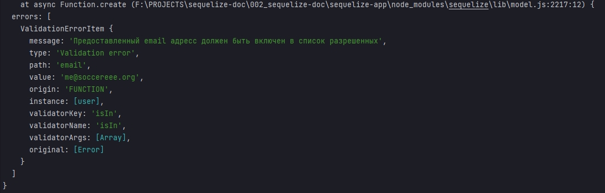

<br/>
<br/>
<br/>


# Validators_and_Null_Values

Валидаторы и нулевые значения.

И теперь важно упомянуть как **allowNull** взаимодействует с валидаторами. Если столбец не допускает нулевые значения, или другими словами, **allowNull** установлен на **false**.  

Рассмотрим на примере **username**.

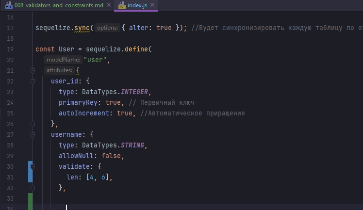 

Я так понял что если пользователь отправляет пустое значение, **allowNull** отрабатывает, не дает поместить пустое значение в БД, но однако  перестает дальше выполнять код. Т.е. блок **validate** он выполянть не будет. Все валидаторы будут пропущены. И будет выдана ошибка проверки. 

Однако если столбец допускает нулевое значение использую **allowNull:true**, что на самом деле является значением по умолчанию для каждого столбца. Нулевое значение передается. Только тогда произойдет переход к блоку **validate** и созданные вами валидаторы отработают.

Мы можем создать пользовательский валидатор который проверяет является ли значение **Null**.

Перехожу к email. Явно указываю **allowNull:true**. Перехожу к блоку **validate** где создаю наш собственный валидатор. Называю функцию **myEmailValidator** котрая принимает аргументом отловленное значение **value**

```js
const Sequelize = require("sequelize");
const { DataTypes, Op } = Sequelize;
const bcrypt = require("bcrypt");
const zlib = require("zlib");

// DB=network
// USER=asu8
// PASSWORD=123
// DIALECT=mysql
// HOST=10.178.4.52

const sequelize = new Sequelize("network", "asu8", "123", {
  host: "10.178.4.52",
  dialect: "mysql",
}); // создаю экземпляр класса

sequelize.sync({ alter: true }); //Будет синхронизировать каждую таблицу по отдельности не пересобирая все таблицы

const User = sequelize.define(
  "user",
  {
    user_id: {
      type: DataTypes.INTEGER,
      primaryKey: true, // Первичный ключ
      autoIncrement: true, //Автоматическое приращение
    },
    username: {
      type: DataTypes.STRING,
      allowNull: false,
      validate: {
        len: [4, 6],
      },

      // get() {
      //   const rawValue = this.getDataValue("username"); //Получаю не обработанное значение от текущего пользователя
      //   return rawValue.toUpperCase();
      // },
    },
    password: {
      type: DataTypes.STRING,
      // set(value) {
      //   const salt = bcrypt.genSaltSync(12);
      //   const hash = bcrypt.hashSync(value, salt); // мфдгу переданное значение salt захэшированный пароль
      //   this.setDataValue("password", hash);
      // },
    },
    age: {
      type: DataTypes.INTEGER,
      defaultValue: 21,
      validate: {
        isNumeric: {
          msg: "Вы должны ввести число для возраста",
        },
      },
    },
    description: {
      type: DataTypes.STRING,
      // set(value) {
      //   const compressed = zlib.deflateSync(value).toString("base64");
      //   this.setDataValue("description", compressed);
      // },
      // get() {
      //   const value = this.getDataValue("description");
      //   const uncompressed = zlib.inflateSync(Buffer.from(value, "base64")); //расспаковываю
      //   return uncompressed.toString(); // привожу buffer object к строке
      // },
    },
    aboutUser: {
      type: DataTypes.VIRTUAL,
      get() {
        return `${this.username} ${this.description}`;
      },
    },
    email: {
      type: DataTypes.STRING,
      unique: true, // ограничение, поле email является уникальным.
      allowNull: true, // обязательно устанавливаю в true для того что бы при проверке перейти к validate
      validate: {
        myEmailValidator(value) {
          if (value === null) {
            throw new Error("Пожалуйста введите email");
          }
        },
      },
    },
  },

  {
    freezeTableName: true, // указываю что бы имя нашей модели совпадало с именем нашей таблицы
  }
); // Определяю модель пользователей
User.sync({ alter: true })
  .then(() => {
    return User.create({
      username: "Никита",
      age: "31",
      email: null,
    });
  })
  .then((data) => {
    console.log(data);
  })
  .catch((error) => {
    console.log(error);
  });

```

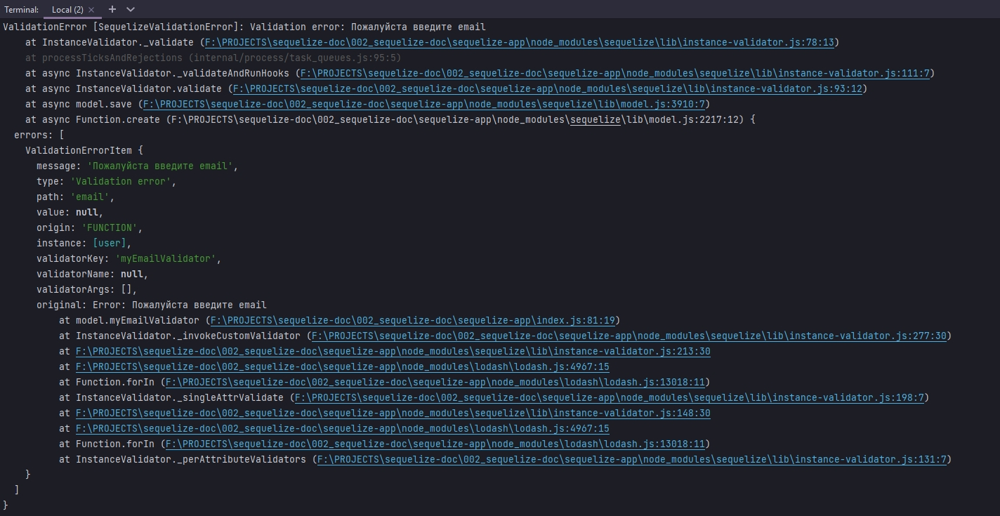

Но мы же можем передать **undefined** или "".

<br/>
<br/>
<br/>


# Model_Wide_Validation

Проверка на уровне модели. До этого мы использовали проверку столбцов. Но проверка на уровне модели может проверять модель дальше после запуска конкретных валидаторов. На этом уровне мы можем проверить например отличается ли пароль от имени пользователя. 

По этому здесь где у нас происходит определение имени таблицы **freezeTableName:true**. Ниже я могу прописать **validate** в которую помещаю функцию проверки. Создаю свою функцию **usernamePassMatch(){}**. Здесь я могу использовать контекст **this** для доступа к свойствам проверяемого объекта. Прописываю условие что если, через **this** обращаюсь к нужному объекту **username === this.password** то возвращаю ошибку.

```js
const Sequelize = require("sequelize");
const { DataTypes, Op } = Sequelize;
const bcrypt = require("bcrypt");
const zlib = require("zlib");

// DB=network
// USER=asu8
// PASSWORD=123
// DIALECT=mysql
// HOST=10.178.4.52

const sequelize = new Sequelize("network", "asu8", "123", {
  host: "10.178.4.52",
  dialect: "mysql",
}); // создаю экземпляр класса

sequelize.sync({ alter: true }); //Будет синхронизировать каждую таблицу по отдельности не пересобирая все таблицы

const User = sequelize.define(
  "user",
  {
    user_id: {
      type: DataTypes.INTEGER,
      primaryKey: true, // Первичный ключ
      autoIncrement: true, //Автоматическое приращение
    },
    username: {
      type: DataTypes.STRING,
      allowNull: false,
      validate: {
        len: [4, 6],
      },

      // get() {
      //   const rawValue = this.getDataValue("username"); //Получаю не обработанное значение от текущего пользователя
      //   return rawValue.toUpperCase();
      // },
    },
    password: {
      type: DataTypes.STRING,
      // set(value) {
      //   const salt = bcrypt.genSaltSync(12);
      //   const hash = bcrypt.hashSync(value, salt); // мфдгу переданное значение salt захэшированный пароль
      //   this.setDataValue("password", hash);
      // },
    },
    age: {
      type: DataTypes.INTEGER,
      defaultValue: 21,
      validate: {
        isNumeric: {
          msg: "Вы должны ввести число для возраста",
        },
      },
    },
    description: {
      type: DataTypes.STRING,
      // set(value) {
      //   const compressed = zlib.deflateSync(value).toString("base64");
      //   this.setDataValue("description", compressed);
      // },
      // get() {
      //   const value = this.getDataValue("description");
      //   const uncompressed = zlib.inflateSync(Buffer.from(value, "base64")); //расспаковываю
      //   return uncompressed.toString(); // привожу buffer object к строке
      // },
    },
    aboutUser: {
      type: DataTypes.VIRTUAL,
      get() {
        return `${this.username} ${this.description}`;
      },
    },
    email: {
      type: DataTypes.STRING,
      unique: true, // ограничение, поле email является уникальным.
      allowNull: true, // обязательно устанавливаю в true для того что бы при проверке перейти к validate
      validate: {
        myEmailValidator(value) {
          if (value === null) {
            throw new Error("Пожалуйста введите email");
          }
        },
      },
    },
  },

  {
    freezeTableName: true, // указываю что бы имя нашей модели совпадало с именем нашей таблицы
    //Провожу валидацию на уровне модели
    validate: {
      usernamePassMatch() {
        if (this.username === this.password) {
          throw new Error(`Имя пользователя и пароль не должны совпадать!!!`);
        } else {
          console.log(`Регистрация прошла успешно`);
        }
      },
    },
  }
); // Определяю модель пользователей
User.sync({ alter: true })
  .then(() => {
    return User.create({
      username: "Nikita",
      password: "Nikita",
      age: 2,
      email: "nik@mail.com",
    });
  })
  .then((data) => {
    console.log(data);
  })
  .catch((error) => {
    console.log(error);
  });

```


>Запомни!! Сначало происходит проверка на уровне модели и лишь потом происходит проверка каждого столбца. Если в >них конечно прописаны валидаторы. По этому как и в случае с полями. Если произойдет ошибка на уровне валидации >модели, то последующий код выполняться не будет. А значит и валидация столбцов проводится не будет.