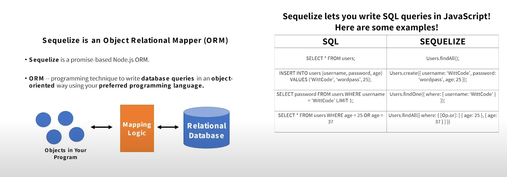
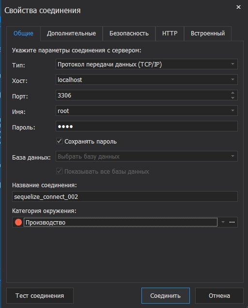
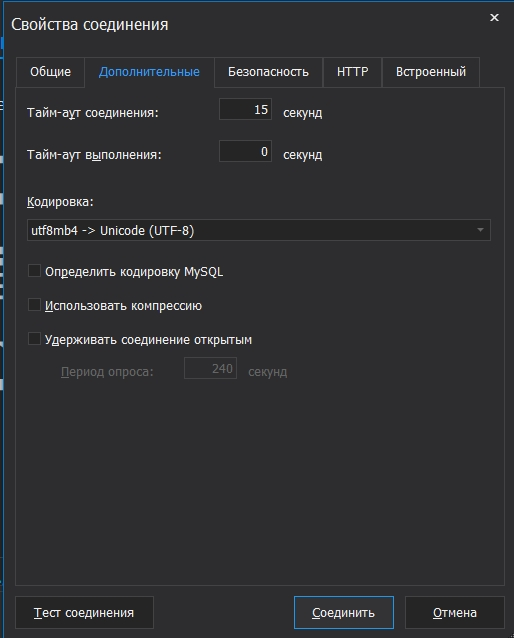
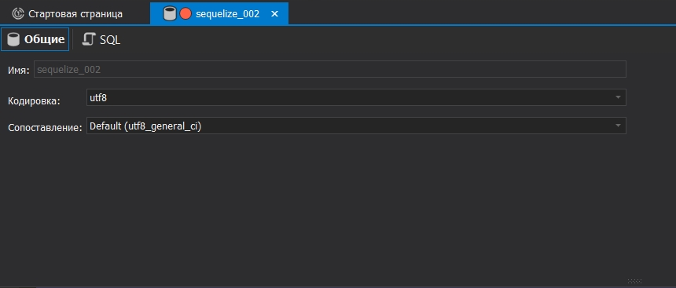
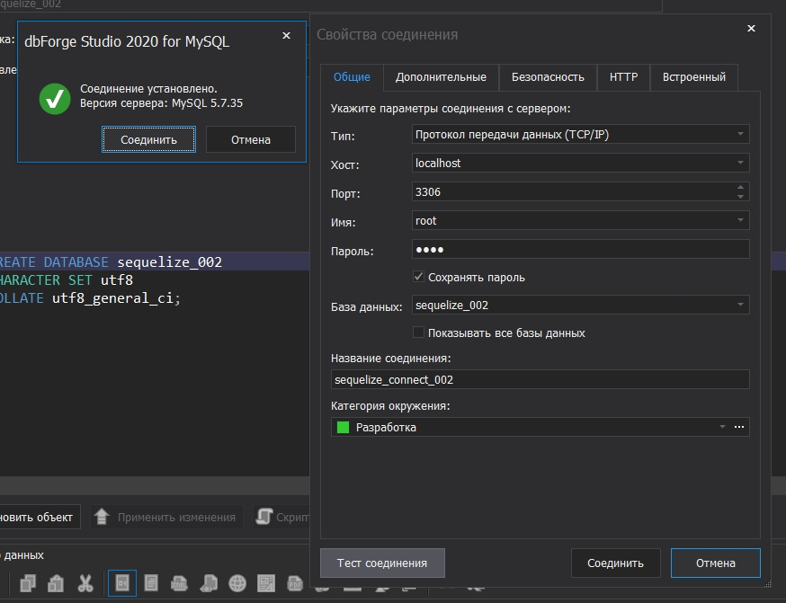
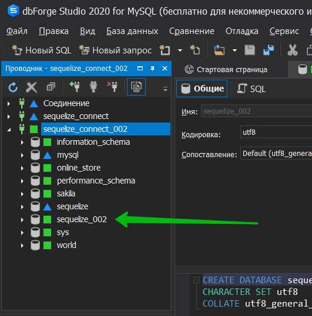
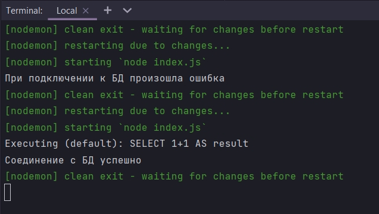
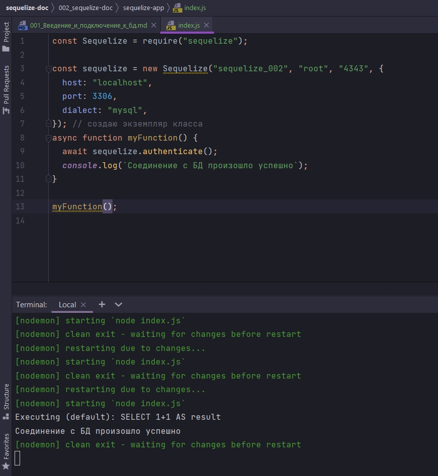

# 001_Введение_и_подключение_к_бд



лучший способ узнать sequelize - это применить все знания на практике. По этому для начало подключимся к БД с помощью sequelize.

Инициализирую проект

```shell
npm init -y
```

далее 

```shell
npm install sequelize
```

Поскольку sequelize потдерживает несколько механизмов БД нам нужно установить драйвер для нужной БД. Я буду использовать mysql.

Устанавливаю драйвер.

```shell
npm install mysql2
```

В index.js я формирую наше подключение к БД.









В index.js создаю новый экземпляр класса sequelize и так же передаю нужную информацию в конструктор. 

В JS существует соглашение о том что модуль возврата должен называться с заглавной буквы т.е. это функция конструктор.

Функция конструктор это по сути функция с ключевым словом new перед new. Смотрите если мы хотим создать экземпляр класса то мы обычно делаем это в нижнем регистре

```js
const Sequelize = require("sequelize");

const sequelize = new Sequelize(); // создаю экземпляр класса

```

Теперь информация трубуемая этой функции конструктор включает имя схемы которая 



```js
const Sequelize = require("sequelize");

const sequelize = new Sequelize("sequelize_002", "root", "4343", {}); // создаю экземпляр класса

```

Объект опций это по сути то как мы можем настроить наше соединение. Здесь мне нужно указать диалект который зависит от движка БД

```js
const Sequelize = require("sequelize");

const sequelize = new Sequelize("sequelize_002", "root", "4343", {
  dialect: "mysql",
}); // создаю экземпляр класса

```

Так же есть много других различных опций такие как host

```js
const Sequelize = require("sequelize");

const sequelize = new Sequelize("sequelize_002", "root", "4343", {
  host: "localhost",
    port: 3306,
  dialect: "mysql",
}); // создаю экземпляр класса

```
Как я понял это не обязательно.

Проверить сможем ли мы подключиться к БД мы можем с помощью функции аутентификации.

```js
const Sequelize = require("sequelize");

const sequelize = new Sequelize("sequelize_002", "root", "4343", {
  host: "localhost",
    port: 3306,
  dialect: "mysql",
}); // создаю экземпляр класса

sequelize.authenticate();

```

Эта функция authenticate возвращает обещание. И я предполагаю что вы знаете что такое promise. По сути promise - это просто задача которая будет завершена в какой-то момент в будущем. Например это соединение будет установлено не сразу, а в какой-то момент в будущем.

```js
const Sequelize = require("sequelize");

const sequelize = new Sequelize("sequelize_002", "root", "4343", {
  host: "localhost",
    port: 3306,
    dialect: "mysql",
}); // создаю экземпляр класса

sequelize
  .authenticate()
  .then(() => {
    console.log(`Соединение с БД успешно`);
  })
  .catch(() => {
    console.log(`При подключении к БД произошла ошибка`);
  });

```



В документации обычно такой код

```js
const Sequelize = require("sequelize");

const sequelize = new Sequelize("sequelize_002", "root", "4343", {
  host: "localhost",
  port: 3306,
  dialect: "mysql",
}); // создаю экземпляр класса
async function myFunction() {
  await sequelize.authenticate();
  console.log(`Соединение с БД произошло успешно`);
}

myFunction();

```



Но мы собираемся использовать подход с промисами.