# 006_finder_methods

* [What_are_Finder_Queries](#What_are_Finder_Queries)
* [Finder_Method_Raw_Option](#Finder_Method_Raw_Option)
* [findByPk](#findByPk)
* [findOne](#findOne)
* [findOrCreate](#findOrCreate)
* [Setting_Default_Values_for_findOrCreate](#Setting_Default_Values_for_findOrCreate)
* [findOrCreate_Return_Values](#findOrCreate_Return_Values)
* [findAndCountAll](#findAndCountAll)
* [Outro](#Outro)


# What_are_Finder_Queries

Рассмотрим больше методов и параметров поиска, которые вы можете передать. По этому методы поиска - это методы которые генерируют запросы  выбора. Например в прошлом видео мы использовали методы которые выбирали все из таблицы если только они не были ограничены методом **where**. 
Эти методы возвращают экземпляры класса модели, а не простые объекты **javascript**. Это означает что **sequelize** оборачивает все в объекты экземпляра или экземпляр модели. По этому в предыдущих видео мы могди использовать два **JSON** объекта, возвращенного из поискового запроса. Это по существу преобразует возвращенный экземпляр в обычный объект **JS** где мы можем получить доступ к его **properties**.

Так же в качестве примечания вы не можете использовать **toJSON** в обычном объекте **javascript**.  

toJSON мы можем вызвать у экземпляра модели.

<br/>
<br/>
<br/>


# Finder_Method_Raw_Option

Мы можем передать для нашего метода поиска **findAll**, для использования **toJSON**, объект в котором укажем **raw:true**.

```js
const Sequelize = require("sequelize");
const { log } = require("nodemon/lib/utils");
const { where } = require("sequelize");
const { DataTypes, Op } = Sequelize;

// DB=network
// USER=asu8
// PASSWORD=123
// DIALECT=mysql
// HOST=10.178.4.52

const sequelize = new Sequelize("network", "asu8", "123", {
  host: "10.178.4.52",
  dialect: "mysql",
}); // создаю экземпляр класса

sequelize.sync({ alter: true }); //Будет синхронизировать каждую таблицу по отдельности не пересобирая все таблицы

const User = sequelize.define(
  "user",
  {
    user_id: {
      type: DataTypes.INTEGER,
      primaryKey: true, // Первичный ключ
      autoIncrement: true, //Автоматическое приращение
    },
    username: {
      type: DataTypes.STRING,
      allowNull: false,
    },
    password: {
      type: DataTypes.STRING,
    },
    age: {
      type: DataTypes.INTEGER,
      defaultValue: 21,
    },
  },

  {
    freezeTableName: true, // указываю что бы имя нашей модели совпадало с именем нашей таблицы
  }
); // Определяю модель пользователей
User.sync({ alter: true })
  .then(() => {
    return User.findAll({ raw: true });
  })
  .then((data) => {
    //promise возвращает массив который нужно обработать
    console.log(data);
  })
  .catch((error) => {
    console.log(error);
  });

```
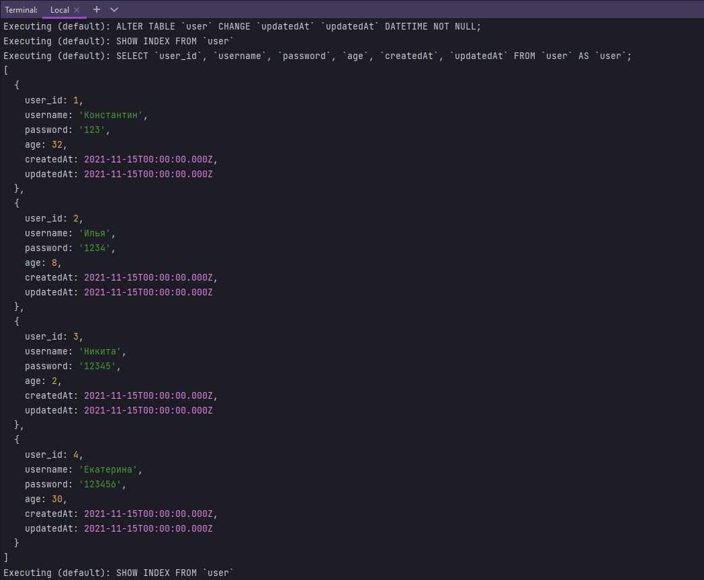

Информация структурированна

если я просто использую **findAll**.

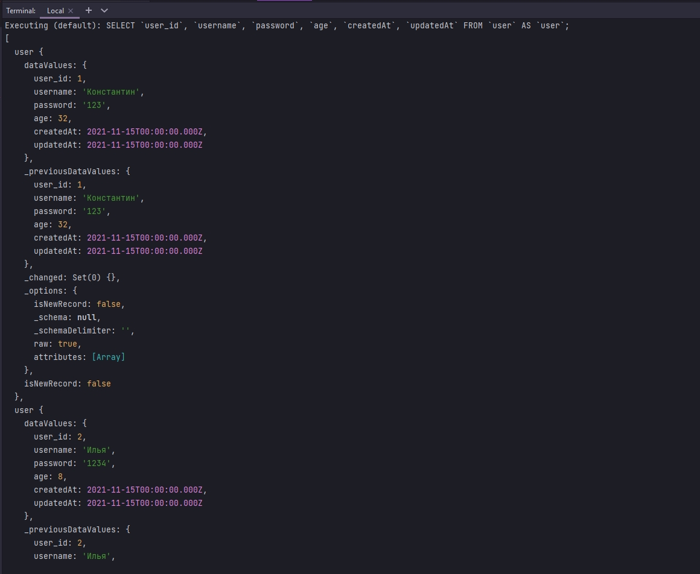

Как мы видим с **findAll** без параметров мы получаем дополнительную информацию которая безпорядочна. А затем чтобы показать вам с помощью **where**, которое мы могли бы указать. Давайте найдем все где возраст равен 28.

```js
const Sequelize = require("sequelize");
const { log } = require("nodemon/lib/utils");
const { where } = require("sequelize");
const { DataTypes, Op } = Sequelize;

// DB=network
// USER=asu8
// PASSWORD=123
// DIALECT=mysql
// HOST=10.178.4.52

const sequelize = new Sequelize("network", "asu8", "123", {
  host: "10.178.4.52",
  dialect: "mysql",
}); // создаю экземпляр класса

sequelize.sync({ alter: true }); //Будет синхронизировать каждую таблицу по отдельности не пересобирая все таблицы

const User = sequelize.define(
  "user",
  {
    user_id: {
      type: DataTypes.INTEGER,
      primaryKey: true, // Первичный ключ
      autoIncrement: true, //Автоматическое приращение
    },
    username: {
      type: DataTypes.STRING,
      allowNull: false,
    },
    password: {
      type: DataTypes.STRING,
    },
    age: {
      type: DataTypes.INTEGER,
      defaultValue: 21,
    },
  },

  {
    freezeTableName: true, // указываю что бы имя нашей модели совпадало с именем нашей таблицы
  }
); // Определяю модель пользователей
User.sync({ alter: true })
  .then(() => {
    return User.findAll({
      where: { age: 28 },
      raw: true, //Преобразую все к объекту JavaScript а не к модели данных
    });
  })
  .then((data) => {
    //promise возвращает массив который нужно обработать
    console.log(data);
  })
  .catch((error) => {
    console.log(error);
  });

```
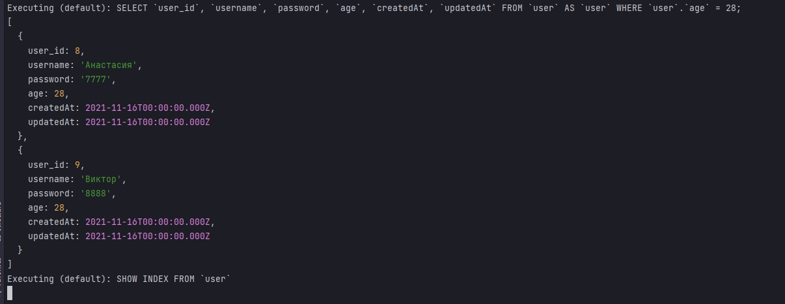

<br/>
<br/>
<br/>

# findByPk

Этот метод означает найти одну строку в таблице из представленного первичного ключа.

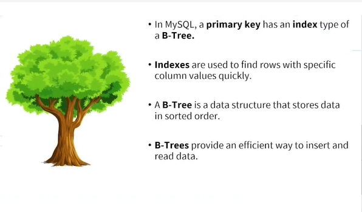

Это будет только одна строка, потому что вы знаете, что первичный ключ используется для указания или однозначной индентификации одной строки в таблице. Так что давайте вместо того что бы найти все мы найдем первичные ключи.

```js
const Sequelize = require("sequelize");
const { log } = require("nodemon/lib/utils");
const { where } = require("sequelize");
const { DataTypes, Op } = Sequelize;

// DB=network
// USER=asu8
// PASSWORD=123
// DIALECT=mysql
// HOST=10.178.4.52

const sequelize = new Sequelize("network", "asu8", "123", {
  host: "10.178.4.52",
  dialect: "mysql",
}); // создаю экземпляр класса

sequelize.sync({ alter: true }); //Будет синхронизировать каждую таблицу по отдельности не пересобирая все таблицы

const User = sequelize.define(
  "user",
  {
    user_id: {
      type: DataTypes.INTEGER,
      primaryKey: true, // Первичный ключ
      autoIncrement: true, //Автоматическое приращение
    },
    username: {
      type: DataTypes.STRING,
      allowNull: false,
    },
    password: {
      type: DataTypes.STRING,
    },
    age: {
      type: DataTypes.INTEGER,
      defaultValue: 21,
    },
  },

  {
    freezeTableName: true, // указываю что бы имя нашей модели совпадало с именем нашей таблицы
  }
); // Определяю модель пользователей
User.sync({ alter: true })
  .then(() => {
    return User.findByPk(8);
  })
  .then((data) => {
    //promise возвращает массив который нужно обработать
    console.log(data.toJSON());
  })
  .catch((error) => {
    console.log(error);
  });

```

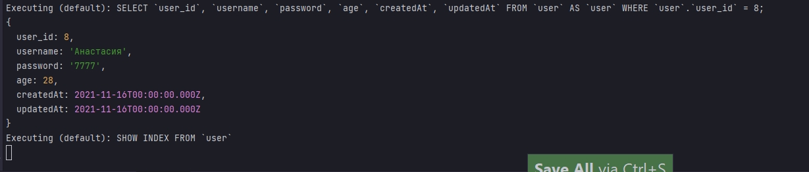

И вот мы получаем пользователя по первичному ключу.

<br/>
<br/>
<br/>
<br/>

# findOne

Еще один метод метод поиска который используется для возврата одной строки это метод **findOne**. Мы можем либо ничего не передавать в данную функцию, либо передать **where**, и он вернет первую строку которая соответствует предоставленному условию. 

````js
const Sequelize = require("sequelize");
const { log } = require("nodemon/lib/utils");
const { where } = require("sequelize");
const { DataTypes, Op } = Sequelize;

// DB=network
// USER=asu8
// PASSWORD=123
// DIALECT=mysql
// HOST=10.178.4.52

const sequelize = new Sequelize("network", "asu8", "123", {
  host: "10.178.4.52",
  dialect: "mysql",
}); // создаю экземпляр класса

sequelize.sync({ alter: true }); //Будет синхронизировать каждую таблицу по отдельности не пересобирая все таблицы

const User = sequelize.define(
  "user",
  {
    user_id: {
      type: DataTypes.INTEGER,
      primaryKey: true, // Первичный ключ
      autoIncrement: true, //Автоматическое приращение
    },
    username: {
      type: DataTypes.STRING,
      allowNull: false,
    },
    password: {
      type: DataTypes.STRING,
    },
    age: {
      type: DataTypes.INTEGER,
      defaultValue: 21,
    },
  },

  {
    freezeTableName: true, // указываю что бы имя нашей модели совпадало с именем нашей таблицы
  }
); // Определяю модель пользователей
User.sync({ alter: true })
  .then(() => {
    return User.findOne();
  })
  .then((data) => {
    //promise возвращает массив который нужно обработать
    console.log(data.toJSON());
  })
  .catch((error) => {
    console.log(error);
  });

````

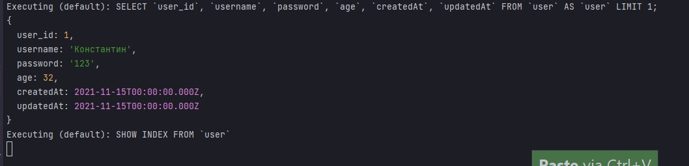

И вот он находит первую строку в таблице. Если мы не передаем условие мы просто возвращаем первую строку в таблице.

```js
const Sequelize = require("sequelize");
const { log } = require("nodemon/lib/utils");
const { where } = require("sequelize");
const { DataTypes, Op } = Sequelize;

// DB=network
// USER=asu8
// PASSWORD=123
// DIALECT=mysql
// HOST=10.178.4.52

const sequelize = new Sequelize("network", "asu8", "123", {
    host: "10.178.4.52",
    dialect: "mysql",
}); // создаю экземпляр класса

sequelize.sync({ alter: true }); //Будет синхронизировать каждую таблицу по отдельности не пересобирая все таблицы

const User = sequelize.define(
    "user",
    {
        user_id: {
            type: DataTypes.INTEGER,
            primaryKey: true, // Первичный ключ
            autoIncrement: true, //Автоматическое приращение
        },
        username: {
            type: DataTypes.STRING,
            allowNull: false,
        },
        password: {
            type: DataTypes.STRING,
        },
        age: {
            type: DataTypes.INTEGER,
            defaultValue: 21,
        },
    },

    {
        freezeTableName: true, // указываю что бы имя нашей модели совпадало с именем нашей таблицы
    }
); // Определяю модель пользователей
User.sync({ alter: true })
    .then(() => {
        return User.findOne({
            where: {
                age: {
                    [Op.or]: {
                        [Op.lt]: 25,
                        [Op.eq]: null,
                    },
                },
            },
        });
    })
    .then((data) => {
        //promise возвращает массив который нужно обработать
        console.log(data.toJSON());
    })
    .catch((error) => {
        console.log(error);
    });


```

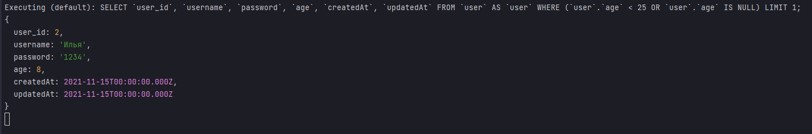

И вот мы сделали еще одни сложный запрос.


<br/>
<br/>
<br/>
<br/>

# findOrCreate

Этот метод создает строку в нашей таблице, если он не может найти строку запрашиваемую нами из таблицы. В любом случае он найдет экземпляр который будет либо найденным либо созданным. Это на самом деле хорошо, потому что у нас нет множества данных в таблице. По этому вместо того что бы найти строку которая у нас уже есть в БД, мы создадим ее .

```js
const Sequelize = require("sequelize");
const { log } = require("nodemon/lib/utils");
const { where } = require("sequelize");
const { DataTypes, Op } = Sequelize;

// DB=network
// USER=asu8
// PASSWORD=123
// DIALECT=mysql
// HOST=10.178.4.52

const sequelize = new Sequelize("network", "asu8", "123", {
  host: "10.178.4.52",
  dialect: "mysql",
}); // создаю экземпляр класса

sequelize.sync({ alter: true }); //Будет синхронизировать каждую таблицу по отдельности не пересобирая все таблицы

const User = sequelize.define(
  "user",
  {
    user_id: {
      type: DataTypes.INTEGER,
      primaryKey: true, // Первичный ключ
      autoIncrement: true, //Автоматическое приращение
    },
    username: {
      type: DataTypes.STRING,
      allowNull: false,
    },
    password: {
      type: DataTypes.STRING,
    },
    age: {
      type: DataTypes.INTEGER,
      defaultValue: 21,
    },
  },

  {
    freezeTableName: true, // указываю что бы имя нашей модели совпадало с именем нашей таблицы
  }
); // Определяю модель пользователей
User.sync({ alter: true })
  .then(() => {
    return User.findOrCreate({ where: { username: "Александр" }, raw: true });
  })
  .then((data) => {
    //promise возвращает массив который нужно обработать
    console.log(data);
  })
  .catch((error) => {
    console.log(error);
  });

```

И вот была создана новая строка 

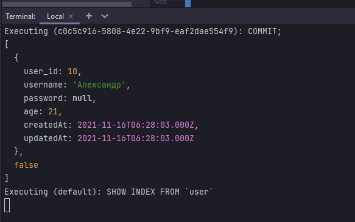

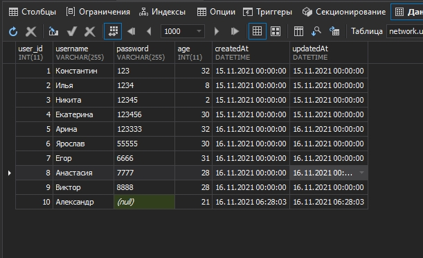

Но если я скажу что найли мне что-то сужествующее 

```js
const Sequelize = require("sequelize");
const { log } = require("nodemon/lib/utils");
const { where } = require("sequelize");
const { DataTypes, Op } = Sequelize;

// DB=network
// USER=asu8
// PASSWORD=123
// DIALECT=mysql
// HOST=10.178.4.52

const sequelize = new Sequelize("network", "asu8", "123", {
  host: "10.178.4.52",
  dialect: "mysql",
}); // создаю экземпляр класса

sequelize.sync({ alter: true }); //Будет синхронизировать каждую таблицу по отдельности не пересобирая все таблицы

const User = sequelize.define(
  "user",
  {
    user_id: {
      type: DataTypes.INTEGER,
      primaryKey: true, // Первичный ключ
      autoIncrement: true, //Автоматическое приращение
    },
    username: {
      type: DataTypes.STRING,
      allowNull: false,
    },
    password: {
      type: DataTypes.STRING,
    },
    age: {
      type: DataTypes.INTEGER,
      defaultValue: 21,
    },
  },

  {
    freezeTableName: true, // указываю что бы имя нашей модели совпадало с именем нашей таблицы
  }
); // Определяю модель пользователей
User.sync({ alter: true })
  .then(() => {
    return User.findOrCreate({ where: { username: "Екатерина" }, raw: true });
  })
  .then((data) => {
    //promise возвращает массив который нужно обработать
    console.log(data);
  })
  .catch((error) => {
    console.log(error);
  });

```

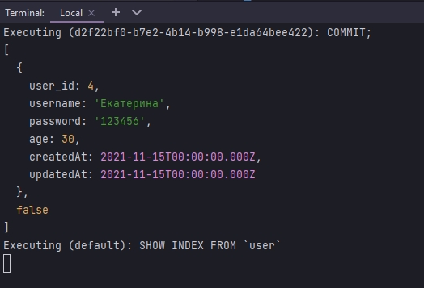

И вот тут он не вставляет ни каких данных, потому что данная запись в таблице уже существует.

<br/>
<br/>
<br/>
<br/>

# Setting_Default_Values_for_findOrCreate

И так же стоит упомянуть когда мы вставлем новую строку **sequelize** вставляет значения полей заданных по умолчанию. Данные значения по умолчанию мы установили в определении нашей таблицы. Мы так же можем установить значения по умолчанию, которые мы хотим для конкретного созданного пользователя, внутри функции **findOrCreate** исползуя **defaults**

```js
const Sequelize = require("sequelize");
const { log } = require("nodemon/lib/utils");
const { where } = require("sequelize");
const { DataTypes, Op } = Sequelize;

// DB=network
// USER=asu8
// PASSWORD=123
// DIALECT=mysql
// HOST=10.178.4.52

const sequelize = new Sequelize("network", "asu8", "123", {
  host: "10.178.4.52",
  dialect: "mysql",
}); // создаю экземпляр класса

sequelize.sync({ alter: true }); //Будет синхронизировать каждую таблицу по отдельности не пересобирая все таблицы

const User = sequelize.define(
  "user",
  {
    user_id: {
      type: DataTypes.INTEGER,
      primaryKey: true, // Первичный ключ
      autoIncrement: true, //Автоматическое приращение
    },
    username: {
      type: DataTypes.STRING,
      allowNull: false,
    },
    password: {
      type: DataTypes.STRING,
    },
    age: {
      type: DataTypes.INTEGER,
      defaultValue: 21,
    },
  },

  {
    freezeTableName: true, // указываю что бы имя нашей модели совпадало с именем нашей таблицы
  }
); // Определяю модель пользователей
User.sync({ alter: true })
  .then(() => {
    return User.findOrCreate({
      raw: true,
      where: { username: "Евгений" },
      defaults: { age: 26, password: 123 },
    });
  })
  .then((data) => {
    //promise возвращает массив который нужно обработать
    console.log(data);
  })
  .catch((error) => {
    console.log(error);
  });

```

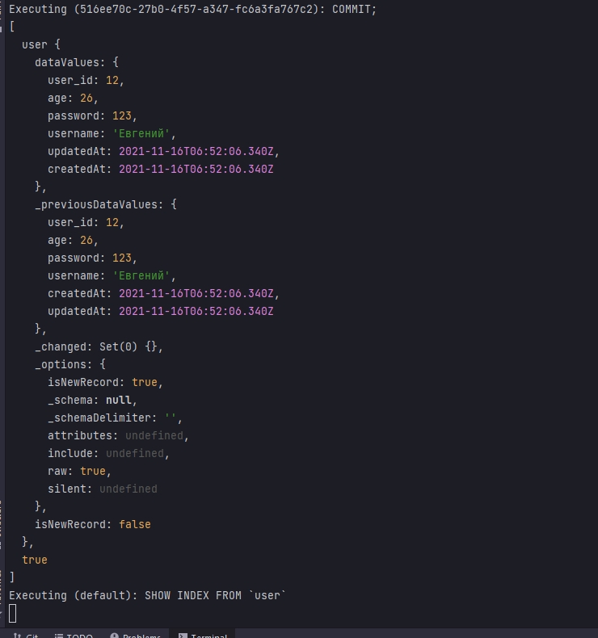

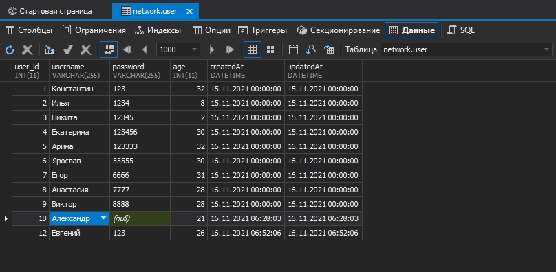

И как видим применились значения по умолчанию **defaults** переданные в функции **findOrCreate**, а не определенные в модели **defaultValue**. Другими словами мы переопределили значение по умолчанию. **defaults** будет применено только в том случае если искомое поле не найдено в таблице, после чего создается новое поле со значениями по умолчанию указанными в функции **findOrCreate**.

Если сейчас мы изменим к примеру age на 37 и попробуем сделать запрос, то нам вернется найденный объект и поле age не применит значение 37 так как данный объект найден и новый создавать не нужно.

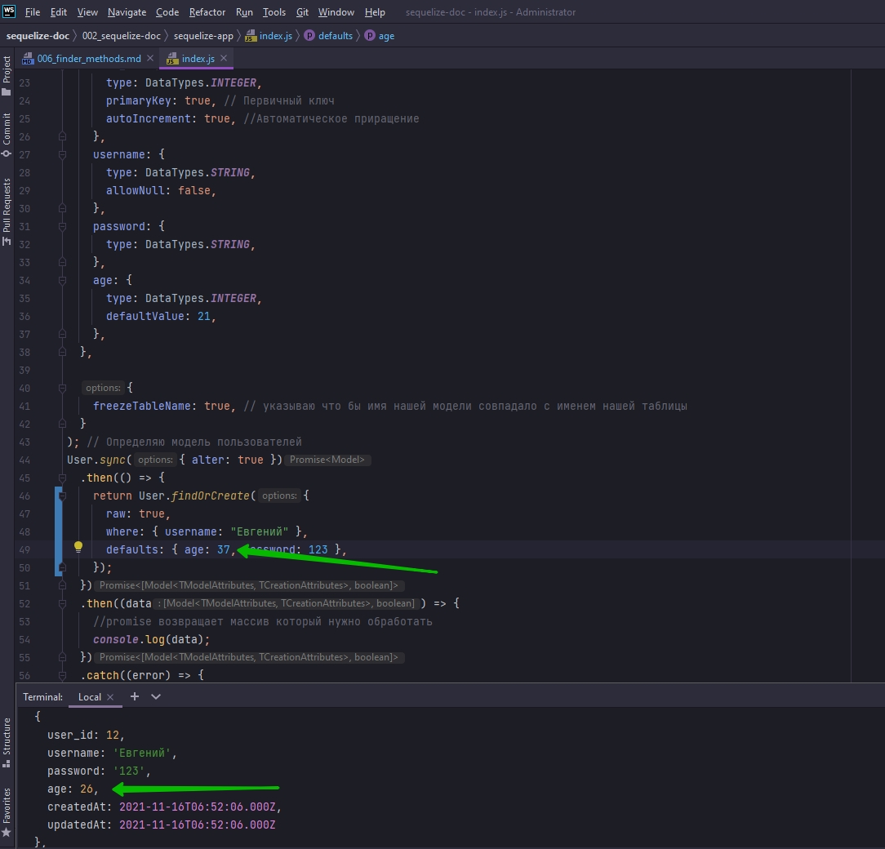

<br/>
<br/>
<br/>

# findOrCreate_Return_Values

Метод **findOrCreate** возвращает больше, чем просто возвращаемый экземпляр из нашей модели. Он так же возвращает логическое значение, которое указывает, где экземпляр был создан, или уже существует, по этому он в основном возвращает массив, содержащий найденный экземпляр и логическое значение. Наприме если то что мы искали, не было найдено в БД, что означает что оно было вставлено, и следовательно логическое значение будет **true** и будет возвращено вместе  с экземпляром который был вставлен в таблицу. Если экземпляр имеется в таблице тогда он вернет найденные экземпляр вместе с **false** логическим значением. По этому когда мы регистрировали данные с помощью **toJSON**, на самом деле мы не получали всю ошибку.

По этому попробуем вызвать деконструкцию объекта, как мы делали в предыдущих видео.

```js
const Sequelize = require("sequelize");
const { log } = require("nodemon/lib/utils");
const { where } = require("sequelize");
const { DataTypes, Op } = Sequelize;

// DB=network
// USER=asu8
// PASSWORD=123
// DIALECT=mysql
// HOST=10.178.4.52

const sequelize = new Sequelize("network", "asu8", "123", {
  host: "10.178.4.52",
  dialect: "mysql",
}); // создаю экземпляр класса

sequelize.sync({ alter: true }); //Будет синхронизировать каждую таблицу по отдельности не пересобирая все таблицы

const User = sequelize.define(
  "user",
  {
    user_id: {
      type: DataTypes.INTEGER,
      primaryKey: true, // Первичный ключ
      autoIncrement: true, //Автоматическое приращение
    },
    username: {
      type: DataTypes.STRING,
      allowNull: false,
    },
    password: {
      type: DataTypes.STRING,
    },
    age: {
      type: DataTypes.INTEGER,
      defaultValue: 21,
    },
  },

  {
    freezeTableName: true, // указываю что бы имя нашей модели совпадало с именем нашей таблицы
  }
); // Определяю модель пользователей
User.sync({ alter: true })
  .then(() => {
    return User.findOrCreate({
      raw: true,
      where: { username: "Евгений" },
      defaults: { age: 37, password: 123 },
    });
  })
  .then((data) => {
    //promise возвращает массив который нужно обработать
    const [result, created] = data; //деконструирую объект
    console.log(created); //Если повторно отправляю объект вернет false, если создает строку возвращает true
  })
  .catch((error) => {
    console.log(error);
  });

```

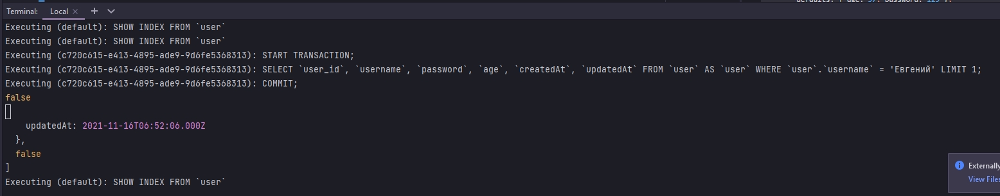

Вернулось **false** так как пользователь уже существует.

Сдругой стороны если я создам нового пользователя вернется **true**

```js
const Sequelize = require("sequelize");
const { log } = require("nodemon/lib/utils");
const { where } = require("sequelize");
const { DataTypes, Op } = Sequelize;

// DB=network
// USER=asu8
// PASSWORD=123
// DIALECT=mysql
// HOST=10.178.4.52

const sequelize = new Sequelize("network", "asu8", "123", {
  host: "10.178.4.52",
  dialect: "mysql",
}); // создаю экземпляр класса

sequelize.sync({ alter: true }); //Будет синхронизировать каждую таблицу по отдельности не пересобирая все таблицы

const User = sequelize.define(
  "user",
  {
    user_id: {
      type: DataTypes.INTEGER,
      primaryKey: true, // Первичный ключ
      autoIncrement: true, //Автоматическое приращение
    },
    username: {
      type: DataTypes.STRING,
      allowNull: false,
    },
    password: {
      type: DataTypes.STRING,
    },
    age: {
      type: DataTypes.INTEGER,
      defaultValue: 21,
    },
  },

  {
    freezeTableName: true, // указываю что бы имя нашей модели совпадало с именем нашей таблицы
  }
); // Определяю модель пользователей
User.sync({ alter: true })
  .then(() => {
    return User.findOrCreate({
      raw: true,
      where: { username: "Наталья" },
      defaults: { age: 37, password: 123 },
    });
  })
  .then((data) => {
    //promise возвращает массив который нужно обработать
    const [result, created] = data; //деконструирую объект
    console.log(created); //Если повторно отправляю объект вернет false, если создает строку возвращает true
  })
  .catch((error) => {
    console.log(error);
  });

```

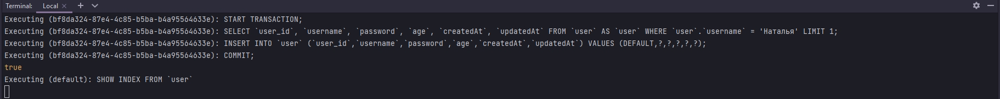


<br/>
<br/>
<br/>


# findAndCountAll

Метод найти и подсчитать все. Этот метод объеденяет поиск всех и подсчет. Другими словами этот метод находит все что соответствует нашему запросу, а так же возвращает количество возвращенных строк.

```js
const Sequelize = require("sequelize");
const { log } = require("nodemon/lib/utils");
const { where } = require("sequelize");
const { DataTypes, Op } = Sequelize;

// DB=network
// USER=asu8
// PASSWORD=123
// DIALECT=mysql
// HOST=10.178.4.52

const sequelize = new Sequelize("network", "asu8", "123", {
  host: "10.178.4.52",
  dialect: "mysql",
}); // создаю экземпляр класса

sequelize.sync({ alter: true }); //Будет синхронизировать каждую таблицу по отдельности не пересобирая все таблицы

const User = sequelize.define(
  "user",
  {
    user_id: {
      type: DataTypes.INTEGER,
      primaryKey: true, // Первичный ключ
      autoIncrement: true, //Автоматическое приращение
    },
    username: {
      type: DataTypes.STRING,
      allowNull: false,
    },
    password: {
      type: DataTypes.STRING,
    },
    age: {
      type: DataTypes.INTEGER,
      defaultValue: 21,
    },
  },

  {
    freezeTableName: true, // указываю что бы имя нашей модели совпадало с именем нашей таблицы
  }
); // Определяю модель пользователей
User.sync({ alter: true })
  .then(() => {
    return User.findAndCountAll({
      where: { username: "Анастасия" },
      raw: true,
    });
  })
  .then((data) => {
    //promise возвращает массив который нужно обработать
    const { count, rows } = data;
    console.log("Количество", count); // Возвращает количество строк
    console.log("Строки", rows); //Возвращает массив строк
  })
  .catch((error) => {
    console.log(error);
  });

```


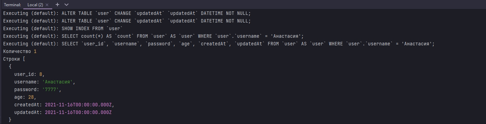


