# 007_setters_getters_and_virtual_fields

* [What_are_Getters_and_Setters](#What_are_Getters_and_Setters)
* [Getters](#Getters)
* [Setters_and_Securing_Passwords_with_Bcrypt](#Setters_and_Securing_Passwords_with_Bcrypt)
* [Combining_Setters_and_Getters](#Combining_Setters_and_Getters)
* [Virtual_Fields](#Virtual_Fields)


C **sequelize** мы можем определить **setters** и **getters** для атрибутов в наших моделях. Что по сути означает что мы можем настроить, как наши данные отображаются для пользователя когда мы их извлекаем из БД. А так же когда вносим измения в данные до того как они будут сохранены в БД. Например скажем мы хотим отображать имя пользователя в верхнем регистре каждый раз, когда когда мы их извлекаем из БД. Мы можем сделать это при помощи **getter**. 

Или сказать что у нас есть поле пароля в наше таблице. И всякий раз когда пользователь создает учетную запись с паролем, мы хотим его хэшировать перед сохранением в БД. Мы могли бы сделать это при помощи сеттера. 

<br/>
<br/>
<br/>

# What_are_Getters_and_Setters

И так первое о чем я собираюсь рассказать это про геттеры. И конечно же мы собираемся определить это в определении нашей модели.

Первое что я собираюсь сделать это получить имя пользователя написанное в верхнем регистре. Для этого в модели перехожу в интересующий меня объект и прописываю функцию **get**. Указываю **get() {}**, в поле **username**. И так же как в **JS** эта функция вызывается автоматически когда значение поля считывается. 

И теперь добавим несколько функций к этому методу **get**, которые будут делать обработку каждый раз когда мы будем извлекать имя пользователя из БД. Создаю переменную **rawValue** в значении которой обращаюсь к  **this.DataValue()**. С помощью этой функции я получаю данные из того столбца, который я передаю аргументом в эту фунцию. По сути здесь я получаю не обработанное значение от текущего пользователя. По этому этот метод получения значения данных является самым простым способом доступа к свойсву объекта с использованием точечной нотации. Однако на самом деле это следует использовать только в пользовательских геттерах. C **sequelize** вы можете можете его использовать вне геттера. Но проще получить доступ к правильному свойству объекта просто использую точечный синтаксис. Например: **user.username**.

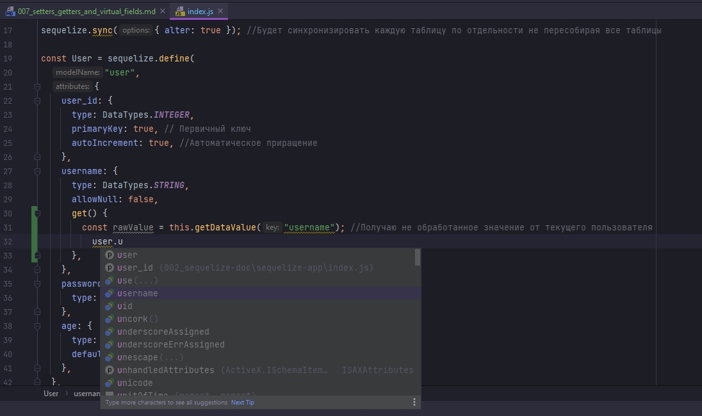

Или там где мы внизу делаем запрос на поиск **findAll**, **FindOne** и т.д.

Основная цель геттера в определении модели это исключить точечный синтаксис. Потому что если я сделаю вот так,смотри ниже, это приведет к бесконечному циклу.

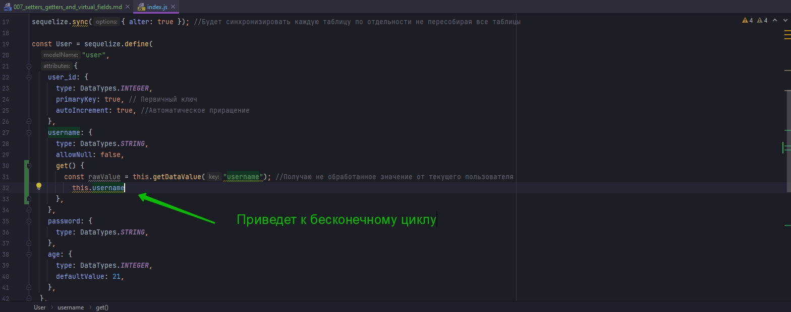

Но так как мы теперь извлекли не измененное значение в переменную **rawValue**. Теперь я просто могу вернуть данную переменную и применить к ней функцию **toUpperCase**.

````js
const Sequelize = require("sequelize");
const { log } = require("nodemon/lib/utils");
const { where } = require("sequelize");
const { DataTypes, Op } = Sequelize;

// DB=network
// USER=asu8
// PASSWORD=123
// DIALECT=mysql
// HOST=10.178.4.52

const sequelize = new Sequelize("network", "asu8", "123", {
  host: "10.178.4.52",
  dialect: "mysql",
}); // создаю экземпляр класса

sequelize.sync({ alter: true }); //Будет синхронизировать каждую таблицу по отдельности не пересобирая все таблицы

const User = sequelize.define(
  "user",
  {
    user_id: {
      type: DataTypes.INTEGER,
      primaryKey: true, // Первичный ключ
      autoIncrement: true, //Автоматическое приращение
    },
    username: {
      type: DataTypes.STRING,
      allowNull: false,
      get() {
        const rawValue = this.getDataValue("username"); //Получаю не обработанное значение от текущего пользователя
        return rawValue.toUpperCase();
      },
    },
    password: {
      type: DataTypes.STRING,
    },
    age: {
      type: DataTypes.INTEGER,
      defaultValue: 21,
    },
  },

  {
    freezeTableName: true, // указываю что бы имя нашей модели совпадало с именем нашей таблицы
  }
); // Определяю модель пользователей
User.sync({ alter: true })
  .then(() => {
    return User.findOne();
  })
  .then((data) => {
    console.log(data.username);
  })
  .catch((error) => {
    console.log(error);
  });

````

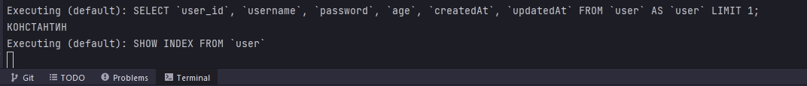

Яросто хочу повторить что это на самом деле не мешает данным которые помещаются в нашу БД. Это влияет только на то как они отображаются.

<br/>
<br/>
<br/>

# Setters_and_Securing_Passwords_with_Bcrypt

Теперь допустим мы хотим изменить наши данные прежде чем они будут отправлены в таблицу. Для этого мы будем использовать **setters**. И как я упоменал ранее это решение если вы хотите захешировать пароль.

Данная функция извлекает значения которые собираюся вставится в таблицу и помещается в **setter** в качестве аргумента или парамера 

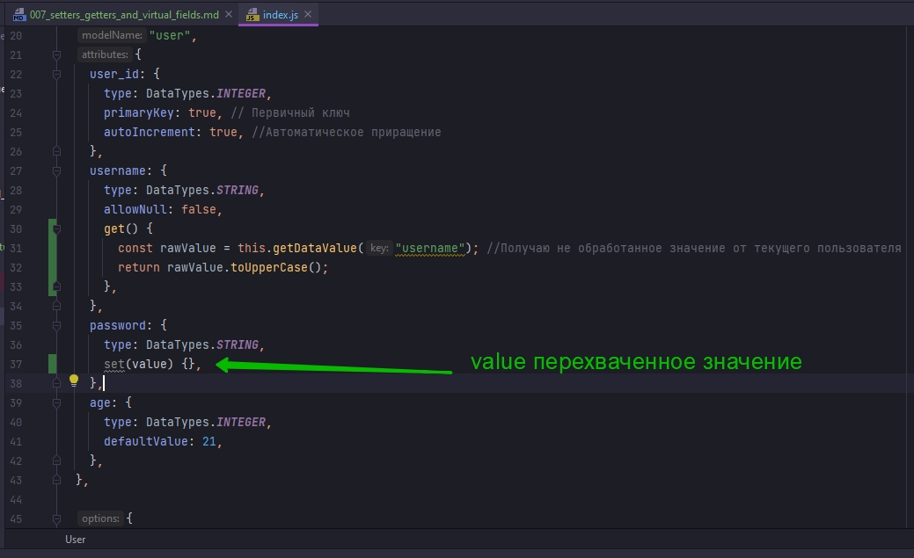

Затем мы можем изменить значение так, как мы этого хотим, и сохранить измененное значение в нашей БД. По этому я вызываю функцию **this.setDataValue()**, первым параметром указываю столбец в который будут отправлены данные, а вторым параметром указываю то что мы хотим отправить **hash**. Второй параметр это переменная с именем **hash**.

Но до отправки этих данных мне нужно захэшировать пароль.

**bcrypt** - это модуль, который помогает нам хэшировать пароли

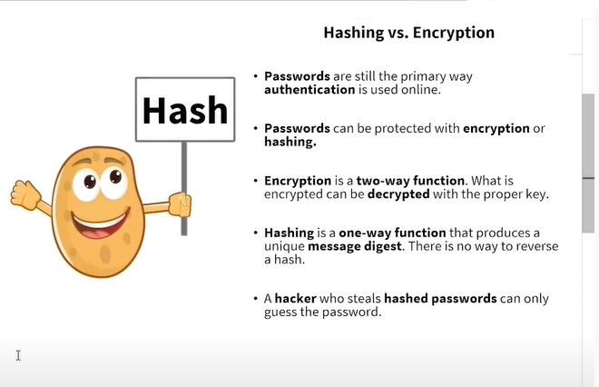

```shell
npm install bcrypt
```

Самое время упомянуть что **getters** и **setters** в **sequelize** не потдерживают асинхронные функции. По этому мы не можем использовать какие либо функции в этих методах, которые являюся асинхронными. Поэтому мы должны использовать синхронную версию методов **bcrypt**. Не беспокойтесь я покажу способ решения этой проблемы и мы будем шифровать пароли асинхронно.

В **setter** создаю функцию **salt**. В значении вызываю **bcrypt** и вызываю функцию **genSaltSync()**. И передаю любое цифровое значение. Это то коичество раз которое будет хэшироваться пароль. К примеру число **12**. 

Далее создаю переменную с именем **hash**. В значении ана принимает **bcrypt.hashSync()**, передаю **value**, и вторым параметром передаю **salt** который мы сгенерировалию.

```js
const Sequelize = require("sequelize");
const { DataTypes, Op } = Sequelize;
const bcrypt = require("bcrypt");

// DB=network
// USER=asu8
// PASSWORD=123
// DIALECT=mysql
// HOST=10.178.4.52

const sequelize = new Sequelize("network", "asu8", "123", {
  host: "10.178.4.52",
  dialect: "mysql",
}); // создаю экземпляр класса

sequelize.sync({ alter: true }); //Будет синхронизировать каждую таблицу по отдельности не пересобирая все таблицы

const User = sequelize.define(
  "user",
  {
    user_id: {
      type: DataTypes.INTEGER,
      primaryKey: true, // Первичный ключ
      autoIncrement: true, //Автоматическое приращение
    },
    username: {
      type: DataTypes.STRING,
      allowNull: false,
      get() {
        const rawValue = this.getDataValue("username"); //Получаю не обработанное значение от текущего пользователя
        return rawValue.toUpperCase();
      },
    },
    password: {
      type: DataTypes.STRING,
      set(value) {
        const salt = bcrypt.genSaltSync(12);
        const hash = bcrypt.hashSync(value, salt); // мфдгу переданное значение salt захэшированный пароль
        this.setDataValue("password", hash);
      },
    },
    age: {
      type: DataTypes.INTEGER,
      defaultValue: 21,
    },
  },

  {
    freezeTableName: true, // указываю что бы имя нашей модели совпадало с именем нашей таблицы
  }
); // Определяю модель пользователей
User.sync({ alter: true })
  .then(() => {
    return User.findOne();
  })
  .then((data) => {
    console.log(data.username);
  })
  .catch((error) => {
    console.log(error);
  });

```

Для того что бы сохранить захэшированный пароль мне нужно использовать функцию сравнения для того что бы сравнить хэшированный пароль с введенным паролем.

Теперь давайте создадим пользователя


```js
const Sequelize = require("sequelize");
const { DataTypes, Op } = Sequelize;
const bcrypt = require("bcrypt");

// DB=network
// USER=asu8
// PASSWORD=123
// DIALECT=mysql
// HOST=10.178.4.52

const sequelize = new Sequelize("network", "asu8", "123", {
  host: "10.178.4.52",
  dialect: "mysql",
}); // создаю экземпляр класса

sequelize.sync({ alter: true }); //Будет синхронизировать каждую таблицу по отдельности не пересобирая все таблицы

const User = sequelize.define(
  "user",
  {
    user_id: {
      type: DataTypes.INTEGER,
      primaryKey: true, // Первичный ключ
      autoIncrement: true, //Автоматическое приращение
    },
    username: {
      type: DataTypes.STRING,
      allowNull: false,
      get() {
        const rawValue = this.getDataValue("username"); //Получаю не обработанное значение от текущего пользователя
        return rawValue.toUpperCase();
      },
    },
    password: {
      type: DataTypes.STRING,
      set(value) {
        const salt = bcrypt.genSaltSync(12);
        const hash = bcrypt.hashSync(value, salt); // мфдгу переданное значение salt захэшированный пароль
        this.setDataValue("password", hash);
      },
    },
    age: {
      type: DataTypes.INTEGER,
      defaultValue: 21,
    },
  },

  {
    freezeTableName: true, // указываю что бы имя нашей модели совпадало с именем нашей таблицы
  }
); // Определяю модель пользователей
User.sync({ alter: true })
  .then(() => {
    return User.create({
      username: "Михаил",
      password: "cappuccino",
    });
  })
  .then((data) => {
    console.log('NAME',data.username);
    console.log('PASSWORD',data.password);
  })
  .catch((error) => {
    console.log(error);
  });

```

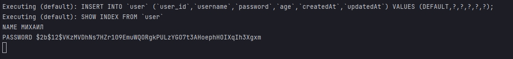

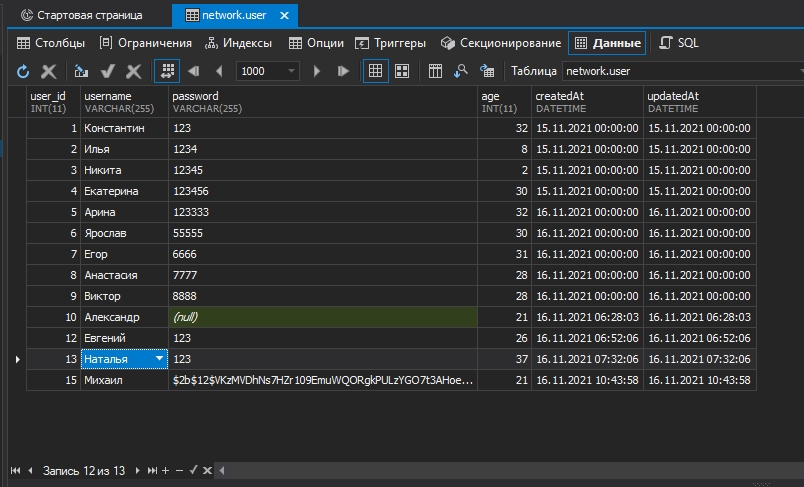

Теперь следующее что мы собираемся сделать это объеденить геттер и сеттер.

<br/>
<br/>
<br/>

# Combining_Setters_and_Getters

Мы можем использовать для одного поля как **getter** так и **setter**. хороший пример для этого например хранение сообщейний пользователей или чего либо того что может быть потенциально длинным в нашу БД. И что мы могли бы сделать? Мы можем использовать **setter** для сжатия данных или другими словами, сделать их меньше, прежде чем вставить их в БД. А затем мы могли бы использовать **getter** для распаковки данных. Когда мы их извлекаем. Что вернет их к исходной форме.

Сжатие и распаковка - это хорошо когда вы храните что-то, например описания или сообщения в своей БД. Потому что вы не хотите, что бы они занимали слишком много места. Другими словами сжатие определенных значений данных может улучшить использование памяти. Однако большинство современных БД автоматически некоторую форму сжатия.  Это большой пример того что мы могли бы сделать с помощью геттера и сеттера. Но в любом случае допустим что у нас есть еще один столбец в нашей таблице под названием **description**

```js
const Sequelize = require("sequelize");
const { DataTypes, Op } = Sequelize;
const bcrypt = require("bcrypt");

// DB=network
// USER=asu8
// PASSWORD=123
// DIALECT=mysql
// HOST=10.178.4.52

const sequelize = new Sequelize("network", "asu8", "123", {
  host: "10.178.4.52",
  dialect: "mysql",
}); // создаю экземпляр класса

sequelize.sync({ alter: true }); //Будет синхронизировать каждую таблицу по отдельности не пересобирая все таблицы

const User = sequelize.define(
  "user",
  {
    user_id: {
      type: DataTypes.INTEGER,
      primaryKey: true, // Первичный ключ
      autoIncrement: true, //Автоматическое приращение
    },
    username: {
      type: DataTypes.STRING,
      allowNull: false,
      get() {
        const rawValue = this.getDataValue("username"); //Получаю не обработанное значение от текущего пользователя
        return rawValue.toUpperCase();
      },
    },
    password: {
      type: DataTypes.STRING,
      set(value) {
        const salt = bcrypt.genSaltSync(12);
        const hash = bcrypt.hashSync(value, salt); // мфдгу переданное значение salt захэшированный пароль
        this.setDataValue("password", hash);
      },
    },
    age: {
      type: DataTypes.INTEGER,
      defaultValue: 21,
    },
    description: {
      type: DataTypes.STRING,
    },
  },

  {
    freezeTableName: true, // указываю что бы имя нашей модели совпадало с именем нашей таблицы
  }
); // Определяю модель пользователей
User.sync({ alter: true })
  .then(() => {
    return User.create({
      username: "Михаил",
      password: "cappuccino",
    });
  })
  .then((data) => {
    console.log("NAME", data.username);
    console.log("PASSWORD", data.password);
  })
  .catch((error) => {
    console.log(error);
  });

```

И так в **description** мы используем тип данных **varchar255**. Я хочу сжимать его, когда он храниться  в БД. И расспаковывать его мы извлекаем данные. И теперь что бы выполнить это сжатие и распаковку мы собираемся импортировать модуль известный как **zlib**, который используется  для добавления сжатых функций в наше приложение. 

```shell
npm install zlib
```

Пишу **setter** в **description**. Первое что мы собираемся сделать это сжать наши данные с помощью метода синхронизации **deflate**. Так как **getter** и **setter** могут работать только с синхронными функциями. Поэтому мы должны  использовать синхронные методы **zlib**.

Создаю переменную **compressed**. В ее значении указываю **zlib.deflateSync()** передаю туду **value**. И следовательно что делает **deflateSync** - это буфер который может быть буферным объектом, типизированным массивом


```js
const Sequelize = require("sequelize");
const { DataTypes, Op } = Sequelize;
const bcrypt = require("bcrypt");
const zlib = require("zlib");
const { deflateSync } = require("zlib");

// DB=network
// USER=asu8
// PASSWORD=123
// DIALECT=mysql
// HOST=10.178.4.52

const sequelize = new Sequelize("network", "asu8", "123", {
  host: "10.178.4.52",
  dialect: "mysql",
}); // создаю экземпляр класса

sequelize.sync({ alter: true }); //Будет синхронизировать каждую таблицу по отдельности не пересобирая все таблицы

const User = sequelize.define(
  "user",
  {
    user_id: {
      type: DataTypes.INTEGER,
      primaryKey: true, // Первичный ключ
      autoIncrement: true, //Автоматическое приращение
    },
    username: {
      type: DataTypes.STRING,
      allowNull: false,
      get() {
        const rawValue = this.getDataValue("username"); //Получаю не обработанное значение от текущего пользователя
        return rawValue.toUpperCase();
      },
    },
    password: {
      type: DataTypes.STRING,
      set(value) {
        const salt = bcrypt.genSaltSync(12);
        const hash = bcrypt.hashSync(value, salt); // мфдгу переданное значение salt захэшированный пароль
        this.setDataValue("password", hash);
      },
    },
    age: {
      type: DataTypes.INTEGER,
      defaultValue: 21,
    },
    description: {
      type: DataTypes.STRING,
      set(value) {
        const compressed = zlib.deflateSync(value).toString("base64");
      },
    },
  },

  {
    freezeTableName: true, // указываю что бы имя нашей модели совпадало с именем нашей таблицы
  }
); // Определяю модель пользователей
User.sync({ alter: true })
  .then(() => {
    return User.create({
      username: "Михаил",
      password: "cappuccino",
    });
  })
  .then((data) => {
    console.log("NAME", data.username);
    console.log("PASSWORD", data.password);
  })
  .catch((error) => {
    console.log(error);
  });

```

**base64** - является типом кодирования для преобразования двоичных данных в текст.

Как установить значение данных с помощью нашего метода набора значений данных. Обращаюсь к **this.setValue()**. Первым параметром указываю столбец **'description'**, вторым параметром указываю переменную **compressed**

```js
const Sequelize = require("sequelize");
const { DataTypes, Op } = Sequelize;
const bcrypt = require("bcrypt");
const zlib = require("zlib");
const { deflateSync } = require("zlib");

// DB=network
// USER=asu8
// PASSWORD=123
// DIALECT=mysql
// HOST=10.178.4.52

const sequelize = new Sequelize("network", "asu8", "123", {
  host: "10.178.4.52",
  dialect: "mysql",
}); // создаю экземпляр класса

sequelize.sync({ alter: true }); //Будет синхронизировать каждую таблицу по отдельности не пересобирая все таблицы

const User = sequelize.define(
  "user",
  {
    user_id: {
      type: DataTypes.INTEGER,
      primaryKey: true, // Первичный ключ
      autoIncrement: true, //Автоматическое приращение
    },
    username: {
      type: DataTypes.STRING,
      allowNull: false,
      get() {
        const rawValue = this.getDataValue("username"); //Получаю не обработанное значение от текущего пользователя
        return rawValue.toUpperCase();
      },
    },
    password: {
      type: DataTypes.STRING,
      set(value) {
        const salt = bcrypt.genSaltSync(12);
        const hash = bcrypt.hashSync(value, salt); // мфдгу переданное значение salt захэшированный пароль
        this.setDataValue("password", hash);
      },
    },
    age: {
      type: DataTypes.INTEGER,
      defaultValue: 21,
    },
    description: {
      type: DataTypes.STRING,
      set(value) {
        const compressed = zlib.deflateSync(value).toString("base64");
        this.setDataValue("description", compressed);
      },
    },
  },

  {
    freezeTableName: true, // указываю что бы имя нашей модели совпадало с именем нашей таблицы
  }
); // Определяю модель пользователей
User.sync({ alter: true })
  .then(() => {
    return User.create({
      username: "Михаил",
      password: "cappuccino",
    });
  })
  .then((data) => {
    console.log("NAME", data.username);
    console.log("PASSWORD", data.password);
  })
  .catch((error) => {
    console.log(error);
  });

```

**Setter** готов. Теперь поработаем с **getter**. Добавляем getter который не принимает параметров. Здесь мы собираемся распаковать данные и отобразить исходный текст. **const value = this.getDataValue("description");** И далее для распаковки я использую метод **inflateSync**. Просто создаю переменную **uncompressed**. Обращаюсь к **zlib** и вызываю **inflateSync**. В качестве первого аргумента потребуется буфер. Для нас этот **buffer** будет создан из **description** хранящийся в БД. Передаю параметром **Buffer** вызываю функцию **from()**. **Buffer.from()** используется для создания нового **buffer**. Первым аргументом мы передаем значение строки **value**. Затем я хочу снова закодировать его в **base64**. И затем наконец мы хотим вернуть наши не сжатые данные.


```js
const Sequelize = require("sequelize");
const { DataTypes, Op } = Sequelize;
const bcrypt = require("bcrypt");
const zlib = require("zlib");
const { deflateSync } = require("zlib");

// DB=network
// USER=asu8
// PASSWORD=123
// DIALECT=mysql
// HOST=10.178.4.52

const sequelize = new Sequelize("network", "asu8", "123", {
  host: "10.178.4.52",
  dialect: "mysql",
}); // создаю экземпляр класса

sequelize.sync({ alter: true }); //Будет синхронизировать каждую таблицу по отдельности не пересобирая все таблицы

const User = sequelize.define(
  "user",
  {
    user_id: {
      type: DataTypes.INTEGER,
      primaryKey: true, // Первичный ключ
      autoIncrement: true, //Автоматическое приращение
    },
    username: {
      type: DataTypes.STRING,
      allowNull: false,
      get() {
        const rawValue = this.getDataValue("username"); //Получаю не обработанное значение от текущего пользователя
        return rawValue.toUpperCase();
      },
    },
    password: {
      type: DataTypes.STRING,
      set(value) {
        const salt = bcrypt.genSaltSync(12);
        const hash = bcrypt.hashSync(value, salt); // мфдгу переданное значение salt захэшированный пароль
        this.setDataValue("password", hash);
      },
    },
    age: {
      type: DataTypes.INTEGER,
      defaultValue: 21,
    },
    description: {
      type: DataTypes.STRING,
      set(value) {
        const compressed = zlib.deflateSync(value).toString("base64");
        this.setDataValue("description", compressed);
      },
      get() {
        const value = this.getDataValue("description");
        const uncompressed = zlib.inflateSync(Buffer.from(value, "base64"));
        return uncompressed;
      },
    },
  },

  {
    freezeTableName: true, // указываю что бы имя нашей модели совпадало с именем нашей таблицы
  }
); // Определяю модель пользователей
User.sync({ alter: true })
  .then(() => {
    return User.create({
      username: "Михаил",
      password: "cappuccino",
    });
  })
  .then((data) => {
    console.log("NAME", data.username);
    console.log("PASSWORD", data.password);
  })
  .catch((error) => {
    console.log(error);
  });

```


И теперь давайте создадим пользователя с описанием.

```js
const Sequelize = require("sequelize");
const { DataTypes, Op } = Sequelize;
const bcrypt = require("bcrypt");
const zlib = require("zlib");
const { deflateSync } = require("zlib");

// DB=network
// USER=asu8
// PASSWORD=123
// DIALECT=mysql
// HOST=10.178.4.52

const sequelize = new Sequelize("network", "asu8", "123", {
  host: "10.178.4.52",
  dialect: "mysql",
}); // создаю экземпляр класса

sequelize.sync({ alter: true }); //Будет синхронизировать каждую таблицу по отдельности не пересобирая все таблицы

const User = sequelize.define(
  "user",
  {
    user_id: {
      type: DataTypes.INTEGER,
      primaryKey: true, // Первичный ключ
      autoIncrement: true, //Автоматическое приращение
    },
    username: {
      type: DataTypes.STRING,
      allowNull: false,
      get() {
        const rawValue = this.getDataValue("username"); //Получаю не обработанное значение от текущего пользователя
        return rawValue.toUpperCase();
      },
    },
    password: {
      type: DataTypes.STRING,
      set(value) {
        const salt = bcrypt.genSaltSync(12);
        const hash = bcrypt.hashSync(value, salt); // мфдгу переданное значение salt захэшированный пароль
        this.setDataValue("password", hash);
      },
    },
    age: {
      type: DataTypes.INTEGER,
      defaultValue: 21,
    },
    description: {
      type: DataTypes.STRING,
      set(value) {
        const compressed = zlib.deflateSync(value).toString("base64");
        this.setDataValue("description", compressed);
      },
      get() {
        const value = this.getDataValue("description");
        const uncompressed = zlib.inflateSync(Buffer.from(value, "base64"));
        return uncompressed;
      },
    },
  },

  {
    freezeTableName: true, // указываю что бы имя нашей модели совпадало с именем нашей таблицы
  }
); // Определяю модель пользователей
User.sync({ alter: true })
  .then(() => {
    return User.create({
      username: "Константин",
      password: "smart",
      description: "Это мое описание, оно может быть очень длиным",
    });
  })
  .then((data) => {
    console.log("NAME:", data.username);
    console.log("PASSWORD:", data.password);
    console.log("DESCRIPTION:", data.description);
  })
  .catch((error) => {
    console.log(error);
  });

```


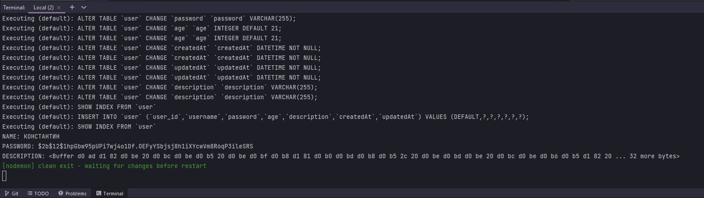

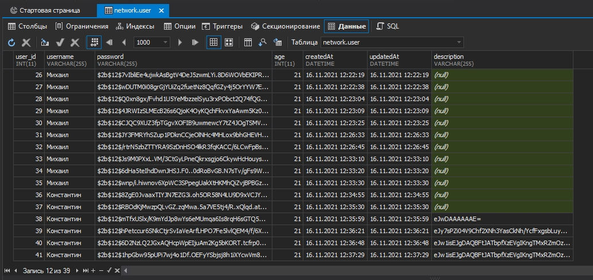

Наш **getter** работает не правильно. Для этого возвращаемое значение **uncompressed** привожу к строке **toString**. Он превратит этот **buffer object** в строку 

```js
const Sequelize = require("sequelize");
const { DataTypes, Op } = Sequelize;
const bcrypt = require("bcrypt");
const zlib = require("zlib");
const { deflateSync } = require("zlib");

// DB=network
// USER=asu8
// PASSWORD=123
// DIALECT=mysql
// HOST=10.178.4.52

const sequelize = new Sequelize("network", "asu8", "123", {
  host: "10.178.4.52",
  dialect: "mysql",
}); // создаю экземпляр класса

sequelize.sync({ alter: true }); //Будет синхронизировать каждую таблицу по отдельности не пересобирая все таблицы

const User = sequelize.define(
  "user",
  {
    user_id: {
      type: DataTypes.INTEGER,
      primaryKey: true, // Первичный ключ
      autoIncrement: true, //Автоматическое приращение
    },
    username: {
      type: DataTypes.STRING,
      allowNull: false,
      get() {
        const rawValue = this.getDataValue("username"); //Получаю не обработанное значение от текущего пользователя
        return rawValue.toUpperCase();
      },
    },
    password: {
      type: DataTypes.STRING,
      set(value) {
        const salt = bcrypt.genSaltSync(12);
        const hash = bcrypt.hashSync(value, salt); // мфдгу переданное значение salt захэшированный пароль
        this.setDataValue("password", hash);
      },
    },
    age: {
      type: DataTypes.INTEGER,
      defaultValue: 21,
    },
    description: {
      type: DataTypes.STRING,
      set(value) {
        const compressed = zlib.deflateSync(value).toString("base64");
        this.setDataValue("description", compressed);
      },
      get() {
        const value = this.getDataValue("description");
        const uncompressed = zlib.inflateSync(Buffer.from(value, "base64")); //расспаковываю
        return uncompressed.toString(); // привожу buffer object к строке
      },
    },
  },

  {
    freezeTableName: true, // указываю что бы имя нашей модели совпадало с именем нашей таблицы
  }
); // Определяю модель пользователей
User.sync({ alter: true })
  .then(() => {
    return User.create({
      username: "Константин",
      password: "smart",
      description: "Это мое описание, оно может быть очень длиным",
    });
  })
  .then((data) => {
    console.log("NAME:", data.username);
    console.log("PASSWORD:", data.password);
    console.log("DESCRIPTION:", data.description);
  })
  .catch((error) => {
    console.log(error);
  });

```

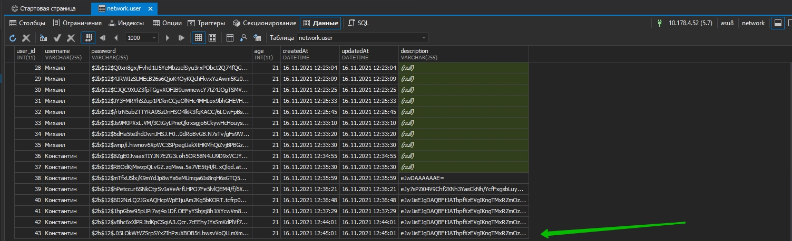

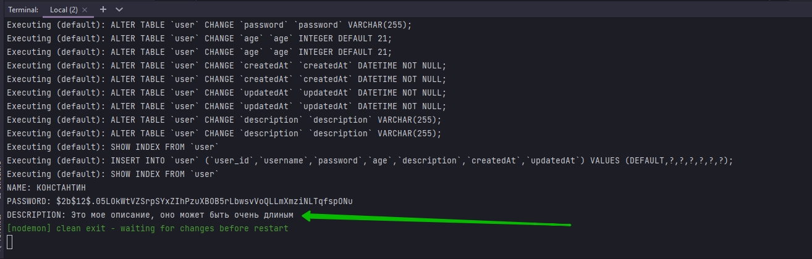


<br/>
<br/>
<br/>

# Virtual_Fields

Виртуальные поля это поля которые **sequelize** заполняет под капотом. Но они не храняться в нашей БД. Их обычное использование - это объединение различных атрибутов. Например мы хотим получить наше имя пользователя и описание вместе. 

Мы можем создать виртуальное поле с каким-нибудь именем. 

Создаю столбец **aboutUser**. Тип данных указываю **VIRTUAL**. И Именно из-за этого типа данных в БД не будет создаваться дополнительный столбец. После указания типа данных я создаю **getter** для объединения username и **description**

```js
const Sequelize = require("sequelize");
const { DataTypes, Op } = Sequelize;
const bcrypt = require("bcrypt");
const zlib = require("zlib");

// DB=network
// USER=asu8
// PASSWORD=123
// DIALECT=mysql
// HOST=10.178.4.52

const sequelize = new Sequelize("network", "asu8", "123", {
  host: "10.178.4.52",
  dialect: "mysql",
}); // создаю экземпляр класса

sequelize.sync({ alter: true }); //Будет синхронизировать каждую таблицу по отдельности не пересобирая все таблицы

const User = sequelize.define(
  "user",
  {
    user_id: {
      type: DataTypes.INTEGER,
      primaryKey: true, // Первичный ключ
      autoIncrement: true, //Автоматическое приращение
    },
    username: {
      type: DataTypes.STRING,
      allowNull: false,
      get() {
        const rawValue = this.getDataValue("username"); //Получаю не обработанное значение от текущего пользователя
        return rawValue.toUpperCase();
      },
    },
    password: {
      type: DataTypes.STRING,
      set(value) {
        const salt = bcrypt.genSaltSync(12);
        const hash = bcrypt.hashSync(value, salt); // мфдгу переданное значение salt захэшированный пароль
        this.setDataValue("password", hash);
      },
    },
    age: {
      type: DataTypes.INTEGER,
      defaultValue: 21,
    },
    description: {
      type: DataTypes.STRING,
      set(value) {
        const compressed = zlib.deflateSync(value).toString("base64");
        this.setDataValue("description", compressed);
      },
      get() {
        const value = this.getDataValue("description");
        const uncompressed = zlib.inflateSync(Buffer.from(value, "base64")); //расспаковываю
        return uncompressed.toString(); // привожу buffer object к строке
      },
    },
    aboutUser: {
      type: DataTypes.VIRTUAL,
      get() {
        return `${this.username} ${this.description}`;
      },
    },
  },

  {
    freezeTableName: true, // указываю что бы имя нашей модели совпадало с именем нашей таблицы
  }
); // Определяю модель пользователей
User.sync({ alter: true })
  .then(() => {
    return User.findOne({ where: { username: "Константин" } });
  })
  .then((data) => {
    console.log(data.aboutUser);
  })
  .catch((error) => {
    console.log(error);
  });

```

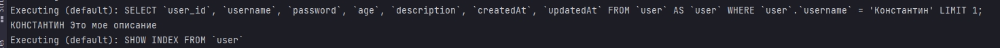