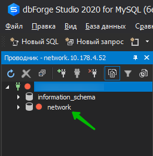
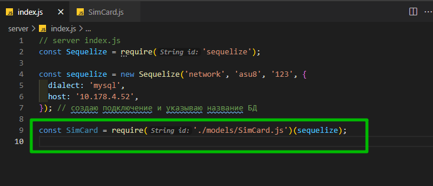
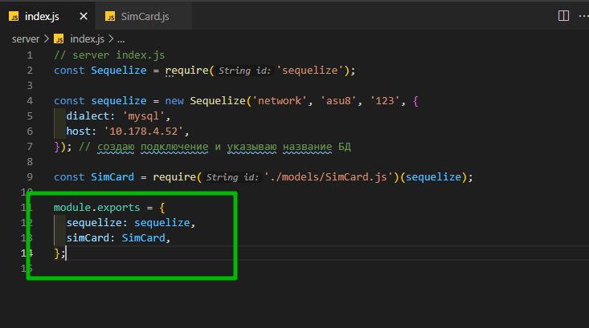

# sequelize

Создаю директорию server и в ней инициализирую проект

```shell
npm init -y
```

```shell
npm i sequelize
```

Далее я должен описать подключение к БД и создать модель. Создаю index.js.

Первым делом я подключаю sequelize

```js
// server index.js
const Sequelize = require('sequelize');
```

Далее я должен создать новое подключение. создаю его с маленькой буквы.



```js
// server index.js
const Sequelize = require('sequelize');

const sequelize = new Sequelize('network'); // создаю подключение и указываю название БД
```

Далее, вторым параметром, я должен указать имя пользователя.

```js
// server index.js
const Sequelize = require('sequelize');

const sequelize = new Sequelize('network', 'asu8'); // создаю подключение и указываю название БД
```

И третьим параметром указываю пароль.

```js
// server index.js
const Sequelize = require('sequelize');

const sequelize = new Sequelize('network', 'asu8', '123'); // создаю подключение и указываю название БД
```

Четвертый параметр это это объект в котором указываю параметры подключения.

Указываю тип БД т.е. dialect.

```js
// server index.js
const Sequelize = require('sequelize');

const sequelize = new Sequelize('network', 'asu8', '123', {
  dialect: 'mysql',
}); // создаю подключение и указываю название БД
```

Далее указываю host т.е. где БД хостится. Если на сервере то соответственно адрес сервера, либо ip адрес.

```js
// server index.js
const Sequelize = require('sequelize');

const sequelize = new Sequelize('network', 'asu8', '123', {
  dialect: 'mysql',
  host: '10.178.4.52',
}); // создаю подключение и указываю название БД
```

Этого достаточно для подключения.

Мне нужно подключить БД к NodeJS.

Но у меня есть таблица которую я должен описать. Создаю директория models а в ней SimCard.js. Это модель таблицы sequelize.

Подключаю sequelize, создаю функция в параметр которой передаю все настройки sequelize.

```js
// models SimCard.js
const Sequelize = require('sequelize');

module.exports = function (sequelize) {};
```

В теле функции возвращаю sequelize.define() где определяю новую модель. Обычно, модели именуются в единственном числе. Модель будет называться SimCard

```js
// models SimCard.js
const Sequelize = require('sequelize');

module.exports = function (sequelize) {
  return sequelize.define('SimCard');
};
```

Кто-то рекомендует называть имя модели и имя таблицы одинаково. А кто-то рекомендует называть имя модели в едиственном числе а название таблицы во множественном.

Дальше я должен описать эту таблицу в понятии модели.

Первый столбец id.

```js
// models SimCard.js
const Sequelize = require('sequelize');

module.exports = function (sequelize) {
  return sequelize.define('SimCard', {
    id: {},
  });
};
```

В него входит type - это тип данных. Sequelize.INTEGER

```js
// models SimCard.js
const Sequelize = require('sequelize');

module.exports = function (sequelize) {
  return sequelize.define('SimCard', {
    id: {
      type: Sequelize.INTEGER,
      autoIncrement: true,
      primaryKey: true,
      allowNull: false,
    },
  });
};
```

```js
// models SimCard.js
const Sequelize = require('sequelize');

module.exports = function (sequelize) {
  return sequelize.define('SimCard', {
    id: {
      type: Sequelize.INTEGER,
      autoIncrement: true,
      primaryKey: true,
      allowNull: false,
    },
    operator: {
      type: Sequelize.STRING,
      allowNull: true,
    },
    number: {
      type: Sequelize.STRING,
      allowNull: true,
    },
  });
};
```

Все это я описал, но есть одно маленькое НО. По умолчанию sequelize будет записывать время создания и перезаписывание строк. Это очень классная функция которая нужна если вы серьезно работаете с данными.

Когда учебный проект тогда timestamp: false.

```js
// models SimCard.js
const Sequelize = require('sequelize');

module.exports = function (sequelize) {
  return sequelize.define(
    'SimCard',
    {
      id: {
        type: Sequelize.INTEGER,
        autoIncrement: true,
        primaryKey: true,
        allowNull: false,
      },
      operator: {
        type: Sequelize.STRING,
        allowNull: true,
      },
      number: {
        type: Sequelize.STRING,
        allowNull: true,
      },
    },
    {
      // создаются поля создания и обновления строк
      timestamp: false,
    }
  );
};
```

И так у меня получился модуль который я должен возвратить в к подключению к базе.
Подключаю файл и передаю параметр sequilize.

```js
// server index.js
const Sequelize = require('sequelize');

const sequelize = new Sequelize('network', 'asu8', '123', {
  dialect: 'mysql',
  host: '10.178.4.52',
}); // создаю подключение и указываю название БД

const SimCard = require('./models/SimCard.js')(sequelize);
```

Теперь вот здесь у меня находится сама модель с которой я могу работать.



И далее в module.exports я возвращаю параметры.



```js
// server index.js
const Sequelize = require('sequelize');

const sequelize = new Sequelize('network', 'asu8', '123', {
  dialect: 'mysql',
  host: '10.178.4.52',
}); // создаю подключение и указываю название БД

const SimCard = require('./models/SimCard.js')(sequelize);

module.exports = {
  sequelize: sequelize,
  simCard: SimCard,
};
```
