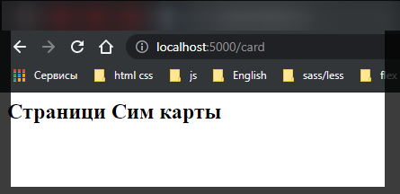

# express

И так всегда изначалоьно настраиваю express.

```shell
npm i express
```

```js
// server index.js

// подключаю express
const express = require('express');

// создаю объект приложения

const app = express();

// определяю обработчик маршрута
app.get('/', function (req, res) {
  res.send('<h2>Привет Express</h2>');
});

// прослушиваю порт

app.listen(5000);
```

Устанавливаю nodemon

```shell
npm install nodemon
```

```json
{
  "name": "server",
  "version": "1.0.0",
  "main": "index.js",
  "scripts": {
    "dev": "nodemon index.js"
  },
  "keywords": [],
  "author": "",
  "license": "ISC",
  "description": "",
  "dependencies": {
    "express": "^4.17.1",
    "nodemon": "^2.0.12",
    "sequelize": "^6.6.5"
  }
}
```


```js
// server index.js

// подключаю express
const express = require('express');

// создаю объект приложения

const app = express();

// определяю обработчик маршрута
app.get('/', function (req, res) {
  res.send('<h2>Главная страница</h2>');
});

app.get('/card', function (req, res) {
  res.send('<h2>Страници Сим карты</h2>');
});

// прослушиваю порт

app.listen(5000);
```



Express получает запрос, этот запрос попадает в конвеер обработки. Конвеер состоит из набора компонентов или middleware, которые получают данные запроса и решают как его обработать.

Для того что бы добавить middleware в функции добавляю третий параметр next и после отработки middleware в теле функции вызываю функцию next для перехода к следующему по цепочке middleware.

```js
// server index.js

// подключаю express
const express = require('express');

// создаю объект приложения

const app = express();

// вспомогательные функции middleware
app.use(function (req, res, next) {
  console.log('Middleware 1');
  next();
});

app.use(function (req, res, next) {
  console.log('Middleware 2');
  next();
});

// определяю обработчик маршрута
app.get('/', function (req, res) {
  res.send('<h2>Главная страница</h2>');
});

app.get('/card', function (req, res) {
  res.send('<h2>Страници Сим карты</h2>');
});

// прослушиваю порт

app.listen(5000);
```

В консоли браузера не выводится, а вот в терминале IDE все как надо быть.


Однако не обязательно вызвать все последующие middleware. Для того что бы остановить обработку. просто удаляю функцию вызова next().

```js
// server index.js

// подключаю express
const express = require('express');

// создаю объект приложения

const app = express();

// вспомогательные функции middleware
app.use(function (req, res, next) {
  console.log('Middleware 1');
  // next(); останавливаю вызов следующего middleware
});

app.use(function (req, res, next) {
  console.log('Middleware 2');
  next();
});

// определяю обработчик маршрута
app.get('/', function (req, res) {
  res.send('<h2>Главная страница</h2>');
});

app.get('/card', function (req, res) {
  res.send('<h2>Страници Сим карты</h2>');
});

// прослушиваю порт

app.listen(5000);
```


Так же функции middleware могут сопостовлятся с определенными маршрутами.

```js
// server index.js

// подключаю express
const express = require('express');

// создаю объект приложения

const app = express();

// вспомогательные функции middleware
app.use(function (req, res, next) {
  console.log('Middleware 1');
  next();
  // next(); останавливаю вызов следующего middleware
});

app.use(function (req, res, next) {
  console.log('Middleware 2');
  next();
});

// определяю обработчик маршрута
app.get('/', function (req, res, next) {
  console.log('middleware сопоставленный с маршрутом');
  res.send('<h2>Главная страница</h2>');
  next();
});

app.get('/card', function (req, res) {
  res.send('<h2>Страници Сим карты</h2>');
});

// прослушиваю порт

app.listen(5000);
```


