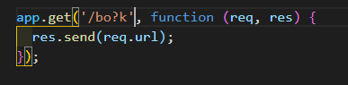
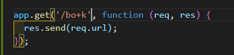
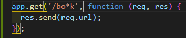
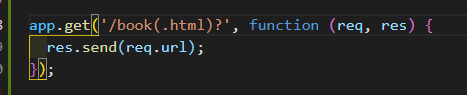
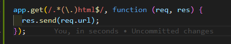

# Машрутизация

При обработке запросов **Express** опирается на систему маршрутизации. В приложении определяются маршруты, а так же обработчики этих маршрутов. Если маршрут соответствует определенному маршруту, то вызывается для обработки запроса соответствующий обработчик.

Для обработки данных по определенному маршруту можно использовать ряд функций, в частности:

- **use**
- **get**
- **post**
- **put**
- **delete**

В качестве первого параметра эти функции могут принимать шаблон адреса, запрос по которому будет обрабатываться. Второй параметр функций представляет функцию, которая будет обрабатывать запрос по совпавшему с шаблоном адресу. Например:

```js
// server index.js

// подключаю express
const express = require('express');

// создаю объект приложения
const app = express();

// Обработка статических файлов
app.use('/static', express.static(__dirname + '/public'));

// Обработка по адресу /about
app.get('/about', function (req, res) {
  res.send('<h1>О сайте</h1>');
});

// Обработка по адресу /contact
app.use('/contact', function (req, res) {
  res.send('<h1>Контакты</h1>');
});
// обработка запроса к корню веб-сайта
app.use('/', function (req, res) {
  res.send('<h1>Главная страница</h1>');
});

// прослушиваю порт
app.listen(5000);
```

Когда происходит запрос **Express** сопостовляет запрошенный адресс с каждым из маршрутов. Затем выбирается первый совпавший маршрут. При совпадении маршрута вызывается его функция обработчика.

<br/>
<br/>
<br/>

**Символы подстановок**

<br/>
<br/>

Используемые шаблоны адресов могут содержать регулярные выражения или специальные символы подстановок. В частности мы можем использовать такие символы как **?** , **+** ,**\*** и **()**

К примеру символ **?** указывает что предыдущий символ может встречаться 1 раз или отсутствовать. И мы можем определить следующую функцию.



```js
// server index.js

// подключаю express
const express = require('express');

// создаю объект приложения
const app = express();

// Обработка статических файлов
app.use('/static', express.static(__dirname + '/public'));

// Обработка по адресу /about
app.get('/about', function (req, res) {
  res.send('<h1>О сайте</h1>');
});

// Обработка по адресу /contact
app.use('/contact', function (req, res) {
  res.send('<h1>Контакты</h1>');
});
// обработка запроса к корню веб-сайта
app.use('/', function (req, res) {
  res.send('<h1>Главная страница</h1>');
});

app.get('/bo?k', function (req, res) {
  res.send(req.url);
});

// прослушиваю порт
app.listen(5000);
```

Такой маршрут будет соответствовать строке запроса **"/bk"** или **"/bok"**.

Символ **+** указывает, что предыдущий символ может встречаться 1 и более раз:



```js
// server index.js

// подключаю express
const express = require('express');

// создаю объект приложения
const app = express();

// Обработка статических файлов
app.use('/static', express.static(__dirname + '/public'));

// Обработка по адресу /about
app.get('/about', function (req, res) {
  res.send('<h1>О сайте</h1>');
});

// Обработка по адресу /contact
app.use('/contact', function (req, res) {
  res.send('<h1>Контакты</h1>');
});
// обработка запроса к корню веб-сайта
app.use('/', function (req, res) {
  res.send('<h1>Главная страница</h1>');
});

app.get('/bo?k', function (req, res) {
  res.send(req.url);
});

app.get('/bo+k', function (req, res) {
  res.send(req.url);
});

// прослушиваю порт
app.listen(5000);
```

Такой маршрут будет соответствовать запросам **"/bok"**, **"/book"**, **"/boook"** и так далее.

Символ звездочка **\*** указывает, что на месте данного символа может находиться любое количество символов:



```js
// server index.js

// подключаю express
const express = require('express');

// создаю объект приложения
const app = express();

// Обработка статических файлов
app.use('/static', express.static(__dirname + '/public'));

// Обработка по адресу /about
app.get('/about', function (req, res) {
  res.send('<h1>О сайте</h1>');
});

// Обработка по адресу /contact
app.use('/contact', function (req, res) {
  res.send('<h1>Контакты</h1>');
});
// обработка запроса к корню веб-сайта
app.use('/', function (req, res) {
  res.send('<h1>Главная страница</h1>');
});

app.get('/bo?k', function (req, res) {
  res.send(req.url);
});

app.get('/bo+k', function (req, res) {
  res.send(req.url);
});

app.get('/bo*k', function (req, res) {
  res.send(req.url);
});

// прослушиваю порт
app.listen(5000);
```

Такой маршрут будет соответствовать запросам **"/bork"**, **"/bonk"**, **"/bor.dak"**, **"/bor/ok"** и так далее.

Скобки **()** позволяют оформить группу символов, которые могут встречаться в запросе:



```js
// server index.js

// подключаю express
const express = require('express');

// создаю объект приложения
const app = express();

// Обработка статических файлов
app.use('/static', express.static(__dirname + '/public'));

// Обработка по адресу /about
app.get('/about', function (req, res) {
  res.send('<h1>О сайте</h1>');
});

// Обработка по адресу /contact
app.use('/contact', function (req, res) {
  res.send('<h1>Контакты</h1>');
});
// обработка запроса к корню веб-сайта
app.use('/', function (req, res) {
  res.send('<h1>Главная страница</h1>');
});

app.get('/bo?k', function (req, res) {
  res.send(req.url);
});

app.get('/bo+k', function (req, res) {
  res.send(req.url);
});

app.get('/bo*k', function (req, res) {
  res.send(req.url);
});

app.get('/book(.html)?', function (req, res) {
  res.send(req.url);
});

// прослушиваю порт
app.listen(5000);
```

Выражение **(.html)?** указывает, что подстрока **".html"** может встречаться или отсутствовать в строке запроса. И такой маршрут будет соответствовать запросам **"/book"** и **"/book.html"**.

Также вместо определения маршрутов мы можем указывать регулярные выражения. Например, необходимо перехватить запрос ко всем файлам **html** или всем путям, которые в конце имеют **".html":**



```js
// server index.js

// подключаю express
const express = require('express');

// создаю объект приложения
const app = express();

// Обработка статических файлов
app.use('/static', express.static(__dirname + '/public'));

// Обработка по адресу /about
app.get('/about', function (req, res) {
  res.send('<h1>О сайте</h1>');
});

// Обработка по адресу /contact
app.use('/contact', function (req, res) {
  res.send('<h1>Контакты</h1>');
});
// обработка запроса к корню веб-сайта
app.use('/', function (req, res) {
  res.send('<h1>Главная страница</h1>');
});

app.get('/bo?k', function (req, res) {
  res.send(req.url);
});

app.get('/bo+k', function (req, res) {
  res.send(req.url);
});

app.get('/bo*k', function (req, res) {
  res.send(req.url);
});

app.get('/book(.html)?', function (req, res) {
  res.send(req.url);
});

app.get(/.*(\.)html$/, function (req, res) {
  res.send(req.url);
});

// прослушиваю порт
app.listen(5000);
```
