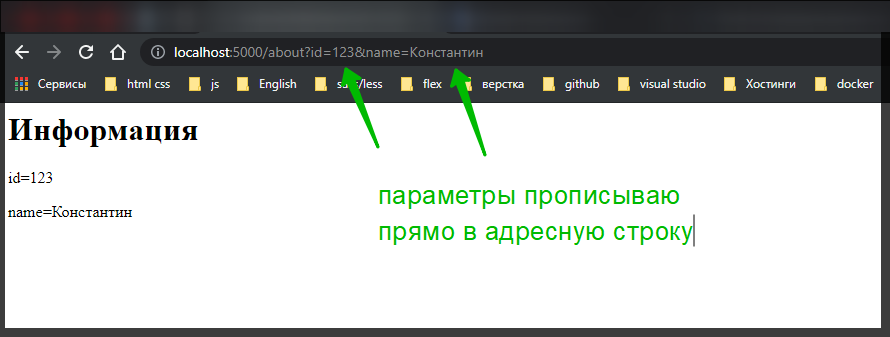
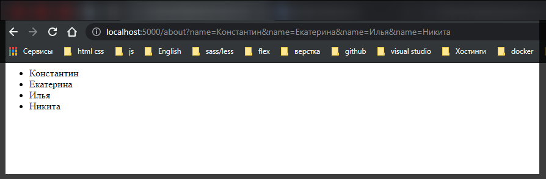
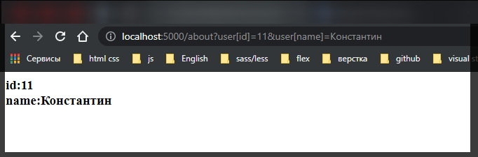
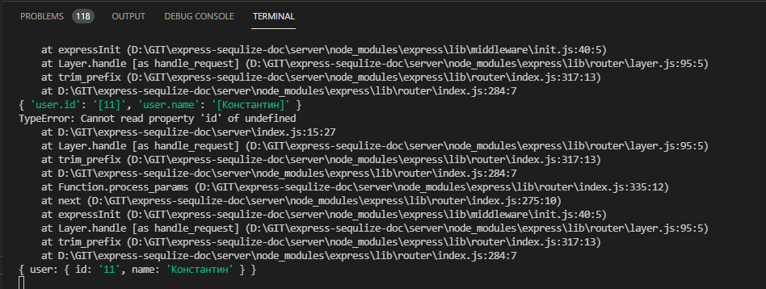

# Пеедача данных проложению параметры строки запроса

Одним из способов передачи данных в приложение представляет использование параметров строки запроса. Строка запроса **(query)** - фактически это часть запрошенного адреса, которая идет после знака вопроса. Например, в запросе **http://localhost:3000/about?id=3&name=Tome** часть **id=3&name=Tome** представляет строку запроса.

Строку запроса образуют параметры. После названия каждого параметра после знака **(=)** идет его значение. Друг от друга параметры отделяются знаком амперсанда. Например в адресной строке использовалось два параметра: **"id"** имеет значение **"3"** и параметр **"name"** имеет значение **"Tom"**.

В **Express** вы можете получить параметр строки запроса через свойство **query** объекта **request**, который передается в функцию обработки запроса. Например:

```js
// server index.js

// подключаю express
const express = require('express');

// создаю объект приложения
const app = express();

app.get('/', function (req, res) {
  res.send('<h1>Главная страница</h1>');
});

app.use('/about', function (req, res) {
  let id = req.query.id;
  let userName = req.query.name;
  res.send(
    '<h1>Информация</h1><p>id=' + id + '</p><p>name=' + userName + '</p>'
  );
});

// прослушиваю порт
app.listen(5000);
```

С помощью выражения **req.query** мы можем получить все параметры строки запроса в виде объекта **JS**, а с помощю выражения **req.query.название_параметра** мы можем обратиться к каждому отдельному параметру.



<br/>
<br/>
<br/>

Передача массивов.

Подобным образом мы можем передавать массивы данных:

```js
// server index.js

// подключаю express
const express = require('express');

// создаю объект приложения
const app = express();

app.get('/', function (req, res) {
  res.send('<h1>Главная страница</h1>');
});

app.use('/about', function (req, res) {
  console.log(req.query);
  let names = req.query.name;
  let responseText = '<ul>';
  for (let i = 0; i < names.length; i++) {
    responseText += '<li>' + names[i] + '</li>';
  }
  responseText += '</ul>';
  res.send(responseText);
});

// прослушиваю порт
app.listen(5000);
```



<br/>
<br/>
<br/>

Передача сложных объектов.

Так же можно передать более сложные объекты, которые состоят из множеств:

```js
// server index.js

// подключаю express
const express = require('express');

// создаю объект приложения
const app = express();

app.get('/', function (req, res) {
  res.send('<h1>Главная страница</h1>');
});

app.use('/about', function (req, res) {
  console.log(req.query);
  let id = req.query.user.id;
  let name = req.query.user.name;
  res.send('<h3>id:' + id + '<br>name:' + name + '</h3>');
});

// прослушиваю порт
app.listen(5000);
```



При передаче в строке запроса свойства объекта помещаются в квадратные скобки: **user[id]**.


