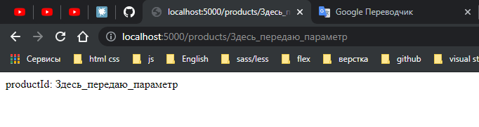
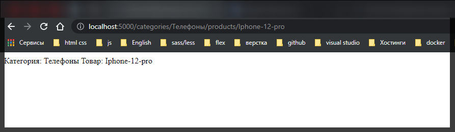
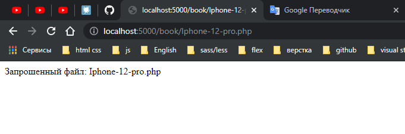

# Параметры маршрута.

Параметры маршрута представляют именованные сегменты **URL**-адреса. Не стоит их путать с параметрами строки запроса. Например:

```
localhost:3000/about/user?id=3&name=Tome
```

Здесь параметры строки запроса - это то, что идет поcле вопросительного знака - **id=3&name=Tome**. Остальная часть, которая идет до вопросительного знака может содержать параметры маршрута.

Название параметра должно включать символы из диапазона **[A-Za-z0-9_]**. В определении маршрута параметры предваряются знаком двоеточия:

```js
const express = require('express');

const app = express();

app.get('/products/:productId', function (req, res) {
  res.send('productId: ' + req.params['productId']);
});

app.listen(5000);
```

В данном случае параметр называется **"productId"**. Через коллекцию **req.params** можно получить все параметры и, в частности, значение парамера **productId**.

Если нам понадобится передать для этого параметра значение, то оно указывается в качестве последнего сегмента в строке запроса:



Мы можем использовать более сложные комбинации параметров.

```js
const express = require('express');

const app = express();

app.get('/products/:productId', function (req, res) {
  res.send('productId: ' + req.params['productId']);
});

app.get('/categories/:categoryId/products/:productsId', function (req, res) {
  let catId = req.params['categoryId'];
  let prodId = req.params['productsId'];
  res.send(`Категория: ${catId} Товар: ${prodId}`);
});

app.listen(5000);
```



Или к примеру.

```js
const express = require('express');

const app = express();

app.get('/products/:productId', function (req, res) {
  res.send('productId: ' + req.params['productId']);
});

app.get('/categories/:categoryId/products/:productsId', function (req, res) {
  let catId = req.params['categoryId'];
  let prodId = req.params['productsId'];
  res.send(`Категория: ${catId} Товар: ${prodId}`);
});

app.get('/book/:pageName.:pageExt', function (req, res) {
  let pageName = req.params['pageName'];
  let pageExt = req.params['pageExt'];
  res.send(`Запрошенный файл: ${pageName}.${pageExt}`);
});

app.listen(5000);
```


