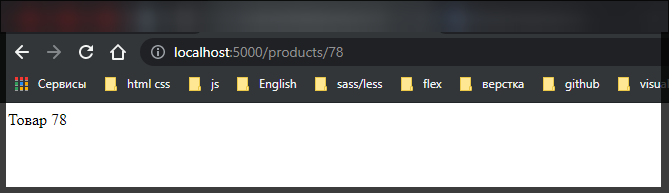
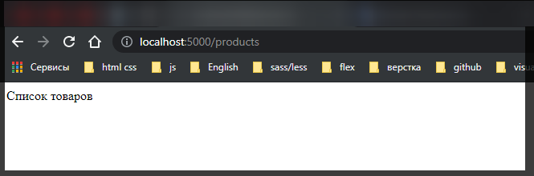
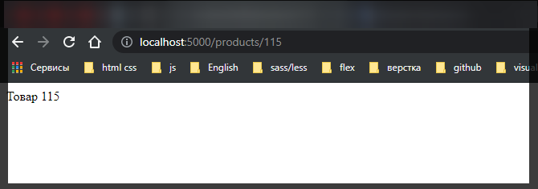

# Router

**Router** - помогает определить дочерние подмаршруты со своими обработчиками относительно главного маршрута. Например определим следующее приложение:

```js
const express = require('express');

const app = express();

app.use('/about', function (req, res) {
  res.send('<h1>О сайте</h1>');
});

app.use('/products/create', function (req, res) {
  res.send('<h1>Добавление товара</h1>');
});

app.use('/products/:id', function (req, res) {
  res.send(`Товар ${req.params.id}`);
});

app.use('/products', function (req, res) {
  res.send('<h1>Список товаров</h1>');
});
app.use('/', function (req, res) {
  res.send('Главная страница');
});

app.listen(5000);
```

Здесь у нас пять маршрутов, которые обрабатываются различными обработчиками. Но 3-ри из этих из этих маршрутов начинаются с **"/products"** и условно относятся к некоторому функционалу по работе с товарами(Просмотр списка товаров, просмотри одного товара по **id** и добавление товара). Объект **Router** позволяет связать подобный функционал в одно целое и упростить управление им. Перепешем предыдущий пример.

```js
const express = require('express');
const app = express();

//Определяем Router
const productRouter = express.Router();

// определяем маршруты и их обработчики внутри роутера

productRouter.use('/create', function (req, res) {
  res.send('Добавление товара');
});

productRouter.use('/:id', function (req, res) {
  res.send(`Товар ${req.params.id}`);
});

productRouter.use('/', function (req, res) {
  res.send('Список товаров');
});

// сопотавляем роутер с конечной точкой "/products"
app.use('/products', productRouter);

app.use('/about', function (req, res) {
  res.send('О сайте');
});

app.use('/', function (req, res) {
  res.send('Главная страница');
});

app.listen(5000);
```



Здесь определен объект **productRouter** который обрабатывает все запросы по маршруту **"/products"**. Это главный маршрут. Однако в рамках этого маршрута может быть подмаршрут **'/'** со своим обработчиком, а так же подмаршруты **'/:id'** и **'/create'**, которые так же имеют свои обработчики.




