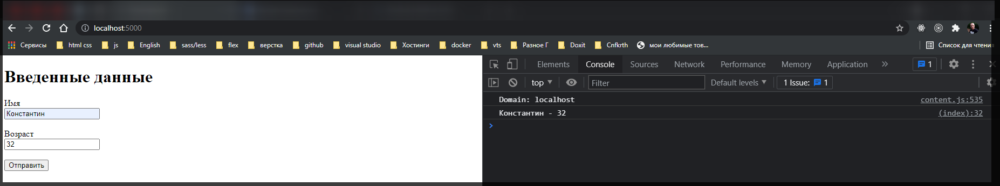

# JSON и AJAX

**JSON** представляет один из самых популярных форматов хранения и передачи данных, и **Express** имеет все возможности для работы с **JSON**. Пусть в папке проекта имеется файл **index.html** со следующим кодом:

```html
<!DOCTYPE html>
<html>
  <head>
    <meta charset="UTF-8" />
    <title>Регистрация</title>
  </head>
  <body>
    <h1>Введенные данные</h1>
    <form name="registerForm">
      <label>Имя</label><br />
      <input type="text" name="userName" /><br /><br />
      <label>Возраст</label><br />
      <input type="number" name="userAge" /><br /><br />
      <button type="submit" id="submit">Отправить</button>
    </form>
    <script>
      document.getElementById('submit').addEventListener('click', function (e) {
        e.preventDefault();
        // получаем данные формы
        let registerForm = document.forms['registerForm'];
        let userName = registerForm.elements['userName'].value;
        let userAge = registerForm.elements['userAge'].value;
        // сериализуем данные в json
        let user = JSON.stringify({ userName: userName, userAge: userAge });
        let request = new XMLHttpRequest();
        // посылаем запрос на адрес "/user"
        request.open('POST', '/user', true);
        request.setRequestHeader('Content-Type', 'application/json');
        request.addEventListener('load', function () {
          // получаем и парсим ответ сервера
          let receivedUser = JSON.parse(request.response);
          console.log(receivedUser.userName, '-', receivedUser.userAge); // смотрим ответ сервера
        });
        request.send(user);
      });
    </script>
  </body>
</html>
```

Здесь, как и в прошлой теме, определена форма с двумя полями для ввода имени и возраста пользователя. Теперь с помощью обработчика нажатия перехвотывается отправка этой формы. Мы получаем значение ее полей и сереализуем в объект **json**, который затем отправляется на сервер с помощью **ajax** на адрес **"/user"**.
Далее определим в главном файле приложения - в **app.js** код который принималбы отправленные данные. Но я буду писать это в **index.js**



Прежде всего для получения данных в формате **json** необходимо создать парсер с помощью функции **json**:

```js
const express = require('express');
const app = express();

// Создаем парсер для данных в формате json
const jsonParser = express.json();

app.post('/user', jsonParser, function (req, res) {
  console.log(req.body);
  if (!req.body) return res.sendStatus(400);
  res.json(req.body); // отправляем пришедший ответ обратно
});

app.get('/', function (req, res) {
  res.sendFile(__dirname + '/index.html');
});

app.listen(5000);
```

```js
// Создаем парсер для данных в формате json
const jsonParser = express.json();
```

В реальности данный парсер будет использовать модуль **bodyParser**, который использовался нами ранее для парсинга данных отправленной формы.

И поскольку с клиентом мы взаимодействуем через формат **json**, то данные клиенту отправляются с помощью метода **res.json()**

```js
app.post('/user', jsonParser, function (req, res) {
  console.log(req.body);
  if (!req.body) return res.sendStatus(400);
  res.json(req.body); // отправляем пришедший ответ обратно
});
```

Следует отметить что мы можем отправить объект с помощью стандартного метода **res.send(req.body)**. В реальности матод **res.json()** устанавливает для заголовка **"Content-type"** значение **"application/json"**, сериализует данные в **json** с помощью функции **JSON.stringify()** и затем отправляет данные с помощью **res.send**.

Для получения данных, как и в случае с формами, используются выражения типа **req.body.userName**, где **req.body** инкапсулирует данные формы, а **userName** - ключ данных.

При обращении к корню приложения пользователю будет отправлятся содержимое файла **index.html** с формой ввода данных.
