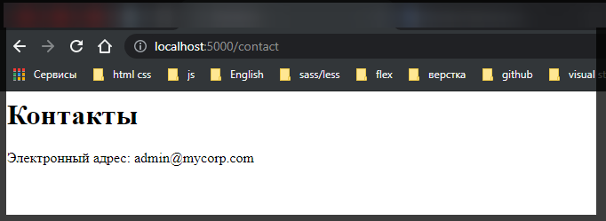
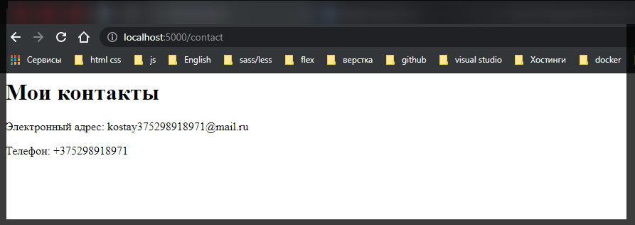
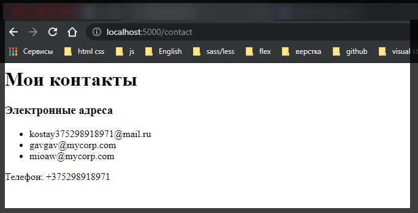

# Представления и движок представлений Handlebars

Как правило, приложения **Express** для определения визуального интерфейса использует не стандартные файлы **html**, а специальные сущности - представления, из которых затем создаются **html**-файлы. Преимуществом представлений является то, что мы можем определять в них некоторые шаблоны, вместо которых затем вставляется какое-то динамическое содержимое с помощью кода **javascript**.

Управляет представлениями специальный компонент - движок представлений **(view engine)**, который также называют движок шаблонов **(template engine)**. Вообще движков представлений в **Express** довольно много: **Pug**, **Jade**, **Dust**, **Nunjucks**, **EJS**, **Handlebars** и другие. Вопрос выбора движка представлений - в основном вопрос предпочтений, все они предоставляют схожую функциональность, различаясь лишь в каких-то деталях.

Для работы с движками представлений в **Express** определено ряд глобальных настроек, которые мы можем установить. Прежде всего это настройка **view** **engine**, которая устанавливает используемый движок предствлений, и **views**, которая устанавливает путь к папке с представлениями внутри проекта (если этот параметр не установлен, то по умолчанию используется папка с именем **views**).

Для начала рассмотрим работу с представлениями на основе движка **Handlebars** или сокращенно **hbs**.

Для работы с представлениями установим пакет **hbs** в проект с помощью команды

```shell
npm install hbs --save
```

Для хранения представлений определим в проекте папку **views**. Затем в нее добавим новый файл **contact.hbs**. **hbs** - это расширение по умолчанию для представлений, которые обрабатываются движком **Handlebars**.

Определим в файле **contact.hbs** простейший **html**-код:

```html
<html>
  <head>
    <meta charset="UTF-8" />
    <meta http-equiv="X-UA-Compatible" content="IE=edge" />
    <meta name="viewport" content="width=device-width, initial-scale=1.0" />
    <title>Контакты</title>
  </head>
  <body>
    <h1>Контакты</h1>
    <p>Электронный адрес: admin@mycorp.com</p>
  </body>
</html>
```

Представление выглядит как обычная веб-страница, однако на самом деле это уже не **html**-страница, просто пока она не содержит никаких шаблонов.

Изменим файл приложения **app.js:** У меня **index.js**

```js
const express = require('express');
const app = express();

app.set('view engine', 'hbs');

app.use('/contact', function (req, res) {
  res.render('contact.hbs');
});

app.use('/', function (req, res) {
  res.send('Главная');
});

app.listen(5000);
```

Чтобы установить **Handlebars** в качестве движка представлений в **Express**, вызывается функция:

```js
app.set('view engine', 'hbs');
```

Для маршрута **"/contact"** используется функция обработчика, которая производит рендеринг представления **"contact.hbs"** с помощью функции **response.render()**. Эта функция на основе представления создает страницу **html**, которая отправляется клиенту.

Запустим приложение и обратимся в веб-браузере с запросом **"http://localhost:5000/contact":**



<br/>
<br/>
<br/>

**Модель представления**

Одним из преимуществ шаблонов является то, что мы можем передавать в представления на место шаблонов модели представления - специальные объекты, данные которые использует движок представлений для рендеринга.

Так, изменим файл **index.js** следующим образом:

```js
const express = require('express');
const app = express();

app.set('view engine', 'hbs');

app.use('/contact', function (req, res) {
  res.render('contact.hbs', {
    title: 'Мои контакты',
    email: 'kostay375298918971@mail.ru',
    phone: '+375298918971',
  });
});

app.use('/', function (req, res) {
  res.send('Главная');
});

app.listen(5000);
```

Теперь в качестве второго параметра в функцию **response.render()** передается специальный объект с тремя свойствами.

Далее изменим код представления **contact.hbs:**

```html
<html>
  <head>
    <meta charset="UTF-8" />
    <meta http-equiv="X-UA-Compatible" content="IE=edge" />
    <meta name="viewport" content="width=device-width, initial-scale=1.0" />
    <title>{{ title }}</title>
  </head>
  <body>
    <h1>{{ title }}</h1>
    <p>Электронный адрес: {{ email }}</p>
    <p>Телефон: {{ phone }}</p>
  </body>
</html>
```

Вместо конкретных данных в коде представления используются те данные, которые определены в модели. Чтобы обратиться к свойствам модели в двойных фигурных скобках указывается нужное свойство: **{{title}}**. При рендеринге представления вместо подобных выражений будут вставляться значения соответствующих свойств модели.

Перезапустим приложение и вновь обратимся по тому же адресу:



Рассмотрим более сложный случай, пусть в представление передается массив:

```js
const express = require('express');
const app = express();

app.set('view engine', 'hbs');

app.use('/contact', function (req, res) {
  res.render('contact.hbs', {
    title: 'Мои контакты',
    emailsVisible: true,
    emails: [
      'kostay375298918971@mail.ru',
      'gavgav@mycorp.com',
      'mioaw@mycorp.com',
    ],
    phone: '+375298918971',
  });
});

app.use('/', function (req, res) {
  res.send('Главная');
});

app.listen(5000);
```

```html
<html>
  <head>
    <meta charset="UTF-8" />
    <meta http-equiv="X-UA-Compatible" content="IE=edge" />
    <meta name="viewport" content="width=device-width, initial-scale=1.0" />
    <title>{{title}}</title>
  </head>
  <body>
    <h1>{{title}}</h1>

    {{#if emailsVisible}}

    <h3>Электронные адреса</h3>

    <ul>
      {{#each emails}}
      <li>{{this}}</li>
      {{/each}}
    </ul>
    {{/if}}
    <p>Телефон: {{phone}}</p>
  </body>
</html>
```

Выражение типа

```hbs
{{#if emailsVisible}}
  // код
{{/if}}
```

позволяет определить видимость кода в зависимости от значения свойства **emailsVisible** - если это свойство равно **true**, то блок кода между **{{#if emailsVisible}} и {{/if}}** добавляется на веб-страницу.

Для перебора массивов можно воспользоваться конструкцией **each**

```hbs
{{#each emails}}
  <li>{{this}}</li>
{{/each}}
```

Эта конструкция перебирает все элементы из массива **emails** и создает для них элемент **<li>**. Текущий перебираемый элемент помещается в переменную **this**.

В итоге при обращении по пути **"/contact"** на веб-странице в виде списка будет отображаться массив:



<br/>
<br/>
<br/>

**Изменение пути к предтавлениям**

По умолчанию представления помещаются в папку **views**, но мы можем выбрать любую другую папку в проекте. Для этого необходимо установить параметр **views**:

```js
const express = require('express');
const app = express();

app.set('view engine', 'hbs');
app.set('views', '../client'); // установка пути к представлениям

app.use('/contact', function (request, response) {
  response.render('index');
});

app.listen(5000);
```

```html
<html lang="en">
  <head>
    <meta charset="UTF-8" />
    <meta http-equiv="X-UA-Compatible" content="IE=edge" />
    <meta name="viewport" content="width=device-width, initial-scale=1.0" />
    <title>Мой документ</title>
  </head>
  <body>
    <h1>Мой документ</h1>
    <p>
      Для того что бы не было конфликтов нужно удалить из папки
      <b>server</b>
      папку
      <b>views</b>
      после чего я могу указывать путь к представлению
    </p>
  </body>
</html>
```
