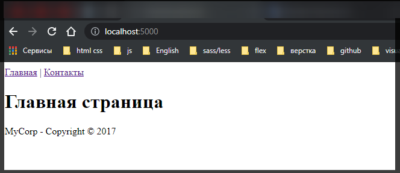

# Частичные представления в Handlebars

Нередко вeб-страницы в приложении используют какие-то общие элементы. Это может быть меню, шапка сайта, футер, другие элементы. Однако здесь встает проблема: если потребуется поменять этот общий элемент, то придется вносить изменения на все веб-страницы, которые используют этот элемент. И было бы гораздо проще определить этот элемент в одном месте, а затем подключать на все страницы.

Решить эту проблему помогают частичные представления **(partial views)**, которые представляют разделяемые общие элементы, которые можно добавлять на обычные представления.

К примеру, мы можем сделать общее меню и общий футер. Для этого создадим для частичных представлений в проекте подкаталог **views/partials**.

Добавим в папку **views/partials** новый файл **menu.hbs:**

```html
<nav><a href="/">Главная</a> | <a href="/contact">Контакты</a></nav>
```

Затем также добавим в views/partials новый файл footer.hbs:

```html
<footer><p>MyCorp - Copyright © 2017</p></footer>
```

Это два частичных представления, которые мы будем подключать в обычные представления.

В папке **views** определим обычное представление **contact.hbs:**

```html
<!DOCTYPE html>
<html>
  <head>
    <title>{{title}}</title>
    <meta charset="utf-8" />
  </head>
  <body>
    {{> menu}}

    <h1>{{title}}</h1>
    <p>Электронный адрес: {{email}}</p>
    <p>Телефон: {{phone}}</p>

    {{> footer}}
  </body>
  <html></html>
</html>
```

Для вставки частичного представления применяется выражение **{{> menu}}**, в котором прописывается имя файла частичного представления без расширения.

Также добавим в папку **views** новое представление, которое назовем **home.hbs:**

```html
<!DOCTYPE html>
<html>
  <head>
    <title>Главная страница</title>
    <meta charset="utf-8" />
  </head>
  <body>
    {{> menu}}
    <h1>Главная страница</h1>

    {{> footer}}
  </body>
  <html></html>
</html>
```

Таким образом, у нас два представления, которые имеют общие элементы. И если нам потребуется добавить какой-нибудь новый пункт меню, то достаточно изменить файл **menu.hbs**.

В конце изменим файл **app.js:**

```js
const express = require('express');
const hbs = require('hbs');
const app = express();

app.set('view engine', 'hbs');
hbs.registerPartials(__dirname + '/views/partials'); // настройка частичных предствлений

app.use('/contact', function (req, res) {
  res.render('contact', {
    title: 'Мои контакты',
    email: 'gavgav@mycorp.com',
    phone: '+1234567890',
  });
});

app.use('/', function (req, res) {
  res.render('home.hbs');
});

app.listen(5000);
```

Для настройки функционала частичных представлений в коде используется вызов:

```js
hbs.registerPartials(__dirname + '/views/partials'); // настройка частичных предствлений
```

который устанавливает каталог, где располагаются частичные представления.

И если мы запустим проект и обратимся по одному из двух маршрутов: **"/"** или **"/contact"**, то после рендеринга представления веб-страница будет содержать меню и футер:



