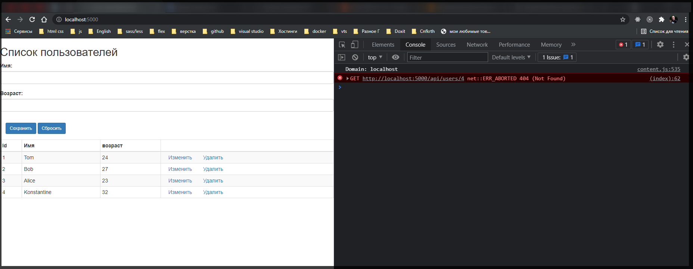

# Создание API

**Данный пример хорош когда разработка ведется без БД т.е. с файлом заглушки.**

Используя **Express** и **Node.js**, мы можем реализовать полноценный **API** в стиле **REST** для взаимодействия с пользователем. Архитектура **REST** предполагает применение следующих методов или типов запросов **HTTP** для взаимодействия с сервером:

- **GET**
- **POST**
- **PUT**
- **DELETE**

Зачастую **REST**-стиль особенно удобен при создании всякого рода **Single Page Application**, которые нередко используют специальные **javascript**-фреймворки типа **Angular**, **React** или **Knockout**.

Рассмотрим, как создать свой **API**. Для нового проекта создадим новую папку, которая пусть будет называться **server**. Сразу определим в проекте файл **package.json:**

Я немного делаю по своему. Создаю папку **server**.

```shell
npm init -y
```

```json
{
  "name": "client",
  "version": "1.0.0",
  "description": "",
  "main": "index.js",
  "scripts": {
    "test": "echo \"Error: no test specified\" && exit 1"
  },
  "keywords": [],
  "author": "",
  "license": "ISC"
}
```

В проекте нам понадобятся **express** и **body-parser** для парсинга полученных данных.

Далее перейдем к этому каталогу в командной строке/терминале и для добавления всех нужных пакетов выполним команду:

```shell
npm i express body-parser
```

В данном случае мы создадим экспериментальный проект, который будет хранить данные в файле **json** и который призван просто показать создание **API** в **Node.js** в стиле **REST**. А пока добавим в папку проекта новый файл **users.json** со следующим содержанием:

Для чтения и записи в этот файл мы будем использовать встроенный модуль **fs**. Для обработки запросов определим в проекте следующий файл **app.js:**

У меня будет **index.js**

```js
const express = require('express');
const fs = require('fs');

const app = express();
const jsonParser = express.json();

app.use(express.static(__dirname + '/public'));

const filePath = 'users.json';

app.get('/api/users', function (req, res) {
  const content = fs.readFileSync(filePath, 'utf-8');
  const users = JSON.parse(content);
  res.send(users);
});

// получение одного пользователя по id
app.get('/api/users/:id', function (req, res) {
  const id = req.params.id; // получаем id
  const content = fs.readFileSync(filePath, 'utf-8');
  const users = JSON.parse(content);
  let user = null;
  // находим в массиве пользователя по id
  for (var i = 0; i < users.length; i++) {
    if (users[i].id == id) {
      user = users[id];
      break;
    }
  }

  // отправляю пользователя
  if (user) {
    res.send(user);
  } else {
    res.status(404).send();
  }
});

// получение отправленных данных
app.post('/api/users', jsonParser, function (req, res) {
  if (!req.body) return res.sendStatus(400); // не корректный запрос к серверу

  const userName = req.body.name;
  const userAge = req.body.age;
  let user = { name: userName, age: userAge };

  let data = fs.readFileSync(filePath, 'utf-8');
  let users = JSON.parse(data);

  // находим максимальный id
  const id = Math.max.apply(
    Math,
    users.map(function (o) {
      return o.id;
    })
  );
  // увеличиваем его на единицу
  user.id = id + 1;

  // добавляем пользователя в массив
  users.push(user);
  data = JSON.stringify(users);
  // перезаписываем файл с новыми данными
  fs.writeFileSync('users.json', data);
  res.send(user);
});

// удаление пользователя по id
app.delete('/api/users/:id', function (req, res) {
  const id = req.params.id;
  let data = fs.readFileSync(filePath, 'utf-8');
  let users = JSON.parse(data);
  let index = -1;
  // находим индекс пользователя в массиве
  for (var i = 0; i < users.length; i++) {
    if (users[i].id == id) {
      index = i;
      break;
    }
  }
  if (index > -1) {
    // удаляем пользователя из массива по индексу
    const user = users.splice(index, 1)[0];
    data = JSON.stringify(users);
    fs.writeFileSync('users.json', data);
    // отправляем удаленного пользователя
    res.send(user);
  } else {
    res.status(404).send();
  }
});

// изменение пользователя
app.put('/api/users', jsonParser, function (req, res) {
  if (!req.body) return res.sendStatus(400); // не корректный запрос к серверу

  const userId = req.body.id;
  const userName = req.body.name;
  const userAge = req.body.age;

  let data = fs.readFileSync(filePath, 'utf-8');
  const users = JSON.parse(data);
  let user;
  for (var i = 0; i < users.length; i++) {
    if (users[i].id == userId) {
      user = users[i];
      break;
    }
  }
  // изменяем данные у пользователя
  if (user) {
    user.age = userAge;
    user.name = userName;
    data = JSON.stringify(users);
    fs.writeFileSync('users.json', data);
    res.send(user);
  } else {
    res.status(404).send();
  }
});

app.listen(5000, function () {
  console.log('Сервер ожидает подключения...');
});
```

Для обработки запросов определено пять методов для каждого типа запросов: **app.get()/app.post()/app.delete()/app.put()**

Когда приложение получает запрос типа **GET** по адресу **"api/users"**, то срабатывает следующий метод:

```js
app.get('/api/users', function (req, res) {
  const content = fs.readFileSync(filePath, 'utf-8');
  const users = JSON.parse(content);
  res.send(users);
});
```

В качестве результата обработки мы должны отправить массив пользователей, которые считываем из файла. Для упрощения кода приложения в рамкаха данного экспериментального проекта для чтения/записи файла применяются синхронные методы **fs.readFileSync()/fs.writeFileSync()**. Но в реальности, как правило, работа с данными будет идти через базу данных, а далее мы все это рассмотрим на примере **MongoDB**.

И чтобы получить данные из файла с помощью метода **fs.readFileSync()** считываем данные в строку, которую парсим в массив объектов с помощью функции **JSON.parse()**. И в конце полученные данные отправляем клиенту методом **res.send()**.

Аналогично работает другой метод **app.get()**, который срабатывает, когда в адресе указан **id** пользователя:

```js
// получение одного пользователя по id
app.get('/api/users/:id', function (req, res) {
  const id = req.params.id; // получаем id
  const content = fs.readFileSync(filePath, 'utf-8');
  const users = JSON.parse(content);
  let user = null;
  // находим в массиве пользователя по id
  for (var i = 0; i < users.length; i++) {
    if (users[i].id == id) {
      user = users[id];
      break;
    }
  }

  // отправляю пользователя
  if (user) {
    res.send(user);
  } else {
    res.status(404).send();
  }
});
```

Единственное, что в этом случае нам надо найти нужного пользователя по **id** в массиве, а если он не был найден, возвратить статусный код **404: res.status(404).send()**.

При получении запроса методом **POST** нам надо применить парсер **jsonParser** для извлечения данных из запроса:

```js
// получение отправленных данных
app.post('/api/users', jsonParser, function (req, res) {
  if (!req.body) return res.sendStatus(400); // не корректный запрос к серверу

  const userName = req.body.name;
  const userAge = req.body.age;
  let user = { name: userName, age: userAge };

  let data = fs.readFileSync(filePath, 'utf-8');
  let users = JSON.parse(data);

  // находим максимальный id
  const id = Math.max.apply(
    Math,
    users.map(function (o) {
      return o.id;
    })
  );
  // увеличиваем его на единицу
  user.id = id + 1;

  // добавляем пользователя в массив
  users.push(user);
  data = JSON.stringify(users);
  // перезаписываем файл с новыми данными
  fs.writeFileSync('users.json', data);
  res.send(user);
});
```

После получения данных нам надо создать новый объект и добавить его в массив объектов. Для этого считываем данные из файла, добавляем в массив новый объект и перезаписываем файл с обновленными данными.

При удалении производим похожие действия, только теперь извлекаем из массива удаляемый объект и опять же перезаписываем файл:

```js
// удаление пользователя по id
app.delete('/api/users/:id', function (req, res) {
  const id = req.params.id;
  let data = fs.readFileSync(filePath, 'utf-8');
  let users = JSON.parse(data);
  let index = -1;
  // находим индекс пользователя в массиве
  for (var i = 0; i < users.length; i++) {
    if (users[i].id == id) {
      index = i;
      break;
    }
  }
  if (index > -1) {
    // удаляем пользователя из массива по индексу
    const user = users.splice(index, 1)[0];
    data = JSON.stringify(users);
    fs.writeFileSync('users.json', data);
    // отправляем удаленного пользователя
    res.send(user);
  } else {
    res.status(404).send();
  }
});
```

Если объект не найден, возвращаем статусный код **404**.

Если приложению приходит **PUT**-запрос, то он обрабатывается методом **app.put()**, в котором с помощью **jsonParser** получаем измененные данные:

```js
// изменение пользователя
app.put('/api/users', jsonParser, function (req, res) {
  if (!req.body) return res.sendStatus(400); // не корректный запрос к серверу

  const userId = req.body.id;
  const userName = req.body.name;
  const userAge = req.body.age;

  let data = fs.readFileSync(filePath, 'utf-8');
  const users = JSON.parse(data);
  let user;
  for (var i = 0; i < users.length; i++) {
    if (users[i].id == userId) {
      user = users[i];
      break;
    }
  }
  // изменяем данные у пользователя
  if (user) {
    user.age = userAge;
    user.name = userName;
    data = JSON.stringify(users);
    fs.writeFileSync('users.json', data);
    res.send(user);
  } else {
    res.status(404).send();
  }
});
```

Здесь также для поиска изменяемого объекта считываем данные из файла, находим изменяемого пользователя по **id**, изменяем у него свойства и сохраняем обновленные данные в файл.

Таким образом, мы определили простейший **API**. Теперь добавим код клиента. Итак, как установлено в коде, **Express** для хранения статических файлов использует папку **public**, поэтому создадим в проекте подобную папку. В этой папке определим новый файл **index.html**, который будет выполнять роль клиента. В итоге весь проект будет выглядеть следующим образом:

Далее определим в файле **index.html** следующий код:

```html
<!DOCTYPE html>
<html>
  <head>
    <meta charset="utf-8" />
    <meta name="viewport" content="width=device-width" />
    <title>Список пользователей</title>
    <link
      href="https://maxcdn.bootstrapcdn.com/bootstrap/3.3.7/css/bootstrap.min.css"
      rel="stylesheet"
    />
  </head>
  <body>
    <h2>Список пользователей</h2>
    <form name="userForm">
      <input type="hidden" name="id" value="0" />
      <div class="form-group">
        <label for="name">Имя:</label>
        <input class="form-control" name="name" />
      </div>
      <div class="form-group">
        <label for="age">Возраст:</label>
        <input class="form-control" name="age" />
      </div>
      <div class="panel-body">
        <button type="submit" class="btn btn-sm btn-primary">Сохранить</button>
        <a id="reset" class="btn btn-sm btn-primary">Сбросить</a>
      </div>
    </form>
    <table class="table table-condensed table-striped table-bordered">
      <thead>
        <tr>
          <th>Id</th>
          <th>Имя</th>
          <th>возраст</th>
          <th></th>
        </tr>
      </thead>
      <tbody></tbody>
    </table>

    <script>
      // Получение всех пользователей
      async function GetUsers() {
        // отправляет запрос и получаем ответ
        const response = await fetch('/api/users', {
          method: 'GET',
          headers: { Accept: 'application/json' },
        });
        // если запрос прошел нормально
        if (response.ok === true) {
          // получаем данные
          const users = await response.json();
          let rows = document.querySelector('tbody');
          users.forEach((user) => {
            // добавляем полученные элементы в таблицу
            rows.append(row(user));
          });
        }
      }
      // Получение одного пользователя
      async function GetUser(id) {
        const response = await fetch('/api/users/' + id, {
          method: 'GET',
          headers: { Accept: 'application/json' },
        });
        if (response.ok === true) {
          const user = await response.json();
          const form = document.forms['userForm'];
          form.elements['id'].value = user.id;
          form.elements['name'].value = user.name;
          form.elements['age'].value = user.age;
        }
      }
      // Добавление пользователя
      async function CreateUser(userName, userAge) {
        const response = await fetch('api/users', {
          method: 'POST',
          headers: {
            Accept: 'application/json',
            'Content-Type': 'application/json',
          },
          body: JSON.stringify({
            name: userName,
            age: parseInt(userAge, 10),
          }),
        });
        if (response.ok === true) {
          const user = await response.json();
          reset();
          document.querySelector('tbody').append(row(user));
        }
      }
      // Изменение пользователя
      async function EditUser(userId, userName, userAge) {
        const response = await fetch('api/users', {
          method: 'PUT',
          headers: {
            Accept: 'application/json',
            'Content-Type': 'application/json',
          },
          body: JSON.stringify({
            id: userId,
            name: userName,
            age: parseInt(userAge, 10),
          }),
        });
        if (response.ok === true) {
          const user = await response.json();
          reset();
          document
            .querySelector("tr[data-rowid='" + user.id + "']")
            .replaceWith(row(user));
        }
      }
      // Удаление пользователя
      async function DeleteUser(id) {
        const response = await fetch('/api/users/' + id, {
          method: 'DELETE',
          headers: { Accept: 'application/json' },
        });
        if (response.ok === true) {
          const user = await response.json();
          document.querySelector("tr[data-rowid='" + user.id + "']").remove();
        }
      }

      // сброс формы
      function reset() {
        const form = document.forms['userForm'];
        form.reset();
        form.elements['id'].value = 0;
      }
      // создание строки для таблицы
      function row(user) {
        const tr = document.createElement('tr');
        tr.setAttribute('data-rowid', user.id);

        const idTd = document.createElement('td');
        idTd.append(user.id);
        tr.append(idTd);

        const nameTd = document.createElement('td');
        nameTd.append(user.name);
        tr.append(nameTd);

        const ageTd = document.createElement('td');
        ageTd.append(user.age);
        tr.append(ageTd);

        const linksTd = document.createElement('td');

        const editLink = document.createElement('a');
        editLink.setAttribute('data-id', user.id);
        editLink.setAttribute('style', 'cursor:pointer;padding:15px;');
        editLink.append('Изменить');
        editLink.addEventListener('click', (e) => {
          e.preventDefault();
          GetUser(user.id);
        });
        linksTd.append(editLink);

        const removeLink = document.createElement('a');
        removeLink.setAttribute('data-id', user.id);
        removeLink.setAttribute('style', 'cursor:pointer;padding:15px;');
        removeLink.append('Удалить');
        removeLink.addEventListener('click', (e) => {
          e.preventDefault();
          DeleteUser(user.id);
        });

        linksTd.append(removeLink);
        tr.appendChild(linksTd);

        return tr;
      }
      // сброс значений формы
      document.getElementById('reset').click(function (e) {
        e.preventDefault();
        reset();
      });

      // отправка формы
      document.forms['userForm'].addEventListener('submit', (e) => {
        e.preventDefault();
        const form = document.forms['userForm'];
        const id = form.elements['id'].value;
        const name = form.elements['name'].value;
        const age = form.elements['age'].value;
        if (id == 0) CreateUser(name, age);
        else EditUser(id, name, age);
      });

      // загрузка пользователей
      GetUsers();
    </script>
  </body>
</html>
```

Основная логика здесь заключена в коде **javascript**. При загрузке страницы в браузере получаем все объекты из БД с помощью функции **GetUsers:**

```js
async function GetUsers() {
  // отправляет запрос и получаем ответ
  const response = await fetch('/api/users', {
    method: 'GET',
    headers: { Accept: 'application/json' },
  });
  // если запрос прошел нормально
  if (response.ok === true) {
    // получаем данные
    const users = await response.json();
    let rows = document.querySelector('tbody');
    users.forEach((user) => {
      // добавляем полученные элементы в таблицу
      rows.append(row(user));
    });
  }
}
```

Для добавления строк в таблицу используется функция **row()**, которая возвращает строку. В этой строке будут определены ссылки для изменения и удаления пользователя.

Ссылка для изменения пользователя с помощью функции **GetUser()** получает с сервера выделенного пользователя:

```js
async function GetUser(id) {
  const response = await fetch('/api/users/' + id, {
    method: 'GET',
    headers: { Accept: 'application/json' },
  });
  if (response.ok === true) {
    const user = await response.json();
    const form = document.forms['userForm'];
    form.elements['id'].value = user.id;
    form.elements['name'].value = user.name;
    form.elements['age'].value = user.age;
  }
}
```

И выделенный пользователь добавляется в форму над таблицей. Эта же форма применяется и для добавления объекта. С помощью скрытого поля, которое хранит **id** пользователя, мы можем узнать, какое действие выполняется - добавление или редактирование. Если **id** равен **0**, то выполняется функция **CreateUser**, которая отправляет данные в **POST**-запросе:

```js
async function CreateUser(userName, userAge) {
  const response = await fetch('api/users', {
    method: 'POST',
    headers: { Accept: 'application/json', 'Content-Type': 'application/json' },
    body: JSON.stringify({
      name: userName,
      age: parseInt(userAge, 10),
    }),
  });
  if (response.ok === true) {
    const user = await response.json();
    reset();
    document.querySelector('tbody').append(row(user));
  }
}
```

Если же ранее пользователь был загружен на форму, и в скрытом поле сохранился его **id**, то выполняется функция **EditUser**, которая отправляет **PUT**-запрос:

```js
async function EditUser(userId, userName, userAge) {
  const response = await fetch('api/users', {
    method: 'PUT',
    headers: { Accept: 'application/json', 'Content-Type': 'application/json' },
    body: JSON.stringify({
      id: userId,
      name: userName,
      age: parseInt(userAge, 10),
    }),
  });
  if (response.ok === true) {
    const user = await response.json();
    reset();
    document
      .querySelector("tr[data-rowid='" + user.id + "']")
      .replaceWith(row(user));
  }
}
```

Запустим приложение, обратимся в браузере по адресу **"http://localhost:5000"** и мы сможем управлять пользователями, которые хранятся в файле **json:**



Не забудь установить nodemon

```shell
npm i nodemon
```
