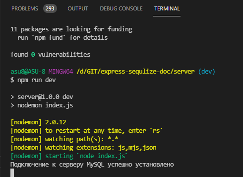
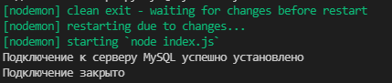

# Подключение к MySQL

Создаю папку **server**

```shell
npm init -y
```

Далее **nodemon** это вопрос буду смотреть по ходу статьи

```shell
npm i nodemon
```

Для работы с сервером **MySQL** в **Node.js** можно использовать ряд драйверов. Самые популярные из них **mysql** и **mysql2**. По большей части они совместимы. В данном случае мы будем использовать **mysql2**, так как, судя по ряду тестов, он предоставляет большую производительность.

И так, установим пакет **mysql2**:

```shell
npm install --save mysql2
```

<br/>
<br/>
<br/>

**Создание подключения**

Для создания подключения применяется метод **createConnection()**, который в качестве параметра принимает настройки подключения и возвращает объект, представляющий подключение.

```js
const mysql = require('mysql2');

const connection = mysql.createConnection({
  host: 'localhost',
  user: 'root',
  database: 'usersdb',
  password: 'пароль_от_сервера',
});
```

Передаваемые в метод настройки конфигурации могут содержать ряд параметров. Наиболее используемые из них:

- **host** - хост, на котором запущен сервер mysql. По умолчанию имеет значение "localhost"
- **port** - номер порта, на котором запущен сервер mysql. По умолчанию имеет значение "3306"
- **user** - пользователь MysQL, который используется для подключения.
- **password** - пароль для пользователя MySQL
- **database** - имя базы данных, к которой идет подключение. Не обязательный параметр. Если он не указан, то подключение идет в целом к серверу.
- **charset** - кодировка для подключения, например по умолчанию используется "UTF8_GENERAL_CI".
- **timezone** - часовой пояс сервера MySQL,This is used to type cast server date/time values to JavaScript. По умолчанию имеет значение "local".

Для установки подключения мы можем использовать метод connect() объекта connection.

```js
const mysql = require('mysql2');

const connection = mysql.createConnection({
  host: '10.178.4.52',
  port: '3306',
  user: 'asu8',
  database: 'network',
  password: '123',
});

connection.connect(function (err) {
  if (err) {
    return console.error('Ошибка: ' + err.message);
  } else {
    console.log('Подключение к серверу MySQL успешно установлено');
  }
});
```

Метод connect() принимает функцию, параметр которой содержит ошибка, которая возникла при подключении.



Если при подключении к серверу mysql генерируется ошибка

**Client does not support authentication protocol requested by server; consider upgrading MySQL client** В этом случае необходимо в MySQL Workbench выполнить следующую команду:

```sql
ALTER USER 'root'@'localhost' IDENTIFIED WITH mysql_native_password BY 'password'
```

Вместо **'password'** должен быть указан пароль от **MySQL** для пользователя **root**.

<br />
<br />
<br />

**Закрытие подключения**

Для закрытия подключения применяется метод **end()**:

```js
const mysql = require('mysql2');

const connection = mysql.createConnection({
  host: '10.178.4.52',
  port: '3306',
  user: 'asu8',
  database: 'network',
  password: '123',
});

// тестирование подключения
connection.connect(function (err) {
  if (err) {
    return console.error('Ошибка: ' + err.message);
  } else {
    console.log('Подключение к серверу MySQL успешно установлено');
  }
});

// закрытие подключения

connection.end(function (err) {
  if (err) {
    return console.log('Ошибка: ' + err.message);
  } else {
    console.log('Подключение закрыто');
  }
});
```



Метод **end()** гарантирует, что перед закрытием подключения к бд будут выполнены все оставшиеся запросы, которые не завершились к моменту вызова метода.

Если мы не вызовем этот метод, то подключение будет оставаться активным, и приложение **Node.js** продолжит свою работу, пока сервер **MySQL** не закроет подключение.

Если же нам надо немедленно закрыть подключение, не дожидаясь выполнения оставшихся запросов, то в этом случае можно применить метод **destroy()**:

```js
connection.destroy();
```
