# Основные операции с данными

Все операции с данными опираются на команды языка **SQL**, про которые подробно можно прочитать в соответствующем [руководстве](https://metanit.com/sql/mysql/). Тем не менее рассмотрим вкратце базовые операции с бд.

<br/>
<br/>

**Создание базы данных**

Создадим базу данных на сервере **MySQL** через **Node.js**:

```js
const mysql = require('mysql2');

const connection = mysql.createConnection({
  host: '10.178.4.52',
  port: '3306',
  user: 'asu8',
  database: 'network',
  password: '123',
});

// тестирование подключения
connection.connect(function (err) {
  if (err) {
    return console.error('Ошибка: ' + err.message);
  } else {
    console.log('Подключение к серверу MySQL успешно установлено');
  }
});

// создание БД
connection.query('CREATE DATABASE sim2', function (err, results) {
  if (err) console.log(err);
  else console.log('База данных создана');
});

// закрытие подключения
connection.end(function (err) {
  if (err) {
    return console.log('Ошибка: ' + err.message);
  } else {
    console.log('Подключение закрыто');
  }
});
```

Здесь я не могу создавать свои базы т.к. запрещено.

Но могу рассмотреть создание таблиц в существующей базе.

<br/>
<br/>
<br/>

**Создание таблиц**

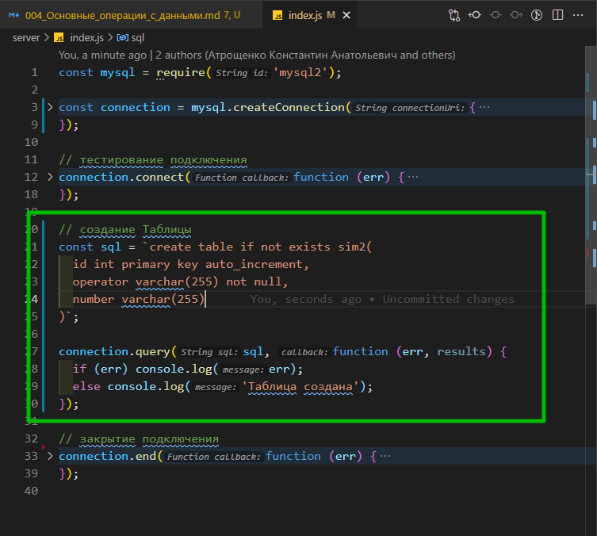

```js
const mysql = require('mysql2');

const connection = mysql.createConnection({
  host: '10.178.4.52',
  port: '3306',
  user: 'asu8',
  database: 'network',
  password: '123',
});

// тестирование подключения
connection.connect(function (err) {
  if (err) {
    return console.error('Ошибка: ' + err.message);
  } else {
    console.log('Подключение к серверу MySQL успешно установлено');
  }
});

// создание Таблицы
const sql = `create table if not exists sim2(
  id int primary key auto_increment,
  operator varchar(255) not null,
  number varchar(255)
)`;

connection.query(sql, function (err, results) {
  if (err) console.log(err);
  else console.log('Таблица создана');
});

// закрытие подключения
connection.end(function (err) {
  if (err) {
    return console.log('Ошибка: ' + err.message);
  } else {
    console.log('Подключение закрыто');
  }
});
```

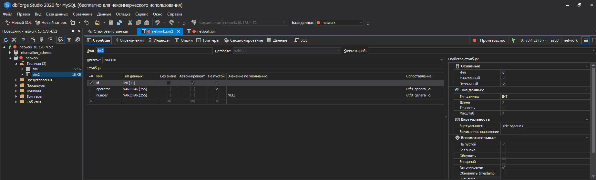

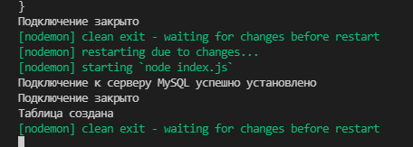

Для создания таблицы применяется команда **CREATE TABLE**, которая создается таблицу **sim2** с тремя столбцами - **id**, **operator** и **number**.

<br/>
<br/>
<br/>

**Добавление данных**

Для добавления применяется **SQL**-команда **INSERT**. Добавим данные в ранее созданную таблицу **sim2**:

```js
const mysql = require('mysql2');

const connection = mysql.createConnection({
  host: '10.178.4.52',
  port: '3306',
  user: 'asu8',
  database: 'network',
  password: '123',
});

// тестирование подключения
connection.connect(function (err) {
  if (err) {
    return console.error('Ошибка: ' + err.message);
  } else {
    console.log('Подключение к серверу MySQL успешно установлено');
  }
});

// Добавление данных
const sql = `INSERT INTO sim2(operator, number) VALUES("A1","+375298918971")`;

connection.query(sql, function (err, results) {
  if (err) console.log(err);
  else console.log(results);
});

// закрытие подключения
connection.end(function (err) {
  if (err) {
    return console.log('Ошибка: ' + err.message);
  } else {
    console.log('Подключение закрыто');
  }
});
```

В данном случае в таблицу добавляется одна строка, где столбец **operator** имеет значение **"A1"**, столбец **number** - значение **"+375298918971"**. С помощью параметра **results** в функции обратного вызова мы можем получить результаты операции. Например, в моем случае консольный вызов будет следующим:

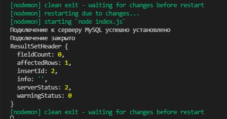

В данном случае мы видим, что возвращается объект, где можно выделить ряд свойств. Прежде всего, это **affectedRows** - количество затронутых операцией строк (в данном случае количество добавленных строк) и **insertId** - идентификатор (значение поля **id**) добавленной записи. Соответственно, если бы нам потребовалось получить **id** добавленной строки, то мы могли бы написать так:

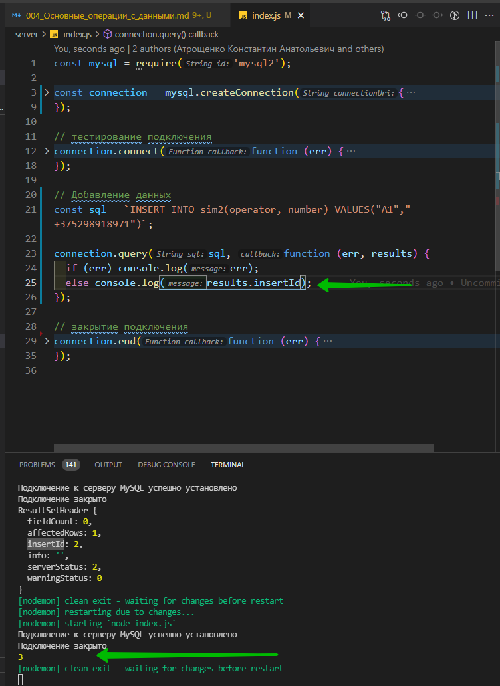

```js
const mysql = require('mysql2');

const connection = mysql.createConnection({
  host: '10.178.4.52',
  port: '3306',
  user: 'asu8',
  database: 'network',
  password: '123',
});

// тестирование подключения
connection.connect(function (err) {
  if (err) {
    return console.error('Ошибка: ' + err.message);
  } else {
    console.log('Подключение к серверу MySQL успешно установлено');
  }
});

// Добавление данных
const sql = `INSERT INTO sim2(operator, number) VALUES("A1","+375298918971")`;

connection.query(sql, function (err, results) {
  if (err) console.log(err);
  else console.log(results.insertId);
});

// закрытие подключения
connection.end(function (err) {
  if (err) {
    return console.log('Ошибка: ' + err.message);
  } else {
    console.log('Подключение закрыто');
  }
});
```

<br/>
<br/>
<br/>

**Добавление множества значений**

Добавим сразу несколько значений:

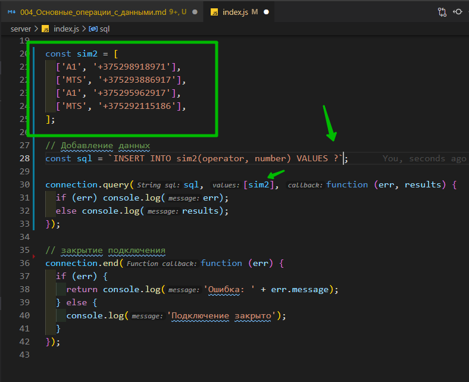

```js
const mysql = require('mysql2');

const connection = mysql.createConnection({
  host: '10.178.4.52',
  port: '3306',
  user: 'asu8',
  database: 'network',
  password: '123',
});

// тестирование подключения
connection.connect(function (err) {
  if (err) {
    return console.error('Ошибка: ' + err.message);
  } else {
    console.log('Подключение к серверу MySQL успешно установлено');
  }
});

const sim2 = [
  ['A1', '+375298918971'],
  ['MTS', '+375293886917'],
  ['A1', '+375295962917'],
  ['MTS', '+375292115186'],
];

// Добавление данных
const sql = `INSERT INTO sim2(operator, number) VALUES ?`;

connection.query(sql, [sim2], function (err, results) {
  if (err) console.log(err);
  else console.log(results);
});

// закрытие подключения
connection.end(function (err) {
  if (err) {
    return console.log('Ошибка: ' + err.message);
  } else {
    console.log('Подключение закрыто');
  }
});
```

При добавлении множества объектов в **sql**-запросе после **VALUES** указывается один вопросительный знак.

И при успешном добавлении свойство **results.affectedRows** укажет, то добавлено **4** строки:
Однако в этом случае следует учитывать, что мы не сможем получить **id** всех добавленных строк.

<br/>
<br/>
<br/>

**Получение данных**

Для получения данных применяется **sql**-команда **SELECT**. Например, получим все данные из таблицы **sim2**:

```js
const mysql = require('mysql2');

const connection = mysql.createConnection({
  host: '10.178.4.52',
  port: '3306',
  user: 'asu8',
  database: 'network',
  password: '123',
});

// тестирование подключения
connection.connect(function (err) {
  if (err) {
    return console.error('Ошибка: ' + err.message);
  } else {
    console.log('Подключение к серверу MySQL успешно установлено');
  }
});

// получение данных из таблицы
const sql = `SELECT * FROM sim2`;

connection.query(sql, function (err, results) {
  if (err) console.log(err);
  else console.log(results);
});

// закрытие подключения
connection.end(function (err) {
  if (err) {
    return console.log('Ошибка: ' + err.message);
  } else {
    console.log('Подключение закрыто');
  }
});
```

Объект **results** в функции обратного вызова будет представлять массив полученных из **БД** данных:

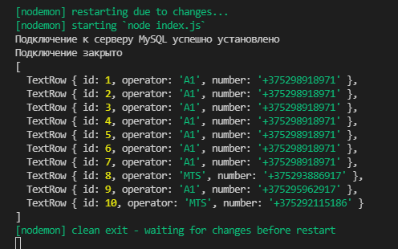

Соответственно после получения мы сможем работать с этими данными как с обычным массивом объектов. Например, выведем только оператора для каждого пользователя из базы данных:

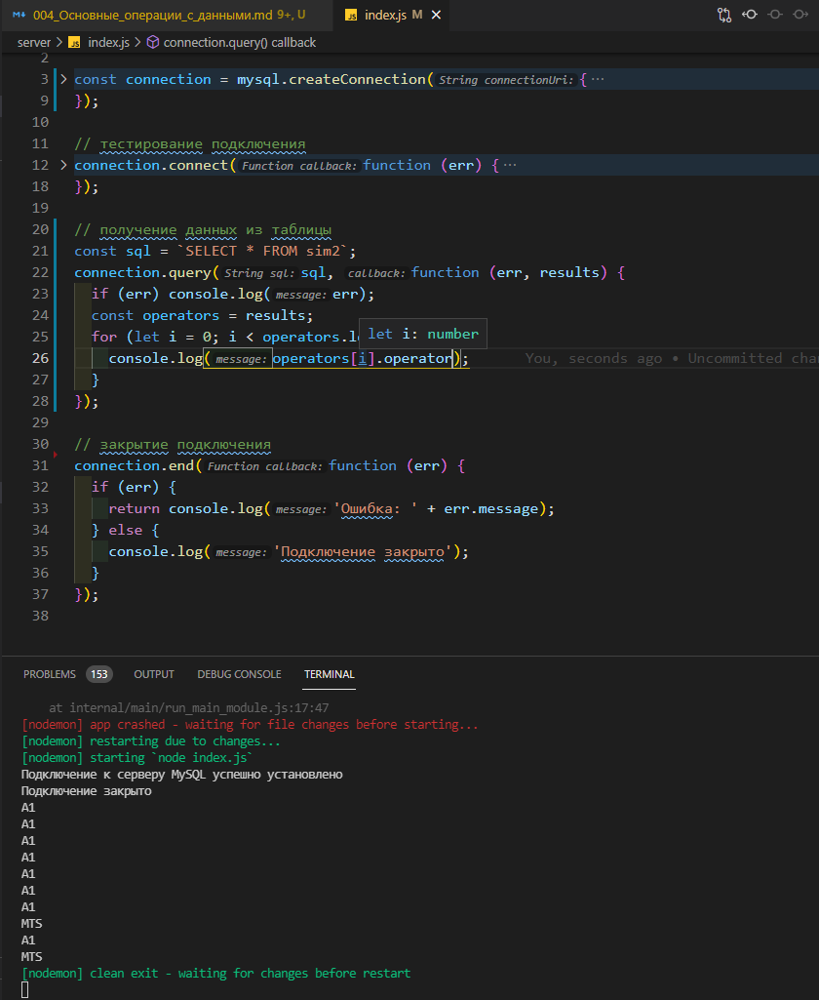

```js
const mysql = require('mysql2');

const connection = mysql.createConnection({
  host: '10.178.4.52',
  port: '3306',
  user: 'asu8',
  database: 'network',
  password: '123',
});

// тестирование подключения
connection.connect(function (err) {
  if (err) {
    return console.error('Ошибка: ' + err.message);
  } else {
    console.log('Подключение к серверу MySQL успешно установлено');
  }
});

// получение данных из таблицы
const sql = `SELECT * FROM sim2`;
connection.query(sql, function (err, results) {
  if (err) console.log(err);
  const operators = results;
  for (let i = 0; i < operators.length; i++) {
    console.log(operators[i].operator);
  }
});

// закрытие подключения
connection.end(function (err) {
  if (err) {
    return console.log('Ошибка: ' + err.message);
  } else {
    console.log('Подключение закрыто');
  }
});
```

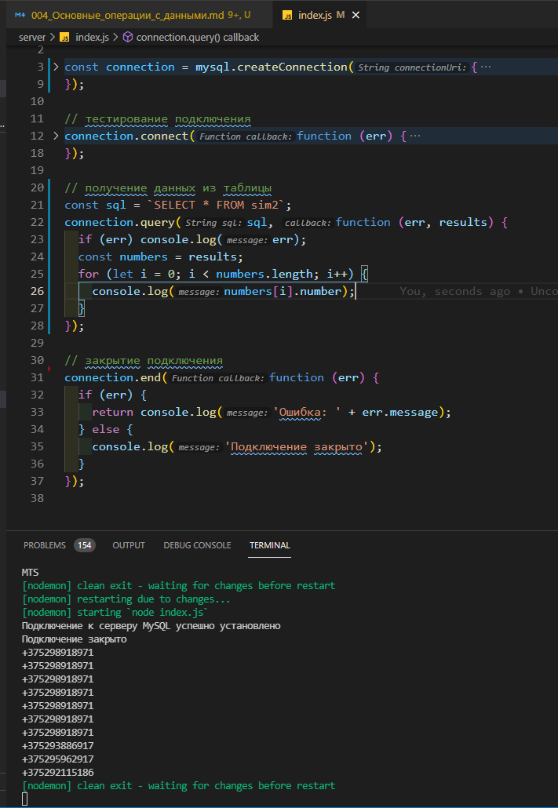

```js
const mysql = require('mysql2');

const connection = mysql.createConnection({
  host: '10.178.4.52',
  port: '3306',
  user: 'asu8',
  database: 'network',
  password: '123',
});

// тестирование подключения
connection.connect(function (err) {
  if (err) {
    return console.error('Ошибка: ' + err.message);
  } else {
    console.log('Подключение к серверу MySQL успешно установлено');
  }
});

// получение данных из таблицы
const sql = `SELECT * FROM sim2`;
connection.query(sql, function (err, results) {
  if (err) console.log(err);
  const numbers = results;
  for (let i = 0; i < numbers.length; i++) {
    console.log(numbers[i].number);
  }
});

// закрытие подключения
connection.end(function (err) {
  if (err) {
    return console.log('Ошибка: ' + err.message);
  } else {
    console.log('Подключение закрыто');
  }
});
```

<br/>
<br/>
<br/>

**Фильтрация данных**

Выполним фильтрацию данных с применением выражения **WHERE:**

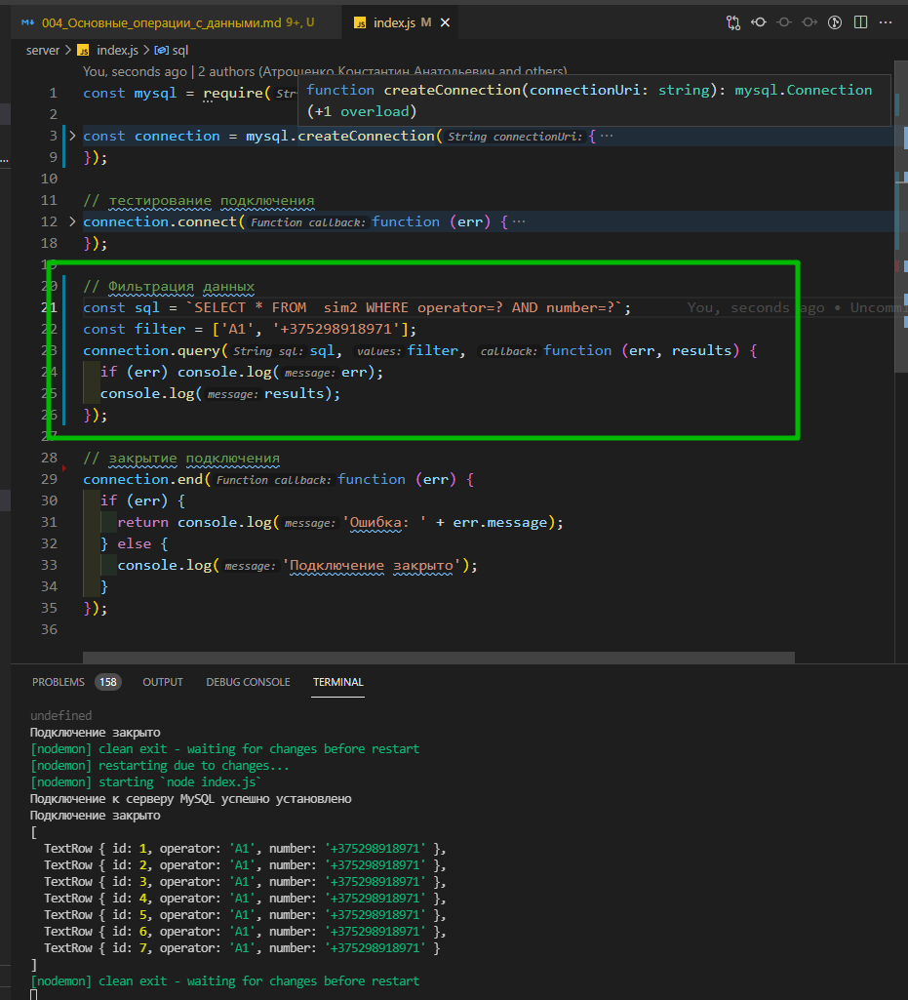

```js
const mysql = require('mysql2');

const connection = mysql.createConnection({
  host: '10.178.4.52',
  port: '3306',
  user: 'asu8',
  database: 'network',
  password: '123',
});

// тестирование подключения
connection.connect(function (err) {
  if (err) {
    return console.error('Ошибка: ' + err.message);
  } else {
    console.log('Подключение к серверу MySQL успешно установлено');
  }
});

// Фильтрация данных
const sql = `SELECT * FROM  sim2 WHERE operator=? AND number=?`;
const filter = ['A1', '+375298918971'];
connection.query(sql, filter, function (err, results) {
  if (err) console.log(err);
  console.log(results);
});

// закрытие подключения
connection.end(function (err) {
  if (err) {
    return console.log('Ошибка: ' + err.message);
  } else {
    console.log('Подключение закрыто');
  }
});
```

Здесь запрос фактически будет выглядеть как **SELECT \* FROM users WHERE operator="A1" AND number=+375298918971**, и в прицнипе мы могли бы напрямую ввести данные в запрос. Однако чтобы избежать **sql**-инъекций при передаче в запрос данных извне рекомендуется использовать параметризацию.

<br/>
<br/>
<br/>

**Обновление**

Для обновления данных применяется **sql**-команда **UPDATE:**

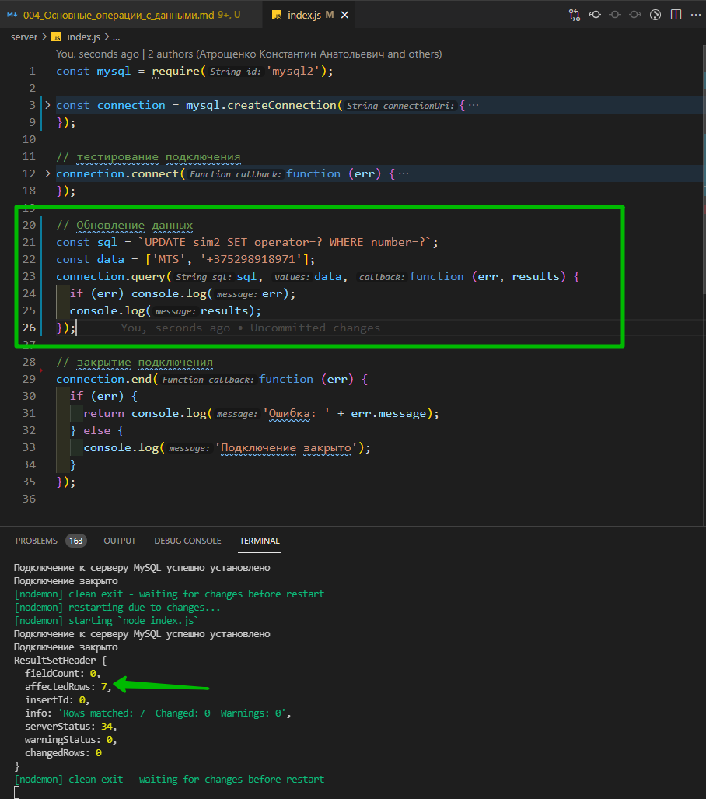

```js
const mysql = require('mysql2');

const connection = mysql.createConnection({
  host: '10.178.4.52',
  port: '3306',
  user: 'asu8',
  database: 'network',
  password: '123',
});

// тестирование подключения
connection.connect(function (err) {
  if (err) {
    return console.error('Ошибка: ' + err.message);
  } else {
    console.log('Подключение к серверу MySQL успешно установлено');
  }
});

// Обновление данных
const sql = `UPDATE sim2 SET operator=? WHERE number=?`;
const data = ['MTS', '+375298918971'];
connection.query(sql, data, function (err, results) {
  if (err) console.log(err);
  console.log(results);
});

// закрытие подключения
connection.end(function (err) {
  if (err) {
    return console.log('Ошибка: ' + err.message);
  } else {
    console.log('Подключение закрыто');
  }
});
```

С помощью свойства **affectedRows** объекта **results** мы можем проверить, сколько строк было обновлено.

<br/>
<br/>
<br/>

**Удаление**

Для удаления применяется **sql**-команда **DELETE:**

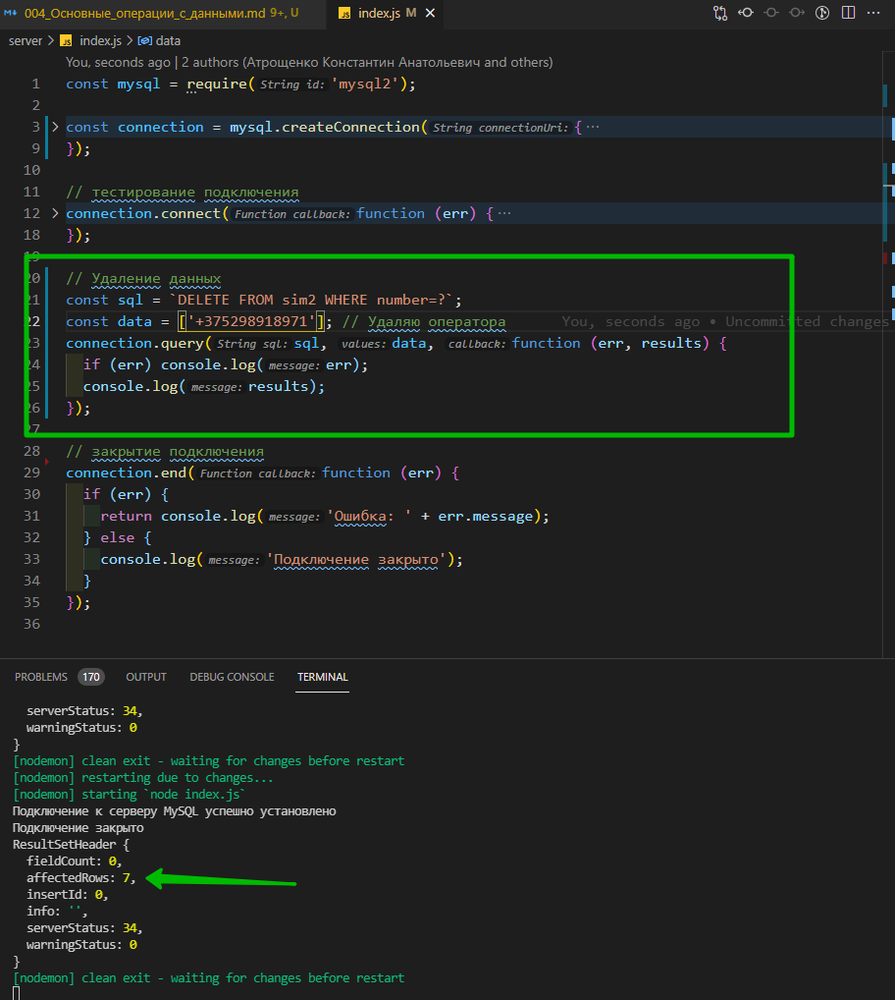

```js
const mysql = require('mysql2');

const connection = mysql.createConnection({
  host: '10.178.4.52',
  port: '3306',
  user: 'asu8',
  database: 'network',
  password: '123',
});

// тестирование подключения
connection.connect(function (err) {
  if (err) {
    return console.error('Ошибка: ' + err.message);
  } else {
    console.log('Подключение к серверу MySQL успешно установлено');
  }
});

// Удаление данных
const sql = `DELETE FROM sim2 WHERE number=?`;
const data = ['+375298918971']; // Удаляю оператора
connection.query(sql, data, function (err, results) {
  if (err) console.log(err);
  console.log(results);
});

// закрытие подключения
connection.end(function (err) {
  if (err) {
    return console.log('Ошибка: ' + err.message);
  } else {
    console.log('Подключение закрыто');
  }
});
```

И после удаления данных проверяю что у меня осталось

```js
const mysql = require('mysql2');

const connection = mysql.createConnection({
  host: '10.178.4.52',
  port: '3306',
  user: 'asu8',
  database: 'network',
  password: '123',
});

// тестирование подключения
connection.connect(function (err) {
  if (err) {
    return console.error('Ошибка: ' + err.message);
  } else {
    console.log('Подключение к серверу MySQL успешно установлено');
  }
});

// получение данных из таблицы
const sql = `SELECT * FROM sim2`;

connection.query(sql, function (err, results) {
  if (err) console.log(err);
  else console.log(results);
});

// закрытие подключения
connection.end(function (err) {
  if (err) {
    return console.log('Ошибка: ' + err.message);
  } else {
    console.log('Подключение закрыто');
  }
});
```

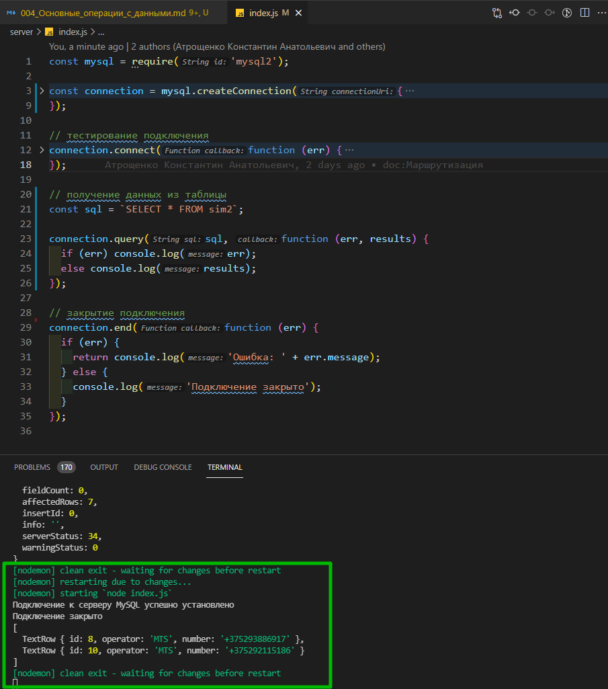

<br/>
<br/>
<br/>

**Удаление таблицы**

```js
const mysql = require('mysql2');

const connection = mysql.createConnection({
  host: '10.178.4.52',
  port: '3306',
  user: 'asu8',
  database: 'network',
  password: '123',
});

// тестирование подключения
connection.connect(function (err) {
  if (err) {
    return console.error('Ошибка: ' + err.message);
  } else {
    console.log('Подключение к серверу MySQL успешно установлено');
  }
});

// Удаление таблицы
const sql = `DROP TABLE sim2 `;
connection.query(sql, function (err, results) {
  if (err) console.log(err);
  console.log(results);
});

// закрытие подключения
connection.end(function (err) {
  if (err) {
    return console.log('Ошибка: ' + err.message);
  } else {
    console.log('Подключение закрыто');
  }
});
```

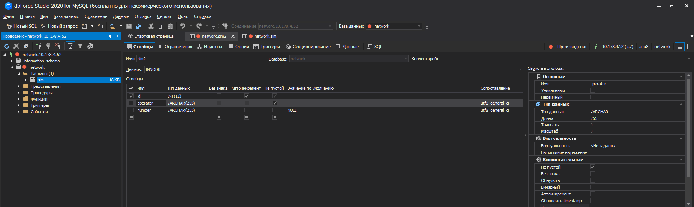
