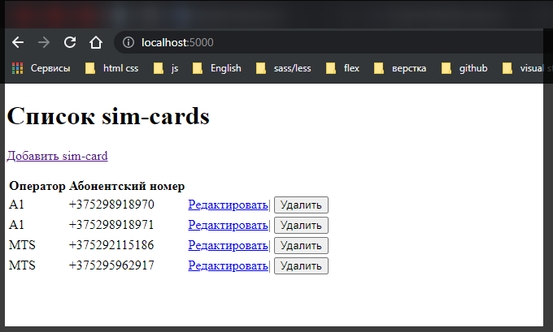
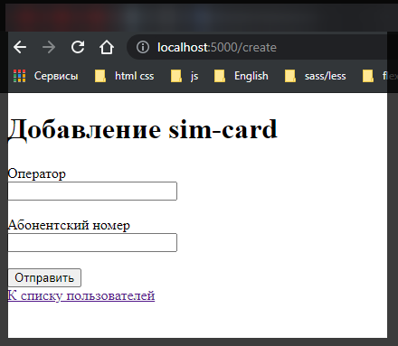
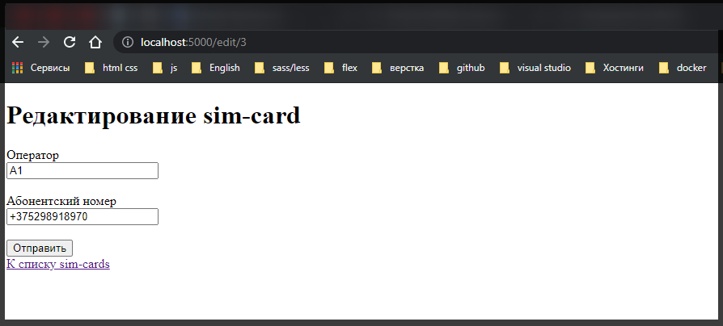
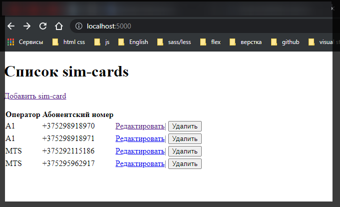
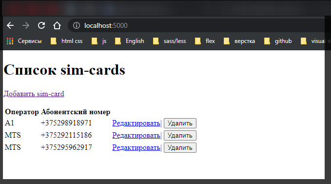

# MySQL Express

Создадим простейшее веб-приложение, которое взаимодействует с бд **MySQL**. Для работы возьмем созданную ранее базу данных **nerwork** и таблицу **sim2**.
Прежде всего определим новый проект и добавим в него пакеты **express**, **mysql2**, **handlebars** и **body-parser**:

```shell
npm install --save hbs express body-parser mysql2
```

В качестве визуальной части мы будем использовать представления **Handlebars**. Поэтому определим в проекте новую папку **views**. В нее добавим новый файл **index.hbs:**

```html
<!DOCTYPE html>
<html>
  <head>
    <title>Список sim-cards</title>
    <meta charset="utf-8" />
  </head>
  <body>
    <h1>Список sim-cards</h1>
    <p><a href="/create">Добавить sim-card</a></p>
    <table>
      <tr>
        <th>Оператор</th>
        <th>Абонентский номер</th>
        <th></th>
      </tr>
      {{#each simCards}}
      <tr>
        <td>{{this.operator}}</td>
        <td>{{this.number}}</td>
        <td>
          <a href="/edit/{{this.id}}">Редактировать</a>|
          <form
            action="delete/{{this.id}}"
            method="POST"
            style="display:inline;"
          >
            <input type="submit" value="Удалить" />
          </form>
        </td>
      </tr>
      {{/each}}
    </table>
  </body>
  <html></html>
</html>
```

Данное представление выводит список объектов в виде таблицы. Рядом с каждый объектом определена ссылка на редактирования объекта и кнопка для удаления объекта. Над таблицей определена ссылка на добавление новых объектов.

Также добавим в папку **views** новый файл **create.hbs** с формой для создания нового объекта:

```html
<!DOCTYPE html>
<html>
  <head>
    <title>Добавление sim-card</title>
    <meta charset="utf-8" />
    <style>
      .field {
        width: 180px;
      }
    </style>
  </head>
  <body>
    <h1>Добавление sim-card</h1>
    <form method="POST">
      <label>Оператор</label><br />
      <input name="operator" class="field" /><br /><br />
      <label>Абонентский номер</label><br />
      <input name="number" class="field" /><br /><br />
      <input type="submit" value="Отправить" />
    </form>
    <a href="/">К списку пользователей</a>
  </body>
  <html></html>
</html>
```

И также добавим в папку **views** новый файл **edit.hbs** с формой для редактирования объекта:

```html
<!DOCTYPE html>
<html>
  <head>
    <title>Редактирование sim-card</title>
    <meta charset="utf-8" />
    <style>
      .field {
        width: 180px;
      }
    </style>
  </head>
  <body>
    <h1>Редактирование sim-card</h1>
    <form action="/edit" method="POST">
      <input type="hidden" name="id" value="{{sim.id}}" />
      <label>Оператор</label><br />
      <input
        name="operator"
        value="{{sim.operator}}"
        class="field"
      /><br /><br />
      <label>Абонентский номер</label><br />
      <input name="number" value="{{sim.number}}" class="field" /><br /><br />
      <input type="submit" value="Отправить" />
    </form>
    <a href="/">К списку sim-cards</a>
  </body>
  <html></html>
</html>
```

И определим в корневой папке проекта файл **app.js**, который будет представлять главный файл приложения:

И изменим **package.json**

```json
{
  "name": "server",
  "version": "1.0.0",
  "description": "",
  "main": "index.js",
  "scripts": {
    "dev": "nodemon app.js"
  },
  "keywords": [],
  "author": "",
  "license": "ISC",
  "dependencies": {
    "body-parser": "^1.19.0",
    "express": "^4.17.1",
    "hbs": "^4.1.2",
    "mysql2": "^2.3.0",
    "nodemon": "^2.0.12"
  }
}
```

```js
const mysql = require('mysql2');
const express = require('express');
const bodyParser = require('body-parser');

const app = express();
const urlencodedParser = bodyParser.urlencoded({ extended: false });

const pool = mysql.createPool({
  connectionLimit: 5,
  host: '10.178.4.52',
  port: '3306',
  user: 'asu8',
  database: 'network',
  password: '123',
});

app.set('view engine', 'hbs');

// Получение данных
app.get('/', function (req, res) {
  pool.query(`SELECT * FROM sim2`, function (err, data) {
    if (err) console.log(err);
    res.render('index.hbs', {
      simCards: data,
    });
  });
});

// Возвращаем форму для обновления данных
app.get('/create', function (req, res) {
  res.render('create.hbs');
});

// получаем отправленные данные и добавляем их в БД
app.post('/create', urlencodedParser, function (req, res) {
  if (!req.body) return res.sendStatus(400);
  const operator = req.body.operator;
  const number = req.body.number;
  pool.query(
    `INSERT INTO sim2(operator, number) VALUES(?,?)`,
    [operator, number],
    function (err, data) {
      if (err) return console.log(err);
      res.redirect('/');
    }
  );
});

// Получаем id редактируемого номера, получаем его из БД и отправляем с формой редактирования.
app.get('/edit/:id', function (req, res) {
  const id = req.params.id;
  pool.query(`SELECT * FROM sim2 WHERE id=?`, [id], function (err, data) {
    if (err) return console.log(err);
    res.render('edit.hbs', {
      sim: data[0],
    });
  });
});

// получаем отредактированные данные и отправляем их в БД
app.post('/edit', urlencodedParser, function (req, res) {
  if (!req.body) return res.sendStatus(400);
  const operator = req.body.operator;
  const number = req.body.number;
  const id = req.body.id;
  pool.query(
    'UPDATE users SET operator=?, number=? WHERE id=?',
    [operator, number, id],
    function (err, data) {
      if (err) return console.log(err);
      res.redirect('/');
    }
  );
});

// получаем id удаляемого пользователя и удаляем его из бд
app.post('/delete/:id', function (req, res) {
  const id = req.params.id;
  pool.query(`DELETE FROM sim2 WHERE id=?`, [id], function (err, data) {
    if (err) console.log(err);
    res.redirect('/');
  });
});

app.listen(5000, function () {
  console.log('Сервер запущен');
});
```

При обращении к корню приложения срабатывает метод

```js
// Получение данных
app.get('/', function (req, res) {
  pool.query(`SELECT * FROM sim2`, function (err, data) {
    if (err) console.log(err);
    res.render('index.hbs', {
      simCards: data,
    });
  });
});
```

Он получает данные из бд и передает их представлению **index.hbs**. И если в бд есть уже какие-нибудь данные, то при запуске приложения мы увидим их на странице:



При нажатии на ссылку добавления серверу будет отправлять с **get**-запрос, который будет обрабатываться следующим методом:

```js
// Возвращаем форму для обновления данных
app.get('/create', function (req, res) {
  res.render('create.hbs');
});
```



После заполнения формы и нажатия на кнопку данные в запросе **POST** отправляются методу:

```js
// получаем отправленные данные и добавляем их в БД
app.post('/create', urlencodedParser, function (req, res) {
  if (!req.body) return res.sendStatus(400);
  const operator = req.body.operator;
  const number = req.body.number;
  pool.query(
    `INSERT INTO sim2(operator, number) VALUES(?,?)`,
    [operator, number],
    function (err, data) {
      if (err) return console.log(err);
      res.redirect('/');
    }
  );
});
```

Метод получает отправленные данные и посредством **SQL**-команды **INSERT** отправляет их БД.

При нажатии на ссылку редактирования в списке объектов следующему методу в **GET**-зпросе передается **id** объекта:

```js
// Получаем id редактируемого номера, получаем его из БД и отправляем с формой редактирования.
app.get('/edit/:id', function (req, res) {
  const id = req.params.id;
  pool.query(`SELECT * FROM sim2 WHERE id=?`, [id], function (err, data) {
    if (err) return console.log(err);
    res.render('edit.hbs', {
      sim: data[0],
    });
  });
});
```

Метод получает **id** и по нему извлекает из БД нужный объект из БД и передается его на форму в представлении **edit.hbs**:



После редактирования и нажатия на кнопку данные отправляются в **POST**-запросе следующему методу:

```js
// получаем отредактированные данные и отправляем их в БД
app.post('/edit', urlencodedParser, function (req, res) {
  if (!req.body) return res.sendStatus(400);
  const operator = req.body.operator;
  const number = req.body.number;
  const id = req.body.id;
  pool.query(
    'UPDATE users SET operator=?, number=? WHERE id=?',
    [operator, number, id],
    function (err, data) {
      if (err) return console.log(err);
      res.redirect('/');
    }
  );
});
```

Метод получает данные и с помощью команды **UPDATE** отправляет их в БД.

При нажатии на кнопку удаления в списке объектов срабатывает метод

```js
// получаем id удаляемого пользователя и удаляем его из бд
app.post('/delete/:id', function (req, res) {
  const id = req.params.id;
  pool.query(`DELETE FROM sim2 WHERE id=?`, [id], function (err, data) {
    if (err) console.log(err);
    res.redirect('/');
  });
});
```




