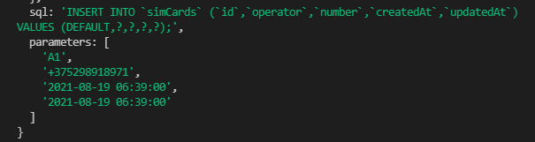
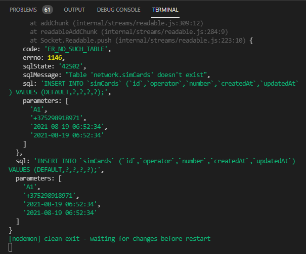
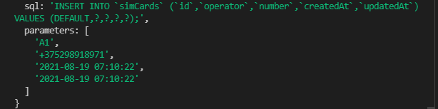
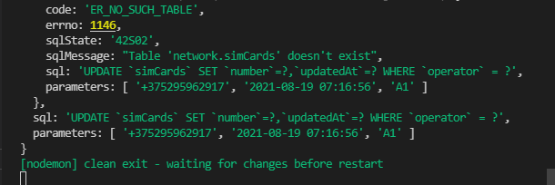
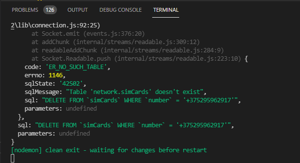

# Запросы к БД

Рассмотим базовые операции с данными на примере модели из прошлой темы:

```js
const Sequelize = require('sequelize');
const sequelize = new Sequelize('network', 'asu8', '123', {
  dialect: 'mysql',
  host: '10.178.4.52',
});

const SimCard = sequelize.define('simCard', {
  id: {
    type: Sequelize.INTEGER,
    autoIncrement: true,
    primaryKey: true,
    allowNull: false,
  },
  name: {
    type: Sequelize.STRING,
    allowNull: true,
  },
  age: {
    type: Sequelize.STRING,
    allowNull: true,
  },
});
```

<br/>
<br/>
<br/>

**Добавление данных**

Для добавления данных в бд у модели вызывается метод **create()**, в который передается добавляемый объект:

```js
SimCard.create({
  operator: 'A1',
  number: '+375298918971',
})
  .then((res) => console.log(res))
  .catch((err) => console.log(err));
```

Как мы видим, свойства передаваемого в метод **create** объекта соответствуют свойствам модели **SimCard** за исключением свойства **id**, которое генерируется базой данных.

После операции добавления мы можем получить добавленный объект, в том числе его **id**, сгенерированный базой данных:

```js
SimCard.create({
  operator: 'A1',
  number: '+375298918971',
})
  .then((res) => {
    const user = { id: res.id, operator: res.operator, number: res.number };
    console.log(user);
  })
  .catch((err) => console.log(err));
```

```js
const Sequelize = require('sequelize');
const sequelize = new Sequelize('network', 'asu8', '123', {
  dialect: 'mysql',
  host: '10.178.4.52',
});

const SimCard = sequelize.define('simCard', {
  id: {
    type: Sequelize.INTEGER,
    autoIncrement: true,
    primaryKey: true,
    allowNull: false,
  },
  operator: {
    type: Sequelize.STRING,
    allowNull: true,
  },
  number: {
    type: Sequelize.STRING,
    allowNull: true,
  },
});

SimCard.create({
  operator: 'A1',
  number: '+375298918971',
})
  .then((res) => {
    const user = { id: res.id, operator: res.operator, number: res.number };
    console.log(user);
  })
  .catch((err) => console.log(err));
```



<br/>
<br/>
<br/>

**Получение данных**

Для извлечения всех данных применяется метод **findAll():**

```js
SimCard.findAll({ raw: true })
  .then((simCards) => {
    console.log(simCards);
  })
  .catch((err) => console.log(err));
```

И полный файл

```js
const Sequelize = require('sequelize');
const sequelize = new Sequelize('network', 'asu8', '123', {
  dialect: 'mysql',
  host: '10.178.4.52',
});

const SimCard = sequelize.define('simCard', {
  id: {
    type: Sequelize.INTEGER,
    autoIncrement: true,
    primaryKey: true,
    allowNull: false,
  },
  operator: {
    type: Sequelize.STRING,
    allowNull: true,
  },
  number: {
    type: Sequelize.STRING,
    allowNull: true,
  },
});

SimCard.create({
  operator: 'A1',
  number: '+375298918971',
})
  .then((res) => {
    console.log(res);
  })
  .catch((err) => console.log(err));

SimCard.findAll({ raw: true })
  .then((simCards) => {
    console.log(simCards);
  })
  .catch((err) => console.log(err));
```



<br/>
<br/>
<br/>

**Получение одного объекта**

Нередко необходимо получить лишь один объект из БД. В этом случае мы можем использовать такие методы как **findByPk()** получает объект по первичному ключу и **findOne()** получает один объект по определенному критерию. Например, получим пользователя с **id=2:**

```js
SimCard.findByPk(1)
  .then((sim) => {
    if (!sim) console.log(sim.operator);
  })
  .catch((err) => console.log(err));
```

Или получим

```js
SimCard.findOne({ where: { operator: 'A1' } })
  .then((sim) => {
    if (!sim) return;
    console.log(sim.operator, sim.number);
  })
  .catch((err) => console.log(err));
```



<br/>
<br/>
<br/>

**Обновление**

Для обновления применяется метод **update()**, в который передается объект с новыми значениями и объект-критерий выборки обновляемых объектов:

```js
const Sequelize = require('sequelize');
const sequelize = new Sequelize('network', 'asu8', '123', {
  dialect: 'mysql',
  host: '10.178.4.52',
});

const SimCard = sequelize.define('simCard', {
  id: {
    type: Sequelize.INTEGER,
    autoIncrement: true,
    primaryKey: true,
    allowNull: false,
  },
  operator: {
    type: Sequelize.STRING,
    allowNull: true,
  },
  number: {
    type: Sequelize.STRING,
    allowNull: true,
  },
});

// Обновление
SimCard.update(
  { number: '+375295962917' },
  {
    where: {
      operator: 'A1',
    },
  }
)
  .then((res) => console.log(res))
  .catch((err) => console.log(err));
```



В данном случае первый объект указывает, что все обновляемые объекты будут получать для поля **number** значение **'+375295962917'**. Второй объект указывает на критерий выборки - обновляются только объекты, у которых operator: **'A1'**.

<br/>
<br/>
<br/>

Удаление
Для удаления используется метод **destroy()**, в который передается объект-критерий выборки удаляемых объектов:

```js
const Sequelize = require('sequelize');
const sequelize = new Sequelize('network', 'asu8', '123', {
  dialect: 'mysql',
  host: '10.178.4.52',
});

const SimCard = sequelize.define('simCard', {
  id: {
    type: Sequelize.INTEGER,
    autoIncrement: true,
    primaryKey: true,
    allowNull: false,
  },
  operator: {
    type: Sequelize.STRING,
    allowNull: true,
  },
  number: {
    type: Sequelize.STRING,
    allowNull: true,
  },
});

// Удаление
SimCard.destroy({
  where: {
    number: '+375295962917',
  },
})
  .then((res) => console.log(res))
  .catch((err) => console.log(err));
```


